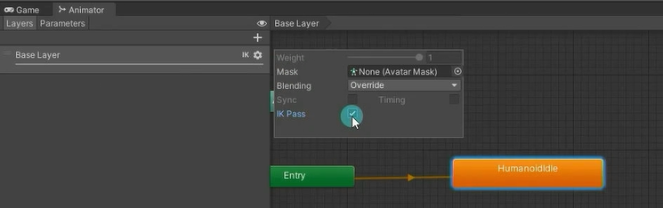
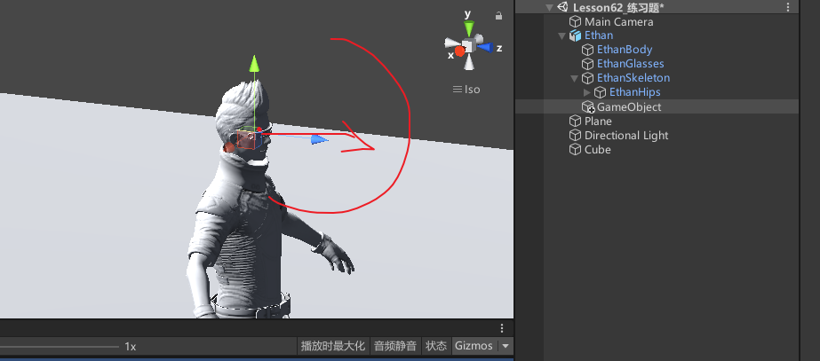

# 什么是IK


在骨骼动画中，构建骨骼的方法被称为正向动力学。
它的表现形式是，子骨骼（关节）的位置根据父骨骼（关节）的旋转而改变。
用我们人体举例子，当我们抬起手臂时，是肩部关节带动的整个手臂的运动，用父子骨骼理解的话就是父带动了子。

而IK全称是Inverse Kinematics，翻译过来的意思就是反向动力学的意思。
它和正向动力学恰恰相反。
它的表现形式是，子骨骼（关节）末端的位置改变会带动自己以及自己的父骨骼（关节）旋转。
用我们人体举例子，当我们拿起一个杯子的时候是用手掌去拿，以杯子为参照物，我们移动杯子的位置，手臂会随着杯子一起移动，用父子骨骼理解的话就是子带动了父。


# 如何进行IK控制
**在状态机的层级设置中开启 IK 通道。**



**继承MonoBehavior的类中，Unity定义了一个IK回调函数:OnAnimatorIK，我们可以在该函数中调用Unity提供的IK相关API来控制IK。**

**Animator中的IK相关API：**
```cs
private Animator animator;
public Transform pos;
public Transform pos2;


void Start()
{
    animator = this.GetComponent<Animator>();
}

private void OnAnimatorIK(int layerIndex)
{
   // 设置头部IK权重
    // weight: LookAt全局权重0~1
    // bodyWeight: LookAt时身体的权重0~1
    // headWeight: LookAt时头部的权重0~1
    // eyesWeight: LookAt时头部的权重0~1
    // clampWeight: 0表示角色运动时不受限制，1表示角色完全固定无法执行LookAt，0.5表示只能够移动范围的一半
    animator.SetLookAtWeight(1, 1f, 1f);
    // 设置头部IK看向位置
    animator.SetLookAtPosition(pos.position);
    
    // 下面几个一般都要配合使用
    
    // 设置IK位置权重
    animator.SetIKPositionWeight(AvatarIKGoal.RightFoot, 1);
    // 设置IK旋转权重
    animator.SetIKRotationWeight(AvatarIKGoal.RightFoot, 1);
    // 设置IK对应的位置
    animator.SetIKPosition(AvatarIKGoal.RightFoot, pos2.position);
    // 设置IK对应的角度
    animator.SetIKRotation(AvatarIKGoal.RightFoot, pos2.rotation);
}
```

# IK反向动力学控制对于我们的意义
IK在游戏开发中的应用。
拾取某一件物品。
持枪或持弓箭瞄准某一个对象等。


# OnAnimatorIK和OnAnimatorMove

OnAnimatorMove是 Unity 中一个重要的回调函数，与 Animator 组件相关，它主要用于控制角色的移动和旋转，特别是在使用动画来驱动角色移动时。（动画本身有移动，但自己还想有移动一般才用）
**精确控制角色移动**：当你需要对角色的移动进行更精细的控制时，可以使用OnAnimatorMove。例如，在某些情况下，你可能不希望完全按照动画中的根运动来移动角色，而是希望在动画的基础上进行一些调整，如添加额外的移动速度、限制移动范围等。
**网络同步**：在多人游戏中，为了保证角色移动的一致性和同步性，通常会在OnAnimatorMove中处理角色的移动逻辑，然后将移动信息发送到服务器进行同步。


我们可以简单理解这两个函数是两个和动画相关的特殊生命周期函数，它们在Update之后LateUpdate之前调用，会在每帧的状态机和动画处理完后调用。
OnAnimatorIK在OnAnimatorMove之前调用，主要处理IK运动相关逻辑
OnAnimatorMove主要处理动画移动以修改根运动的回调逻辑。
他们存在的目的只是多了一个调用时机，当每帧的动画和状态机逻辑处理完后再调用


# 练习
在之前练习题的基础上，实现左右旋转鼠标通过IK控制角色的部分旋转

思路是设置一个头的点，从头的点延伸出一个方向向量，移动鼠标时让方向向量乘上一个四元数，作为要看的对象。


对层级设置好启用IKPass
关联头部位置。Update中得到鼠标的XY选择，在OnAnimatorIK中通过四元数设置
```cs
// 存储机器人头部的 Transform 组件
public Transform headPos;

// x 方向鼠标旋转了多少角度
private float changeAngleX;

// y 方向鼠标旋转了多少角度
private float changeAngleY;

// Update 函数在每帧都会执行，用于检测用户输入并响应
void Update()
{
    // 通过鼠标的移动来控制角色的部分旋转。将 changeAngleX 和 changeAngleY 累加相应的值，并使用 Mathf.Clamp 函数限制旋转角度不超过一定范围。
    changeAngleX += Input.GetAxis("Mouse X");
    changeAngleX = Mathf.Clamp(changeAngleX, -30, 30);

    changeAngleY += Input.GetAxis("Mouse Y");
    changeAngleY = Mathf.Clamp(changeAngleY, -30, 30);
}

// OnAnimatorIK 函数在每帧进行 IK 计算，用于实现鼠标控制角色的部分旋转
private void OnAnimatorIK(int layerIndex)
{
    // 调用 SetLookAtWeight 函数，设置头部的权重。
    animator.SetLookAtWeight(1, 1, 1);

    // 通过四元数计算出头部的朝向，并调用 SetLookAtPosition 函数，将头部的朝向赋值给机器人的 Animator 组件进行控制。

    //计算方向向量乘上x旋转四元数的位置
    Vector3 pos = Quaternion.AngleAxis(changeAngleX, Vector3.up) * (headPos.position + headPos.forward * 10);

    //接着再乘上y旋转四元数的位置
    pos = Quaternion.AngleAxis(changeAngleY, Vector3.right) * pos;

    //看向位置
    animator.SetLookAtPosition(pos);
}
```

