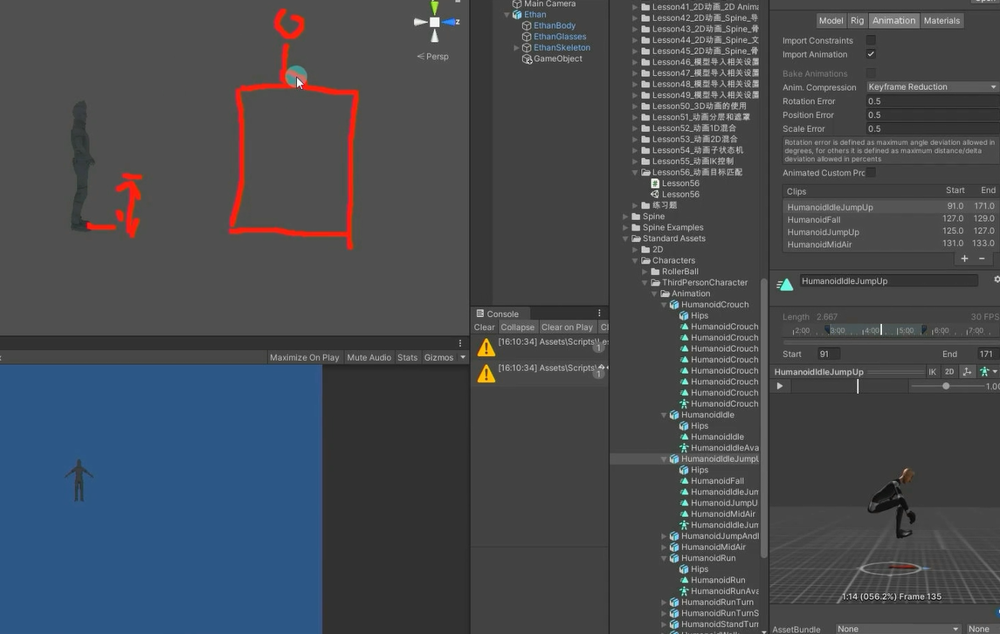
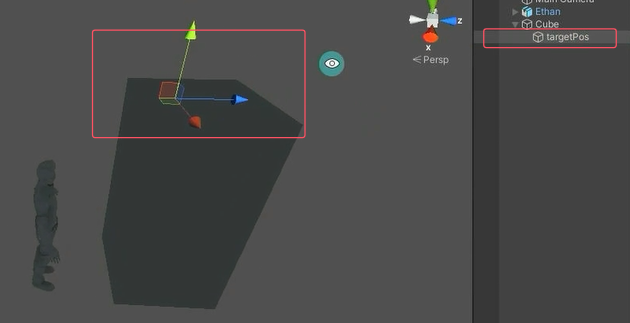
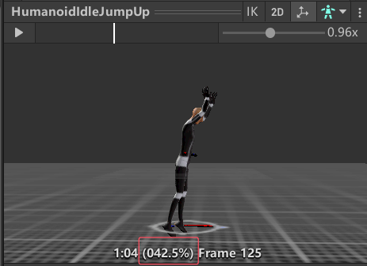
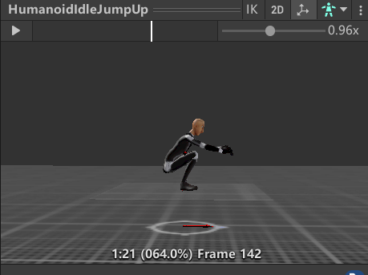
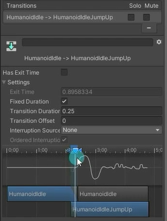
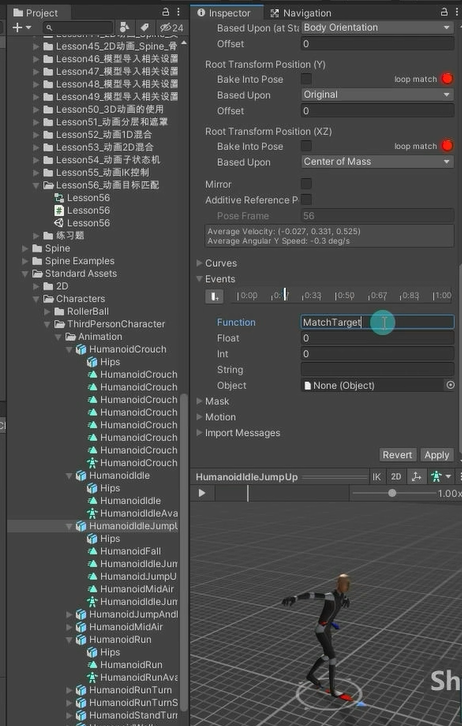

# 什么是动画目标匹配
动画目标匹配主要指的是，当游戏中角色要以某种动作移动，该动作播放完毕后，人物的手或者脚必须落在某一个地方。
比如：角色需要跳过踏脚石或者跳跃并抓住房梁。那么这时我们就需要动作目标匹配来达到想要的效果。
例如跳跃动作，模型动画中会跳到一个固定平面上。实际游戏中可能会跳到一个高平面或低平面。
动画目标匹配就可以帮我们刚好播放动画时跳到对应高度的平面。



# 如何实现动画目标匹配
Unity中的Animator提供了对应的MatchTarget函数来完成该功能。
使用步骤：
1. 找到动作关键点位置信息（比如起跳点，落地点，简单理解就是真正可能产生位移的动画表现部分）。
2. 将关键信息传入MatchTargetAPI中。


设置好目标点


开始位移动作百分比

结束位移动作的百分比



```CS
public Transform targetPos;

void Update()
{
    if( Input.GetKeyDown(KeyCode.Space) )
    {
        animator.SetTrigger("Jump");
        
        //Animator中的MatchTarget方法
        //自动调整 GameObject 的位置和旋转。
        //参数一：目标位置
        //参数二：目标角度
        //参数三：匹配的骨骼位置（AvatarTarget枚举）
        //参数四：位置和角度权重
        //参数五：开始位移动作的百分比 这个参数要观察起跳瞬间动画播放了百分之多少
        //参数六：结束位移动作的百分比 这个参数要观察落地瞬间动画播放了百分之多少
        animator.MatchTarget(
            targetPos.position, 
            targetPos.rotation, 
            AvatarTarget.RightFoot, 
            new MatchTargetWeightMask(Vector3.one, 1), 
            0.4f, 
            .64f
        );
    }
}

```

# 注意
1. 必须保证动画已经切换到了目标动画上。
2. 必须保证调用时动画并不是处于过渡阶段而真正在播放目标动画。（由于Idle动画切换到跳跃动画的时候存在过渡效果，过渡的时候直接用目标匹配会出现异常）
   
3. 需要开启Apply Root Motion。
如果发现匹配不准确，往往是12点原因

可以利用动画事件来解决



然后在脚本中使用目标匹配的API
```cs
private void MatchTarget()
{
    //Animator中的MatchTarget方法
    //自动调整 GameObject 的位置和旋转。
    //参数一：目标位置
    //参数二：目标角度
    //参数三：匹配的骨骼位置（AvatarTarget枚举）
    //参数四：位置和角度权重
    //参数五：开始位移动作的百分比 这个参数要观察起跳瞬间动画播放了百分之多少
    //参数六：结束位移动作的百分比 这个参数要观察落地瞬间动画播放了百分之多少
    animator.MatchTarget(
        targetPos.position, 
        targetPos.rotation, 
        AvatarTarget.RightFoot, 
        new MatchTargetWeightMask(Vector3.one, 1), 
        0.4f, 
        .64f
    );
}

```