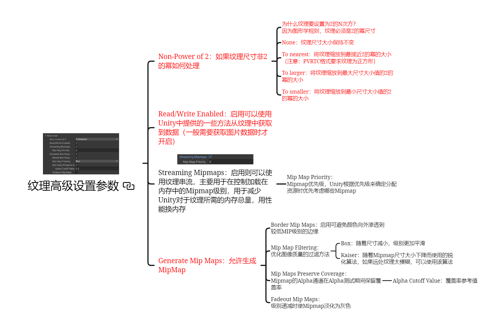
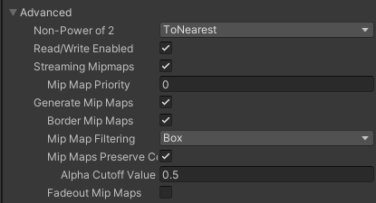
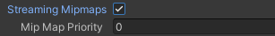
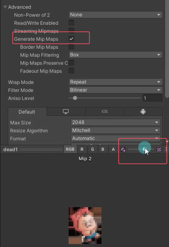

# 高级设置是设置什么？
高级设置主要是纹理的一些尺寸规则、读写规则、以及MipMap相关设置

# 纹理高级设置参数

## Non-Power of 2 如果纹理尺寸非2的幂如何处理

### 为什么纹理要设置为2的N次方？
因为图形学规则，纹理必须是2的幂尺寸

### None
纹理尺寸大小保持不变

### To nearest
将纹理缩放到最接近2的幂的大小
（注意：PVRTC格式要求纹理为正方形）

### To larger
将纹理缩放到最大尺寸大小值的2的幂的大小

### To smaller
将纹理缩放到最小尺寸大小值的2的幂的大小

## Read/Write Enabled 纹理中获取数据
启用可以使用Unity中提供的一些方法从纹理中获取到数据（一般需要获取图片数据时才开启）

## Streaming Mipmaps

启用则可以使用纹理串流，主要用于在控制加载在内存中的[Mipmap](#mipmap是什么)级别，用于**减少Unity对于纹理所需的内存总量**，用性能换内存

- Mip Map Priority：Mipmap优先级，Unity根据优先级来确定分配资源时优先考虑哪些Mipmap

## Generate Mip Maps：允许生成MipMap
2d游戏一般不会用，3d游戏如果内存十分紧张就不用
- Border Mip Maps：启用可避免颜色向外渗透到较低MIP级别的边缘（默认启动）

- Mip Map Filtering：优化图像质量的过滤方法
    - Box：随着尺寸减小，级别更加平滑
    - Kaiser：随着Mipmap尺寸大小下降而使用的锐化算法，如果远处纹理太模糊，可以使用该算法

- Mip Maps Preserve Coverage：Mipmap的Alpha通道在Alpha测试期间保留覆盖率
    - Alpha Cutoff Value：覆盖率参考值

- Fadeout Mip Maps：级别递减时使Mipmap淡化为灰色（一般不勾选）

# MipMap是什么？
Mipmap是三维计算机图形中常用的一种贴图渲染技术。它通过预先计算和优化一系列图片来加快渲染速度，减少图像锯齿。这样的贴图被称为 mipmap，它需要占用一定的内存空间。

Mipmap 中每个层级的小图都是主图的一个特定比例的缩小细节的复制品。当贴图被缩小或从远处观看时，mipmap 会转换到适当的层级。这样可以提高渲染速度，减少实时渲染的负担，并使放大和缩小更有效率。

例如，如果贴图的基本尺寸是 256x256 像素，它的 mipmap 就会有 8 个层级，每个层级是上一层级的四分之一大小。依次层级大小就是：128x128; 64x64; 32x32; 16x16; 8x8; 4x4;2x2; 1x1(一个像素)
简单来说，开启 MipMap 功能后，Unity 会根据图片信息生成不同分辨率的图片，在场景中根据距离选择合适尺寸的图片用于渲染，提升渲染效率。

下图就是一个MipMap

