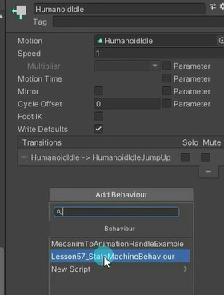

# 状态机行为脚本是什么
状态机行为脚本是一类特殊的脚本，继承指定的基类，主要用于关联到状态机中的状态矩形上。
我们可以按照一定规则编写脚本，在进入、退出、保持在某一个特定状态时进行逻辑处理。
简单解释就是为 Animator Controller 状态机窗口中的某一个状态添加一个脚本，利用这个脚本我们可以做一些特殊功能，比如：
- 进入或退出某一状态时播放声音
- 仅在某些状态下检测一些逻辑，比如是否接触地面等等
- 激活和控制某些状态相关的特效

# 如何使用状态机脚本
**新建一个脚本继承 StateMachineBehaviour 基类**

**重写其中的特定方法进行状态行为监听**
OnStateEnter: 进入状态时，第一个 Update 中调用
OnStateExit: 退出状态时，最后一个 Update 中调用
OnStateIK: OnAnimatorIK 后调用
OnStateMove: OnAnimatorMove 后调用
OnStateUpdate: 除第一帧和最后一帧，每个 Update 上调用
OnStateMachineEnter: 子状态机进入时调用，第一个 Update 中调用
OnStateMachineExit: 子状态机退出时调用，最后一个 Update 中调用

**处理对应逻辑**
```cs
// 重写该函数，当进入指定状态时调用
public override void OnStateEnter(Animator animator, AnimatorStateInfo stateInfo, int layerIndex)
{
    // 当前状态名称与所需状态名称相同时输出日志
    if (stateInfo.IsName(stateName))
        Debug.Log("进入HumanoidIdle状态");
}

// 重写该函数，当退出指定状态时调用
public override void OnStateExit(Animator animator, AnimatorStateInfo stateInfo, int layerIndex)
{
    // 当前状态名称与指定名称相同时输出日志
    if (stateInfo.IsName("HumanoidIdle"))
        Debug.Log("退出HumanoidIdle状态");
}

// 重写该函数，当进行动画 IK 计算时调用
public override void OnStateIK(Animator animator, AnimatorStateInfo stateInfo, int layerIndex)
{
    base.OnStateIK(animator, stateInfo, layerIndex);
}

// 重写该函数，当进行动画更新时每帧调用
public override void OnStateMove(Animator animator, AnimatorStateInfo stateInfo, int layerIndex)
{
    base.OnStateMove(animator, stateInfo, layerIndex);
}

// 重写该函数，当进行动画更新时每帧调用
public override void OnStateUpdate(Animator animator, AnimatorStateInfo stateInfo, int layerIndex)
{
    base.OnStateUpdate(animator, stateInfo, layerIndex);
    // 当前状态名称为指定名称时输出日志
    if (stateInfo.IsName("HumanoidIdle"))
        Debug.Log("处于HumanoidIdle状态");
}

// 重写该函数，当进入状态机时调用
public override void OnStateMachineEnter(Animator animator, int stateMachinePathHash)
{
    base.OnStateMachineEnter(animator, stateMachinePathHash);
}

// 重写该函数，当退出状态机时调用
public override void OnStateMachineExit(Animator animator, int stateMachinePathHash)
{
    base.OnStateMachineExit(animator, stateMachinePathHash);
}
```

点击状态添加写好的状态机行为脚本


# 状态机行为脚本和动画事件如何选择
如果在过渡状态的时候使用动画事件，可能动画事件不会触发，这时候就可以使用状态机行为脚本
状态机行为脚本相对动画事件来说更准确，但是使用起来稍微麻烦一些。根据实际需求选择使用。


