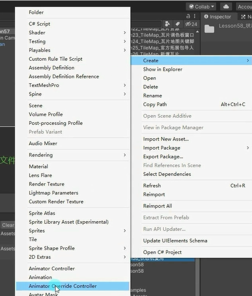
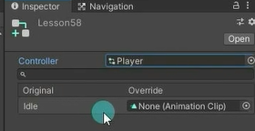

# 状态机复用是什么
游戏开发时经常遇到这样的情况，有n个玩家和n个怪物，他们的动画状态机行为都是一致的，只是对应的动作不同而已。
这时如果我们为他们每一个对象都创建一个状态机进行状态设置和过渡设置无疑是浪费时间的。
因此，状态机复用就是解决这一问题的方案。
它主要用于为不同对象使用共同的状态机行为，从而减少工作量并提升开发效率。

# 如何复用状态机
只是动画文件不同，其它的连线，参数都相同

**在Project窗口右键Create->Animator Override Controller**

**为Animator Override Controller文件在Inspector窗口关联基础的Animator Controller文件**

**关联需要的动画**

