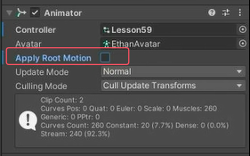
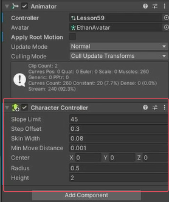
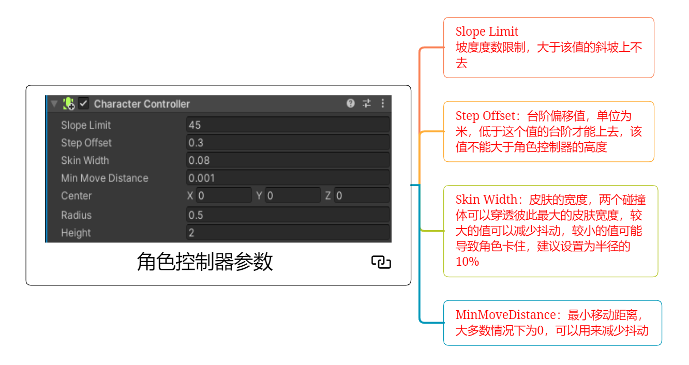
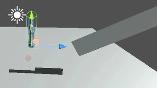
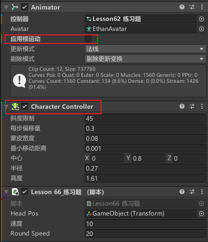
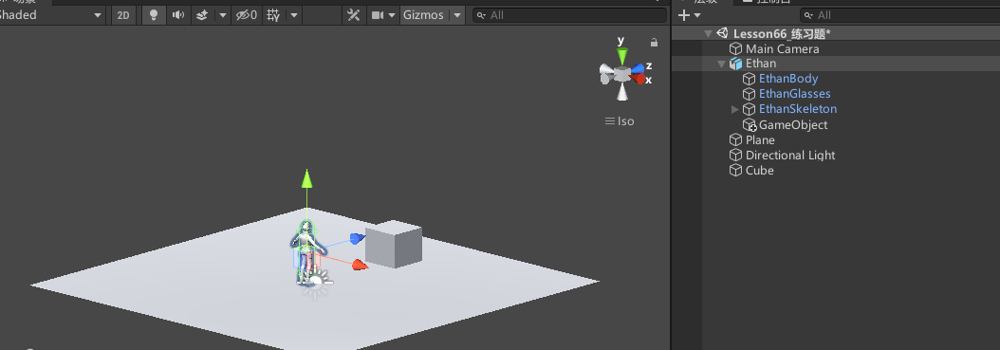

# CharacterController角色控制器是什么
角色控制器是让角色可以受制于碰撞，但是不会被刚体所牵制。
如果我们对角色使用刚体判断碰撞，可能会出现一些奇怪的表现，比如在斜坡上往下滑动，不加约束的情况碰撞可能让自己被撞飞等等。
而角色控制器会让角色表现得更加稳定。
Unity提供了角色控制器组件专门用于控制角色。

注意：
- 添加角色控制器后，不用再添加刚体。
- 能检测碰撞函数。
- 能检测触发器函数。
- 能被射线检测到。


# 角色控制器的使用


使用角色控制器建议取消Animator组件上的根运动


给角色添加CharacterController



## 角色控制器参数



Slope Limit（斜度限制）：坡度度数限制，大于该值的斜坡上不去
Step Offset（每步偏移量）：台阶偏移值，单位为米，低于这个值的台阶才能上去，该值不能大于角色控制器的高度
Skin Width（蒙皮宽度）：皮肤的宽度，两个碰撞体可以穿透彼此最大的皮肤宽度，较大的值可以减少抖动，较小的值可能导致角色卡住，建议设置为半径的10%。通俗来说就是角色可以和刚体穿模多少。
MinMoveDistance（最小移动距离）：大多数情况下为0，可以用来减少抖动


## 代码相关
CharacterController.isGrounded变量 是否接触了地面
```cs
//在上次移动期间 CharacterController 是否接触地面？
if (characterController.isGrounded)
{
    print("接触地面了");
}
```

CharacterController.SimpleMove方法 受重力作用的移动
```cs
characterController.SimpleMove(Vector3.forward * 10 * Time.deltaTime);
```

CharacterController.Move方法 不受重力作用的移动
```cs
characterController.Move(Vector3.forward * 10 * Time.deltaTime);
```

```cs
public class Lesson66_3D动画_角色控制器 : MonoBehaviour
{
    private CharacterController characterController;
    private Animator animator;

    void Start()
    {
        characterController = this.GetComponent<CharacterController>();
        animator = this.GetComponent<Animator>();

        if ( characterController.isGrounded )
        {
            print("接触地面了");
        }
    }

    void Update()
    {
        animator.SetInteger("Speed", (int)Input.GetAxisRaw("Vertical"));

        //CharacterController中的Move方法 不受重力作用的移动
        //始终朝人物前面移动
        characterController.SimpleMove(this.transform.forward * 80 * Time.deltaTime * Input.GetAxisRaw("Vertical"));
        //characterController.Move(this.transform.forward * 80 * Time.deltaTime * Input.GetAxisRaw("Vertical"));
    }

    //角色控制器判断是否和别的碰撞器产生碰撞时
    private void OnControllerColliderHit(ControllerColliderHit hit)
    {
        print("角色碰撞器发生碰撞"+hit.collider.gameObject.name);
    }

    //OnCollisionEnter方法对角色控制器没用 
    //private void OnCollisionEnter(Collision collision)
    //{
    //    print("碰撞触发");
    //}

    //角色控制器可以检测触发器 OnTriggerEnter方法有用
    private void OnTriggerEnter(Collider other)
    {
        print("触发器触发");
    }
}

```

# 练习
在之前的练习题基础上，加入角色控制器控制角色的移动

给模型添加角色控制器组件，取消Animator组件的根运动


创建平面光源立方体等


代码中得到角色控制器组件，写移动和选择逻辑
```cs
public class Lesson66_练习题 : MonoBehaviour
{
    private CharacterController characterController; 
    
    public float speed = 10;
    
    public float roundSpeed = 20;
    
    void Start()
    {
        characterController = this.GetComponent<CharacterController>();
    }
    
    void Update()
    {
        characterController.SimpleMove(this.transform.forward * speed * Time.deltaTime * Input.GetAxis("Vertical")); 
        
        this.transform.Rotate(Vector3.up, roundSpeed * Time.deltaTime * Input.GetAxis("Horizontal"));
    }
}
```