# 准备地形
在进行导航寻路网格生成时
第一步是需要有地形
地形由美术同学制作模型
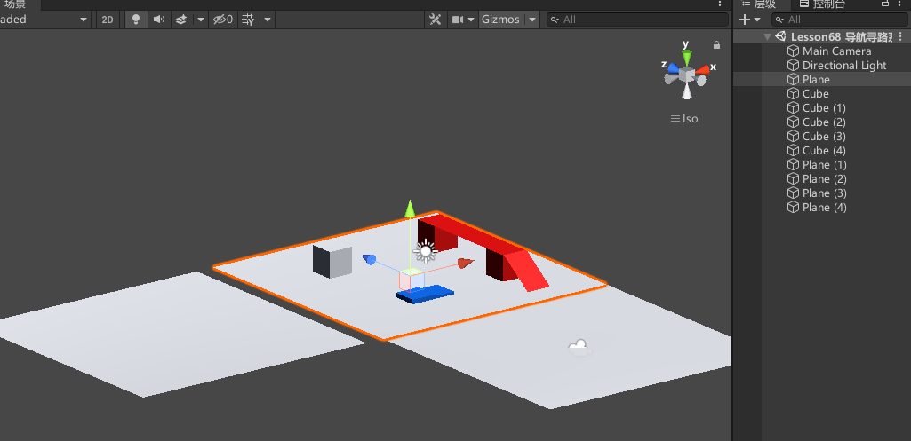

# 打开导航网格窗口

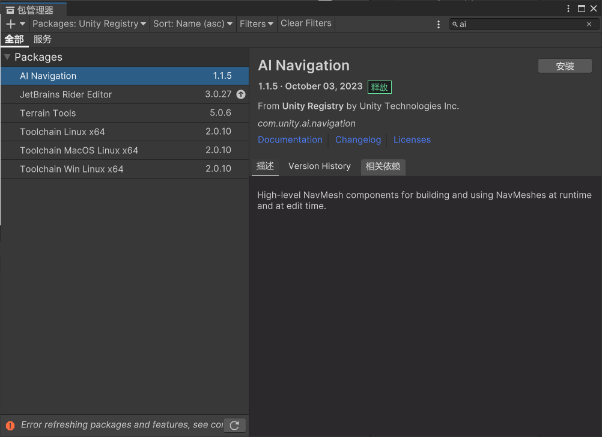

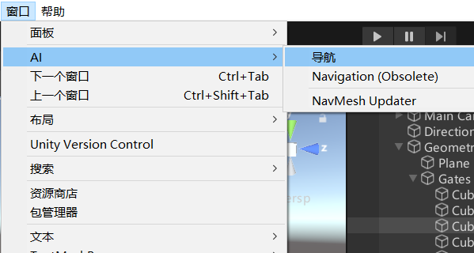

# 参数相关 旧版
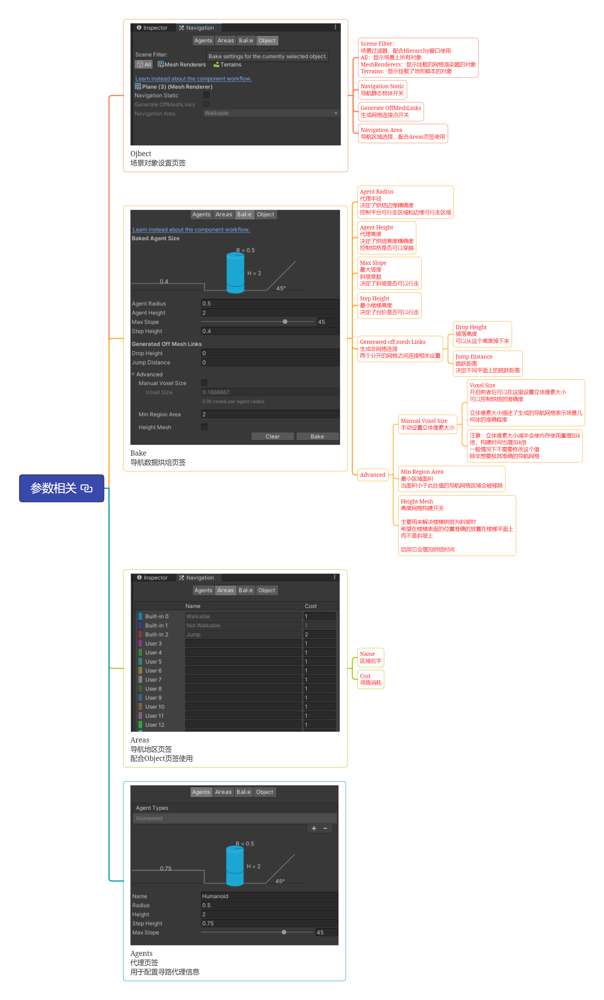

## Ojbect 场景对象设置页签
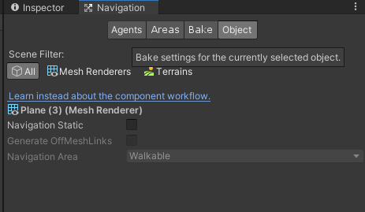

### Sceme Filter：
场景过滤器，配合Hierarchy窗口使用
All：显示场景上所有对象
MeshRenderers：显示挂载的网格渲染器的对象
Terrains：显示挂载了地形脚本的对象

### Navigation Static 导航静态物体开关
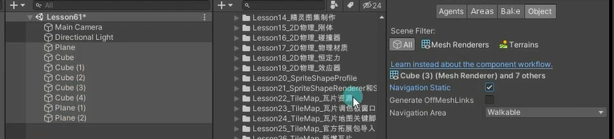

相当于在
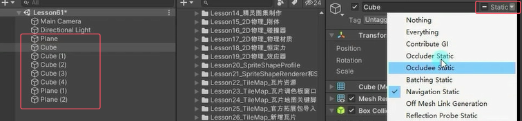

### Generate OffMeshLinks 生成网格连接点开关
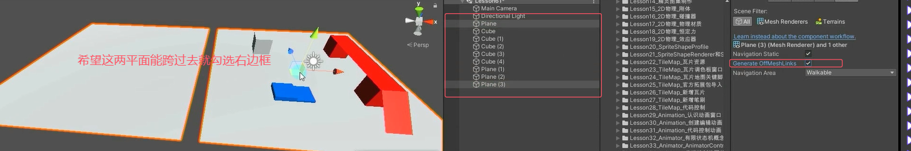

### Navigation Area

导航区域选择，配合Areas页签使用

## Bake 导航数据烘焙页签

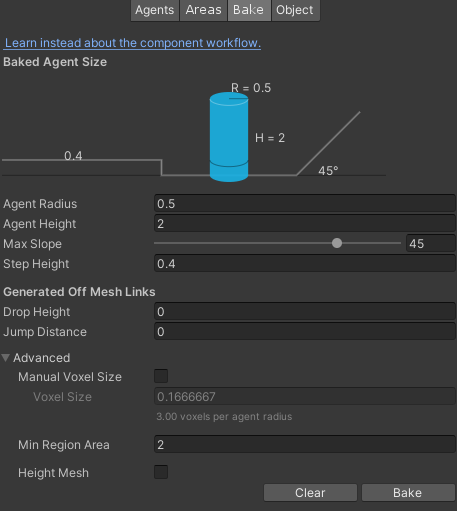

先把导航静态物体开关给打开再点下面烘焙
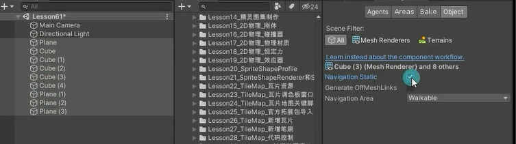
点击烘焙，场景中生成的蓝色部分就是可行走的区域。注意要设置成有对象是导航静态才能烘焙成功
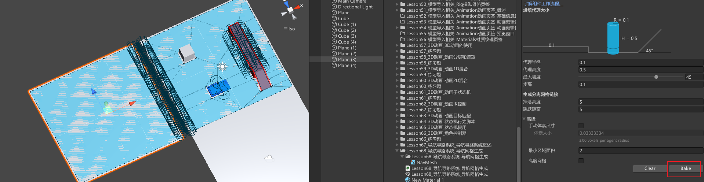

### Agent Radius 代理半径
决定了烘焙边缘精确度
控制平台可行走区域和边缘可行走区域

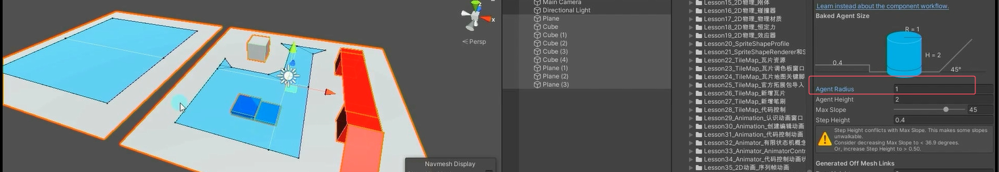

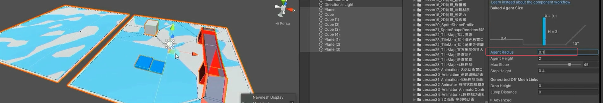

### Agent Height 代理高度
决定了烘焙高度精确度
控制拱桥是否可以穿越

拱桥不可以过
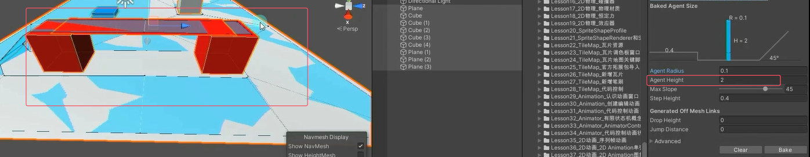

把代理高度调小就可以过
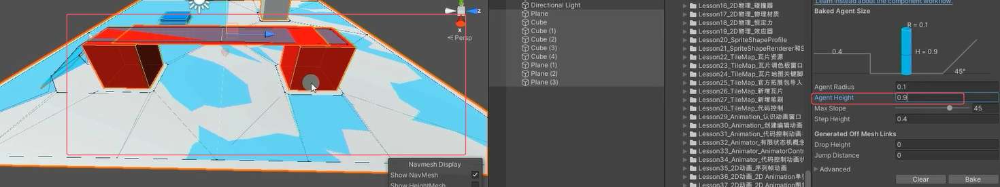

### Max Slope 最大坡度
斜坡度数
决定了斜坡是否可以行走

不能走，只能0~14.5
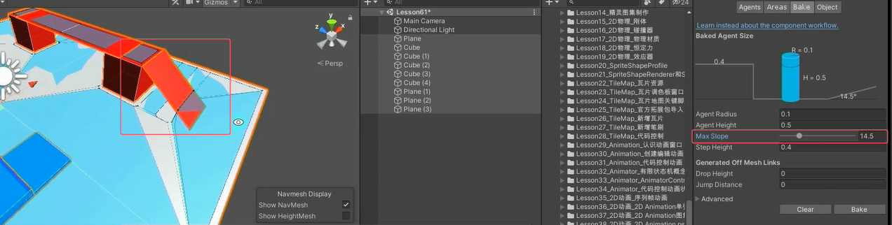

可以走，有0~60
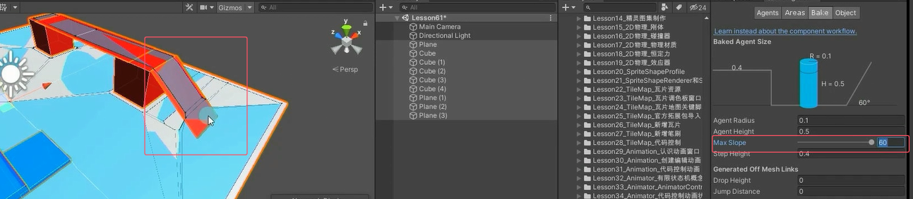

### Step Height 最小楼梯高度
决定了台阶是否可以行走

上面不能走，下面能走，上面 - 下面的高度差 > 0.1所以不能走
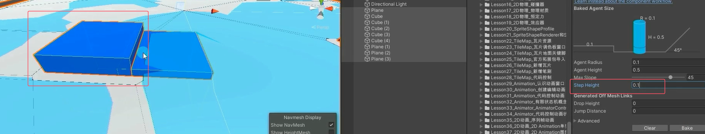

两个台阶都可以走
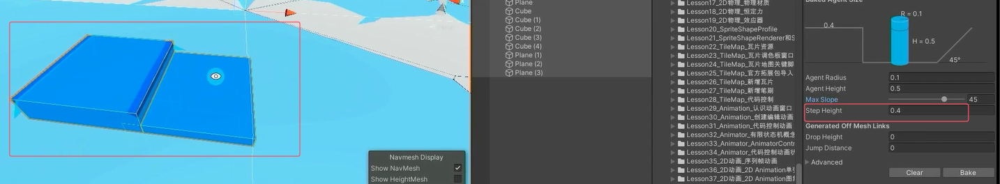

### Generated off mesh Links 生成非网格连接
两个分开的网格之间连接相关设置
记得要先把两平面之间的生成网格连接点开关给打开
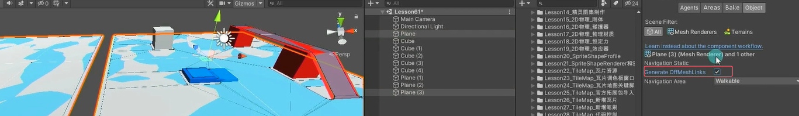

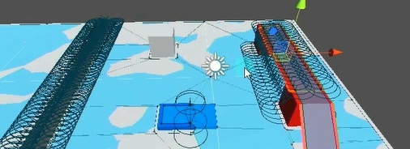

- Drop Height
  掉落高度
  可以从这个高度掉下来
- Jump Distance
  跳跃距离
  决定不同平面上的跳跃距离

### Advanced
一般很少设置高级设置，耗性能

- Manual Voxel Size
  手动设置立体像素大小
  立体像素大小描述了生成的导航网格表示场景几何体的准确程度 
  注意：立体像素大小减半会使内存使用量增加4倍，构建时间也增加4倍一般情况下不需要修改这个值
除非想要极其准确的导航网格

  - Voxel Size
    开启前者后可以在这里设置立体像素大小可以控制烘焙的准确度

- Min Region Area
  最小区域面积
  当面积小于此处值的导航网格区域会被移除

- Height Mesh
  高度网格构建开关
  主要用来解决楼梯烘焙为斜坡时希望在楼梯表面的位置准确的放置在楼梯平面上而不是斜坡上
  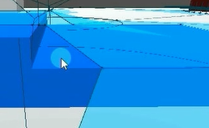
  启用它会增加烘焙时间

## Areas 导航地区页签
配合Object页签使用
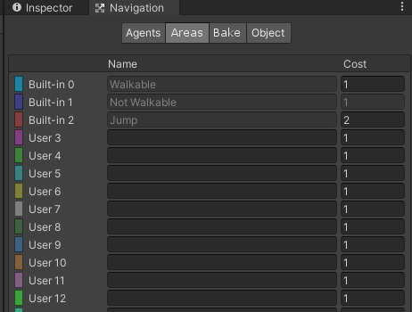

可以自己新加一个导航区域（Plane（4）），去Object页签选择
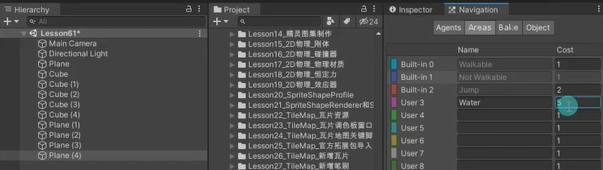

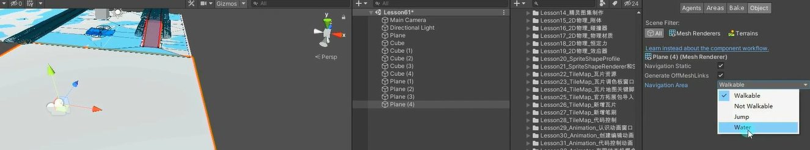

烘焙后
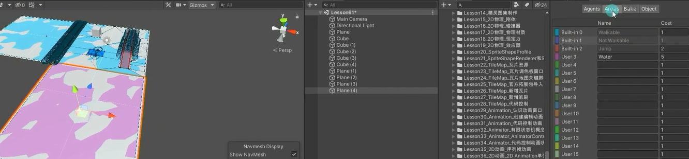

### Name 区域名字

### Cost 寻路消耗
寻路消耗越大，越不会从这边走

## Agents 代理页签
用于配置寻路代理信息

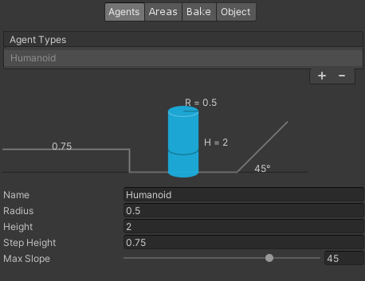
