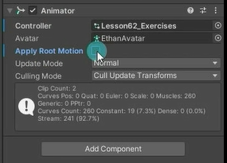

# 导航网格寻路组件是用来干什么的
NavMeshAgent
通过上节课导航网格生成知识点的学习，我们已经准备好了地形相关的数据，知道地形上哪些地方可以到达，哪些不能。那么寻路组件的作用就是帮助我们让角色可以在地形上准确的移动起来。

寻路组件的本质就是根据烘焙出的寻路网格信息，通过基于A星寻路的算法计算出行进路径让我们在该路径上移动起来。


# 导航网格寻路组件参数
先准备一个玩家，然后添加Nav Mesh Agent导航网格寻路组件


## Agent Type 代理类型 
配合Agents页签使用
## Base Offset 基础偏移值
相对对象轴心点的高度偏移

## Steering 移动设置

Speed 寻路时的最大移动速度（世界单位/秒）

Angular Speed 寻路时转身的最大旋转速度（度/秒）

Acceleration 最大加速度（世界单位/平方秒）

Stopping Distance 当靠近目标点多少距离时，停止运动

Auto Braking 自动制动（减速） 启用后，当到达目标时将减速，如果存在连续移动（比如巡逻移动）建议不要开启该选项

## Obstacle Avoidance 避障设置

### Radius 半径
用于计算障碍物和其它寻路对象之间的碰撞


### Height 高度
通过头顶障碍物时用于计算高度间隙使用


### Quality 障碍躲避品质
越高躲避障碍越准确，但是性能消耗较大，如果不想主动避开其它动态障碍，可以设置为无，则只会解析碰撞

### Priority 优先级
0~99， 避障时，数字较小的障碍物表示较高的优先级 优先级低的会忽略避障

## Path Finding 路径寻找规则

### Auto Traverse OffMesh Link 自动通过分离网格链接
是否开启自动遍历网格外的其它网格连接 
如果要自定义判断，则关闭此功能

### Auto Repath 自动重新寻路
如果开启，当到达路径后段时会再次尝试寻路，当没有到达目标的路径时，会生成一条到达与目标位置最近的可达点

### Area Mask 区域遮罩
寻路时，考虑的区域 如果寻路时不想考虑某些区域，则取消选中 
塔防游戏中常见的功能


# 代码设置
使用网格相关脚本需要引用命名 UnityEngine.AI
```cs
public NavMeshAgent navMeshAgent;

void Start()
{
    navMeshAgent = GetComponent<NavMeshAgent>();
}
```

## 常用内容
**NavMeshAgent.SetDestination方法 自动寻路设置目标点传入Vector3变量**
```cs
navMeshAgent.SetDestination()
```

**NavMeshAgent.isStopped变量 停止寻路**
```cs
navMeshAgent.isStopped = true;
```
示例
```cs
void Update()
{
    if (Input.GetMouseButtonDown(0))
    {
        RaycastHit hit; // 存储射线检测的结果
        if (Physics.Raycast(Camera.main.ScreenPointToRay(Input.mousePosition), out hit)) // 如果从主摄像机的鼠标位置发出一条射线，并检测到碰撞体
        {
            print(hit.collider.name);
            navMeshAgent.isStopped = false;  // 开启寻路
            //让对象朝目标点移动 先生成行进路径 然后再移动
            navMeshAgent.SetDestination(hit.point); 
        }
    }

    if (Input.GetKeyDown(KeyCode.Space)) // 如果按下空格键
    {
        navMeshAgent.isStopped = true; // 设置导航代理的isStopped属性为true，表示停止移动
    }
}
```
假如发现跳跃的地方跳不过去，需要检查两岸的生成寻路网格连接的选项有没有勾选，要勾选了才能从一边跳到另一边，要两边都能跳的话两边都要勾选


遇到消耗更高的区域会绕着走，遇到不能走的区域也会绕过去


## 不常用
### 属性
1 面板参数相关 速度，加速度，旋转速度
```cs
//遵循路径时的最大移动速度。
print(navMeshAgent.speed);

//代理遵循某一路径时的最大加速度，以单位/秒^2 表示。
print(navMeshAgent.acceleration);

//遵循路径时的最大回转速度（以 deg/ s 为单位）。
print(navMeshAgent.angularSpeed);
```

2 其它重要属性
2.1 当前是否有路径
```cs
//NavMeshAgent中的hasPath变量 当前是否有路径
if ( navMeshAgent.hasPath )
{
}

```
2.2 代理目标点 可以设置 也可以得到
```cs
//获取代理在世界坐标系单位中的目标或尝试设置代理在其中的目标。
print(navMeshAgent.destination);
```

2.3 代理目标点 
```cs
//获取代理在世界坐标系单位中的目标或尝试设置代理在其中的目标。
print(navMeshAgent.destination);
```

2.4 当前路径
```cs
//获取和设置当前路径的属性。
print(navMeshAgent.path);
```

2.5 路径是否在计算中
```cs
//是正在计算过程中而尚未就绪的路径吗？（只读）
if ( navMeshAgent.pathPending )
{
}
```

2.6 路径状态
```cs
//当前路径的状态（完整、部分或无效）。
print(navMeshAgent.pathStatus);
```
2.7 是否更新位置
```cs
//获取或设置变换位置是否与模拟的代理位置同步。默认值为 true。
navMeshAgent.updatePosition = true;
```

2.8 是否更新角度
```cs
//代理是否应该更新变换方向？
navMeshAgent.updateRotation = true;
```
2.9 代理速度
```cs
//获取 NavMeshAgent 组件的当前速度，或者设置一个速度来手动控制代理。
print(navMeshAgent.velocity);
```

2.10 计算生成路径
```cs
//计算到指定点的路径并存储生成的路径。
NavMeshPath navMeshPath = new NavMeshPath();
if( navMeshAgent.CalculatePath(Vector3.zero, navMeshPath) )
{
}
```

### 方法
计算生成路径
```cs
//计算到指定点的路径并存储生成的路径。
NavMeshPath navMeshPath = new NavMeshPath();
if( navMeshAgent.CalculatePath(Vector3.zero, navMeshPath) )
{
}
```

设置新路径
```cs
//为此代理分配一条新路径。
if (navMeshAgent.SetPath(navMeshPath))
{
}
```

清除路径
```cs
//清除当前路径。
navMeshAgent.ResetPath();
```


调整到指定点位置
```cs
//将代理调整至指定的位置。
navMeshAgent.Warp(Vector3.zero);
```


# 练习
在场景上加入一个角色，可以通过鼠标右键点击控制场景上角色的移动，要切换动画

先搭建场景


角色动作只有待机和移动
设置角色的Animator状态机


通过导航寻路系统来移动，取消通过动画来移动


添加脚本挂载到角色上，脚本中判断鼠标点击移动角色并播放动画
```cs
void Update()
{
    if (Input.GetMouseButtonDown(0))
    {
        RaycastHit hit;
        if (Physics.Raycast(Camera.main.ScreenPointToRay(Input.mousePosition), out hit)) 
        {
            navMeshAgent.SetDestination(hit.point);
        }
    }

    if (navMeshAgent.velocity == Vector3.zero) // 如果导航代理的速度为零，表示没有移动
        animator.SetInteger("Speed", 0);
    else // 否则，表示正在移动
        animator.SetInteger("Speed", 1);
}
```