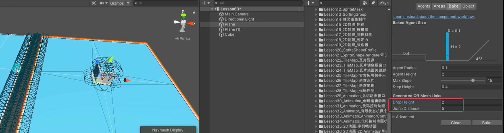

# OffMeshLink网格外连接是什么
我们在烘焙地形数据的时候，可以生成网格外连接，但是它是满足条件的都会生成，而且是要在编辑模式下生成。

如果我们只希望两个未连接的平面之间只有有限条连接路径可以跳跃过去，并且运行时可以动态添加，就可以使用网格外连接组件，达到“指哪打哪”的效果。


# 网格外连接组件使用
使用两个对象作为两个平面之间的连接点（起点和终点）创建两个对象作为起点和终点

先搭建环境





**使用两个对象作为两个平面之间的连接点（起点和终点）创建两个对象作为起点和终点**


**添加Off Mesh Link脚本进行关联**
这个脚本添加到**哪个对象上都可以**，可以添加到新建空对象，也可以是起点或终点对象


**设置Off Mesh Link脚本参数**
# 网格外连接组件参数


## Start 起始点

## End 结束点

## Cost Override* 覆盖消耗值 
负数或0则使用所属Area区域中的寻路消耗值 
如果为正数，则使用Area区域寻路消耗值 * 正数代表该连接点的寻路消耗 
相当于我们可以自定义连接点的寻路消耗 
主要用来解决当有"步行"和连接点都可以到达某一个目标时，希望优先选择步行区域，但是步行路径明显更远时修改该值

## Bi Directional 是否开启双向连接点 
开启后可以从Start到End，反之也可以 
如果关闭，则只能Start到End

## Activated 是否启用该连接点 
如果关闭，则自动寻路时相当于失效

## Auto Update Positions 是否自动更新位置 
如果启用 当**开始和结束**位置改变时，导航网格也将更新 
如果不启用，即使改变了开始结束位置，也会按照刚开始的位置进行计算

```cs
void Update()
    {
        if( Input.GetMouseButtonDown(0) )
        {
            RaycastHit hit;
            if(Physics.Raycast(Camera.main.ScreenPointToRay(Input.mousePosition), out hit))
            {
                navMeshAgent.SetDestination(hit.point);
            }
        }
    }
```


