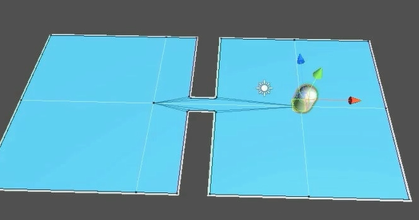
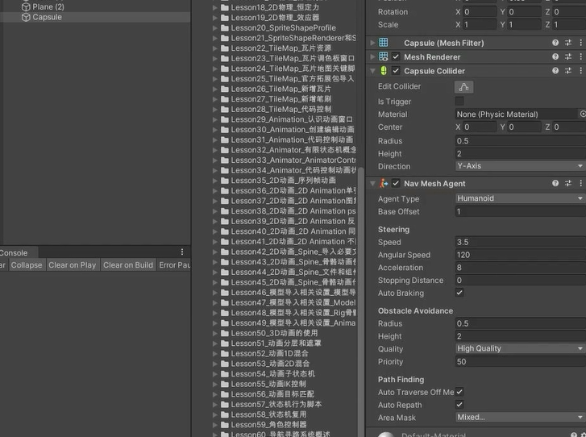
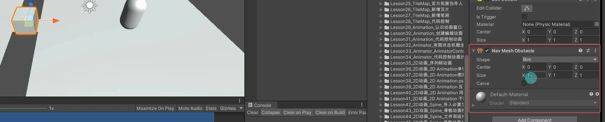
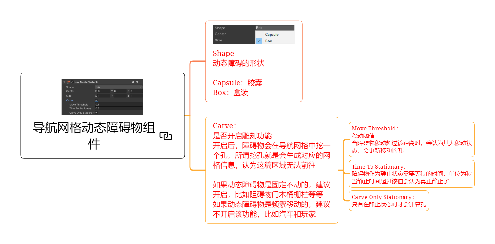
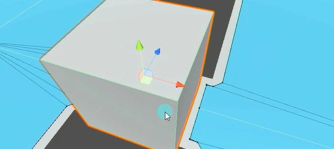
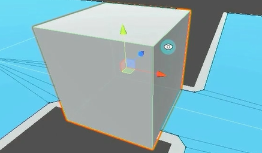
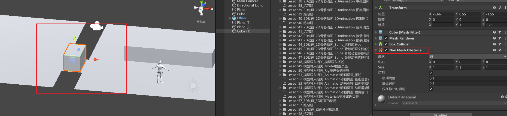
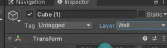

# 导航网格动态障碍组件用来干啥
在游戏中常常会有这样的一个功能，场景中有一道门，如果这道门没有被破坏是不能自动导航到门后场景的。
只有当这道门被破坏了，才可以通过此处前往下一场景。
而类似这样的物体本身是不需要进行寻路的，所以没有必要为它添加NavMeshAgent脚本。 
这时就会使用**动态障碍**组件实现该功能。


# 导航动态障碍物组件的使用
先创建地形环境





**为需要进行动态阻挡的对象添加NavMeshObstacle组件**
创建一个立方体作为障碍物，目标是障碍物被销毁才能通过桥。立方体添加NavMeshObstacle组件


**设置相关参数**

**代码逻辑控制其的移动或者显隐**，让代理对象看看要不要通过某些区域或者不然通过某些区域
# 导航网格动态障碍物组件参数

## Shape 动态障碍的形状
Capsule：胶囊 
Box：盒装

## Carve：是否开启雕刻功能 
开启后，障碍物会在导航网格中挖一个孔，所谓挖孔就是会生成对应的网格信息，认为这篇区域无法前往


取消Carve后


如果动态障碍物是固定不动的，建议开启，比如阻碍物门木桶栅栏等等 
如果动态障碍物是频繁移动的，建议不开启该功能，比如汽车和玩家

### Move Threshold：移动阈值 
当障碍物移动超过该距离时，会认为其为移动状态，会更新移动的孔

### Time To Stationary 静止时间
障碍物作为静止状态需要等待的时间
单位为秒 当静止时间超过该值会认为真正静止了

### Carve Only Stationary：仅在静止时切割
只有在静止状态时才会计算孔


# 练习
在场景上加入一个阻碍玩家前进的动态障碍物，玩家摧毁它才可以前往下一个区域

创建两个地形，中间的桥。桥上添加一个立方体作为障碍物，障碍物添加NavMeshObstacle组件。注意要打开雕刻功能。打开后因为中间寻路网格断开了，玩家会自动停止不播跑步动画了。假如是移动的怪物就不应该打开雕刻功能，注意玩家可以绕开怪物走。



给障碍物立方体修改成Wall层级，在脚本中添加鼠标右键销毁障碍物的代码

```cs
if( Input.GetMouseButtonDown(0) )
{
    RaycastHit hit;
    if(Physics.Raycast(Camera.main.ScreenPointToRay(Input.mousePosition), out hit))
    {
        navMeshAgent.SetDestination(hit.point);
    }
}

if (Input.GetMouseButtonDown(1))
{
    RaycastHit hit;
    if (Physics.Raycast(
            Camera.main.ScreenPointToRay(Input.mousePosition), 
            out hit, 
            1000, 
            1 << LayerMask.NameToLayer("Wall")
        ) // 从主摄像机的鼠标位置发出一条射线，并在1000米内检测到属于Wall层的碰撞体
    ) 
    {
        hit.collider.gameObject.SetActive(false);
    }
}
```

