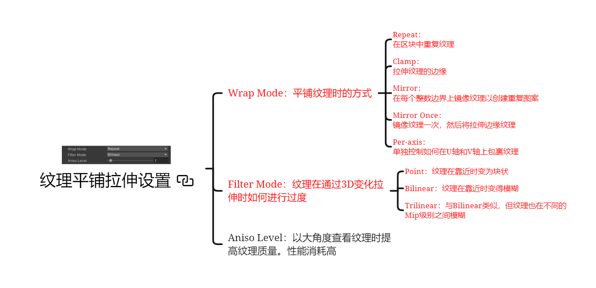
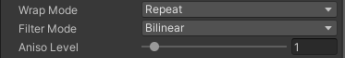
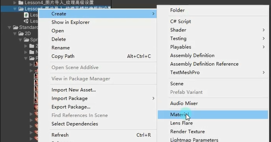
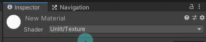
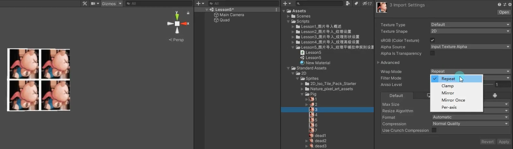
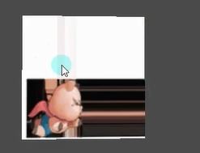
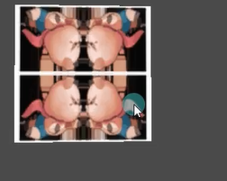
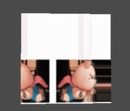
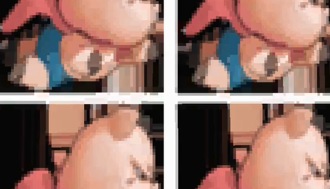
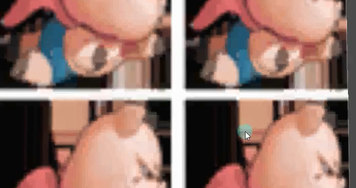

# 平铺拉伸主要是做什么
平铺拉伸主要设置纹理的平铺规则以及拉伸规则

# 纹理平铺拉伸参数

## Wrap Mode：平铺纹理时的方式
**一般情况下不需要自己设置，是美术会帮你设置好**

先创建一个材质球，设置shader，然后直接将材质球直接给场景上的Quad

### Repeat：在区块中重复纹理

### Clamp：拉伸纹理的边缘

### Mirror：在每个整数边界上镜像纹理以创建重复图案

### Mirror Once：镜像纹理一次，然后将拉伸边缘纹理

### Per-axis：单独控制如何在U轴和V轴上包裹纹理

## Filter Mode：纹理在通过3D变化拉伸时如何进行过度

### Point：纹理在靠近时变为块状

### Bilinear：纹理在靠近时变得模糊

### Trilinear：与Bilinear类似，但纹理也在不同的Mip级别之间模糊

## Aniso Level：以大角度查看纹理时提高纹理质量。性能消耗高