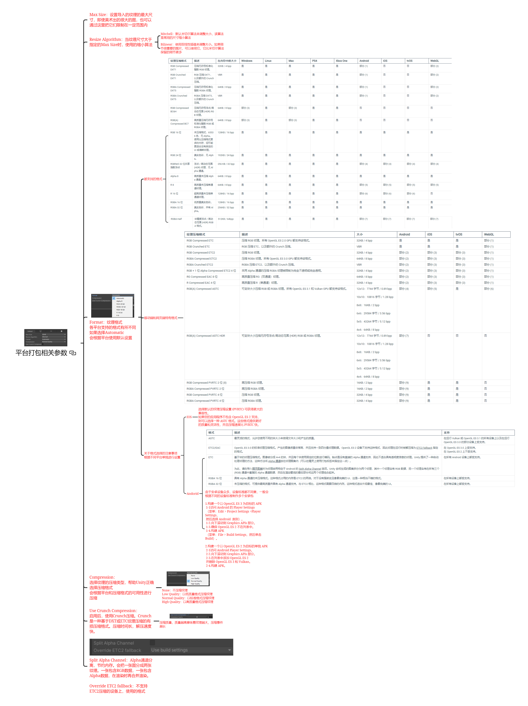
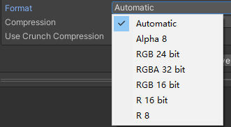
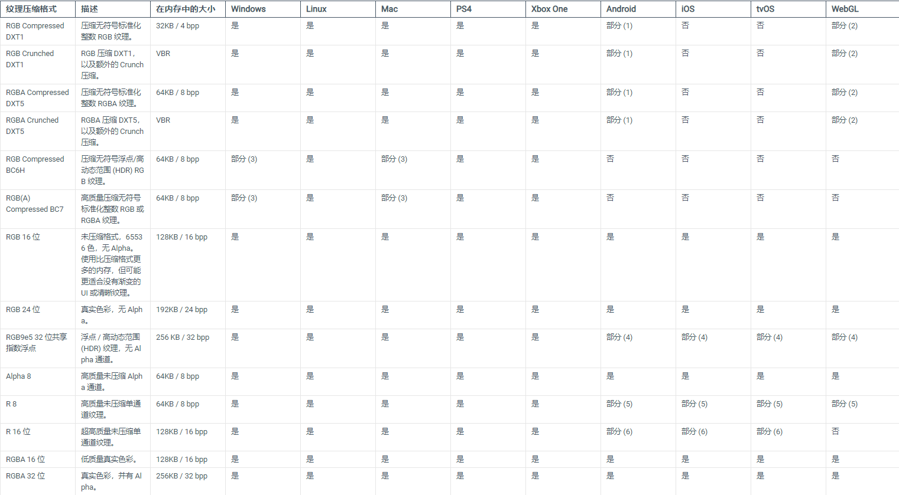
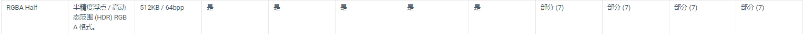
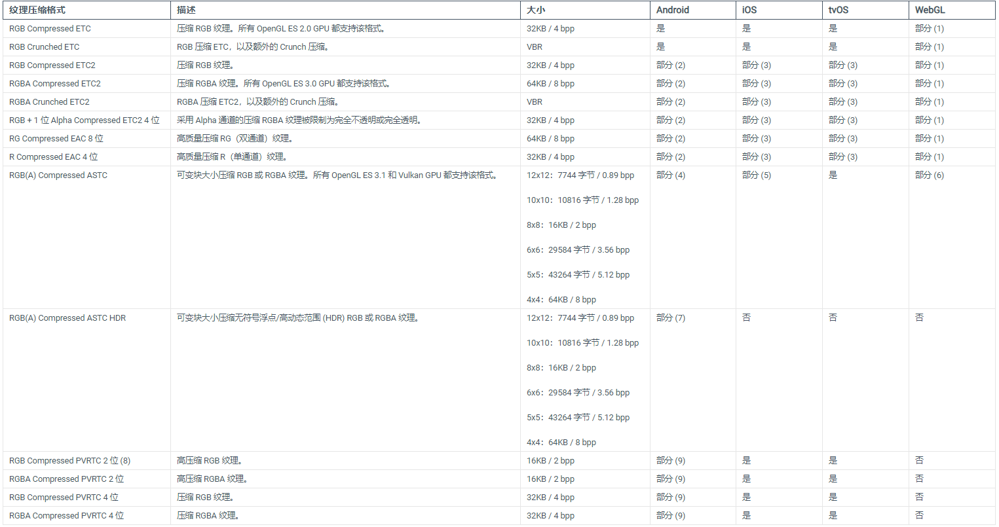
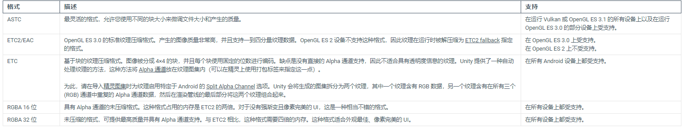
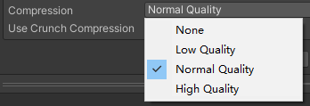
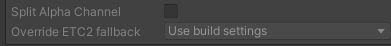

# 平台设置主要设置什么？
平台设置主要设置纹理最终打包时在不同平台的尺寸、格式、压缩方式。它非常的重要，因为它影响了你的包大小和读取性能方面的问题。

# 平台打包相关参数
[平台打包相关参数.svg](8.纹理平台打包相关设置/平台打包相关参数.svg)

## Max Size：纹理的最大尺寸
设置导入的纹理的最大尺寸，即使美术出的很大的图，也可以通过这里把它们限制在一定范围内
一般选2048就行，有的设备不支持很大的纹理

## Resize Algorithm：缩小算法
当纹理尺寸大于指定的Max Size时，使用的缩小算法
- Mitchell：默认米切尔算法来调整大小，该算法是常用的尺寸缩小算法
- Bilinear：使用双线性插值来调整大小。如果细节很重要的图片，可以使用它，它比米切尔算法保留的细节更多

## Format：纹理格式

各平台支持的格式有所不同 如果选择Automatic 会根据平台使用默认设置

### 都支持的格式

### 移动端和网页端特有格式

### 关于格式选择的注意事项
根据不同平台单独进行设置
- IOS：选择默认的纹理压缩设置 (PVRTC) 可获得更大的兼容性。 如果您的应用程序不包含 OpenGL ES 2 支持，则可以选择一种 ASTC 格式。这些格式提供更好的质量和灵活性，并且压缩速度比 PVRTC 快。
        
- Andorid：
  
  由于安卓设备众多，设备标准都不同一，一般会根据不同的设备标准制作多个安装包

1. 构建一个以 OpenGL ES 3 为目标的 APK 
   1-1访问 Android 的 Player Settings （菜单：Edit > Project Settings >Player Settings， 然后选择 Android 类别）。 
   1-2.向下滚动到 Graphics APIs 部分。 
   1-3.确保 OpenGL ES 2 不在列表中。 
   1-4.构建 APK （菜单：File > Build Settings，然后单击 Build）。

2. 构建一个以 OpenGL ES 2 为目标的单独 APK 
   2-1访问 Android Player Settings。 
   2-2.向下滚动到 Graphics APIs 部分。 
   2-3.在列表中添加 OpenGL ES 2 并删除 OpenGL ES 3 和 Vulkan。 
   2-4.构建 APK。

## Compression：选择纹理的压缩类型

帮助Unity正确选择压缩格式 会根据平台和压缩格式的可用性进行压缩
None：不压缩纹理
Low Quality：以低质量格式压缩纹理 
Normal Quality：以标准格式压缩纹理 
High Quality：以高质量格式压缩纹理

## Use Crunch Compression：使用Crunch压缩
Crunch是一种基于DXT或ETC纹理压缩的有损压缩格式。压缩时间长，解压速度快。

- 压缩质量：质量越高意味着纹理越大，压缩事件越长

## Split Alpha Channel：Alpha通道分离

Alpha通道分离，节约内存。会把一张图分成两张纹理。一张包含RGB数据，一张包含Alpha数据，在渲染时再合并渲染。

Override ETC2 fallback：不支持ETC2压缩的设备上，使用的格式