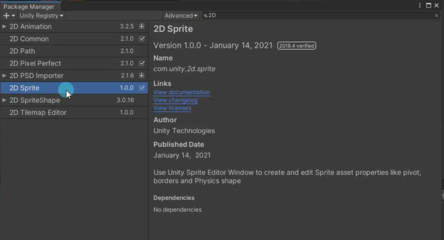
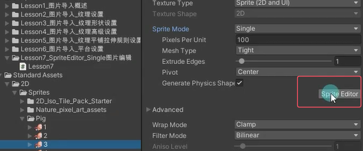
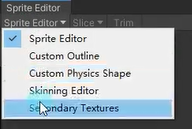
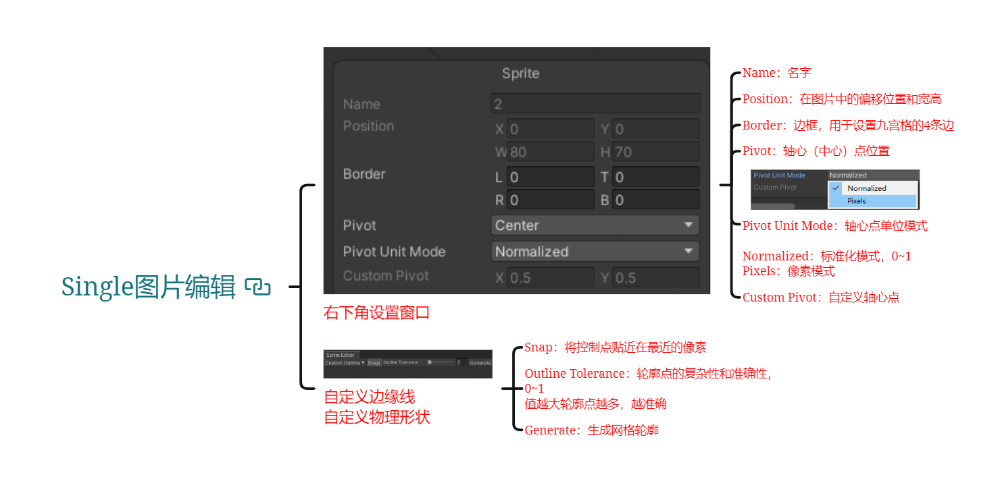
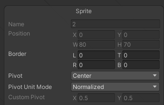
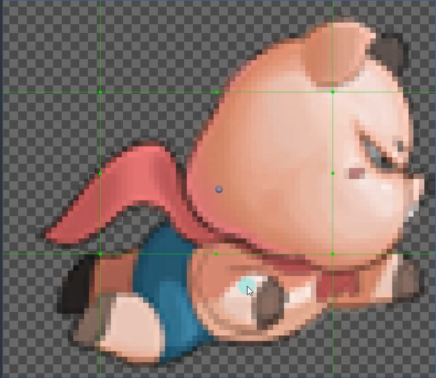
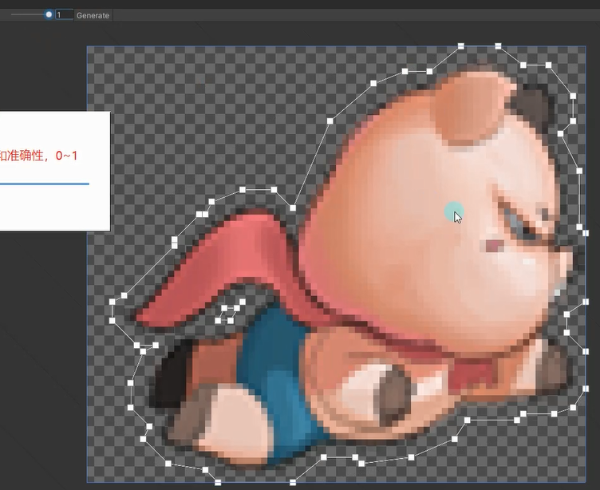
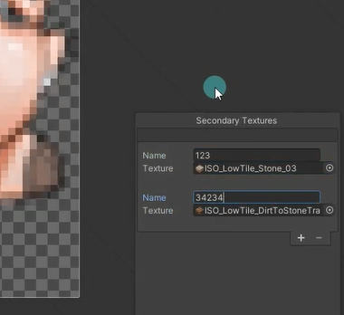

# SpriteEditor是什么？
SpriteEditor就是精灵图片编辑器。它主要用于编辑2D游戏开发中使用的Sprite精灵图片。它可以用于编辑图集中提取元素，设置精灵边框，设置九宫格，设置轴心（中心）点等等功能。打开SpriteEditor需要把一张图片的纹理类型切换成Sprite模式。

# 引入SpriteEditor
如果一开始是一个3d的工程，需要安装2D Sprite包才能使用SpriteEditor。
可以点击SpriteEditor按钮跳转下载或者直接打开PackageManager搜索2DSprite并导入。

# Single图片编辑 功能讲解
Single图片编辑主要讲解的就是在设置图片时
将精灵图片模式（Sprite Mode）设置为Single的精灵图片在Sprite Editor窗口中如何编辑

打开sprite editor

## Sprite Editor
Sprite Editor右下角设置窗口

### Name：图片名字

### Position：在图片中的偏移位置和宽高

### Border：边框，用于设置九宫格的4条边
用一些切片模式就会用到

### Pivot：轴心（中心）点位置

### Pivot Unit Mode：轴心点单位模式
Normalized：标准化模式，0~1
Pixels：像素模式

### Custom Pivot：自定义轴心点

## Custom Outline 自定义边缘线
自定义边缘线设置，可以自定义精灵网格的轮廓形状。默认情况下不修改都是在矩形网格上渲染，边缘外部透明区域会被渲染，浪费性能。使用自定义轮廓，可以调小透明区域，提高性能。

### Snap：将控制点贴近在最近的像素

### Outline Tolerance：轮廓点的复杂性和准确性，0~1
值越大轮廓点越多，越准确

### Generate：生成网格轮廓

## Custom Physics Shape（决定碰撞判断区域）
自定义精灵图片的物理形状，主要用于设置需要物理碰撞判断的2D图形。
它决定了之后产生碰撞检测的区域。参数和操作和[自定义边缘线](#custom-outline-自定义边缘线)中基本一致

## Skinning Editor 皮肤编辑器

## Secondary Textures（为图片添加特殊效果）
次要纹理设置，可以将其它纹理和该精灵图片关联。点击加号添加要关联的图片作为辅助纹理，设置名字。着色器可以得到这些辅助纹理然后用于做一些效果处理，让精灵应用其它效果。
