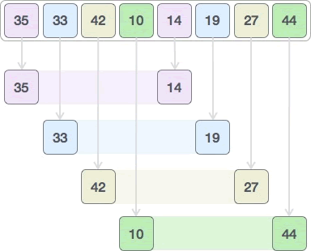
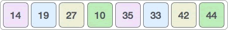
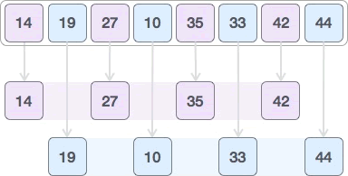
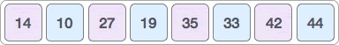

### 插入排序


```cpp

#include <iostream>
#include <vector>

void insertionSort(std::vector<int>& arr) {
    for (int i = 1; i < arr.size(); ++i) {
        int key = arr[i];  // 保存
        int j = i - 1;
        while (j >= 0 && arr[j] > key) {
            arr[j + 1] = arr[j];
            --j;
        }
        arr[j + 1] = key;
    }
}

int main() {
    std::vector<int> arr = {12, 11, 13, 5, 6};
    insertionSort(arr);
    for (int num : arr) {
        std::cout << num << " ";
    }
    return 0;
}

```


### 选择排序


```cpp
#include <iostream>
#include <vector>

void selectionSort(std::vector<int>& arr) {
    for (int i = 0; i < arr.size() - 1; ++i) {
        int minIndex = i;
        for (int j = i + 1; j < arr.size(); ++j) {
            if (arr[j] < arr[minIndex]) {
                minIndex = j;
            }
        }
        std::swap(arr[i], arr[minIndex]);
    }
}

int main() {
    std::vector<int> arr = {64, 25, 12, 22, 11};
    selectionSort(arr);
    for (int num : arr) {
        std::cout << num << " ";
    }
    return 0;
}
```


### 冒泡排序


从列表的第一个元素开始，比较相邻的两个元素。
如果前一个元素大于后一个元素，交换它们的位置。
继续遍历列表，直到最后一个元素。
重复上述步骤，直到没有需要交换的元素为止。

时间复杂度：
- 最坏情况：$O(n^2)$（当数组完全逆序时）
- 最好情况：$O(n)$（当数组已经有序时）
- 平均情况：$O(n^2)$

空间复杂度：
- O(1)O(1)（原地排序，不需要额外的存储空间）
```cpp
#include <iostream>
using namespace std;

void bubbleSort(int arr[], int n) {
    for (int i = 0; i < n - 1; i++) { // 外层循环控制遍历次数
        bool swapped = false; // 标志位，用于优化
        for (int j = 0; j < n - i - 1; j++) { // 内层循环比较相邻元素
            if (arr[j] > arr[j + 1]) {
                // 交换相邻元素
                swap(arr[j], arr[j + 1]);
                swapped = true; // 发生了交换
            }
        }
        if (!swapped) { // 如果没有发生交换，说明已经有序，提前退出
            break;
        }
    }
}

int main() {
    int arr[] = {64, 34, 25, 12, 22, 11, 90};
    int n = sizeof(arr) / sizeof(arr[0]);

    bubbleSort(arr, n);

    cout << "排序后的数组: ";
    for (int i = 0; i < n; i++) {
        cout << arr[i] << " ";
    }
    cout << endl;

    return 0;
}

```


### 希尔排序


希尔排序算法的实现思路是：
将待排序序列划分成多个子序列，使用普通的插入排序算法对每个子序列进行排序；
按照不同的划分标准，重复执行第一步；
使用普通的插入排序算法对整个序列进行排序。

间隔 4 个元素，将整个序列划分为 4 个子序列：


采用插入排序算法分别对 {35, 14}、{33, 19}、{42, 27}、{10, 44} 进行排序，最终生成的新序列为：


间隔 2 个元素，再次划分整个序列：



采用插入排序算法分别对 {14, 27, 35, 42} 和 {19, 10, 33, 44} 进行排序：



希尔排序的时间复杂度取决于**增量序列**的选择：

最坏情况：O(n²)，当增量序列选择不当时。
最好情况：O(n log n)，当增量序列选择合适时。
平均情况：O(n log n) 到 O(n²) 之间。


优点：
相对于简单插入排序，效率更高。
原地排序，不需要额外的存储空间。
适用于中等规模的数据集。

缺点：
时间复杂度依赖于增量序列的选择。
不稳定排序算法（可能改变相同元素的相对顺序）。


```cpp

#include <iostream>
using namespace std;

void shellSort(int arr[], int n) {
    // 初始增量设为数组长度的一半，逐步缩小
    for (int gap = n / 2; gap > 0; gap /= 2) 
    {
        // 对每个子序列进行插入排序
        for (int i = gap; i < n; i++) 
        {
            int temp = arr[i]; // 记录当前待插入的元素
            int j;
            // 将元素插入到正确的位置
            for (j = i; j >= gap && arr[j - gap] > temp; j -= gap) 
            {
                arr[j] = arr[j - gap];
            }
            arr[j] = temp;
        }
    }
}

int main() {
    int arr[] = {12, 34, 54, 2, 3};
    int n = sizeof(arr) / sizeof(arr[0]);

    shellSort(arr, n);

    cout << "排序后的数组: ";
    for (int i = 0; i < n; i++) {
        cout << arr[i] << " ";
    }
    return 0;
}

```

### 快速排序


选择基准元素：从列表中选择一个元素作为基准（pivot）。选择方式可以是第一个元素、最后一个元素、中间元素或随机元素。
分区：将列表重新排列，使得所有小于基准元素的元素都在基准的左侧，所有大于基准元素的元素都在基准的右侧。基准元素的位置在分区完成后确定。
递归排序：对基准元素左侧和右侧的子列表分别递归地进行快速排序。
合并：由于分区操作是原地进行的，递归结束后整个列表已经有序。

时间复杂度：
最好情况：O(n log n)，每次分区都能将数组均匀地分成两部分。
最坏情况：O(n²)，每次分区都只能分出一个元素，例如数组已经有序时。
平均情况：O(n log n)，在实际应用中，快速排序的平均性能非常好。

空间复杂度：
O(log n)，主要用于递归调用栈。

可以随机选择基准值避免最坏情况的发生。

```cpp
#include <iostream>
using namespace std;

// 快速排序的核心函数
int partition(int arr[], int low, int high) 
{
    int pivot = arr[high];  // 选择最后一个元素作为基准值
    int i = low - 1;        // i 是小于基准值的部分的最后一个元素的索引

    for (int j = low; j < high; j++) 
    {
        if (arr[j] < pivot) 
        {
            i++;
            swap(arr[i], arr[j]);  // 将小于基准值的元素放到左边
        }
    }
    swap(arr[i + 1], arr[high]);  // 将基准值放到正确的位置
    return i + 1;  // 返回基准值的索引
}

// 快速排序的递归函数
void quickSort(int arr[], int low, int high) 
{
    if (low < high) 
    {
        int pi = partition(arr, low, high);  // 分区并获取基准值的索引
        quickSort(arr, low, pi - 1);
        quickSort(arr, pi + 1, high);
    }
}

// 测试代码
int main() {
    int arr[] = {10, 7, 8, 9, 1, 5};
    int n = sizeof(arr) / sizeof(arr[0]);
    quickSort(arr, 0, n - 1);
    cout << "Sorted array: ";
    for (int i = 0; i < n; i++) 
    {
        cout << arr[i] << " ";
    }
    return 0;
}

```

### 归并排序
分：将数组从中间分成两半。（为1时天然有序）
治：递归地对两个子数组进行排序。
合：将两个有序的子数组合并成一个有序的数组。

记住：算法不是死记硬背的招式，而是解决问题的策略。下次遇到复杂问题时，先想能否"分而治之"！
思维拓展
当遇到K个有序数组合并时，归并策略可以演变为多路归并（使用优先队列优化）。这种分治思想还广泛应用于：

逆序对统计（在合并时计数）
大整数乘法（拆分成小块计算）
分布式排序（MapReduce框架的核心思想）


```cpp
void merge(vector<int>& nums, int l, int mid, int r) 
{
    vector<int> temp(r - l + 1);  // 临时数组存放合并后的结果
    int i = l, j = mid + 1, k = 0;
    
    // 合并两个有序数组
    while (i <= mid && j <= r) 
    {
        if (nums[i] <= nums[j]) temp[k++] = nums[i++];
        else temp[k++] = nums[j++];
    }
    
    // 将剩余的元素放入临时数组
    while (i <= mid) temp[k++] = nums[i++];
    while (j <= r) temp[k++] = nums[j++];
    
    // 将临时数组的内容拷贝回原数组
    for (int p = 0; p < k; p++) nums[l + p] = temp[p];
}

void mergeSort(vector<int>& nums, int l, int r) {
    if (l >= r) return;  // 递归终止条件：只有一个元素时无需排序
    
    int mid = l + (r - l) / 2;  // 找到中间点
    mergeSort(nums, l, mid); 
    mergeSort(nums, mid + 1, r);
    merge(nums, l, mid, r); 
}

```
