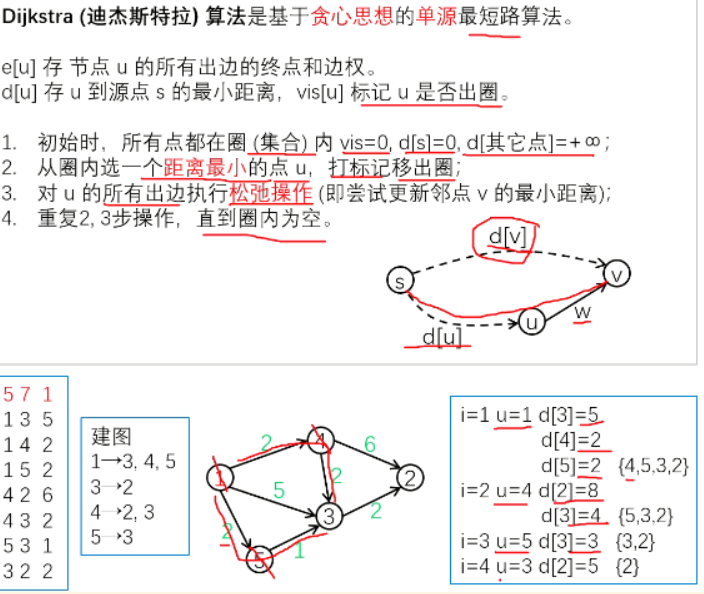

[850. Dijkstra求最短路 II - AcWing题库](https://www.acwing.com/problem/content/852/)
### 题目描述
给定一个 $n$ 个点 $m$ 条边的有向图，图中可能存在重边和自环，所有边权均为非负值。

请你求出 $1$ 号点到 $n$ 号点的最短距离，如果无法从 $1$ 号点走到 $n$ 号点，则输出 $-1$。

#### 输入格式

第一行包含整数 $n$ 和 $m$。

接下来 $m$ 行每行包含三个整数 $x,y,z$，表示存在一条从点 $x$ 到点 $y$ 的有向边，边长为 $z$。

#### 输出格式

输出一个整数，表示 $1$ 号点到 $n$ 号点的最短距离。

如果路径不存在，则输出 $-1$。

#### 数据范围

$1 \le n,m \le 1.5 \times 10^5$,  
图中涉及边长均不小于 $0$，且不超过 $10000$。  
数据保证：如果最短路存在，则最短路的长度不超过 $10^9$。

#### 输入样例：

```
3 3
1 2 2
2 3 1
1 3 4
```

#### 输出样例：

```
3
```

---
### 算法




```cpp
#include<iostream>
#include<cstring>
#include<queue>
using namespace std;
const int N = 100010;
typedef pair<int, int> PII;
int n, m;
int e[N], ne[N], h[N], w[N], idx;
int dist[N];
bool state[N];  // 是否已经确定最短路
void add(int a, int b, int c)
{
    e[idx] = b, ne[idx] = h[a], w[idx] = c, h[a] = idx++;
}

int dijkstra()
{
    memset(dist, 0x3f, sizeof(dist));
    dist[1] = 0;
    priority_queue<PII, vector<PII>, greater<PII>> heap;
    heap.push({0, 1});      //这个顺序不能倒，pair排序时是先根据first，再根据second，这里显然要根据距离排序
    //获取dist最小的边
    while (heap.size())
    {
        auto t = heap.top();
        heap.pop();
        //已找到的dist最小的点来做跳板来更新dist
        int ver = t.second, distance = t.first;     //distance是源点到t点距离
        if (state[ver]) continue;      //如果有重边会从这里出去，
        // 不写，continue答案也是正确的，但是会处理许多重复的数据。这样就和朴素的dijkstra一样了，反而还多了个维护堆的时间。
        //更新状态，dist
        state[ver] = true;
        for (int i = h[ver]; i != -1; i = ne[i])
        {
            int j = e[i];
            if (dist[j] > distance + w[i])          
            {
                dist[j] = distance + w[i];
                heap.push({dist[j], j});
            }
        }
    }
    if (dist[n] == 0x3f3f3f3f) return -1;
    else return dist[n];
}

int main()
{
    cin >> n >> m;
    memset(h, -1, sizeof(h));
    while (m--)
    {
        int x, y, z;
        cin >> x >> y >> z;
        add(x, y, z);
    }
    cout << dijkstra() << endl;
    return 0;
}
```

