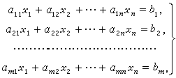

[883. 高斯消元解线性方程组 - AcWing题库](https://www.acwing.com/problem/content/885/)

### 题目描述
输入一个包含 $n$ 个方程 $n$ 个未知数的线性方程组。

方程组中的系数为实数。

求解这个方程组。

下图为一个包含 $m$ 个方程 $n$ 个未知数的线性方程组示例：



#### 输入格式

第一行包含整数 $n$。

接下来 $n$ 行，每行包含 $n+1$ 个实数，表示一个方程的 $n$ 个系数以及等号右侧的常数。

#### 输出格式

如果给定线性方程组存在唯一解，则输出共 $n$ 行，其中第 $i$ 行输出第 $i$ 个未知数的解，结果保留两位小数。

注意：本题有 SPJ，当输出结果为 `0.00` 时，输出 `-0.00` 也会判对。在数学中，一般没有正零或负零的概念，所以严格来说应当输出 `0.00`，但是考虑到本题作为一道模板题，考察点并不在于此，在此处卡住大多同学的代码没有太大意义，故增加 SPJ，对输出 `-0.00` 的代码也予以判对。

如果给定线性方程组存在无数解，则输出 `Infinite group solutions`。

如果给定线性方程组无解，则输出 `No solution`。

#### 数据范围

$1 \le n \le 100$,  
所有输入系数以及常数均保留两位小数，绝对值均不超过 $100$。

#### 输入样例：

```
3
1.00 2.00 -1.00 -6.00
2.00 1.00 -3.00 -9.00
-1.00 -1.00 2.00 7.00
```

#### 输出样例：

```
1.00
-2.00
3.00
```

---
### 算法


```cpp
#include<iostream>
#include<cmath>
using namespace std;

const int N = 110;
const double eps = 1e-8;

int n;
double a[N][N];

int gauss()
{
    int c, r;           // col是列， row行
    for (c = 0, r = 0; c < n; c++)
    {
        // 找到绝对值最大那个
        int t = r;
        for (int i = r; i < n; i++)
        {
            if (fabs(a[t][c]) < fabs(a[i][c])) t = i;
        }
        if (fabs(a[t][c]) < eps) continue;
        for (int i = c; i <= n; i++) swap(a[t][i], a[r][i]);
        for (int i = n; i >= c; i--) a[r][i] /= a[r][c];
        for (int i = r + 1; i < n; i++)
        {
            if (fabs(a[i][c]) < eps) continue;
            else
            {
                for (int j = n; j >= c; j--)
                {
                    a[i][j] -= a[i][c] * a[r][j];
                }
            }
        }
        r++;    //这一行工作完成进入下一行
    }
    if (r < n)
    {
        for (int i = r; i < n; i++)
            if (fabs(a[i][n]) > eps) return 2;    
        return 1;
    }
    for (int i = n - 1; i >= 0; i--)
        for (int j = i + 1; j < n; j++)
            a[i][n] -= a[i][j] * a[j][n];
    return 0;

}


int main()
{
    cin >> n;
    for (int i = 0; i < n; i++)
        for (int j = 0; j < n + 1; j++)
            cin >> a[i][j];
    int flag = gauss();
    if (flag == 0)
    {
        for (int i = 0; i < n; i++) 
        {
            if (a[i][n] == -0.00) a[i][n] = 0.00;   // 瓦也不知为什么会-0.00
            printf("%.2lf\n", a[i][n]);
        }
    }
    else if (flag == 1) cout << "Infinite group solutions" << endl;
    else cout << "No solution" << endl;
    return 0;
}

作者：爱不被爱的爱酱
链接：https://www.acwing.com/activity/content/code/content/4755871/
来源：AcWing
著作权归作者所有。商业转载请联系作者获得授权，非商业转载请注明出处。


```