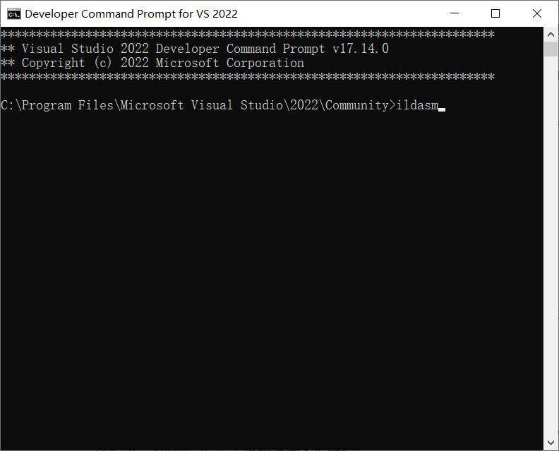
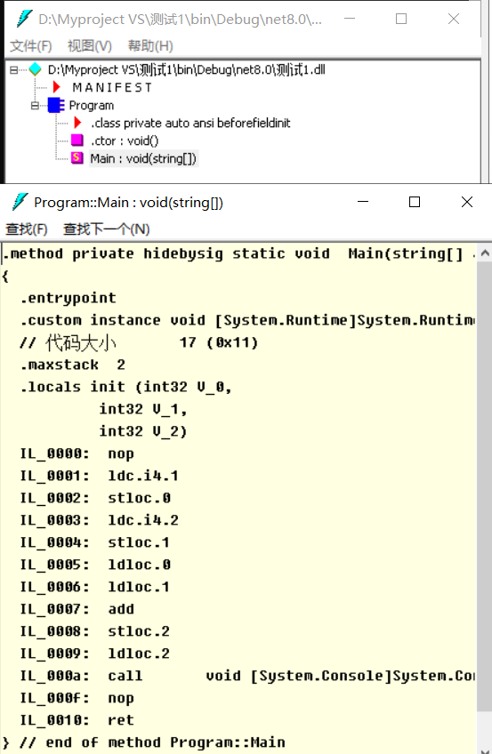

.NET 核心运行机制 —— CLI 与代码编译过程
深入探讨了 .NET 的底层运行机制，特别是 **CLI（公共语言基础结构）** 以及 **C# 代码是如何被编译和执行的**。这部分内容非常关键，是区别普通程序员和高级程序员的分水岭（面试必问）。

补充了**现代 .NET 的编译机制**和**常考面试题**的拓展。

---

# 一、 核心痛点：为什么代码不能直接运行？
*   **视频摘要：**
    *   开发者编写的高级语言（如 C#、VB.NET）对人类友好（支持类、对象、多态等 OOP 概念）。
    *   但是，**计算机硬件（CPU）和操作系统听不懂高级语言**，它们只认识**本地机器码（Native Machine Code，即 0 和 1）**。
    *   不同的硬件架构（x86, ARM）和操作系统（Windows, Linux）对应的机器码是完全不同的。
*   **个人理解：** 就像你写了一篇完美的中文小说（C#代码），但你的读者是只懂法语、德语、日语的外国人（不同架构的硬件）。你需要找人翻译（编译）。

# 二、 .NET 的“两步走”编译魔法 (核心重点)
为了实现“跨平台”和“多语言互通”，.NET 没有像 C/C++ 那样直接把代码翻译成死板的机器码，而是采用了**两步走**的策略：

## 第一步：编译期 (Source Code -> IL)
*   当你点击 Visual Studio 的“运行/生成”按钮时，C# 编译器（早期叫 `csc.exe`，现在底层是强大的 **Roslyn 编译器**）会启动。
*   它**不会**生成机器码，而是将 C# 代码翻译成一种中间形态——**IL (Intermediate Language，中间语言)**。
*   **为什么要有 IL？**
    *   **语言中立（消除差异）：** 无论你用 C# 写还是用 VB 写，编译后都会变成长得一模一样的 IL 代码。
    *   编译产物：此时会生成 `.exe` 或 `.dll` 文件（存放在 `bin/Debug` 目录下）。*注意：.NET 的 exe 跟 C++ 的 exe 本质不同，它里面装的不是机器码，而是 IL 指令和元数据（Metadata）！*

## 第二步：运行期 (IL -> Native Machine Code)
*   当你双击运行这个程序时，.NET 的大管家 **CLR (Common Language Runtime)** 接管工作。
*   CLR 会把 IL 代码在运行的瞬间，翻译成当前电脑硬件能听懂的**本地机器码**，然后再交由 CPU 执行，最终输出结果。

# 三、 认识大管家：CLR 的附加超能力
视频中提到，CLR 不仅仅是个“翻译官”，它还提供了许多运行时服务（Runtime Services）。
*   **深入补充：CLR 到底干了什么？**
    *   **JIT 编译（Just-In-Time）：** 视频中提到的“即时翻译”过程，专业术语叫 JIT。它不是一次性全翻译完，而是用到哪行代码翻译哪行，翻译过的会缓存起来。
    *   **GC（Garbage Collection - 垃圾回收）：** 自动帮你清理不再使用的内存空间。C/C++ 程序员经常头疼的“内存泄漏”，在 C# 里被 CLR 自动解决了。（这是最核心的面试考点）
    *   **线程管理与异常处理：** 确保程序崩溃时能抛出可捕获的异常（Exception），而不是直接让系统蓝屏。
    *   正因为有 CLR 的保护，C# 代码被称为**“托管代码”（Managed Code）**。

# 四、 揭秘 IL 代码：使用 ildasm 工具
*   **原课摘要：** 视频中演示了如何通过“开发者命令提示符 (Developer Command Prompt)”输入 `ildasm` 命令，打开反汇编工具，偷窥 `.exe` 文件内部的 IL 代码。

*   **结论：** IL 代码看起来像底层的汇编语言，极其反人类。作为开发者，我们永远不需要手写 IL，只需要写优雅的 C# 即可。
*   **现代技术拓展：**
    *   `ildasm` 已经是相对古老且简陋的工具了。
    *   在现在的实际开发中，如果我们需要查看别人的 `.dll` 源码，或者分析 IL，我们通常会使用更现代化的第三方免费工具，比如 **ILSpy** 或 JetBrains 的 **dotPeek**。它们不仅能看 IL，还能把 IL 完美**反编译回 C# 源码**！

---

# 进阶总结与现代架构补充 (面试防身必看)

**1. 弄懂三个极易混淆的缩写：CLI, CLR, IL**
*   **CLI (基础设施/标准):** 微软写的一本“说明书/规范”。规定了多语言互通的标准。
*   **CLR (运行时/实现):** 微软根据这本说明书，开发出来的“真实例子/引擎”。它是 CLI 规范的具体落地。
*   **IL (也被称为 MSIL 或 CIL):** 根据说明书规定的一种“世界通用语（中间语言）”。

**2. 前沿补充：AOT (Ahead-Of-Time) 提前编译技术**
*   **传统 .NET 依赖 JIT：** 也就是视频讲的“运行时翻译”。缺点是：程序第一次启动时需要边翻译边运行，导致**启动速度较慢**。
*   **.NET 8 / 9 的杀手锏 Native AOT：** 现代 .NET 引入了 AOT 技术。它允许你在**发布程序的时候，直接跳过 IL 阶段**，强行把 C# 编译成彻彻底底的本地机器码！
*   **好处：** 不需要 CLR 的 JIT 参与，程序体积超小，启动速度达到毫秒级，非常适合云原生和微服务架构。这也是当前 .NET 在高性能领域反超 Java 的核心武器之一。