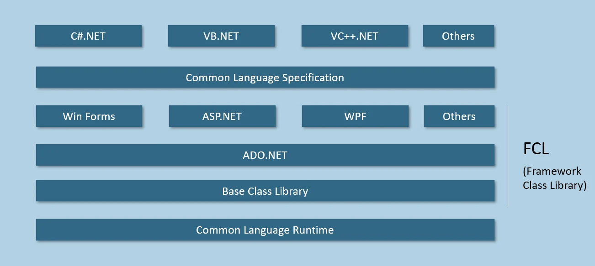

**关于 .NET Framework 架构与核心组件的笔记**

# **一、 .NET Framework 宏观概述**

.NET Framework 是一个用于构建、部署和运行各种类型应用程序（如桌面应用、Web 应用和 Windows 服务）的综合软件开发平台。

*   **.NET 生态划分：** 现代 .NET 生态主要分为两个重要分支：传统的 .NET Framework（主要针对 Windows 生态）和跨平台的 .NET Core（现已演进为统一的 .NET 5/6/7 等版本）。
*   **架构本质：** .NET Framework 架构（也称为 .NET 栈）是一个自底向上的分层结构，底层的组件为上层提供服务，确保了开发的模块化和标准化。

# **二、 .NET Framework 的两大基石**

整个框架围绕两个最核心的部分展开：执行引擎与代码库。

1.  **CLR (Common Language Runtime - 公共语言运行库)**
    *   处于架构的最底层，是整个 .NET 程序的执行引擎。
    *   负责提供运行时环境以及底层基础服务（如内存分配、垃圾回收 GC、线程管理、安全性检查和代码即时编译 JIT）。
2.  **FCL (Framework Class Library - 框架类库)**
    *   建立在 CLR 之上，是微软提供的一个庞大的、面向对象的预定义类库集合。
    *   开发者在编写代码时（如调用 `System.Console.WriteLine`），实际上就是在调用 FCL 中封装好的类、结构、接口和委托。
    *   **架构关系：** FCL 并不是单一的库，而是一个广义概念。它包含了底层通用库（BCL）以及针对特定应用场景（如数据库访问、Web 界面、桌面图形界面）的高级组件库。

# **三、 FCL 内部组件层级拆解**

为了更好地复用代码，FCL 内部进行了精细的模块化划分：

**1. BCL (Base Class Library - 基类库)**
*   **定位：** BCL 是 FCL 的核心子集，建立在 CLR 正上方，是所有 .NET 应用程序都必须依赖的底层基础库。
*   **功能：** 提供与具体业务无关的通用基础功能。例如：基本数据类型处理、文件 I/O 操作（读写文件）、字符串操作、类型转换、多线程基础（如 `Task` 类）以及集合框架（List, Dictionary 等）。
*   **跨场景复用：** 无论开发的是控制台、桌面还是 Web 应用，底层都在调用 BCL。

**2. ADO.NET (数据访问技术)**
*   **定位：** 建立在 BCL 之上，专门用于实现应用程序与关系型数据库（如 SQL Server, Oracle, MySQL）之间交互的类库。
*   **功能职责：** 负责建立数据库连接、执行 SQL 命令、以及数据的检索、插入、更新和删除操作。
*   **核心类库：** 如 `SqlConnection`、`SqlCommand` 等。
*   **补充纠错：** 业界常误以为 ADO.Net 是 ActiveX Data Objects 的缩写。实际上，在 .NET 时代，ADO.NET 就是一个专有名词，不再代表 ActiveX 缩写，它采用的是完全不同的“断开式”数据访问架构，性能和扩展性远超老旧的 ADO 技术。

**3. 应用层框架层 (UI & Web Frameworks)**
这些框架平行存在于 ADO.NET 和 BCL 之上，用于处理特定类型的用户界面和交互逻辑：
*   **WinForms (Windows Forms)：** 传统的桌面应用程序 UI 库。采用事件驱动模型，包含大量预定义的控件类（如 `Form`, `Label`, `Button`, `TextBox`）。
*   **WPF (Windows Presentation Foundation)：** 自 .NET 3.0 引入的现代桌面 UI 框架。
    *   **深度补充：** WPF 彻底分离了界面设计与业务逻辑，采用 XAML 语言描述界面，并底层利用 DirectX 进行硬件加速渲染，在图形表现力、动画和数据绑定机制上远超 WinForms。
*   **ASP.NET：** 专用于构建 Web 应用程序和 Web API 的庞大框架。包含多个子技术栈，如 Web Forms（早期拖拽式开发）、ASP.NET MVC（主流的模型-视图-控制器架构）、Web API（用于构建 RESTful 接口）等。

# **四、 跨语言互操作性的核心规范**

.NET 最强大的特性之一是支持多语言混合编程。为了让 C#、VB.NET、F# 等数十种语言能够在一个平台上无缝协同工作，微软制定了严格的底层规范：

**1. CLS (Common Language Specification - 公共语言规范)**
*   **本质：** CLS 不是包含代码的动态链接库（DLL），而是一份**标准指导文档和规则集**。
*   **作用：** 它规定了所有 .NET 语言必须遵守的最小公共特性集合。只要编程语言（如 C# 和 VB.NET）的编译器遵循 CLS 开发，它们编译出来的中间语言（IL）就能被 CLR 统一识别和执行。
*   **涵盖内容：** 类的定义方式、对象的创建、方法的参数传递机制、泛型规范等。开发者通常不需要直接操作 CLS，只需熟练使用符合 CLS 规范的编程语言即可。

**2. CTS (Common Type System - 公共类型系统)**
*   **本质：** CTS 是 CLS 的核心组成部分，专门解决多语言数据类型不统一的问题。
*   **运作机制：** 不同的编程语言对数据类型有不同的叫法（例如 C# 中叫 `int`，VB.NET 中叫 `Integer`）。CTS 在底层定义了一个统一的标准类型（`System.Int32`）。
*   **意义：** 各种语言的编译器在编译时，都会将自己的特有类型映射到 CTS 标准类型上。这使得用 C# 编写的类可以轻松继承用 VB.NET 编写的基类，彻底打通了语言间的壁垒。