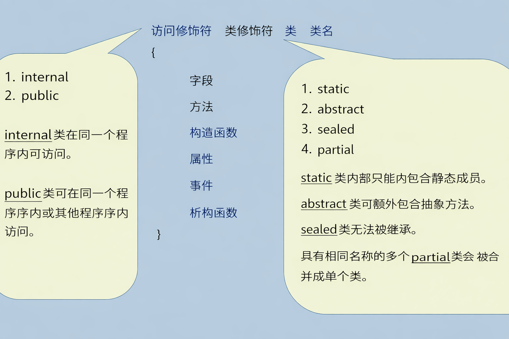
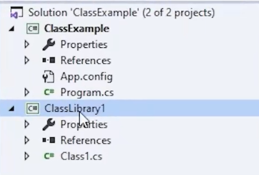
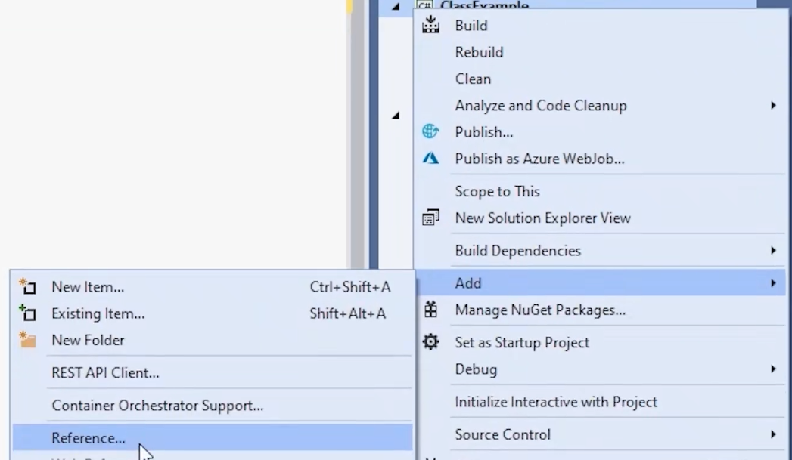
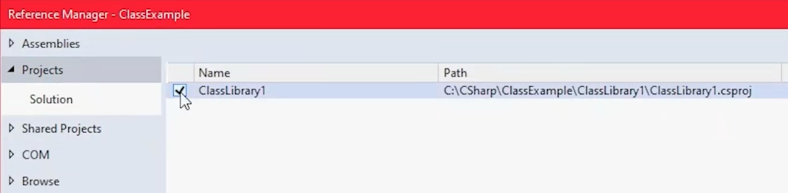
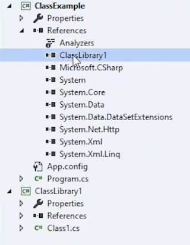
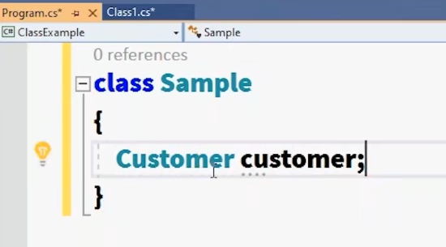

这是一份关于C#中创建类与对象、以及底层内存模型与程序集架构的深度学习笔记。

---

# 一、 类的定义与基础结构

类（Class）是面向对象编程的基石，是对现实世界实体的抽象模型。

## 语法规范与命名
*   **关键字**：使用 `class` 关键字声明。
*   **命名约定**：C# 严格推荐使用 **PascalCase（大驼峰命名法）** 来命名类（例如：`CustomerData`、`ShoppingCart`）。这不仅是代码风格规范，更是.NET生态中区分类型与变量的重要视觉标志。


## 类的成员构成
类作为一个模型，可以包含多种成员，分别承担不同的职责：
*   **字段 (Fields)**：存储对象的核心状态数据。
*   **方法 (Methods)**：定义对象的行为和业务逻辑。
*   **属性 (Properties)**：对字段的封装，用于安全地获取或设置私有字段的值（体现封装性）。
*   **构造函数 (Constructors)**：在对象实例化时自动调用，用于初始化对象的字段。
*   **事件 (Events)**：用于对象间的通信和通知机制（发布/订阅模式）。
*   **析构函数 (Destructors/Finalizers)**：用于清理非托管资源（如文件句柄、数据库连接）。

**深度理解**：虽然类定义了上述所有成员，但**对象在内存中（堆中）实际只分配空间来存储字段的值**。方法、属性等逻辑代码块属于类的元数据，全局只有一份，由所有对象共享调用。

---

# 二、 访问修饰符与程序集边界

在企业级开发中，系统通常被划分为多个层级（如数据访问层 DAL、业务逻辑层 BLL 等），这就涉及到了代码的可见性控制。

## 核心修饰符
*   **internal（默认）**：内部访问。表示该类只能在**同一个程序集（Assembly / Project）**内被访问。如果不显式书写修饰符，类默认就是 `internal`。
*   **public**：公开访问。表示该类不仅在当前程序集可用，还可以被其他引用了该程序集的外部项目访问。

## 程序集 (Assembly) 与解决方案 (Solution) 的本质
*   **程序集**：C# 项目编译后的产物。在 .NET（C#）的世界里，**一个项目（Project）编译后生成的那个完整的 .exe 或 .dll 文件，就是一个程序集（Assembly）。**

**程序集分为两种形态：**

- **.exe（可执行程序集）**：编译生成 `.exe`（可执行文件）。这就像是一辆**装好引擎的完整玩具车**。它里面有一个启动开关（也就是代码里的 Main 方法），你双击它，它就能自己跑起来。 
- **.dll（类库程序集）**：编译生成 `.dll`（动态链接库）。类库主要用于封装可复用的核心逻辑。。这就像是一盒**高级汽车配件**（比如一套高级轮胎、一个车载音响）。它里面没有启动开关（没有 Main 方法），**不能自己单独运行**。它被造出来的唯一目的，就是被别的 .exe 引用（安装）进去，提供各种现成的功能。


*   **架构关系**：一个解决方案（Solution）可以包含多个项目（Project/Assembly）。若要在控制台应用中使用类库中的类，必须满足两个条件：
    1.  该类必须声明为 `public`。
    2.  控制台应用必须在项目中**添加对该类库的引用 (Add Reference)**。















**这个 .exe 或 .dll 里面到底装了什么？**
既然叫“集”，说明它是一个集合体。千万不要以为编译后的 .exe 或 .dll 里面全是电脑直接能懂的 0 和 1（那是 C/C++ 的做法）。
在 C# 中，一个程序集（也就是这个文件）切开来看，主要包含三样极其核心的东西：

1. **IL 代码 (中间语言代码)**
当你把 C# 代码编译成程序集时，代码并没有变成底层的机器码，而是变成了一种叫 IL（Intermediate Language）的半成品代码。
为什么这么做？因为这样你的 .exe 或 .dll 就可以跨平台！无论把它放在 Windows 还是 Linux 上，只要目标机器装了 .NET 运行时（CLR），运行时就会在程序启动的瞬间，把 IL 代码实时翻译成当前电脑懂的底层指令。

2. **元数据 (Metadata) —— “产品说明书”**
这是程序集非常牛的一个特性。程序集里面自带了一份详尽的“说明书”。这份说明书记录了：
这个 DLL 里到底有几个类？
每个类叫什么名字？
类里面有哪些字段是 public 的，哪些方法带了几个参数？
**作用**：为什么你在 Visual Studio 里引入一个别人写的 DLL 后，敲下代码就能自动弹出长长的方法提示（代码补全）？就是因为 Visual Studio 读取了这个 DLL 里的元数据！

3. 清单 (Manifest) —— “发货单”
记录了这个程序集自身的信息。比如：
它的版本号是多少（v1.0 还是 v2.0）？
它的作者是谁？
**最关键的：它依赖哪些其他的 DLL 才能活下去？** （比如你的订单系统 DLL 可能依赖了数据库连接的 DLL，清单里就会写得清清楚楚）。


---

# 三、 类的可选修饰符

除了访问修饰符，类的声明还可以附加行为修饰符，用于改变类的继承和实例化规则：
*   **static（静态类）**：无法被实例化（不能 `new`），所有成员必须也是静态的（常用于工具类，如 `Math`）。
*   **abstract（抽象类）**：无法被直接实例化，只能作为基类被其他类继承，通常包含未实现的抽象方法。
*   **sealed（密封类）**：不可被其他类继承，处于继承链的末端，有助于性能优化和安全。
*   **partial（分部类）**：允许将一个类的定义拆分到多个物理文件中，编译时会自动合并（常用于隔离机器自动生成的代码和人工编写的代码）。

---

# 四、 对象的实例化与内存模型（核心重点）

面向对象最核心的难点在于理解变量与物理对象在内存中的分离关系。

## 堆 (Heap) 与对象实体
*   当应用程序启动时，操作系统会在 RAM 中分配一块动态内存区域称为“堆”。
*   所有的对象（类的实例）都**强制存储在堆中**。
*   **对象的匿名性**：在堆中创建的对象本质上是“无名”的。它们只是一块包含字段数据的内存块，系统无法直接通过名字找到它们。

## 栈 (Stack) 与引用变量
*   为了操作堆中无名的对象，我们必须在栈区声明一个**引用变量 (Reference Variable)**。
*   栈是遵循 LIFO（后进先出）规则的内存区，用于存储方法运行时的局部变量。
*   **引用变量的作用**：它的本质是一个指针，存储的是目标对象在堆内存中的**内存地址**。一个引用变量同一时刻只能指向一个对象。

## 实例化解析与默认值
使用 `new` 关键字是触发对象创建的唯一途径：

```csharp
// 1. Customer c: 在【栈】上开辟空间，创建一个名为 c 的引用变量（类型为 Customer）。
// 2. new Customer(): 在【堆】上开辟空间，真正创建出包含所有字段的物理对象。
// 3. "=": 将堆中对象的内存地址，赋值给栈上的变量 c。
Customer c = new Customer();
```

**默认初始化机制**：
当 `new` 在堆中分配好空间后，会自动将类中声明的字段初始化为类型默认值，防止出现内存垃圾数据：
*   数值类型（如 `int`, `double`）：默认为 `0`。
*   布尔类型（`bool`）：默认为 `false`。
*   引用类型（如 `string`, 其他类对象）：默认为 `null`。

**深度扩展（垃圾回收机制 GC）**：
因为对象是匿名的，如果栈上的引用变量 `c` 的生命周期结束（例如方法执行完毕出栈），或者我们手动将其赋值为 `null`，堆中的对象就会失去唯一的地址关联。此时，这个对象就变成了内存中的“孤岛”。.NET 的垃圾回收器 (Garbage Collector) 会在后台定期扫描，自动清理这些无法被访问的对象，释放堆内存。

---

# 五、 代码实践说明

综合以上概念，以下展示多项目架构下的类与对象交互代码：

```csharp
// 【所在程序集：BusinessLogic.dll (类库项目)】
namespace BusinessLogic
{
    // 必须声明为 public，外部程序集才能访问
    public class Customer
    {
        // 字段声明 (实例化时会存放在堆中)
        public int CustomerId;     // 默认初始化为 0
        public string CustomerName; // 默认初始化为 null
    }

    // 默认是 internal class Helper，外部项目无法访问
    internal class Helper 
    {
        // 仅限当前 DLL 内部使用的辅助类
    }
}

// =========================================================

// 【所在程序集：ConsoleApp.exe (控制台项目)】
// 需提前添加对 BusinessLogic.dll 的引用
using BusinessLogic; 
using System;

namespace ConsoleApp
{
    class Program
    {
        static void Main(string[] args)
        {
            // c1 是栈上的引用变量，new Customer() 存在于堆中
            Customer c1 = new Customer();
            
            // 覆盖默认值 0 和 null
            c1.CustomerId = 1001;
            c1.CustomerName = "Alice";

            // c2 是另一个独立的引用，指向堆中一块全新的内存区域
            Customer c2 = new Customer();
            c2.CustomerId = 1002;

            // 此时堆中存在两个相互独立的 Customer 对象
            // 如果执行 c1 = c2; 那么 c1 将放弃原对象的地址，转而指向 c2 所指的对象。
            // 原来的 Alice 对象将因为没有引用指向它，而被 GC 回收。
        }
    }
}
```