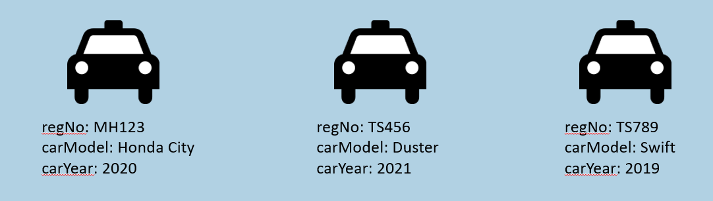
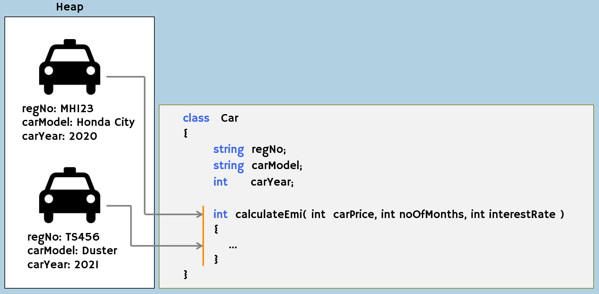
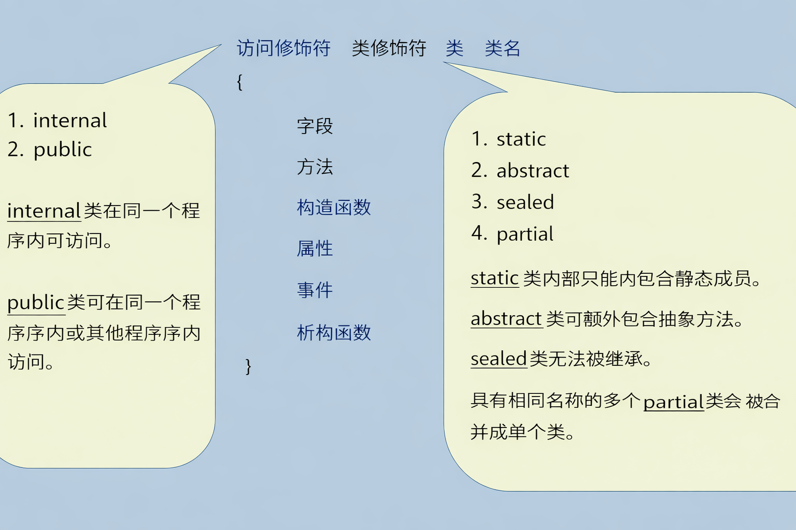

#### 面向对象编程简介
可扩展应用程序的编程模型
广泛应用于 Java、Python、JavaScript、C++等主流语言
OOP 的目标是将数据及其相关操作组合为一个称为"对象"的单一单元

#### 对象
对象是程序中表示现实世界人或物的小单元（实体）。
例如：你、你的笔记本电脑
任何物理事物都可以被视为对象。
对象是“类”的实例（例子）。
对象存储一组字段（关于对象的详细信息）。




#### 类
类是对象的模型。
类（又称“类型”）表示您希望在相似对象中存储的数据结构（字段和方法列表）。
类不是对象的集合。
对象是基于“类”创建的。
例如：
```cs
class Car
{
  string regNo;
  string carModel;
  int carYear;
}
```


#### 方法
方法是执行特定操作（处理或工作）的语句集合，例如进行某些计算、显示某些输出、检查某些条件等。
方法应当是类的一个成员（组成部分）。
代码语句不允许出现在类的外部；它们仅允许在方法内部使用。

```cs
class Car
{
  int calculateEmi( int carPrice, int noOfMonths, int interestRate )
  {
    //do calculation here
    return (emi);
  }
}
```

#### 对象与类的关联
对象存储字段。
对象关联其类的所有方法。这意味着，对象可以调用其类的方法。
类声明字段列表；定义方法列表。



**创建类**



**创建对象**


1. 创建引用变量
   `ClassName referenceVariable;`

2. 创建对象并将其引用存储到引用变量中
     `referenceVariableName = new ClassName( );`

**关键要点**

- 对象是对人或事物的程序化表示。
- 所有对象都是基于类创建的；存储在"堆"中。
- 每次应用程序执行时，都会创建一个新的堆（且仅有一个）。
- 所有引用变量（方法的局部变量）都存储在栈中。每次方法调用时，都会创建一个新的栈。
- 方法是执行某些操作/计算的语句集合。
- 类支持两种访问修饰符：'internal' 和 'public'。
- 类支持四种修饰符：'static'、'abstract'、'sealed' 和 'partial'。
- 对象存储实际数据（一组字段）并可访问类的方法。
- 引用变量存储（仅一个）对象的地址。