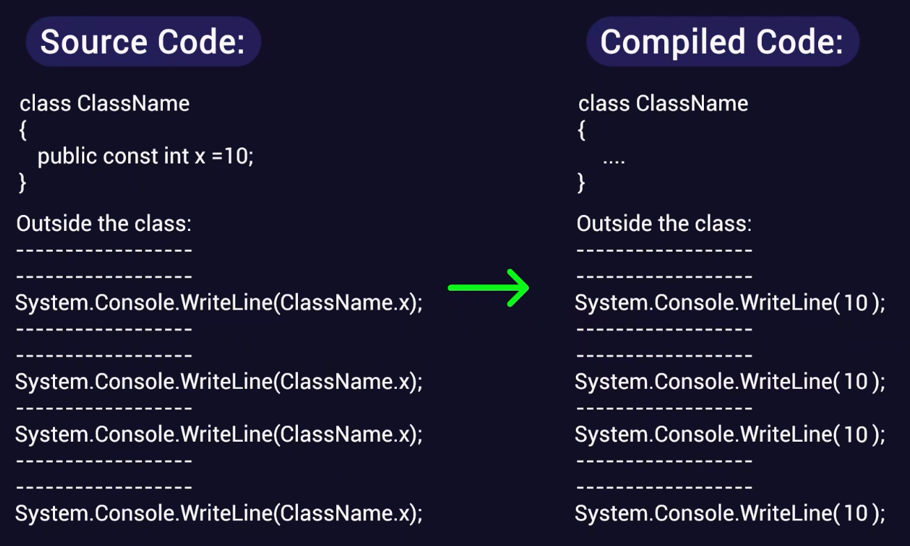

# 常量字段

## 核心概念：什么是常量字段？

在 C# 中，**常量字段 (Constant Fields)** 使用 `const` 关键字声明，用于存储那些在程序运行期间**绝对不可更改**的固定值。

*   **隐式的静态特征**：常量字段在逻辑上是属于类本身的，它被该类的所有对象共享。因此，访问常量字段的方式与访问静态字段完全相同（通过类名访问）。
*   **绝对的不可变性**：常量的值一旦设定，在程序的整个生命周期内都无法被修改。

## 深度解析：编译期替换与内存行为

理解常量字段最核心的一点是它的**编译期行为**。常量字段在运行时的内存分配方式与实例字段和静态字段截然不同：

*   **没有运行时的内存分配**：实例字段存储在堆内存的对象中，静态字段存储在专门的类内存中。但是，常量字段既不存储在对象中，也不存储在类内存中。
*   **硬编码替换 (Hardcoded Replacement)**：在代码编译阶段，编译器会扫描所有使用了该常量的地方，并将常量名**直接替换为它所代表的字面量（实际的值）**。
    *   *例如*：如果定义了 `const int X = 10;`，当代码中写到 `int y = X + 5;` 时，编译器编译出的底层中间语言 (IL) 代码实际上是 `int y = 10 + 5;`。
    *   正因为这种替换机制，常量在编译后就不再作为一个变量存在，这就解释了为什么它不需要分配运行时内存。




## 声明与初始化的严格限制

由于常量的替换发生在编译期，C# 对常量的声明有着极其严格的限制：

1.  **必须在声明时初始化**：不能先声明后赋值，也不能在构造函数中赋值。
2.  **只能赋予字面量 (Literal Values)**：常量的值必须在编译时就能完全确定。
3.  **数据类型的限制**：常量只能是 C# 的内置原始数据类型（如 `int`, `double`, `char`, `bool` 等）或者 `string`。
    *   *深层逻辑*：不能将一个对象（如 `new Product()`）或方法的返回值赋给常量，因为对象的创建和方法的执行是**运行时**行为，编译器无法在编译期算出它们的结果。虽然可以将引用类型设为 `const`，但唯一合法的值只能是 `null`。

## 代码实现与访问规范

### 类的内部定义

```csharp
namespace ClassLibrary1
{
    public class Product
    {
        // 实例字段
        public int productId;
        
        // 静态字段：共享，但可变
        public static int TotalProducts = 0;

        // 常量字段：共享，且不可变
        // 必须在声明时直接赋值
        public const string CategoryName = "Electronics";

        // 非法操作示例（会导致编译错误）：
        // public const double PI; // 错误：未初始化
        // public const string Time = DateTime.Now.ToString(); // 错误：依赖运行时结果
    }
}
```

### 类外部的访问

与静态字段一样，常量字段必须通过**类名**来访问，绝不能通过对象引用变量来访问。

```csharp
using System;
using ClassLibrary1;

namespace FieldsExample
{
    class Program
    {
        static void Main(string[] args)
        {
            Product p1 = new Product();
            
            // 访问常量：必须使用 类名.常量名
            Console.WriteLine("Product Category: " + Product.CategoryName);
            
            // 下面的代码会导致编译错误：
            // 1. 不能通过对象实例访问常量
            // Console.WriteLine(p1.CategoryName); 
            
            // 2. 常量的值是只读的，绝不能被修改
            // Product.CategoryName = "Home Appliances"; 
            
            Console.ReadLine();
        }
    }
}
```

### 局部常量 (Local Constants)
除了在类级别声明为字段，`const` 关键字也可以用在方法内部，声明一个**局部常量**。它的作用域仅限于该方法内部，但编译期替换的底层逻辑完全一致。

```csharp
public void CalculateArea()
{
    const double PI = 3.14159; // 局部常量
    double radius = 5.0;
    double area = PI * radius * radius;
}
```

## 工程实践：如何选择适当的字段类型？

在设计类时，如何决定一个数据应该是实例字段、静态字段还是常量？可以遵循以下决策树：

1.  **这个数据是每个对象独有的吗？（各不相同）**
    *   是 $\rightarrow$ 使用**实例字段** (Instance Field)。*例如：每个产品的 ID。*
2.  **这个数据是所有对象共享的吗？且在程序运行期间可能会发生改变？**
    *   是 $\rightarrow$ 使用**静态字段** (Static Field)。*例如：统计当前系统中的产品总数。*
3.  **这个数据是所有对象共享的吗？且永远不会改变？**
    *   是 $\rightarrow$ 使用**常量字段** (Constant Field)。*例如：圆周率 PI，或者某个固定的分类名称。*

*进阶思考*：由于常量的编译期替换特性，如果常量定义在一个单独的类库 (DLL) 中，当这个常量的值被修改并重新编译了类库后，**引用该类库的其他项目也必须重新编译**。否则，其他项目底层运行的代码依然使用的是替换前的旧值。如果遇到这种需要跨程序集共享、且未来可能会稍微变动的值，C# 提供了 `readonly` 关键字作为更好的替代方案（通常称为只读字段）。