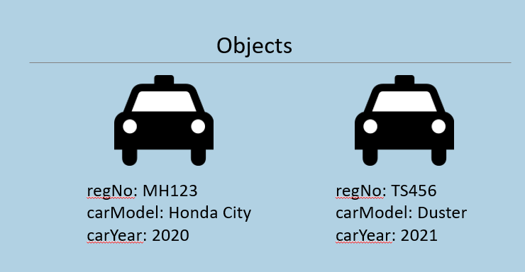
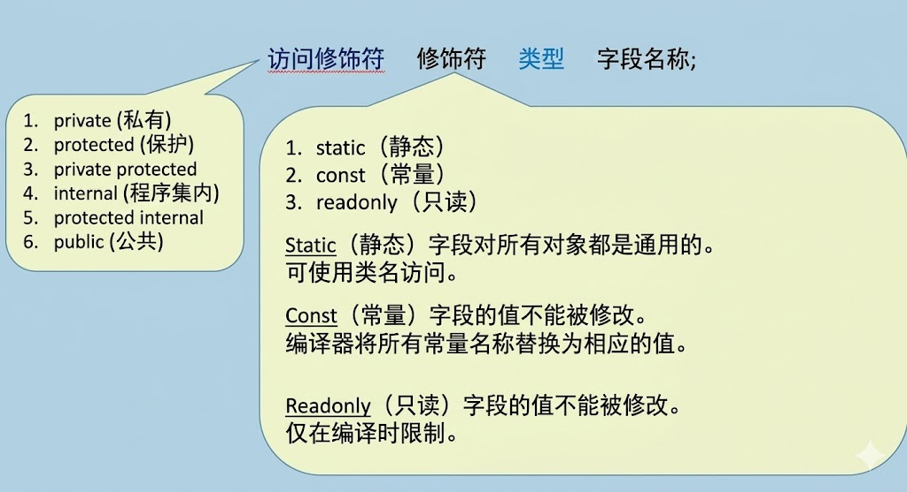
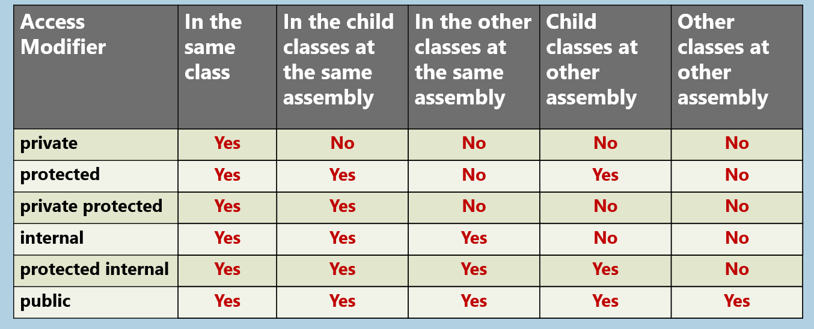
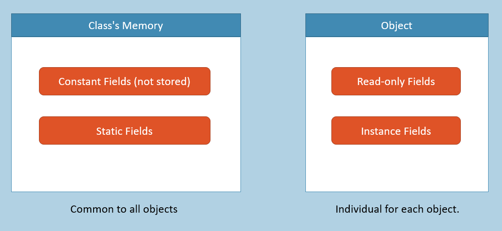

#### 字段
在类中声明的变量；存储在对象中。
每个对象独立拥有。



```cs
class Car
{
  string regNo;
  string carModel;
  int carYear;
}
```


**字段的语法**



#### 字段的访问修饰符
访问修饰符（又称"访问说明符"或"可见性修饰符"）指定字段的可访问性，决定字段在何处可被访问；它们为字段提供安全性保护。




**静态字段**
静态字段存储在对象之外。
静态字段为类的所有对象所共有。


**堆中的类内存**
bankName: 虚拟银行


**堆中的对象**
对象1：
accountNumber: 1001
accountHolderName: Scott
当前余额：5000


对象2：
账号：1002
账户持有人姓名：Bob
当前余额：6000


```cs
class BankAccount
{
  long accountNumber;
  string accountHolderName;
  double currentBalance;
  static string bankName;
}
```


  

  

#### 实例字段（对比）静态字段

**存储方式：**
**实例字段：** 存储在对象中
**静态字段：** 存储在类的内存中。

  

**相关概念：**
**实例字段：** 表示与对象相关的数据。
**静态字段：** 表示属于所有对象的公共数据。

  

**声明：**
**实例字段：** 声明时不使用"static"关键字。语法：类型 字段名;
**静态字段：** 声明时使用"static"关键字。语法：static 类型 字段名;

  

**访问方式：**
**实例字段：** 通过对象（引用变量）访问。
**静态字段：** 仅通过类名访问（不能通过对象访问）。

  

**内存分配时机：**
**实例字段：** 为每个对象单独分配，因为实例字段存储在对象"内部"。
**静态字段：** 在整个程序运行期间仅分配一次；即当程序执行过程中首次使用该类时分配。

  

  

#### 常量字段
常量字段类似于静态字段，对于类的所有对象都是共有的。
无法修改常量字段的值。
常量字段可通过类名访问而非通过对象。
常量字段不存储在对象中；也不会存储在任何地方。
常量字段在编译时会被替换为其值；因此不会存储在内存中的任何位置。
常量字段必须在声明时初始化（仅能使用字面值）。
常量也可以声明为"局部常量"（在方法内部）。
访问修饰符 const 类型 字段名 = 值;

  

  

#### 只读字段
只读字段类似于实例字段，即每个对象单独存储其值。
无法修改只读字段的值。
只读字段可通过引用变量使用对象访问。
只读字段必须在"声明时内联"或"构造函数中"进行初始化。
访问修饰符 readonly 数据类型 字段名 = 值;




**关键要点**
- 字段是在类中声明但存储在对象中的变量。
- 字段的访问修饰符：private、protected、private protected、internal、protected internal、public
- 字段的修饰符：static、const、readonly
- 实例字段对每个对象都是独立的；静态字段对所有对象是共用的（一次性）。
- 常量必须在声明时初始化；只读字段必须在"声明时"或在"实例构造函数"中进行初始化。