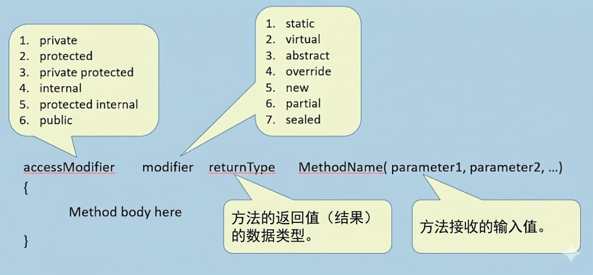

# 深入理解方法 (Methods)

## 一、 核心概念：什么是方法？

在面向对象编程（OOP）中，如果说**字段（Fields）** 代表了对象的状态（名词，如颜色、价格、名称），那么**方法（Methods）** 就代表了对象的**行为和动作**（动词，如计算、打印、保存）。

方法是将一系列用于执行特定计算或操作的语句打包成的一个代码块。在类中定义方法，主要目的是为了操作或处理该类内部的字段数据。

###  核心深层认知：方法在内存中的存在形式
一个极为重要的概念是：**方法并不存储在具体的对象实例中**。
当我们创建了100个 `Product` 对象时，堆内存中会有100份隔离的字段数据，但**方法的代码在内存中永远只有一份**（存储在代码段或类型对象中）。
当对象调用方法时，执行的总是同一段代码。那么方法是如何区分当前正在操作的是哪一个对象的数据呢？
**底层原理**：当你调用 `product1.CalculateTax()` 时，C# 编译器在底层会隐式地将 `product1` 的内存地址（即隐式的 `this` 关键字）作为参数传递给该方法。方法内部依靠这个隐式的引用，精准地读取和修改当前调用对象的字段。

---

## 二、 方法的解剖结构与语法

声明一个标准的 C# 方法遵循以下语法结构：

`[访问修饰符] [可选修饰符] [返回类型] [方法名称]([参数列表]) { // 方法体 }`

1.  **访问修饰符 (Access Modifiers)**：决定该方法可以在哪里被调用。与字段一样，包括 `public`, `private`, `protected`, `internal` 等。默认是 `private`。
2.  **可选修饰符 (Modifiers)**：用于改变方法的行为特性。例如 `static`（静态方法）、`virtual`（虚方法）、`abstract`（抽象方法）、`override`（重写方法）等。
3.  **返回类型 (Return Type)**：方法执行完毕后，向调用者交回的数据类型。
    *   如果需要返回一个整数，写 `int`。
    *   如果**不需要返回任何值**，必须使用关键字 `void`。
4.  **方法名称 (Method Name)**：C# 的编码规范强烈建议方法名采用 **PascalCase（大驼峰命名法）**，即每个单词首字母大写（如 `CalculateTax`）。
5.  **参数列表 (Parameters)**：方法执行所需的外部输入数据。参数是可选的，即使没有参数，括号 `()` 也必须保留。
6.  **方法体 (Method Body)**：包含在大括号 `{}` 内部的具体执行逻辑。

---

## 三、 工程级代码示例：税率计算逻辑

以下代码展示了如何在类中定义方法，以及如何在主程序中通过对象引用来调用该方法。

*进阶补充：在处理与金钱、财务相关的金额计算时，强烈建议使用 `decimal` 类型而非 `double`，因为浮点数（double）在计算机底层以二进制分数表示，会产生精度丢失，而 `decimal` 是专门为高精度财务计算设计的。*

### 业务类定义 (类库项目)

```csharp
namespace ClassLibrary
{
    public class Product
    {
        // 实例字段
        public int ProductId;
        public decimal Cost;
        public decimal Tax; // 初始默认值为 0

        // 定义实例方法：计算税金并赋值给 Tax 字段
        // 因为不需要向外返回值，所以返回类型为 void
        public void CalculateTax()
        {
            // localTax 是一个局部变量，生命周期仅存在于该方法内部
            decimal localTax;

            // 业务逻辑：根据当前对象的 Cost 字段计算税金
            if (Cost <= 20000)
            {
                // 注意：在实际开发中，百分比通常写作 0.10m (m代表decimal字面量)
                localTax = Cost * 0.10m; 
            }
            else
            {
                localTax = Cost * 0.125m; 
            }

            // 将局部变量的计算结果，赋值给当前对象的实例字段 Tax
            Tax = localTax;
        }
    }
}
```

### 主程序调用 (控制台项目)

```csharp
using System;
using ClassLibrary;

namespace MethodsExample
{
    class Program
    {
        static void Main(string[] args)
        {
            // 1. 创建对象并初始化字段
            Product product1 = new Product();
            product1.ProductId = 1001;
            product1.Cost = 10000m;

            Product product2 = new Product();
            product2.ProductId = 1002;
            product2.Cost = 50000m;

            // 此时，product1 和 product2 的 Tax 字段均为 0

            // 2. 调用方法 (必须通过对象引用变量进行调用)
            // 执行逻辑跳转至类的 CalculateTax 方法，上下文锁定为 product1
            product1.CalculateTax(); 

            // 执行逻辑跳转至类的 CalculateTax 方法，上下文锁定为 product2
            product2.CalculateTax();

            // 3. 打印结果
            Console.WriteLine($"Product 1 Tax: {product1.Tax}"); // 输出: 1000.00
            Console.WriteLine($"Product 2 Tax: {product2.Tax}"); // 输出: 6250.00

            Console.ReadLine();
        }
    }
}
```

---

## 四、 局部变量vs 实例字段

在编写方法时，深刻理解变量的作用域至关重要。

*   **实例字段（如上文的 `Cost`, `Tax`）**：
    *   声明在类中，方法之外。
    *   生命周期与对象一致，对象在，字段就在。
    *   在类中的**所有非静态方法**里都可以直接访问，无需重新声明。
*   **局部变量（如上文的 `localTax`）**：
    *   声明在具体的**方法内部**。
    *   分配在线程的**栈内存 (Stack)** 中。
    *   生命周期极短。当方法开始执行时创建，一旦方法执行到右大括号 `}` 结束，局部变量就会被立即销毁并从内存中清除。
    *   其他方法绝对无法访问该局部变量。

**架构设计原则**：尽量缩小变量的作用域。如果一个数据只在某次计算中作为临时中间值（如上述的 `localTax`），务必将其声明为局部变量，绝不能声明为类的字段，否则会造成内存浪费甚至引发并发状态错误。只有需要被对象长期持有的状态，才应该声明为字段。