#### 方法

方法是一个函数（一组语句），用于基于字段执行某些处理。

方法是类的组成部分。

方法可以接收一个或多个输入值作为"参数"，并返回一个值作为"返回值"。

  

例如：

class Car
{
  int calculateEmi( int carPrice, int noOfMonths, int interestRate )
  {
    //do calculation here
    return (emi);
  }
}

  

**方法语法**
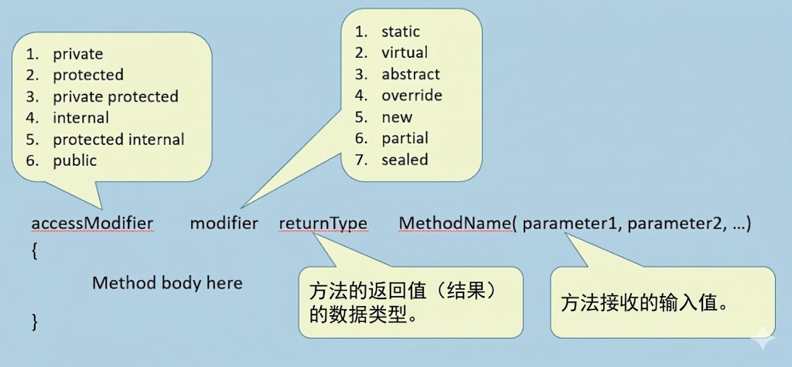

#### 方法的访问修饰符

方法访问修饰符（又称"访问说明符"或"可见性修饰符"）与字段的访问修饰符相同。

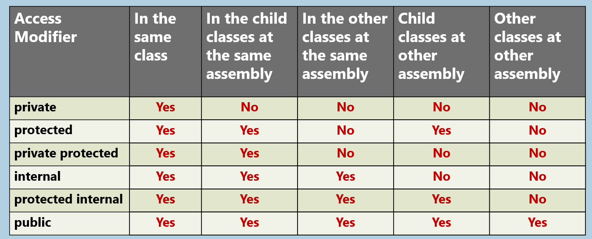

#### 封装

封装是一种概念，指的是：

- 将数据（字段）和操作这些数据的方法捆绑在一起。
    
- 隐藏对象的内部实现细节，仅提供与之交互的必要成员。
    

  

优势：

1. 模块化
    
2. 隐藏实现细节
    
3. 数据完整性
    

  

实现方式：

1. 私有字段 &
    
2. 公共属性或公共方法

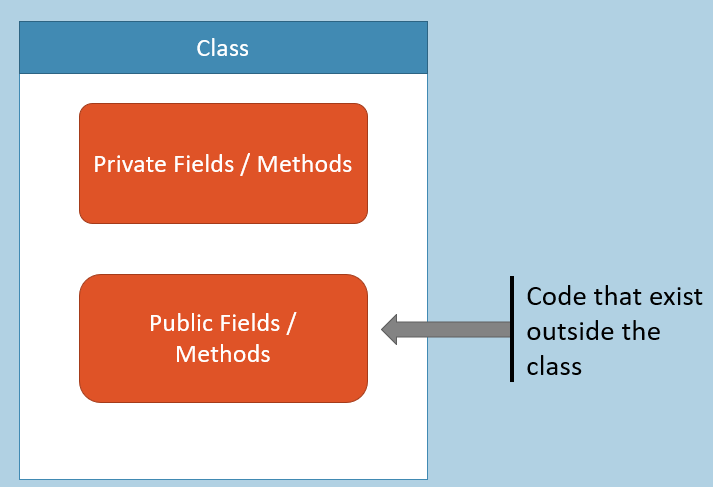

#### 局部变量与参数

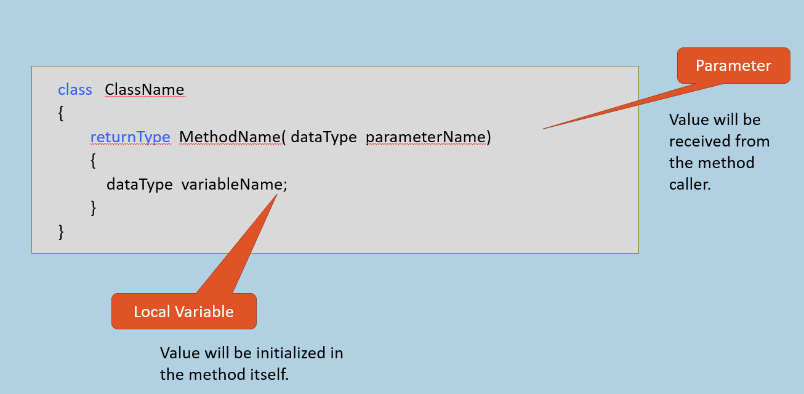

**参数：**

从"方法调用者"接收的变量被称为"参数"。

这些参数存储在方法的栈中。

每次方法调用时，都会创建一个新的栈。

  

**局部变量：**

在方法内部声明的变量称为"局部变量"。局部变量只能在同一个方法内使用。

局部变量和参数一样，都存储在同一个栈中。

方法执行结束时栈会被删除。因此所有的局部变量和参数都将被清除。

  

  

#### "this"关键字

"this"关键字指代"当前对象"，即调用该方法的对象。

"this"关键字仅在"实例方法"中可用。

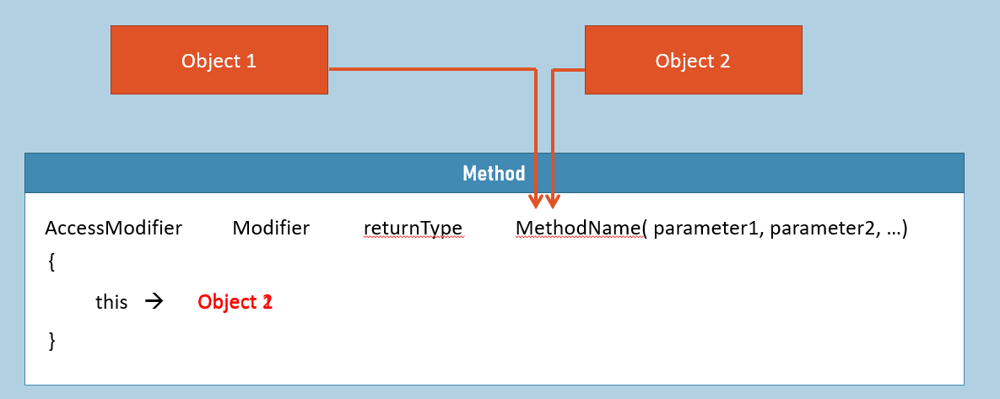

#### 实例方法（对比）静态方法

**关联：**

**实例方法：** 与对象相关联

**静态方法：** 与类相关联

  

**操作对象：**

**实例方法：** 操作实例字段。

**静态方法：** 操作静态字段。

  

**声明：**

**实例方法：** 声明时不使用"static"关键字。语法：`returnType methodName( ) { }`

**静态方法：** 使用"static"关键字声明。语法： `static returnType methodName( ) {  }`

  

**可通过以下方式访问：**

**实例方法：** 通过对象（通过引用变量）访问。

**静态方法：** 仅通过类名访问（不能通过对象访问）。

  

**可以访问（字段）**

**实例方法：** 可以访问实例字段和静态字段

**静态方法：** 不能访问实例字段；但可以访问静态字段。

  

**可以访问（方法）**

**实例方法：** 可以访问实例方法和静态方法。

**静态方法：** 无法访问实例方法；但只能访问静态方法。

  

**"this"关键字：**

**实例方法：** 可以使用"this"关键字，因为调用实例方法时必须存在"当前对象"。

**静态方法：** 不能使用"this"关键字，因为调用实例方法时不存在"当前对象"。

  

  

#### 引用变量作为参数

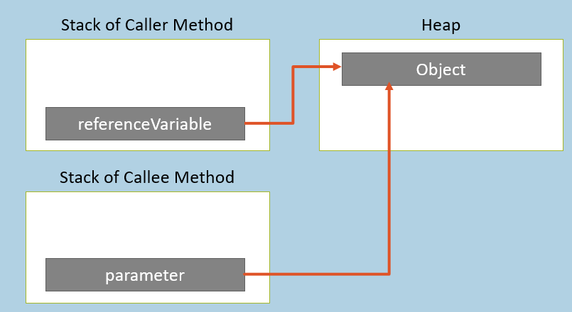

如果将"引用变量"作为参数传递，对象的引用（地址）将被传递给方法。

该参数的数据类型将是类名。

如果你在方法中对该对象进行了任何更改，调用者方法中的同一对象也会自动受到影响，因为你访问的是同一个对象。

  

  

#### 默认参数

方法参数的默认值。

如果不向参数传递值，则该参数将被赋予默认值。

为了避免每次都需要向参数传递值；如果方法调用者没有为参数提供值，则自动为该参数采用某个默认值。

accessModifier   modifier    returnType  MethodName( parameter1 )
{
                 Method body here
}

  

  

#### 命名参数

根据参数名称为其提供值。

语法：`parametername: value`

传递参数时可以改变参数的顺序。

在方法调用时，参数名称具有表达性（易于理解）。

调用方法： `MethodName(ParameterName : value, ParameterName : value);`

  

  

#### 方法重载

在同一个类中编写多个同名方法，但参数不同。

调用者在调用方法时会有多种选择。

所有同名方法的参数差异是必须的。

MethodName( )
MethodName( int )
MethodName( string )
MethodName( int, string )
MethodName( string , int)
MethodName( string , string, int)
etc.

  

  

#### 参数修饰符

指定参数如何接收值。

- 默认[无关键字]
    
- 参考
    
- 输出
    
- 输入
    
- 参数
    

  

  

#### 参数修饰符（默认）

"实参"将被赋值给"形参"，但不会反向传递。
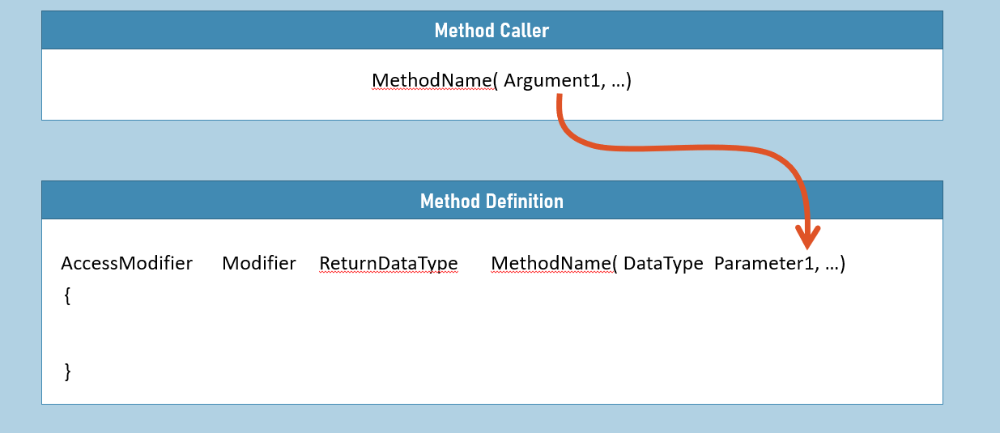

#### 参数修饰符（ref）

"实参"将被赋值给"形参"，反之亦然。

实参必须是一个变量且必须预先初始化。

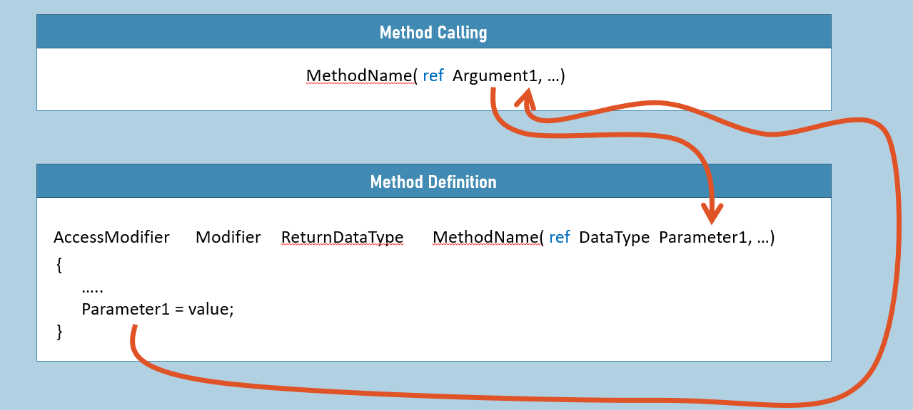

#### 参数修饰符 (out)

"实参"不会被赋值给"形参"，只会进行反向赋值。

参数必须是变量；该参数可以未初始化。

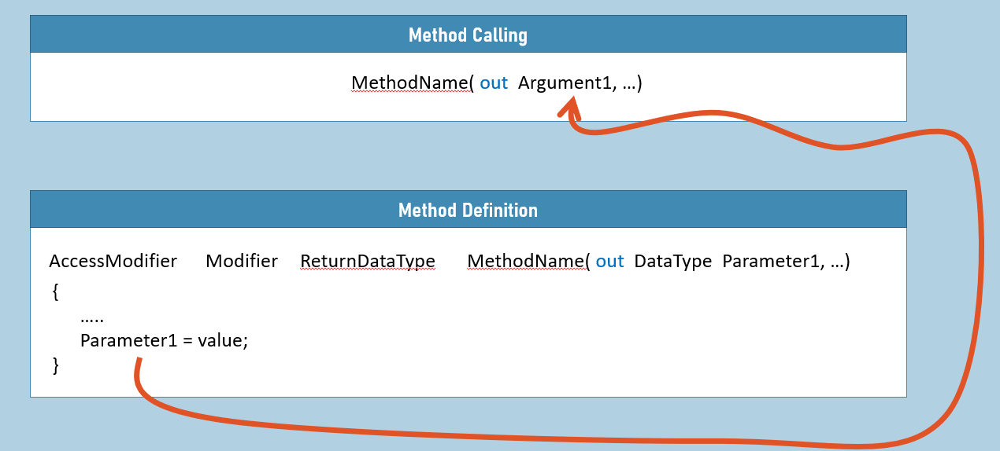

#### 'out'变量声明

您可以在调用带有'out'参数的方法时直接声明 out 变量。

C# 7.0 中的新特性。

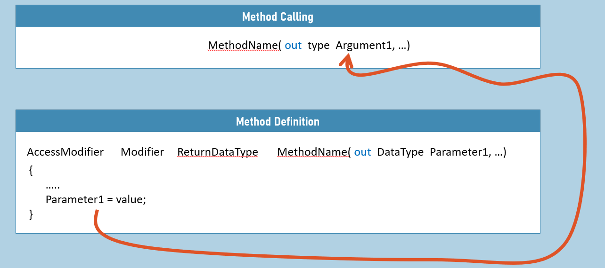

#### 参数修饰符 (in)

"Argument" 将被赋值给 "Parameter"，但该参数变为只读。

我们无法在方法内修改参数的值；如果尝试更改，将会显示编译时错误。

C# 7.2 的新特性。

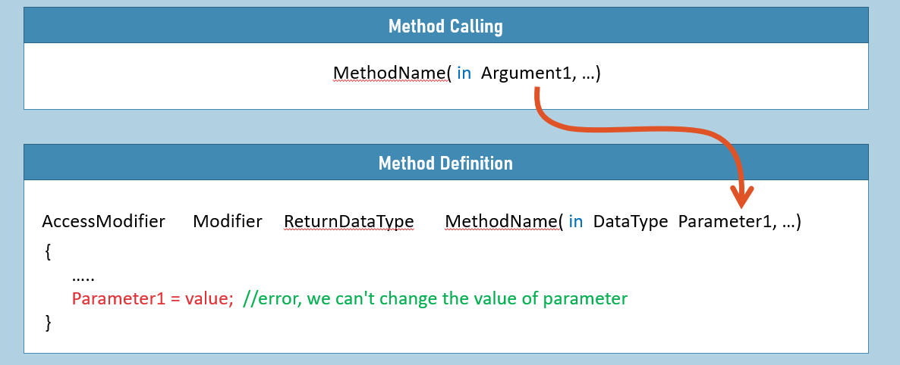

#### 引用返回

返回变量的引用将被赋值给接收变量。

C# 7.3 中的新特性。

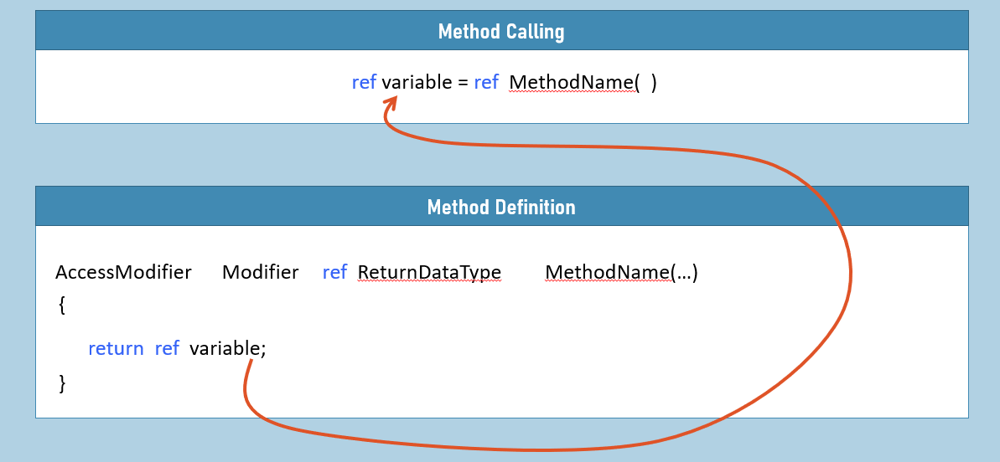

#### 参数修饰符 (params)

所有参数集合将作为数组一次性传入该参数。

"params"参数修饰符只能用于方法的最后一个参数，且每个方法只能使用一次。

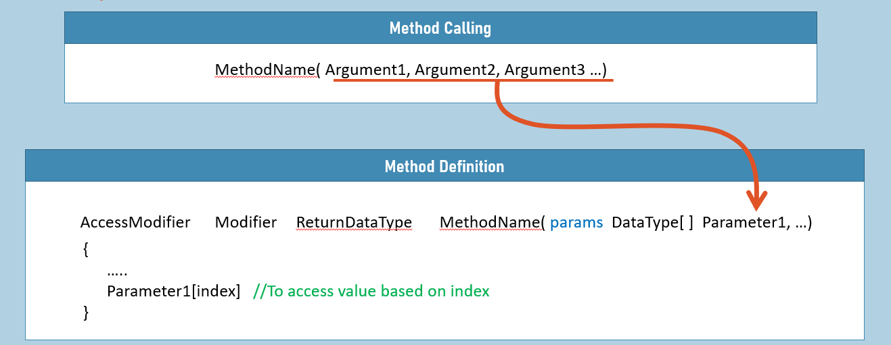

#### 局部函数

"局部函数"是指那些为完成某些小型处理过程而编写在方法内部的函数。

局部函数不属于类的组成部分，无法通过引用变量直接调用。

局部函数不支持"访问修饰符"和"修饰符"的使用。

局部函数支持参数传递和返回值。

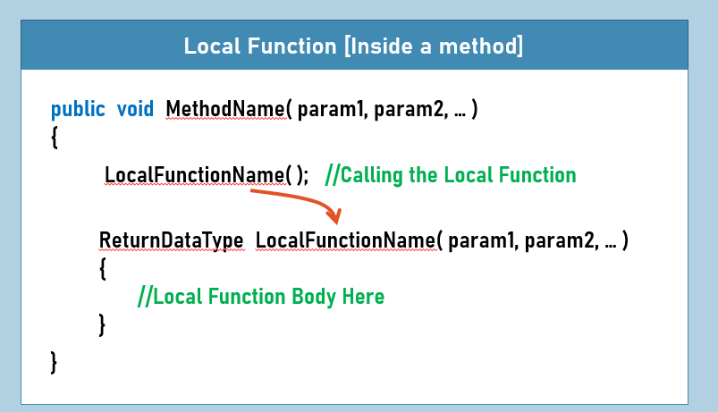

#### 静态局部函数

"静态局部函数"本质上也是函数，与普通"局部函数"相同。

唯一区别在于，静态局部函数无法访问包含方法的局部变量或参数。

这是为了避免在局部函数中意外访问包含方法的局部变量或参数。

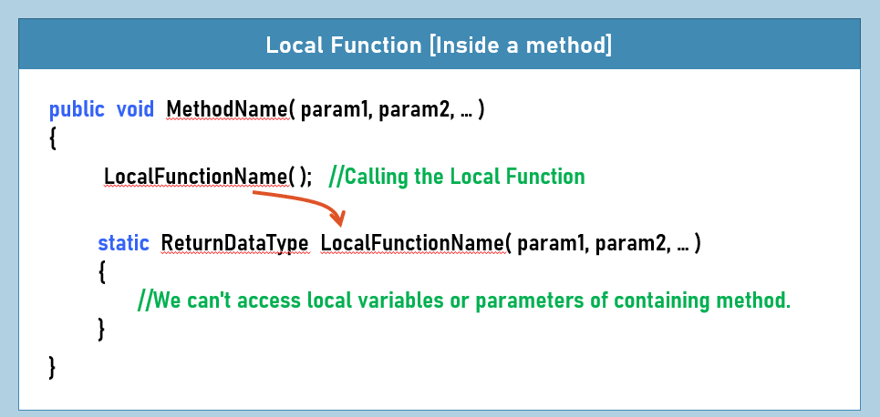

#### 递归

一个方法调用其自身。

在数学计算中非常有用，例如求一个数的阶乘。

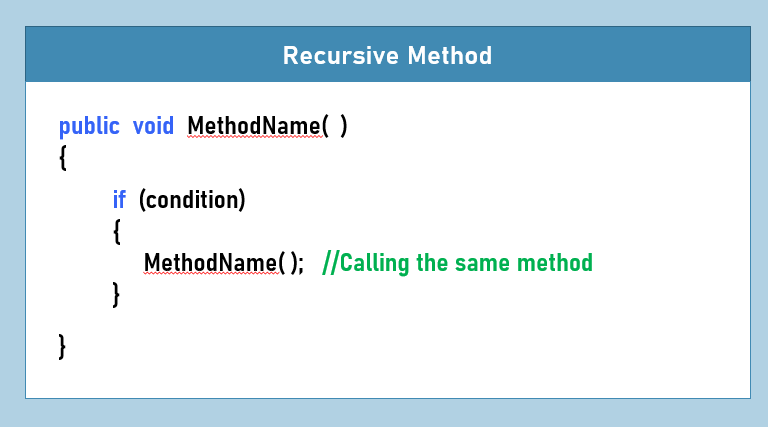

**关键要点**

- 方法是类的一部分，包含一系列执行特定过程的语句。
    
- 方法的访问修饰符：private、protected、private protected、internal、protected internal、public。
    
- 方法的修饰符：static、virtual、abstract、override、new、partial、sealed
    
- 每次方法调用时都会创建一个新栈，该方法的所有局部变量和参数都将存储在该栈中，并在方法执行结束时自动删除。
    
- 在实例方法中，'this'关键字指向"调用该方法的当前对象"。
    
- 实例方法可以访问和操作实例字段及静态字段；而静态方法只能访问静态字段。
    
- 但静态方法可以创建类的对象，然后通过该对象访问实例字段。
    
- 使用命名参数时，可以在调用方法时改变参数的顺序。
    
- 方法重载是指'在同一个类中编写多个同名方法，但这些方法具有不同的参数集合'。
    
- 'ref'参数用于将值传入方法并同时将值返回给方法调用者；而'out'参数仅用于将值返回给方法调用者，不能用于将值传入方法。