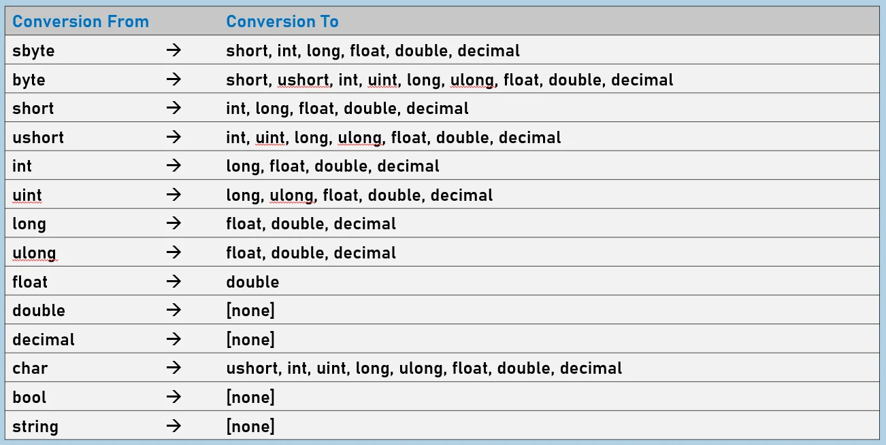

# **C# 隐式类型转换 (Implicit Casting) 深度解析与实践**

## **一、 核心概念与本质**
隐式类型转换是 C# 语言在编译期自动完成的类型转换机制。其核心原则是：**将占用内存较小（较低类型）的数据安全地转换为占用内存较大（较高类型）的数据**。

在类型系统的设计中，只要目标类型能够完全包含源类型的取值范围，编译器就会默默地允许这种转换，不需要任何显式的语法（如强转符号 `()`）或调用特殊方法。

*   **内存视角的“高低”之分**：
    *   `sbyte` 占用 1 个字节，属于“较低类型”。
    *   `short` 占用 2 个字节，相对于 `sbyte` 是“较高类型”；但相对于占用 4 字节的 `int`，它又是“较低类型”。




---

## **二、 典型应用场景与代码演示**

### **基础数值类型的自动提升**
这是最常见的场景，低位宽的整型自动转换为高位宽的整型或浮点型。
```csharp
sbyte sbyteValue = 10;

// sbyte (1字节) 隐式转换为 int (4字节)
int intValue = sbyteValue; 

// sbyte 隐式转换为 double (8字节)
double doubleValue = sbyteValue; 

// 此时 sbyteValue, intValue, doubleValue 的值均为 10
```

### **字符类型 (char) 到数值类型的转换**
在 C# 中，`char` 结构在内存中表示为 16 位的 Unicode 字符。它可以隐式转换为更高范围的数值类型（如 `ushort`, `int`, `long`, `float` 等）。转换的结果是该字符对应的字符编码数值（对于基础英文字符而言，即 ASCII 码值）。
```csharp
char ch = 'A';

// char 隐式转换为 int，存储的是字符的 Unicode/ASCII 数值
int asciiValue = ch; 

Console.WriteLine(asciiValue); // 输出结果为 65
```

### **违反隐式转换规则的编译期错误**
隐式转换的前提是**绝对的范围兼容**，不仅看字节数，还要看符号位（Signed vs Unsigned）。
```csharp
sbyte signedByte = 10;

// 下面这行代码会导致编译错误：
// Cannot implicitly convert type 'sbyte' to 'uint'
uint unsignedInt = signedByte; 
```
*分析*：虽然 `uint` 占 4 字节，比 `sbyte`（1 字节）大，但 `sbyte` 可以表示负数（-128 到 127），而 `uint` 是无符号的（最小值为 0）。编译器为了防止负数被错误地转换为无符号数从而引发不可预知的逻辑错误，严格禁止了这种隐式转换。

---

## **三、 经典书籍中的深度拓展与避坑**

结合《CLR via C#》、《C# in a Nutshell》以及《Effective C#》的底层解析，关于隐式转换有以下几点需要深入理解：

### **CLR 底层的扩展机制 (Sign/Zero Extension)**
参考《CLR via C#》，在 IL（中间语言）代码层面，隐式转换是通过扩展指令完成的。如果源类型是无符号的（如 `byte`），CLR 会执行**零扩展**（高位补 0）；如果源类型是有符号的（如 `sbyte`），CLR 会执行**符号扩展**（高位补符号位）。这一切由编译器和运行时无缝协作完成，保证了数值的正确性且几乎没有性能损耗。

### **隐式转换的“陷阱”：精度丢失 (Precision Loss)**
《C# in a Nutshell》中特别指出，**隐式转换虽然保证不抛出异常、不发生数量级溢出，但并非 100% 不丢失数据（精度）**。
当从大的整型隐式转换为浮点型时，可能会发生精度截断。例如：
*   `int` (32位) 隐式转 `float` (32位)
*   `long` (64位) 隐式转 `double` (64位)
```csharp
int bigInt = 100000001; // 一个需要完整 32 位精度的整数
float floatValue = bigInt; // int 隐式转 float 是合法的

// 输出结果并不是 100000001，而是 100000000
Console.WriteLine(floatValue); 
```
*原因*：`float` 也是 32 位，但它需要将部分位用于存储指数（Exponent），留给尾数（Mantissa）的位数不足 32 位，因此无法精确表示所有大整数，从而发生末尾精度的隐式丢失。在金融计算或高精度计数场景中，必须警惕这一隐患。

### **不可隐式转换的类型**
*   **向下转换**：如 `int` 转 `short`，必须使用显式转换（强制转换）。
*   **浮点数与 Decimal**：`double` 和 `float` 无论如何**不能**隐式转换为 `decimal`，反之亦然。虽然 `decimal` 有 128 位，但它的内部结构和浮点机制与 IEEE 754 浮点数完全不同，必须显式转换。
*   **非数值类型**：`bool` 和 `string` 不能与任何数值类型进行隐式或显式转换，必须使用 `Convert` 类或 `Parse` 方法。