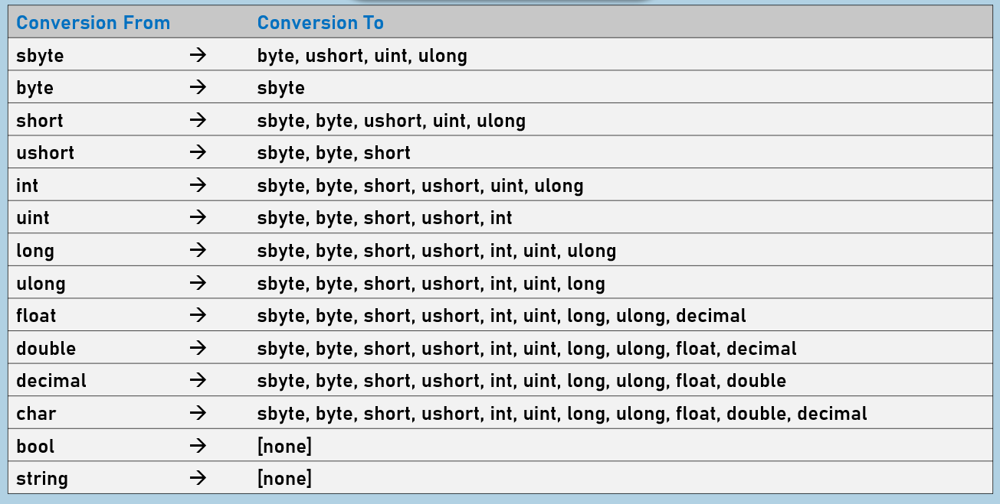

# **C# 显式类型转换**

## **一、 核心概念与语法**
显式类型转换（通常称为强制转换）是 C# 中处理不兼容类型转换的一种机制。当编译器判定某次转换存在数据丢失风险时（通常是从大范围类型向小范围类型转换），会拒绝隐式转换。此时，开发者必须使用圆括号 `()` 语法，强制要求编译器执行转换。

显式转换的本质是开发者向编译器做出保证：“我清楚这里可能会发生什么，并且我愿意承担后果。”

*   **语法格式**：`(目标类型) 源数据`




---

## **二、 典型应用场景与代码演示**

### **必须使用的场景：向下转换 (Downcasting)**
当把高精度、大范围的数值类型赋值给低精度、小范围的变量时，必须使用显式转换。这是因为目标内存空间不足以容纳源数据的所有位。

```csharp
int sourceValue = 100;

// 必须使用显式转换：int (4字节) -> byte (1字节)
byte targetValue = (byte)sourceValue; 

// 必须使用显式转换：double -> int (小数部分会被直接截断)
double pi = 3.14159;
int intPi = (int)pi; // intPi 的值为 3
```

### **可选使用的场景：冗余的显式声明**
在所有允许隐式转换的场景中，开发者都可以选择加上显式转换符号。虽然这在功能上是多余的，但在某些复杂数学运算公式中，可以用来提高代码的可读性，明确表达开发者的意图。

```csharp
int a = 10;
// 隐式转换完全可行，但显式写出 (float) 也合法
float b = (float)a; 
```

---

## **三、 核心风险：有损转换与底层逻辑**

显式转换最大的隐患在于**数据截断（Truncation）**。当源数据超出了目标类型的最大/最小范围时，转换并不会报错（在默认上下文下），而是会产生一个不可预期的“近似值”或“错误值”。

**底层原理解析（基于二进制截断）：**
假设我们将整数 `500` 强转为 `byte` 类型：
```csharp
int largeValue = 500;
byte byteValue = (byte)largeValue; 
Console.WriteLine(byteValue); // 输出结果为 244
```
*为什么是 244？*
*   `int` 类型的 `500` 在内存中的二进制表示为：`00000000 00000000 00000001 11110100`
*   `byte` 类型只占 1 个字节（8位）。在进行强转时，CLR（公共语言运行时）会直接**暴力砍掉**高位的 24 个 bit，只保留最低的 8 个 bit。
*   截断后剩下的 8 位是 `11110100`，将其转换为十进制，正好是 `244`。
这种静默的数据丢失在金融、科学计算等领域是致命的逻辑漏洞。

---

## **四、 经典书籍中的深度拓展与防御性编程**

**1. 《CLR via C#》：使用 checked 关键字防御溢出**
由于 C# 编译器为了极致的运行性能，默认处于 `unchecked`（不检查溢出）上下文中。Jeffrey Richter 在《CLR via C#》中强烈建议，如果无法绝对保证数据不越界，应当将显式转换包裹在 `checked` 块中。这样一旦发生溢出，CLR 会抛出 `OverflowException`，而不是让错误的数据继续在程序中流转。

```csharp
int largeValue = 500;

try
{
    checked
    {
        // 这里不会静默变成 244，而是直接抛出 System.OverflowException
        byte byteValue = (byte)largeValue; 
    }
}
catch (OverflowException ex)
{
    Console.WriteLine("数据溢出，转换失败！");
}
```

**2. 面向对象中的显式转换 (Reference Type Casting)**
*(注：在面向对象的多态中，从子类转换到父类是安全的，属于**隐式转换**；而从父类强制还原为子类，才需要**显式转换**。)*
当处理引用类型的显式转换时：
```csharp
object obj = "Hello World"; // 隐式：string -> object
string str = (string)obj;   // 显式：object -> string
```

**3. 《Effective C#》：优先使用 is / as 运算符**
Bill Wagner 在《Effective C#》中指出，对于引用类型的显式强转 `(Type)obj`，如果对象类型不匹配，会抛出昂贵的 `InvalidCastException`。现代 C# 编程推荐使用 `as` 关键字或 `is` 模式匹配来进行安全的显式转换：

```csharp
object unknownObj = 123;

// 传统显式强转：如果 unknownObj 不是 string，程序会崩溃 (InvalidCastException)
// string text = (string)unknownObj; 

// 推荐做法：模式匹配 (C# 7.0+)
if (unknownObj is string text)
{
    Console.WriteLine(text.ToUpper());
}
else
{
    Console.WriteLine("类型不匹配，转换失败");
}
```