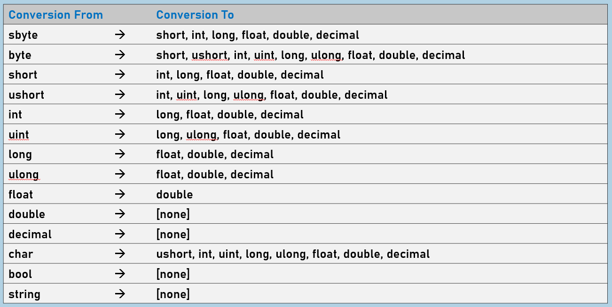
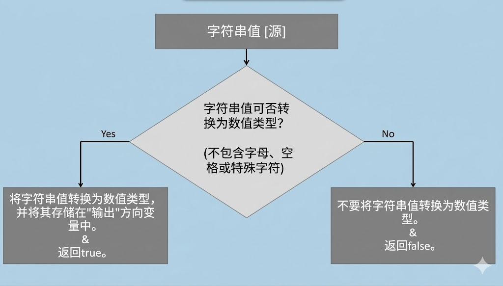
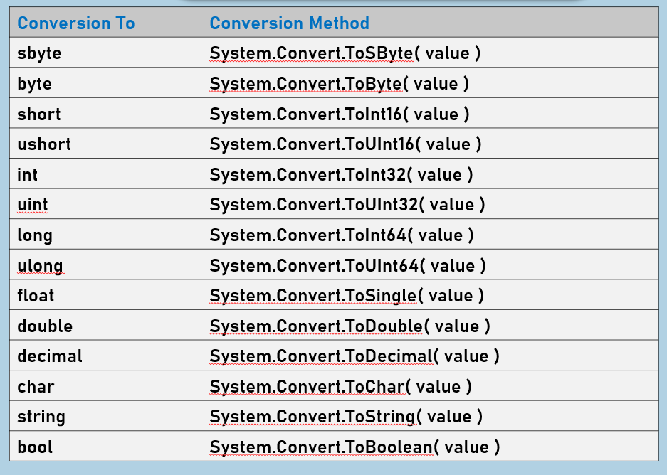

#### 类型转换

'类型转换'是将一个值从一种类型（源类型）转换为另一种类型（目标类型）的过程。

例如：int 转 long

  

1. 隐式类型转换

（从低数值类型到高数值类型）

  

2. 显式类型转换

（从高数值类型到低数值类型）

  

3. 解析/尝试解析

（从字符串到数值类型）

  

4. 转换方法

（从任意基本类型到任意基本类型，包括字符串以及其他类型如 DateTime、Base64 等）

  

  

#### 隐式类型转换

较低数值类型可以自动（隐式）转换为较高数值类型。

#### 显式类型转换

我们可以通过在源值左侧用括号指定目标数据类型，手动将值从一种数据类型转换为另一种数据类型。

  

**松散转换：** 如果目标类型不足以存储转换后的值，可能会导致值丢失。

  

**语法：** `(DestinationDataType)SourceValue`

1. 在隐式转换表中的所有情况。

2. 在以下显式转换表中的情况。

3. 子类到父类的转换。

#### 解析

通过使用"解析"技术，可以将字符串值转换为任何数值数据类型。

例如：字符串转整型

源值必须仅包含数字；不应包含空格、字母或特殊字符。

如果源值无效，将引发 FormatException 异常。

**语法：** `DestinationDataType.Parse(SourceValue)`

  

  

#### TryParse

字符串值可通过"TryParse"技术（与"parse"相同）转换为任何数值数据类型；但它在尝试解析前会先检查源值。

例如：字符串 -> 整数

  

如果源值无效，则返回 false；这种情况下不会引发任何异常。

若源值有效，则返回 true [表示转换成功]

它避免了 FormatException。

`bool variable = _DestinationType_.TryParse(_SourceValue_, out _DestinationVariable_)`

  

  

#### 转换方法

转换方法是一种预定义的方法，可将任何基本类型（包括'string'）转换为其他任何基本类型（也包括'string'）。

例如：string  ->  int      以及      int  ->  string

  

System.Convert 是一个类，其中包含一组预定义的方法。

如果源值无效，则会引发 FormatException。

对于每种数据类型，我们都有一个转换方法。

所有转换方法都是静态方法。

  

**语法：**

`type destinationVariable = Convert._ConversionMethod_ (_SourceValue_ )`

**关键要点**

- 在所有可能的"隐式转换"和"显式转换"情况下，始终推荐使用"显式转换"或"转换方法"。
    
- 从"字符串"转换为"数值类型"时，应使用 TryParse 而非 Parse；因为 TryParse 可以避免异常。
    
- 对于任意类型之间的值转换，请使用转换方法。