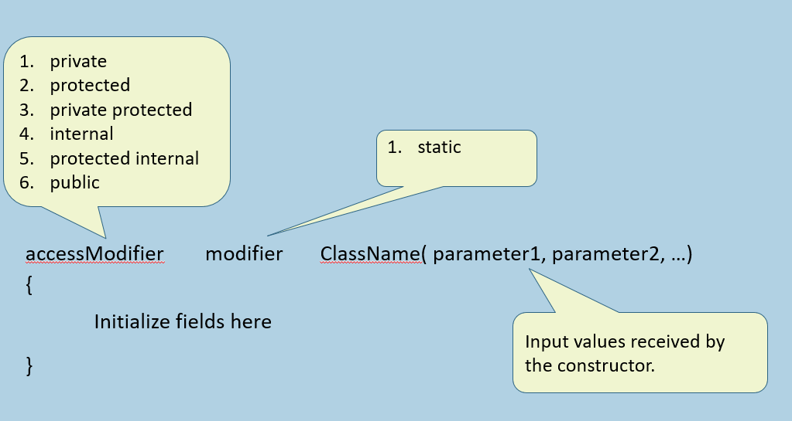

# C# 实例构造函数

## 核心概念与职责
构造函数（Constructor）是类中一种特殊的方法，其核心职责是在创建对象（实例化）时自动执行，用于初始化类的字段或属性。

从更深层的面向对象设计角度（如《代码大全》所述），构造函数的根本目的是**确保对象在被创建并在内存中分配后，立即处于一种有效、安全且可用的状态**。
在一个类中，成员通常分为三类核心角色：
*   **字段/属性**：用于存储对象的状态数据。
*   **方法**：用于操作和改变这些状态数据。
*   **构造函数**：用于在对象生命周期开始时确立这些数据的初始状态。

## 构造函数的定义规则
在C#中定义构造函数时，必须遵循以下严格规则：

*   **命名一致性**：构造函数的名称必须与它所在的类名完全相同。
*   **无返回类型**：构造函数不能有任何返回类型，甚至不能写 `void`。
*   **修饰符限制**：
    *   可以应用访问修饰符（如 `public`, `private`, `internal`, `protected` 等）。
    *   不能应用如 `virtual`, `abstract`, `override` 等面向对象的多态修饰符（因为构造函数不能被继承或重写）。
    *   唯一的非访问修饰符是 `static`（用于静态构造函数，其运行机制与实例构造函数完全不同）。

## 编译器背后的行为 (深入理解)
结合《CLR via C#》的底层解析，当使用 `new` 关键字创建对象时，CLR（公共语言运行时）会执行以下步骤：
1.  为对象在托管堆（Managed Heap）上分配内存。
2.  将对象的所有实例字段初始化为零值（或 `null`）。
3.  调用实例构造函数（在IL中间语言代码中，实例构造函数被称为 `.ctor` 方法）。

**默认构造函数规则**：
如果在一个类中没有显式定义任何构造函数，C#编译器会在编译时自动生成一个隐式的、无参的公共构造函数（Default Constructor）。然而，**一旦在类中显式定义了任何一个构造函数（无论是否有参数），编译器就不再自动生成默认的无参构造函数**。如果此时仍然需要无参实例化对象，必须手动显式写出一个无参构造函数。

## 参数化构造函数与 `this` 关键字
硬编码（在无参构造函数中写死数据）违背了对象独立性的原则。每个对象都应该代表一个独立的实体（例如每个员工有不同的ID和姓名）。因此，通常通过**参数化构造函数**由外部在实例化时传入具体的值。

当构造函数的参数名与类的字段名相同时，会产生命名冲突。此时必须使用 `this` 关键字。`this` 代表当前正在被实例化的对象本身。

### 代码示例：带参数的构造函数与对象实例化

**类库定义 (Employee.cs)：**
```csharp
public class Employee
{
    // 定义类的字段
    public int empId;
    public string empName;
    public string job;

    // 参数化构造函数
    public Employee(int empId, string empName, string job)
    {
        // 使用 this 关键字区分实例字段和传入的参数
        // this.empId 指向当前对象的字段，等号右边的 empId 是构造函数的参数
        this.empId = empId;
        this.empName = empName;
        this.job = job;
    }
}
```

**控制台应用调用 (Program.cs)：**
```csharp
class Program
{
    static void Main(string[] args)
    {
        // 每次使用 new 关键字时，都会调用构造函数，并将传入的值赋给独立的对象内存空间
        Employee emp1 = new Employee(101, "Scott", "Manager");
        Employee emp2 = new Employee(102, "Smith", "Developer");
        Employee emp3 = new Employee(103, "Allen", "Designer");

        // 打印验证，每个对象保持独立的状态
        Console.WriteLine($"Emp1: {emp1.empId}, {emp1.empName}, {emp1.job}");
        Console.WriteLine($"Emp2: {emp2.empId}, {emp2.empName}, {emp2.job}");
    }
}
```

## 私有构造函数
虽然大多数实例构造函数是 `public` 的，以便外部可以自由实例化，但在某些特定场景下，会将构造函数标记为 `private`。
当构造函数为私有时，类的外部无法使用 `new` 关键字创建该类的对象。这种设计通常用于以下模式：
*   **单例模式 (Singleton Pattern)**：只允许类自身在内部创建一个唯一的实例，并通过静态方法暴露给外部。
*   **工厂方法模式 (Factory Method)**：强制开发者通过类提供的静态方法（工厂方法）来获取对象，而不是直接 `new`，从而可以在对象创建前注入复杂的验证或缓存逻辑。

## 构造函数重载
同一个类中可以定义多个构造函数，只要它们的**参数列表（参数的类型、数量或顺序）不同**即可，这就是构造函数重载。这为调用者提供了多种初始化对象的方式。例如，可以提供一个全参数构造函数，以及一个只接收ID、其他字段赋默认值的构造函数。

