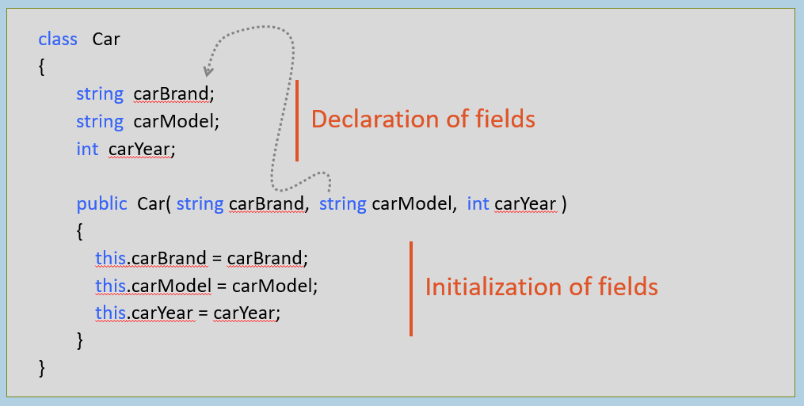

#### 构造函数

类的特殊方法，包含字段的初始化逻辑。

构造函数不仅初始化字段，还包含额外的初始化逻辑（如果有的话）。

  

例如：

**构造函数的语法**

#### 构造函数的规则

- 构造函数的名称应与类名相同。
    
- 建议将构造函数设为"public"成员或"internal"成员；
    
- 如果是"private"成员，则只能在同一个类内部调用；因此只能在同一个类内部创建该类的对象，而不能在类外部创建。
    
- 构造函数可以有一个或多个参数。
    
- 构造函数不能返回任何值，因此没有返回类型。
    
- 一个类可以有一个或多个构造函数，但该类的所有构造函数的参数类型必须不同。
    

  

  

#### 实例构造函数（对比）静态构造函数

**实例构造函数**

public ClassName( Parameter1, Parameter2, … )
{
    …
}

1. 初始化实例字段。
    
2. 每当为类创建新对象时自动执行。
    
3. 默认为"private"；可以使用任意访问修饰符。
    
4. 可以包含任何初始化逻辑，这些逻辑应在每次为该类创建新对象时执行。
    

  

**静态构造函数**

static ClassName( )
{
    …
}

1. 初始化静态字段。
    
2. 仅执行一次，即当首次为该类创建对象时，或在 Main 方法执行期间首次访问该类时。
    
3. 默认为"public"；访问修饰符不可更改。
    
4. 可以包含任何只需执行一次的初始化逻辑，即在为类创建新对象时执行。
    

  

  

#### 无参构造函数 vs 带参构造函数

**无参构造函数**

public ClassName( )
{
  …
}

1. 不带参数的构造函数。
    
2. 它通常使用一些字面值初始化字段（或）包含对象的一些通用初始化逻辑。
    

  

**参数化构造函数**

public ClassName( Parameter1, Parameter2, … )
{
  …
}

1. 带有一个或多个参数的构造函数。
    
2. 通常通过将参数值赋给字段来初始化字段。
    

  

  

#### 隐式（对比）显式构造函数

**隐式构造函数（编译后）**

public ClassName( )
{
}

1. 若某个类没有构造函数，在编译时会自动提供一个空构造函数，该构造函数不进行任何初始化操作。这被称为"隐式构造函数"或"默认构造函数"。
    
2. 其存在只是为了满足"类必须拥有构造函数"这一规则。
    

  

**显式构造函数（编码时）**

public ClassName( with or without parameters )
{
  …
}

1. 开发者创建的构造函数（无参或有参）被称为"显式构造函数"。
    
2. 在这种情况下，C#编译器不会提供任何隐式构造函数。
    

  

  

#### 构造函数重载

在类中编写多个同名构造函数，但参数列表不同（类似于"方法重载"）。

建议在类中编写一个无参构造函数，以防需要进行构造函数重载。

  

构造函数重载（同一类中存在多个构造函数）

public ClassName( )
{
}

public ClassName( parameter1, parameter2, … )
{
   …
}

  

  

#### 对象初始化器

用于初始化类的字段/属性，同时创建对象的特殊语法。

在构造函数之后执行。

仅用于在创建对象后初始化字段/属性；不能包含任何初始化逻辑。

  

**执行：**

`new ClassName( ) { field1 = value, field2 = value, … }`

  

**在以下情况下使用"对象初始化器"：**

1. 类中没有构造函数；但您想要初始化字段/属性。
    
2. （或）存在一个构造函数；但其目的是初始化其他字段集，而非您想要初始化的那些字段。
    

  

  

**关键要点**

1. '实例构造函数'用于初始化'实例字段'；但也可以访问'静态字段'。
    
2. '静态构造函数'用于初始化'静态字段'；无法访问'实例字段'。
    
3. 如果开发者创建类时未定义任何构造函数，C#编译器会自动提供默认（空）构造函数。
    
4. 如果创建带参数的构造函数，建议始终先编写无参构造函数。
    
5. 若要在创建新对象时立即初始化对象的指定字段，请使用"对象初始化器"。