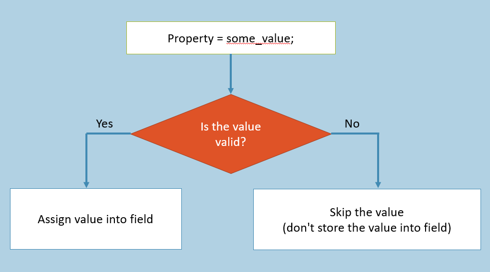
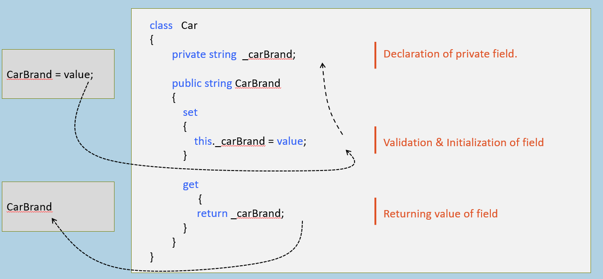
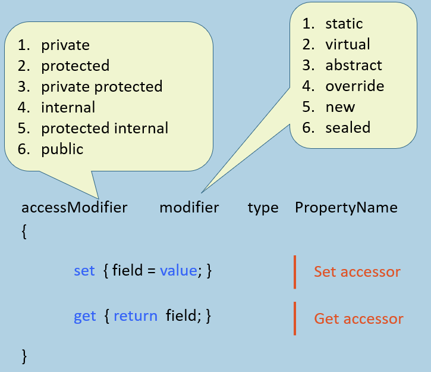
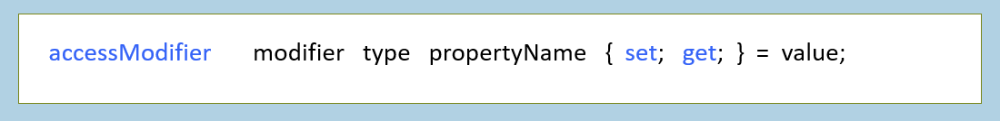
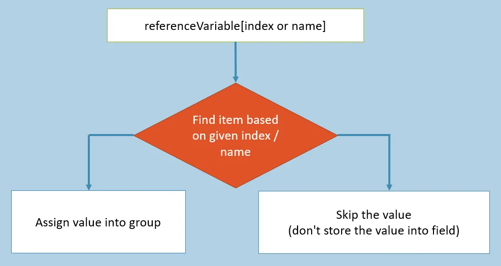
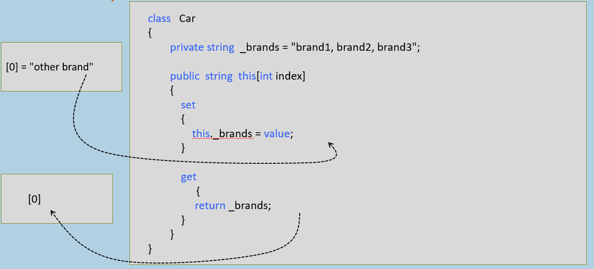
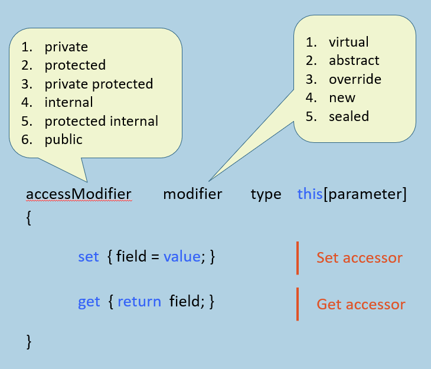

#### 属性

接收传入的值；验证该值；将值赋给字段。
- **输入**：尝试给一个属性赋予新值。
- **判定**：检查这个值是否符合预设的规则（如格式、范围等）。
- **分流**：
    - 如果通过校验，则更新底层字段。
    - 如果未通过，则直接丢弃该值，保持原状态不变。

属性是两个访问器（get 访问器和 set 访问器）的集合。

**属性的语法**

#### set访问器 vs get访问器

**set访问器**

set
{
  field = value;
}

1. 用于验证传入值并将其赋值给字段。
    
2. 当有值被赋给属性时自动执行。
    
3. 有一个名为"value"的默认（隐式）参数，表示当前值，即分配给该属性的值。
    
4. 不能有任何额外参数。
    
5. 但不能返回任何值。
    

  

**get访问器**

get
{
  return field;
}

1. 用于计算值并返回相同值（或）按原样返回字段值。
    
2. 在属性被获取时自动执行。
    
3. 没有隐式参数。
    
4. 不能有参数。
    
5. 应返回字段的值。
    

  

#### 属性的特点与优势

属性在字段周围创建了一个保护层，防止将无效值赋给属性，并在调用属性时自动执行某些计算。

不会为该属性分配内存。

  

**访问器的访问修饰符：**

访问修饰符可分别应用于属性、set 访问器和 get 访问器。但访问器的访问修饰符必须比属性的访问修饰符更具限制性。

例如：

internal  modifier  data_type  PropertyName
{
     private  set { property = value; }
     protected  get { return property; }
}

  

  

#### 只读对比只写属性

**只读属性**

accessModifier type PropertyName
{
  get
  {
    return field;
  }
}

1. 仅包含 'get' 访问器
    
2. 读取并返回字段的值；但不修改字段的值。
    

  

**只写属性**

accessModifier type PropertyName
{
  set
  {
    field = value;
  }
}

1. 仅包含 'set' 访问器。
    
2. 验证并将传入值分配给字段；但不返回该值。
    

  

  

#### 自动实现的属性

未定义 set 访问器和 get 访问器的属性。

用于轻松创建属性（语法更简洁）。

在编译时自动创建私有字段（字段名称为_propertyName）。

自动实现的属性可以是只读（仅有'get'访问器）属性；但不能是只写（仅有'set'访问器）。

  

accessModifier  modifier  data_type  PropertyName
{
     accessModifier  set;
     accessModifier  get;
}

仅适用于您不想编写任何验证或计算逻辑的情况。

  

  

#### 自动实现的属性初始化器

C# 6.0 中的新特性

您可以为自动实现的属性直接初始化值

#### 属性：关键要点

建议在实际项目中始终使用属性(Properties)。

你也可以使用'自动实现属性'来简化代码。

属性不会占用任何内存(不会被存储)。

属性在私有字段周围形成一个保护层，在将传入值分配给字段之前进行验证。

只读属性仅包含'get'访问器；只写属性仅包含'set'访问器。

属性不能包含额外参数。

  

  

  

#### 索引器

接收数字/字符串。在一组项目中搜索特定项；向项目组设置或获取值。

它提供了访问一组项目的更简洁语法。

这个图示通常描述的是**索引器（Indexer）** 或**集合访问**的逻辑：程序尝试通过键（Name）或位置（Index）去定位集合中的成员。如果找到了对应的位置，则进行赋值操作；如果没找到，则忽略该次操作。

索引器是类的一种特殊成员，它包含用于访问一组项目/元素的 set 访问器和 get 访问器。

  

例如：

**索引器语法**

#### 索引器：关键要点备忘

- 索引器总是使用 'this' 关键字创建。
    
- 索引器通常用于访问一组元素（项）。
    
- 带参数的属性被称为索引器。
    
- 索引器通过 get 和 set 访问器以及 [ ] 运算符实现。
    
- 索引器必须包含一个或多个参数。
    
- 索引器中不允许使用 ref 和 out 参数修饰符。
    
- 索引器不能是静态的。
    
- 索引器通过其签名（调用语法）来识别；而属性则通过其名称来识别。
    
- 索引器可以被重载。