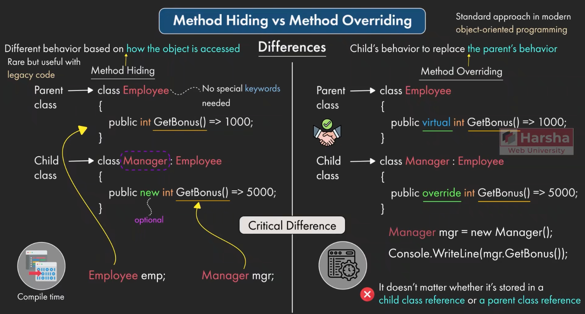
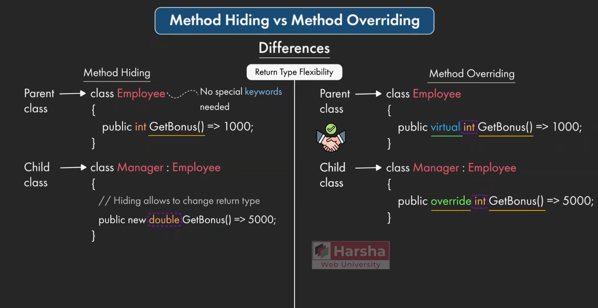
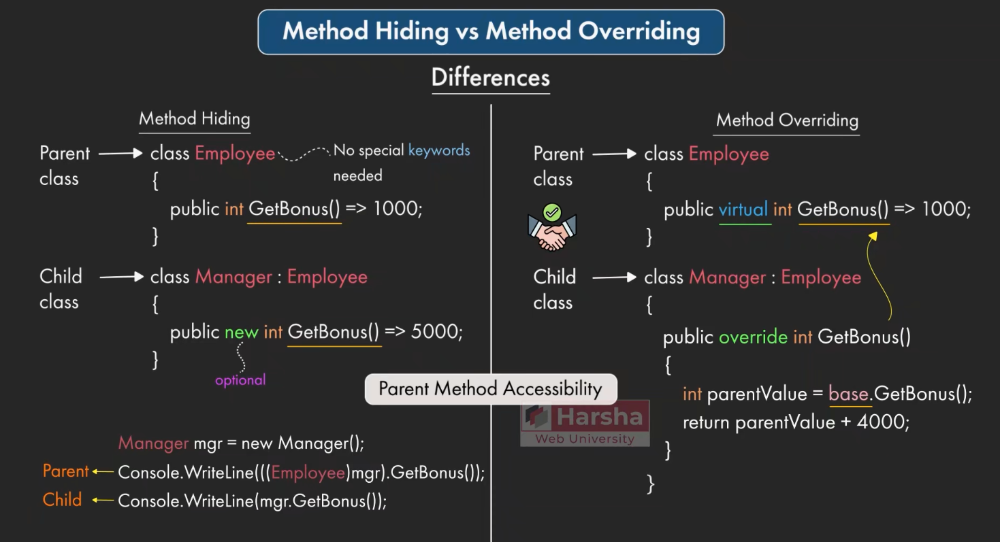

# 方法隐藏vs方法重写

在 C# 的面向对象体系中，理解“方法隐藏（`new`）”与“方法重写（`override`）”的区别，是掌握多态性（Polymorphism）的绝对核心。这不仅是高级 .NET 面试中的高频必考题，更是决定系统架构灵活性的关键基石。

## 核心差异速览 (面试核心要点)

这两种机制最本质的区别在于**方法调用的决议时机**：

*   **方法隐藏 (Method Hiding)**：**编译时决议（早期绑定 / 静态绑定）**。调用哪个方法，完全由**引用变量的声明类型**决定，与内存中实际存储的对象类型无关。
*   **方法重写 (Method Overriding)**：**运行时决议（晚期绑定 / 动态绑定）**。调用哪个方法，由内存中**实际的对象类型**决定，与引用变量的声明类型无关。这是实现真正多态的基础。

## 详细对比与底层机制

### 语法与关键字要求
*   **隐藏**：父类不需要任何特殊关键字（通常是普通方法）。子类使用 `new` 关键字（可选，但强烈建议加上以消除编译警告）。这是一种单方面的行为，父类对此一无所知。
*   **重写**：父类**必须**使用 `virtual` 或 `abstract` 开放重写权限。子类**必须**使用 `override` 进行重写。这是一种父子类之间严格的契约合作。



方法隐藏：编译时基于对象访问方式有不同行为（Employee执行Employee的，Manager执行Manager的，不会有多态性）
方法重写：运行时不管存储在子类引用还是父类引用，都会找到最真的引用然后使用重写的函数，有多态性比如（ Father f = new Child()，f最后会调用Child的方法）

### 返回类型约束 (扩展：C# 9.0 协变返回类型)
*   **隐藏**：子类可以返回与父类**完全不同**的类型。因为从编译器的角度来看，子类的隐藏方法是一个与父类毫无关系的全新方法，只是恰好名字和参数一样而已。
*   **重写**：传统上，子类重写的方法必须与父类具有**完全相同**的返回类型。
    > **补充（参考《C# 9.0 in a Nutshell》）**：从 C# 9.0 开始，引入了**协变返回类型（Covariant Return Types）**。允许重写的方法返回父类方法返回类型的**更具体的派生类型**。例如，父类返回 `Animal`，子类重写时可以返回 `Tiger`。



### 外部强制调用父类方法的行为
*   **隐藏**：在类的外部，如果将子类对象强制转换（Cast）为父类引用，可以“绕过”子类的方法，强制执行父类被隐藏的方法。
*   **重写**：在类的外部，一旦方法被重写，父类的实现就被彻底“替换”了（在虚方法表中被覆盖）。无论你怎么类型转换，只要对象实际是子类，就一定会执行子类重写的方法。父类的实现只能在子类的内部通过 `base.MethodName()` 调用。



## 代码实战：终极对比测试

以下代码直观地展示了两者在不同引用类型下的调用结果差异：

```csharp
using System;

public class Employee
{
    // 供隐藏测试的普通方法
    public string GetBonusHiding() 
    {
        return "[Employee] 基础奖金 1000";
    }

    // 供重写测试的虚方法
    public virtual string GetBonusOverriding() 
    {
        return "[Employee] 基础奖金 1000";
    }
}

public class Manager : Employee
{
    // 1. 方法隐藏 (使用 new)
    // 甚至可以改变返回类型，但为了对比这里保持一致
    public new string GetBonusHiding() 
    {
        return "[Manager] 管理层奖金 5000 (Hiding)";
    }

    // 2. 方法重写 (使用 override)
    public override string GetBonusOverriding() 
    {
        return "[Manager] 管理层奖金 5000 (Overriding)";
    }
}

public class Program
{
    public static void Main()
    {
        // 场景：在内存中实际创建的是 Manager 对象
        // 但是使用基类 Employee 的变量来引用它 (向上转型)
        Employee empRef = new Manager();

        Console.WriteLine("--- 测试方法隐藏 (Method Hiding) ---");
        // 编译时决议：看变量类型。empRef 是 Employee，所以调用 Employee 的方法
        Console.WriteLine(empRef.GetBonusHiding()); 
        // 输出: [Employee] 基础奖金 1000

        Console.WriteLine("\n--- 测试方法重写 (Method Overriding) ---");
        // 运行时决议：看实际对象。内存里是 Manager，所以调用 Manager 重写的方法
        Console.WriteLine(empRef.GetBonusOverriding()); 
        // 输出: [Manager] 管理层奖金 5000 (Overriding)
        
        
        Console.WriteLine("\n--- 强制转换测试 ---");
        Manager realManager = new Manager();
        // 外部强制转换为父类：
        // 隐藏模式下，父类方法复活
        Console.WriteLine(((Employee)realManager).GetBonusHiding());     // 输出: [Employee] ...
        // 重写模式下，依然雷打不动执行子类方法
        Console.WriteLine(((Employee)realManager).GetBonusOverriding()); // 输出: [Manager] ...
    }
}
```

## 架构选型与最佳实践

在实际的企业级项目设计中，应如何选择？

### 绝对优先选择：方法重写 (`override`)
根据《Effective C#》和主流的面向对象设计原则，**方法重写是实现真正多态的标准途径**。
在诸如 ASP.NET Core MVC / Web API 这样的现代框架中，处处体现着重写的设计。例如，框架提供了一个基础的 `Controller` 类，内部有 `OnActionExecuting` 等生命周期虚方法。框架底层使用基类引用集合来统一处理所有请求（`List<Controller>`），它依赖**运行时动态绑定**来确保每一个具体的自定义控制器（如 `UserController`）重写的逻辑能够被正确触发。

### 特殊的妥协方案：方法隐藏 (`new`)
方法隐藏往往不是一种主动的设计模式，而是一种**防御性编程的妥协（Workaround）**。
最经典的应用场景是**版本控制与兼容性修复**：
当你继承了一个无法修改源码的第三方类库，你在子类中写了一个新方法。几个月后，第三方类库升级，在其父类中恰好也新增了一个同名同参的方法。为了不破坏你现有的业务逻辑和多态结构，你使用 `new` 关键字隐藏父类的新方法，从而安全地隔离了父类的更新带来的破坏。

**总结**：如果你需要不同的类型表现出不同的行为（多态），用 `override`；如果你仅仅是想解决基类变更带来的命名冲突，才使用 `new`。