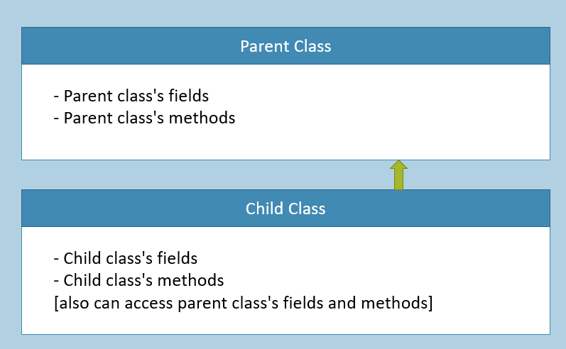
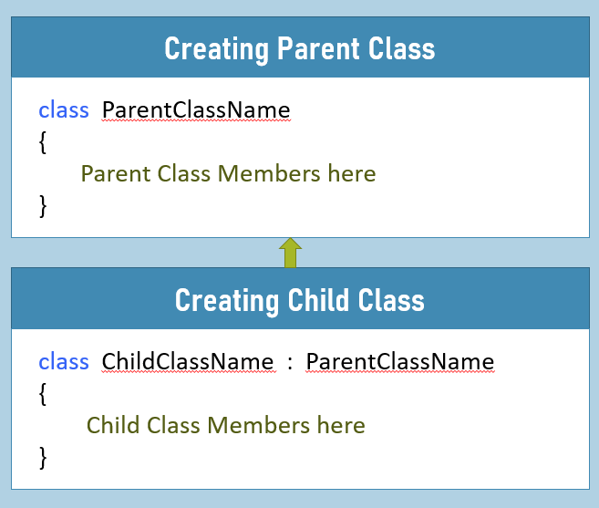
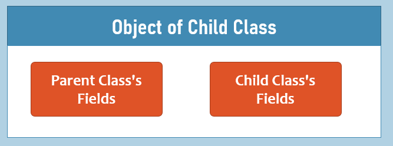
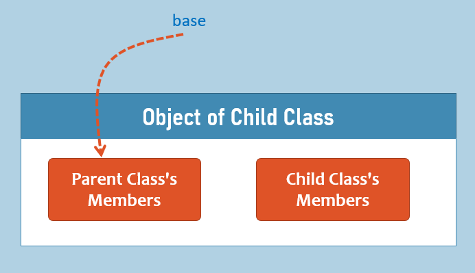
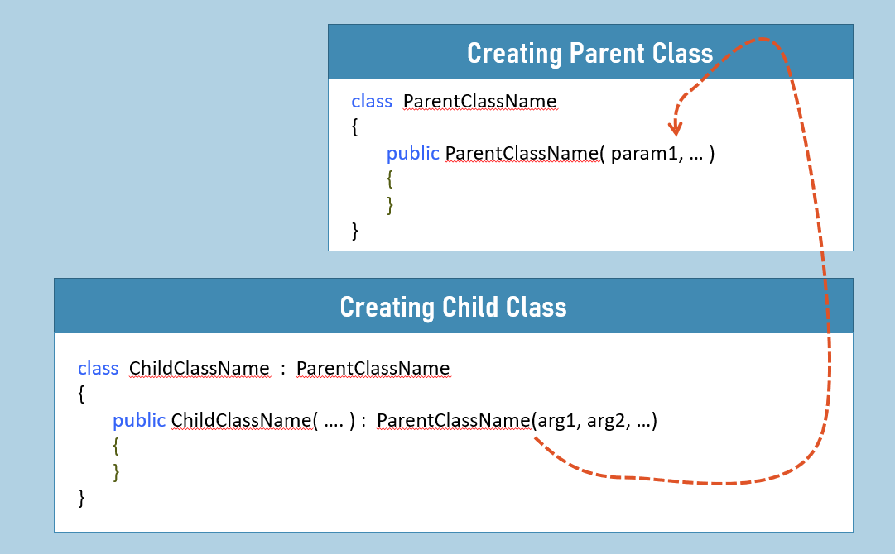
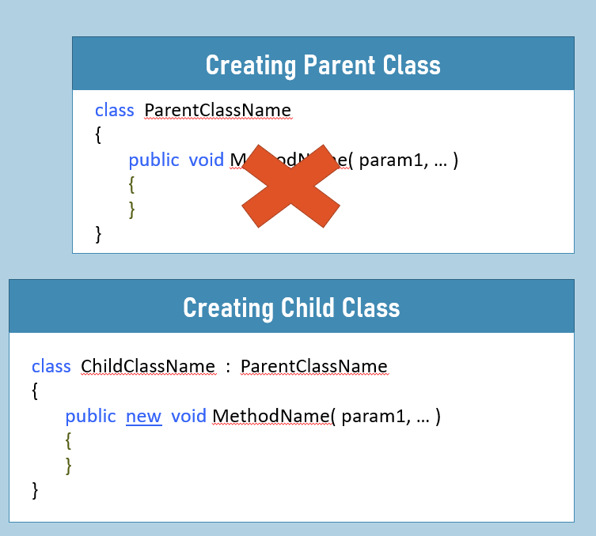
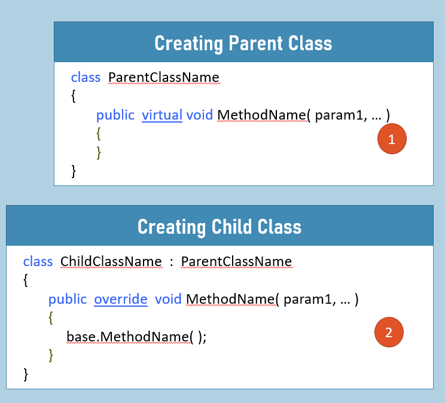
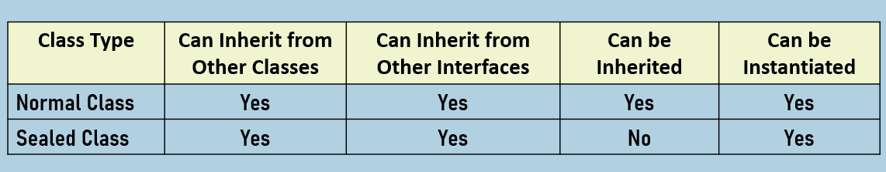
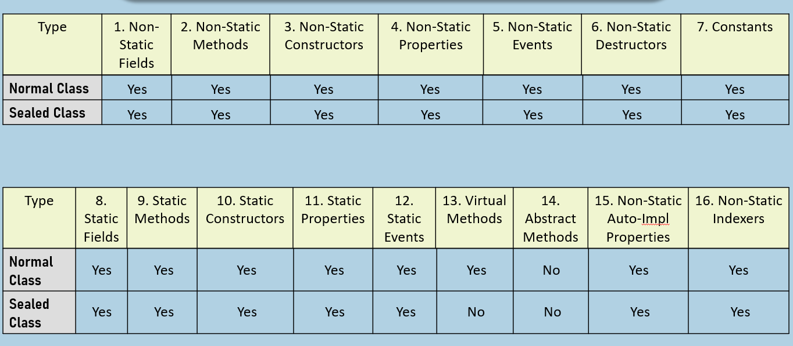
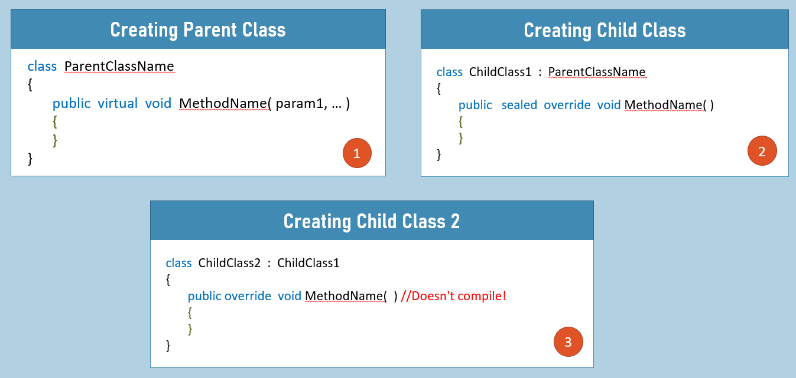

#### 继承

- 这允许类被排列成表示"是一种"关系的层次结构。
    
- "父类"充当"一个或多个子类"的"基类型"。
    
- 子类是从父类派生而来的。




- 子类通过扩展父类而形成的概念。
    
- "子类"继承"父类"。
    
- 子类对象同时存储子类和父类的成员。








#### 继承的类型

**1. 单继承**
```cs
class ParentClassName
{
}

class ChildClassName : ParentClassName
{
}
```

一个父类，一个子类。

  

**2. 多级继承**
```cs
class ParentClassName
{
}

class ChildClass1 : ParentClassName
{
}

class ChildClass2 : ChildClass1
{
}
```


一个父类，一个子类；且该子类还拥有另一个子类。

  

**3. 层次继承**
```cs
class ParentClassName
{
}

class ChildClass1 : ParentClassName
{
}

class ChildClass2 : ParentClassName
{
}
```


一个父类，多个子类。

  

**4. 多重继承**
```cs
class ParentClass1
{
}

class ParentClass2
{
}

class ChildClass : ParentClass1, ParentClass2
{
}
```


多个父类，一个子类。

  

**5. 混合继承**
```cs
class ParentClassName
{
}

class ChildClass1 : ParentClassName
{
}

class ChildClass2 : ChildClass1
{
}

class ChildClass3 : ChildClass1
{
}
```


层次继承 + 多级继承

  

#### 'base' 关键字

"base" 关键字用于在子类中表示父类的成员。

默认情况下，它的使用是可选的。

当父类成员与子类成员存在"名称歧义"时，必须使用该关键字。





#### 父类的构造函数





在"子类"中调用"父类的无参构造函数"是可选的。

在"子类"中调用"父类的带参构造函数"并传递必要参数是必须的。

  

  

#### 方法隐藏

这是一个概念，通过在子类中创建具有相同名称和相同参数的另一个方法，用于隐藏（覆盖）父类的方法。



当进行方法隐藏时，如果使用子类的对象调用该方法；只会执行子类的方法；父类的方法将不会被执行。

方法隐藏是自动完成的；但建议使用"new"关键字（但不是必须的）。

  

  

#### 方法重写

这是一个概念，通过在子类中创建同名同参数的方法来扩展父类方法。

当进行方法重写时，若通过子类对象调用该方法，会先执行父类方法再执行子类方法。

方法重写通过在父类方法使用"virtual"关键字，子类方法使用"override"关键字实现。

使用"base"关键字可调用父类方法。

没有使用 'virtual' 关键字的是父类方法；子类方法无法"重写"这些方法。

  

  

#### 关键要点

- "父类"充当"一个或多个子类"的"基类型"。
    
- 子类中的 'base' 关键字可以访问父类的成员。
    
- 子类对象也会自动存储父类的字段；但如果这些字段不是 'private' 修饰的，就可以在子类中访问它们。
    
- 方法隐藏是通过在子类中创建一个与父类方法签名相同的新方法，来"覆盖"父类方法的概念。
    
- 方法重写是通过在子类中创建一个与父类方法签名相同的新方法，来"扩展"父类方法的概念。
    
- C#不支持多重继承（拥有多个父类）。这意味着一个子类只能有一个父类；然而，一个子类可以实现多个父接口；因此，C#通过这种方式支持多重继承。
    

  

  

#### 密封类

密封类是一种可实例化但不可继承的类。

当你不希望其他开发者为特定类创建子类时，使用密封类。

  
```cs
sealed class Class1
{
}

class Class2 : Class1 //not possible
{
}

```

  

  

#### 对比表：类对比密封类





**第一部分：基础成员与非静态成员**

| **类型**  | **1. 非静态字段** | **2. 非静态方法** | **3. 非静态构造函数** | **4. 非静态属性** | **5. 非静态事件** | **6. 非静态析构函数** | **7. 常量** |
| ------- | ------------ | ------------ | -------------- | ------------ | ------------ | -------------- | --------- |
| **普通类** | 是            | 是            | 是              | 是            | 是            | 是              | 是         |
| **抽象类** | 是            | 是            | 是              | 是            | 是            | 是              | 是         |
| **密封类** | 是            | 是            | 是              | 是            | 是            | 是              | 是         |


**第二部分：静态成员与特殊方法**

| **类型**  | **8. 静态字段** | **9. 静态方法** | **10. 静态构造函数** | **11. 静态属性** | **12. 静态事件** | **13. 虚方法 (Virtual)** | **14. 抽象方法 (Abstract)** | **15. 非静态自动属性** | **16. 非静态索引器** |
| ------- | ----------- | ----------- | -------------- | ------------ | ------------ | --------------------- | ----------------------- | --------------- | -------------- |
| **普通类** | 是           | 是           | 是              | 是            | 是            | 是                     | **否**                   | 是               | 是              |
| **抽象类** | 是           | 是           | 是              | 是            | 是            | 是                     | **是**                   | 是               | 是              |
| **密封类** | 是           | 是           | 是              | 是            | 是            | **否**                 | **否**                   | 是               | 是              |

#### 密封方法

密封方法必须是"重写方法"；在对应的子类中不能被再次重写。

使用密封方法防止在对应的子类中重写特定方法。



