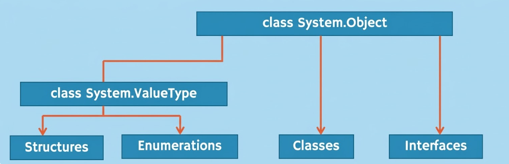

# 万物之源：System.Object类

## 核心概念：宇宙基类

在 C# 和整个 .NET 公共语言运行时 (CLR) 的设计哲学中，**一切皆对象**。为了在底层保证类型系统的统一性与安全性，C# 强制规定：**无论是值类型还是引用类型，系统中的每一个类型最终都必须直接或间接地继承自 `System.Object` 类。**

在日常开发中，当我们定义一个普通的类时，即便没有手写继承任何父类，C# 编译器在将其编译为中间语言 (IL) 时，也会**隐式地**让它继承自 `System.Object`。

```csharp
// 开发者编写的代码：
public class Person 
{ 
}

// 编译器实际生成的等效代码：
public class Person : System.Object 
{ 
}
```

## 别名机制：`object` 与 `System.Object`

在 C# 中，我们经常会看到 `object` 这个关键字。这极易与面向对象编程中的“对象（实例）”这一概念产生混淆。

事实上，C# 语言提供的全小写关键字 `object` 仅仅是 .NET 框架中大驼峰命名的 `System.Object` 类的**别名 (Alias)**。它们在编译后是完全等价的。为了避免概念上的混淆，在讨论基类时，通常使用全称 `System.Object`；在编写代码时，推荐使用简短的关键字 `object`。

## CLR 类型继承树图谱

结合《CLR via C#》对底层架构的剖析，C# 的类型系统继承树可以清晰地划分为两大分支：

### 引用类型分支
所有的类 (Class)、接口 (Interface)、委托 (Delegate) 以及字符串 (String)，都**直接或间接**继承自 `System.Object`。

*   `System.Object`
    *   `System.String`
    *   `Person` (自定义类)
        *   `Supplier` (继承自 Person)

### 值类型分支
所有的基本数字类型 (int, float, bool 等)、结构体 (Struct) 和枚举 (Enum) 都是值类型。
值类型的继承链比较特殊，它们被编译器强制派生自 `System.ValueType`，而 `System.ValueType` 本身又派生自 `System.Object`。

*   `System.Object`
    *   **`System.ValueType`** (值类型的中转基类)
        *   `System.Int32` (即 `int`)
        *   `System.Boolean` (即 `bool`)
        *   `MyStruct` (自定义结构体)

*(注：尽管结构体隐式继承自 `ValueType`，但 C# 语法禁止开发者手动使用结构体去继承任何类或结构体。)*

## 终极多态性与装箱陷阱

设计 `System.Object` 作为所有类型的终极基类，带来的最大好处是**极致的多态性**。根据面向对象的里氏替换原则 (LSP)：**父类的引用变量可以指向任何子类的实例对象**。

这意味着，一个 `object` 类型的变量可以用来存储 C# 中的**任何**数据。这为编写通用的 API（如早期的 `ArrayList`）提供了可能。

### 代码实战：万能的 object 变量
```csharp
public class Person { }

public class Program
{
    public static void Main()
    {
        // 1. 指向普通的引用类型（正常的多态行为）
        object obj1 = new Person();
        object obj2 = "Hello World";

        // 2. 指向值类型（触发底层机制）
        int number = 42;
        object obj3 = number; 
    }
}
```

### 补充底层原理解析：装箱 (Boxing)
虽然将 `int` 赋值给 `object` 在语法上是完美成立的，但结合《Effective C#》的性能优化建议，这里隐藏着巨大的性能陷阱。

`int` 是值类型（在栈上），而 `object` 是引用类型（其引用的对象必须在堆上）。当把 `int` 赋值给 `object` 时，CLR 会在后台执行一次称为**装箱 (Boxing)** 的操作：
1. 在托管堆 (Heap) 上分配新的内存空间。
2. 将栈上 `int` 的值复制到这块堆内存中。
3. 返回这块堆内存的引用地址给 `object` 变量。

频繁的装箱会产生大量的垃圾对象，给垃圾回收器 (GC) 带来巨大压力。因此，在现代 C# 中，尽量使用**泛型 (Generics)** 来替代使用 `object` 处理未知类型的参数。

## System.Object 提供的四大基础行为

正因为万物皆继承自 `System.Object`，这保证了 CLR 中的每一个实例（无论是数字、结构体还是复杂的类）都天生自带一套“公共契约”。`System.Object` 提供了以下四个极为重要的虚方法或基础方法：

1.  **`GetType()`**：返回实例的精确运行时类型信息（常用于反射）。此方法不是虚方法，无法被重写。
2.  **`ToString()`**：返回当前对象的字符串表示形式。默认返回类型的完全限定名。
3.  **`Equals(object obj)`**：用于比较两个对象是否相等。默认实现为比较内存引用地址（引用相等性）。
4.  **`GetHashCode()`**：为对象生成一个整数哈希码，常用于哈希表（如 `Dictionary<K, V>`）的数据结构中。

重写 `ToString()`、`Equals()` 和 `GetHashCode()` 是开发高质量 C# 类的必修课。