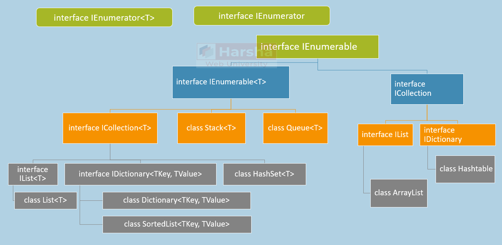

# 迭代器是什么
在 C# 中，**迭代器（Iterator）** 是一种用于遍历集合（如数组、列表等）元素的机制，它允许你按顺序访问集合中的每个元素而不必暴露集合的内部结构。迭代器的核心是通过 `IEnumerable` 和 `IEnumerator` 接口实现的，但 C# 提供了更简洁的语法（`yield` 关键字）来简化迭代器的创建。

在表现效果上看，迭代器是可以在容器对象（例如链表或数组）上遍历访问的接口。设计人员无需关心容器对象的内存分配的实现细节，可以用foreach遍历的类，都是实现了迭代器的。



# **迭代器的基本概念**
- **`IEnumerable` 接口**：表示一个集合可以被迭代，包含一个 `GetEnumerator` 方法。
- **`IEnumerator` 接口**：提供了遍历集合的能力，包含 `MoveNext()`、`Reset()` 和 `Current` 属性。

`IEnumerable<T>` 是更**抽象**的概念：它只要求 “能遍历”，不关心底层是数组、链表、哈希表还是其他数据结构。这种抽象的好处是 “解耦”，意味着它的内部实现可以随时修改（比如改成用数组存储），但调用者的遍历逻辑（`foreach`）完全不需要变。
**重要：**
- 当你调用该方法时，它只是初始化了这个状态机，返回一个句柄。
- 只有当你调用 `MoveNext()`（通常是通过 `foreach` 循环）时，方法体内部的代码才会执行到下一个 `yield return`。

**标准迭代器实现（手动版）**
**接口定义**：
```cs
public interface IEnumerable
{
    IEnumerator GetEnumerator();
}

public interface IEnumerator
{
    bool MoveNext();
    object Current { get; }
    void Reset(); // 实际开发中通常不实现
}
```
**完整实现示例**：
```cs
public class MyCollection : IEnumerable
{
    private int[] data = { 1, 2, 3 };

    public IEnumerator GetEnumerator() => new MyEnumerator(data);

    // 没yield return，必须手动写一个类来维护“状态”
    private class MyEnumerator : IEnumerator
    {
        private int[] data;
        private int index = -1;

        public MyEnumerator(int[] data) => this.data = data;

        public bool MoveNext()
        {
            index++;
            return index < data.Length;
        }

        public object Current => data[index];
        public void Reset() => index = -1;
    }
}

// 使用：
foreach (int num in new MyCollection())
{
    Console.WriteLine(num); // 输出 1 2 3
}
```


# foreach本质
**foreach本质**:
1. 先获取in后面这个对象的 `IEnumerator` 会调用对象其中的`GetEnumerator`方法
2. 执行得到这个`IEnumerator`对象中的 `MoveNext`方法
3. 只要`MoveNext()`方法的返回值时true 就会去得到`Current`然后复制给 item
```cs
foreach (var item in collection) 
{
    // code
}

// 等价于：
IEnumerator enumerator = collection.GetEnumerator();
try 
{
    while (enumerator.MoveNext()) 
    {
        var item = enumerator.Current;
        // code
    }
}
finally 
{
    IDisposable disposable = enumerator as IDisposable;
    disposable?.Dispose();
}

```

# `yield return` 语法糖
C# 的 `yield return` 关键字可以快速定义迭代器，无需手动实现 `IEnumerator`
**yield return 就是生成并返回一个实现了 `IEnumerator<T>` 和 `IEnumerable<T>` 接口的状态机类**
既然如此也可以在属性中使用yield return

## **基本作用：简化迭代器**
`yield return` 的作用是告诉编译器：“帮我自动生成一个迭代器，按我写的顺序逐个返回这些值”。例如：
```cs
IEnumerable<int> GetNumbers()
{
    yield return 10;
    yield return 20;
    yield return 30;
}
```
当调用 `GetNumbers()` 时，它不会一次性返回所有值，而是返回一个“待执行的迭代器”。只有当你用 `foreach` 遍历时，才会按顺序取出每个值。

## **关键特性：延迟执行（Lazy）**
`yield return` 的代码不会一次性全部执行，而是按需执行。看这个例子：
```cs
IEnumerable<string> GetMessages()
{
    Console.WriteLine("开始迭代");
    yield return "第一步";
    Console.WriteLine("执行到中间");
    yield return "第二步";
    Console.WriteLine("结束迭代");
}

// 测试代码：
var messages = GetMessages();  // 这里不会输出任何内容！
Console.WriteLine("准备遍历");
foreach (var msg in messages)  // 此时才开始真正执行
{
    Console.WriteLine(msg);
}
```

**关键点**：
- 调用 `GetMessages()` 时，代码不会运行，只是返回一个“迭代器对象”。
- 当 `foreach` 开始遍历时，代码才从头执行，每次遇到 `yield return` 时：
    - 返回一个值，
    - **暂停当前方法**，记录当前位置（状态）。
    - 下次循环时，从暂停的位置继续执行。

## 在属性中返回生成的迭代器类
```cs
public class fibonacciSequence
{
    // 只读属性，返回一个无限的斐波那契数列
    public IEnumerable<int> Numbers
    {
        get
        {
            int a = 0, b = 1;
            while (true)
            {
                yield return a;
                int temp = a;
                a = b;
                b = temp + b;
            }
        }
    }
}

// 使用方式：
var seq = new FibonacciSequence();
foreach (var n in seq.Numbers.Take(10)) 
{
    Console.WriteLine(n); // 只会计算前10个
}
```

## **底层原理：状态机**
编译器会将 `yield return` 代码转换为一个隐藏的“状态机”类。例如，上述 `GetMessages()` 会被编译成一个类似如下的类：
```cs
class GeneratedStateMachine : IEnumerator<string>
{
    private int _state = 0;
    public string Current { get; private set; }

    public bool MoveNext()
    {
        switch (_state)
        {
            case 0:
                Console.WriteLine("开始迭代");
                Current = "第一步";
                _state = 1;
                return true;
            case 1:
                Console.WriteLine("执行到中间");
                Current = "第二步";
                _state = 2;
                return true;
            case 2:
                Console.WriteLine("结束迭代");
                return false; // 结束
            default:
                return false;
        }
    }
    // 其他接口方法（略）
}
```

`yield return` 既可以用于返回 `IEnumerable<T>` 的函数，也可以用于返回 `IEnumerator<T>`（或非泛型 `IEnumerator`）的函数。这两种返回类型都属于 C# 迭代器模式的一部分，而 `yield return` 本质是**生成迭代器逻辑的语法糖**，对这两种类型都适用。

`IEnumerable<T>` 和 `IEnumerator<T>` 是迭代器模式的两个核心接口：
- `IEnumerable<T>`：表示 “可被遍历的集合”，它的 `GetEnumerator()` 方法返回一个 `IEnumerator<T>`（负责实际遍历）。
- `IEnumerator<T>`：表示 “枚举器”，负责跟踪遍历状态（`Current` 属性、`MoveNext()` 方法等）。

`yield return` 的作用是**自动生成这两个接口的实现代码**，无论函数返回的是 “可枚举集合”（`IEnumerable<T>`这个**常用**）还是 “枚举器”（`IEnumerator<T>`），编译器都会帮我们处理底层的状态管理和迭代逻辑。
## yield break
**`yield break` 的基本作用**
- **功能**：在迭代器方法中，`yield break` 会立即终止迭代，不再生成后续的值。
```cs
IEnumerable<int> GetNumbers()
{
    yield return 1;
    yield return 2;
    yield break; // 这里终止，后续的 yield return 不会执行
    yield return 3; // 永远不会执行
}

// 使用
foreach (var num in GetNumbers())
{
    Console.WriteLine(num);
}
// 输出：1, 2
```

## **实际应用案例**
**流水线式的数据处理（累加器示例）**
迭代器非常适合用于构建数据处理流水线。例如，给定一组商品价格，我们需要逐个计算并获取当前的“累加总金额”（Running Total）。

```cs
using System;
using System.Collections.Generic;

namespace RunningTotalDemo
{
    class Program
    {
        static void Main()
        {
            List<double> prices = new List<double> { 90.0, 34.0, 12.0, 80.0 };

            // 获取累加流
            IEnumerable<double> runningTotals = GetRunningTotals(prices);

            // 按需消费累加结果
            int step = 1;
            foreach (double total in runningTotals)
            {
                Console.WriteLine($"截至第 {step} 个商品，累计金额为: {total}");
                step++;
            }
        }

        // 使用 yield return 构建累加迭代器
        static IEnumerable<double> GetRunningTotals(IEnumerable<double> prices)
        {
            double sum = 0;
            foreach (double price in prices)
            {
                sum += price;
                // 返回当前的累加结果，并暂停。下次请求时，sum 的值会被保留。
                yield return sum; 
            }
        }
    }
}
```


**分页加载数据**
```cs
IEnumerable<int> LoadBigData()
{
    int pageSize = 1000;
    for (int page = 0; ; page++)
    {
        var data = QueryDatabase(page, pageSize);
        if (data.Count == 0) yield break;
        
        foreach (var item in data)
        {
            yield return item;
        }
    }
}
```


**游戏技能连招系统**：
```cs
IEnumerator ComboAttack()
{
    yield return PlayAnimation("Attack1");
    if (Input.GetButton("Attack"))
    {
        yield return PlayAnimation("Attack2");
        if (Input.GetButton("Attack"))
        {
            yield return PlayAnimation("FinalBlow");
        }
    }
}
```

**树形结构遍历**：
```cs
public IEnumerable<Node> Traverse(Node root)
{
    yield return root;
    foreach (var child in root.Children)
    {
        foreach (var node in Traverse(child))
        {
            yield return node;
        }
    }
}
```


# 迭代器的设计规范与语法限制
在使用 yield 编写迭代器时，编译器强制规定了以下严格的限制条件（结合《Effective C#》解析其底层原因）：

1. **不能包含 ref 或 out 参数：**
    - **底层原因：** ref 和 out 参数本质上是指向线程栈（Thread Stack）上特定内存地址的指针。由于迭代器方法在遇到 yield return 时会暂停并退出当前的方法调用栈，随后再恢复，原来的线程栈帧可能早已被销毁或被其他方法覆盖。因此，如果允许 ref/out，将导致严重的内存安全问题（野指针）。
2. **不能用于构造函数 (Constructor) 或析构函数 (Destructor/Finalizer)：**
    - **底层原因：** 构造函数的作用是完整地初始化一个对象并交还控制权。如果构造函数被“暂停”，对象将处于一种“半初始化”的未决状态，这违反了面向对象的基本生命周期规则。
3. **可以作为方法的返回值，也可以作为属性的 get 访问器：**  
    只要返回类型被声明为 `IEnumerable、IEnumerable<T>`、`IEnumerator` 或 `IEnumerator<T>`，即可在其内部使用 `yield return`。
4. **`yield break` 语句：**  
    如果在迭代过程中遇到某种条件需要彻底终止迭代（不再生成后续数据），可以使用 `yield break`; 语句。它等效于常规方法中的 `return`;，会立即结束迭代并使得后续对 `MoveNext()` 的调用返回 `false`。
