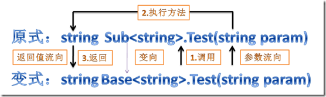
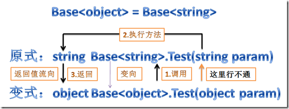
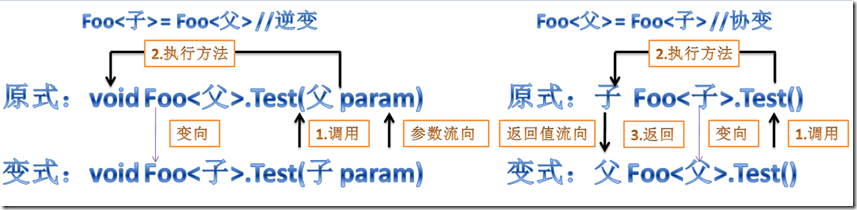
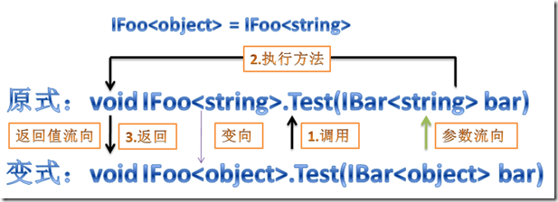

# 泛型：协变与逆变（in / out）

## 引言：一场由于“理所当然”引发的血案

在开始之前，我们先来看一个几乎所有 C# 新手都会遇到的“反直觉”报错。

在面向对象编程中，有一个绝对真理（里氏替换原则）：**子类可以替换父类**。
因为 `string` 是 `object` 的子类，所以下面这行代码毫无问题：
```csharp
object obj = "Hello World"; // 完美运行
```

顺着这个“理所当然”的逻辑，既然 `string` 是 `object`，那么“一堆 string”自然也就是“一堆 object”。于是你写出了下面的代码：
```csharp
List<string> strings = new List<string> { "A", "B" };
List<object> objects = strings; // 💥 编译报错：无法将类型隐式转换！
```
**灵魂拷问：为什么 `List<string>` 不能赋值给 `List<object>`？！这难道不是反人类吗？**

这并不是 C# 编译器蠢，恰恰相反，这是编译器在**救你的命**。
设想一下，如果编译器允许上述代码通过，接下来会发生什么？
```csharp
// 假设上一行编译通过了：
List<object> objects = strings; 

// 因为 objects 声明为 List<object>，我往里面塞一个 int 是合法操作吧？
objects.Add(42); 

// 此时，可怕的事情发生了：
// objects 和 strings 在内存中指向的是同一个集合！
// 你的 List<string> 里面混进了一个 int！
string first = strings[2]; // 💥 运行时崩溃！尝试把数字 42 当作字符串读取。
```

为了防止这种灾难性的**类型不安全**发生，C# 2.0 引入泛型时定下了一条死规矩：**泛型默认是“不变的”（Invariant）**。
也就是说，哪怕 `T` 和 `U` 是父子关系，`List<T>` 和 `List<U>` 之间也**没有任何亲戚关系**。

这解决了安全问题，但却带来了巨大的**痛点**。

---

## 第一章：黑暗时代（C# 2.0 - C# 3.0）—— 那些年我们受过的苦

### 痛点 1：只读集合的无妄之灾
上面说 `List<T>` 因为有 `Add` 方法，所以不安全。那如果我根本不修改集合呢？
比如我有一个方法，只是把集合里的东西打印出来：

```csharp
void PrintAll(IEnumerable<object> items)
{
    foreach (var item in items) Console.WriteLine(item);
}

// 调用处：
IEnumerable<string> myStrings = new List<string> { "Hello" };
PrintAll(myStrings); // 💥 在 C# 3.0 依然报错！
```
在这个场景里，`IEnumerable<T>` 是个只读接口，根本没有 `Add` 方法，绝对不可能发生“往字符串集合里塞数字”的惨剧。**把它当作 `IEnumerable<object>` 是绝对安全的！**
但在 C# 3.0 及以前，编译器依然冷酷地拒绝了你。

### 痛点 2：委托的死板限制
假设我们要写一个事件处理器，处理所有控件的点击事件：
```csharp
// 这是一个接收 object 参数的委托
Action<object> myAction = (obj) => Console.WriteLine(obj.ToString());

// 按钮点击事件需要一个 Action<string> (假设参数是字符串形式的事件名)
Action<string> buttonClick = myAction; // 💥 C# 3.0 报错！
```
逻辑上完全讲得通：`myAction` 是一个“能处理任何 `object`”的方法。我现在把它赋值给一个“只需处理 `string`”的委托变量，它当然能胜任啊！（杀鸡用牛刀，当然切得动）。但编译器依然拒绝。

### 以前是怎么解决的？
在 C# 4.0 之前，为了让代码编译通过，开发者被迫写出极度丑陋且损失性能的“胶水代码”：

**方案 A：强制转换创建新集合（极度浪费内存）**
```csharp
List<string> strings = new List<string>();
// 重新 new 一个 List<object>，把数据挨个装箱拷过去
List<object> objs = new List<object>(strings.ToArray()); 
```

**方案 B：使用 LINQ 的 `.Cast<T>()`（性能损耗）**
```csharp
IEnumerable<string> strings = new List<string>();
// 每次遍历都会在底层执行 (object)item 强转
PrintAll(strings.Cast<object>()); 
```

开发者怒了：**既然有些接口只有只读操作，有些委托只有只写操作，C# 语言层面能不能聪明一点，把这些安全的转换放行？！**

于是，英雄登场。

---

## 第二章：破晓之光 —— C# 4.0 与 `<in T>` / `<out T>` 的诞生

在 2010 年发布的 **C# 4.0 (.NET Framework 4.0)** 中，微软的语言设计团队终于解决了这个世纪难题。

他们引入了**泛型修饰符 `in` 和 `out`**。这就是所谓的**协变（Covariance）**  和 **逆变（Contravariance）**。

### 核心设计哲学
微软没有一刀切地允许所有泛型转换，而是从源头上思考：什么情况下转换是**绝对类型安全**的？

答案极其优美：
1. **如果你是一个“生产者”（Producer）**：你只往外吐出 `T` 类型的对象，从来不接收 `T`。那么把你当作“吐出父类对象”的机器是安全的。这叫**协变（Covariance）**，用 **`out`** 表示。
2. **如果你是一个“消费者”（Consumer）**：你只接收 `T` 类型的对象作为输入，从来不往外吐出 `T`。那么把你当作“处理子类对象”的机器是安全的。这叫**逆变（Contravariance）**，用 **`in`** 表示。

让我们深入拆解这两个概念，彻底重塑你的大脑。

---

## 第三章：协变 —— 顺流而下 `<out T>`

**Foo<父类> = Foo<子类>**
**定义**：如果 `泛型类型` 能够随其 `类型参数` 保持**相同方向**的继承关系，就叫协变。
（`string` 是 `object` 的子类 ➔ `IEnumerable<string>` 也是 `IEnumerable<object>` 的子类）。

### `out` 关键字的作用
当你在接口的泛型参数前加上 `out` 时，你是在向编译器**发誓**：“在这个接口里面，`T` 永远只会出现在**返回值（输出）**的位置，绝对不会出现在参数（输入）的位置！”

### 经典源码剖析：`IEnumerable<out T>`
我们来看看 .NET 源码中 `IEnumerable<T>` 是怎么声明的：
```csharp
// 注意这里的 out！
public interface IEnumerable<out T> : IEnumerable
{
    IEnumerator<T> GetEnumerator();
}

public interface IEnumerator<out T> : IDisposable, IEnumerator
{
    // T 永远只作为返回值出现 (Current 属性的 get)
    T Current { get; } 
}
```

### 为什么它是安全的？
因为有 `out` 约束，编译器检查了 `IEnumerable<T>` 里的所有方法，发现没有任何一个方法是 `void Add(T item)` 这种接收 `T` 作为参数的。

因此，当你写出下面的代码时：
```csharp
IEnumerable<string> strings = new List<string> { "Hello" };

// 魔法时刻：C# 4.0 完美编译！发生隐式转换！
IEnumerable<object> objects = strings; 
```
编译器在底层是这么想的：
*   你通过 `objects.Current` 获取元素时，底层其实给的是 `string`。
*   你期望拿到一个 `object`，我给你一个 `string`。
*   `string` 转换为 `object` 是天经地义的（子类转父类）。
*   **绝对安全，放行！**

### 现实世界比喻：水果篮
*   `IEnumerable<out T>` 就像是一个“自动售货机（吐出物品）”。
*   你有一台“吐出苹果的机器”（`IEnumerable<Apple>`）。
*   我现在需要一台“吐出水果的机器”（`IEnumerable<Fruit>`）。
*   我把你的苹果机器拿来用，它吐出来的苹果，我完全可以当成水果吃掉。这是协变。


### 典型场景：**生产者（输出数据），如返回值、只读集合。**

```cs
//泛型委托：
public delegate T MyFuncA<T>();//不支持逆变与协变
public delegate T MyFuncB<out T>();//支持协变
 
MyFuncA<object> funcAObject = null;
MyFuncA<string> funcAString = null;
MyFuncB<object> funcBObject = null;
MyFuncB<string> funcBString = null;
MyFuncB<int> funcBInt = null;
 
funcAObject = funcAString;//编译失败，MyFuncA不支持逆变与协变
funcBObject = funcBString;//变了，协变
funcBObject = funcBInt;//编译失败，值类型不参与协变或逆变
 
//泛型接口
public interface IFlyA<T> { }//不支持逆变与协变
public interface IFlyB<out T> { }//支持协变
 
IFlyA<object> flyAObject = null;
IFlyA<string> flyAString = null;
IFlyB<object> flyBObject = null;
IFlyB<string> flyBString = null;
IFlyB<int> flyBInt = null;
 
flyAObject = flyAString;//编译失败，IFlyA不支持逆变与协变
flyBObject = flyBString;//变了，协变
flyBObject = flyBInt;//编译失败，值类型不参与协变或逆变
 
//数组：
string[] strings = new string[] { "string" };
object[] objects = strings;
```


---

## 第四章：逆变 —— 逆流而上 `<in T>`

**这是最烧脑的部分，请集中注意力。**
**Foo<子类> = Foo<父类>**
**定义**：如果 `泛型类型` 与其 `类型参数` 的继承关系**完全相反**，就叫逆变。
（`string` 是 `object` 的子类 ➔ `IComparer<object>` 反而变成了 `IComparer<string>` 的子类！）。

### `in` 关键字的作用
当你在泛型参数前加上 `in` 时，你向编译器**发誓**：“在这个接口/委托里面，`T` 永远只会作为**参数（输入）** 出现，绝对不会作为返回值输出！”

### 经典源码剖析：`Action<in T>` 与 `IComparer<in T>`
看看 .NET 的源码：
```csharp
// 委托：T 只能作为参数传入
public delegate void Action<in T>(T obj);

// 比较器接口：T 只能被传进去比较，不会被返回出来
public interface IComparer<in T>
{
    int Compare(T x, T y);
}
```

### 为什么反过来了？为什么它是安全的？
我们来看这段让人大脑宕机的代码：

```csharp
// 这是一个“能比较任何两个 object”的比较器
IComparer<object> objectComparer = new MyObjectComparer();

// 魔法时刻：把处理父类的机器，赋值给处理子类的变量！
IComparer<string> stringComparer = objectComparer; 
```
为什么 `IComparer<object>` 可以赋值给 `IComparer<string>`？！

**编译器视角：**
*   你现在拿到了 `stringComparer` 变量。
*   根据类型定义，你接下来肯定会调用 `stringComparer.Compare(string A, string B)`。
*   但其实底层工作的是 `objectComparer`，它的真实方法是 `Compare(object A, object B)`。
*   也就是说，你把两个 `string` 对象，传给了一个期望接收两个 `object` 对象的机器。
*   `string` 传给 `object` 参数，符合里氏替换原则（子类转父类）。
*   **绝对安全，放行！**

### 现实世界比喻：垃圾桶
*   `Action<in T>` 就像是一个“垃圾桶（接收物品）”。
*   这里有一个“万能垃圾桶”（`Action<object>`），什么垃圾都能扔进去。
*   你现在急需一个“专门扔废纸的垃圾桶”（`Action<Paper>`）。
*   我指着那个万能垃圾桶对你说：“诺，就把那个当成废纸垃圾桶用吧！”
*   你往万能垃圾桶里扔废纸，完全合法且安全。这就是逆变。


### 典型场景：**消费者（输入数据），如函数参数、写入操作。**

```cs
public delegate void MyActionA<T>(T param);//不支持逆变与协变
public delegate void MyActionB<in T>(T param);//支持逆变
 
public interface IPlayA<T> { }//不支持逆变与协变
public interface IPlayB<in T> { }//支持逆变
 
MyActionA<object> actionAObject = null;
MyActionA<string> actionAString = null;
MyActionB<object> actionBObject = null;
MyActionB<string> actionBString = null;
actionAString = actionAObject;//MyActionA不支持逆变与协变,编译失败
actionBString = actionBObject;//变了，逆变
 
IPlayA<object> playAObject = null;
IPlayA<string> playAString = null;
IPlayB<object> playBObject = null;
IPlayB<string> playBString = null;
playAString = playAObject;//IPlayA不支持逆变与协变,编译失败
playBString = playBObject;//变了，逆变
```


---

## 第五章：协变与逆变的完美交响 —— `Func<in T, out TResult>`

如果你理解了上面的内容，那么恭喜你，你可以看懂整个 C# 中设计得最完美的一个委托：`Func` 委托。

在 .NET 源码中，带一个参数、有返回值的 `Func` 是这样定义的：
```csharp
public delegate TResult Func<in T, out TResult>(T arg);
```
一句话总结：**输入（参数）支持逆变，输出（返回值）支持协变。**

### 实战演示：将 in 和 out 压榨到极致

假设我们有三个类：
`Animal` (动物) -> 父类
`Dog` (狗) -> 子类
`Poodle` (贵宾犬) -> 孙子类

我们有一个极其宽泛的委托：
```csharp
// 这个方法：接收普通的狗，返回普通的狗
Func<Dog, Dog> processDog = (dog) => { return new Dog(); };
```

现在，见证奇迹的时刻，下面这行代码可以完美编译运行：
```csharp
// 我们把 processDog 赋值给了一个新委托。
// 这个新委托声明为：接收“孙子类贵宾犬”，返回“父类动物”
Func<Poodle, Animal> newProcess = processDog; 
```

**剥开外壳看本质（为什么安全？）：**
1. **参数（in T，逆变生效）**：`newProcess` 承诺调用者必须传一个 `Poodle`（贵宾犬）进来。底层实际执行的是 `processDog`，它需要一只 `Dog`。把贵宾犬当成普通的狗处理，安全！
2. **返回值（out TResult，协变生效）**：`newProcess` 承诺给调用者返回一只 `Animal`。底层执行完后，实际吐出的是一只 `Dog`。调用者拿到 `Dog` 后把它当作 `Animal` 看待，安全！

这就是类型安全的最高境界：**要求更宽（输入更具体），承诺更少（输出更抽象）**。

---

## 第六章：避坑指南与致命限制

虽然 `in` 和 `out` 极其强大，但微软为了保证底层的内存和类型绝对安全，给它们加了三道死命令。你必须牢记在心。

### 限制 1：仅限于泛型接口和泛型委托
你**不能**在类（Class）或结构体（Struct）上使用 `in` 或 `out`！
```csharp
// 💥 编译报错！修饰符不能用于类
public class MyClass<out T> { } 
```
**原因**：类里面通常会有字段（Field）和属性（Property），它们既能被读取（out），也能被修改（in）。只要一个类型同时包含了读和写，它就注定必须是**不变的（Invariant）**。只有接口和委托可以做到纯粹的“只进不出”或“只出不进”。

### 限制 2：仅支持引用类型，不支持值类型
这是无数老手都会栽跟头的地方：
```csharp
IEnumerable<int> ints = new List<int> { 1, 2, 3 };
// 💥 编译报错！无法隐式转换！
IEnumerable<object> objects = ints; 
```
等一下！`int` 不是继承自 `object` 吗？`IEnumerable` 不是加了 `out` 协变吗？凭什么报错？！

**底层原因揭秘**：
协变和逆变的底层实现，依赖于**引用（指针）的直接转换（Reference Conversion）**。
对于引用类型（如 `string` 和 `object`），它们在内存里存的都是一个指向托管堆的指针。不管是 `IEnumerable<string>` 还是 `IEnumerable<object>`，底层操作内存时，指针的长度（通常是 8 字节）和机制是一模一样的。编译器只需要“换个眼光看这个指针”就行了，性能极高。

但是，`int` 是**值类型（Value Type）**。一个 `int` 在内存里直接占 4 个字节，而 `object` 在堆上有自己的方法表指针等复杂结构。
如果允许 `IEnumerable<int>` 转为 `IEnumerable<object>`，就意味着你每次调用 `.Current` 读取数据时，底层都必须把 `int` **装箱（Boxing）** 成 `object`。
这会带来巨大的内存分配和性能消耗。**C# 团队认为：协变和逆变必须是“零运行时开销”的引用转换，不能隐含高昂的装箱操作**。所以，值类型被无情地排除在外。

### 限制 3：历史包袱 —— 破损的数组协变
C# 1.0 的时候，为了方便开发者，微软破例允许了数组的协变：
```csharp
string[] strings = new string[] { "A", "B" };
object[] objects = strings; // 在 C# 1.0 就允许了！
```
但这是一个**巨大的架构设计错误**。因为数组是允许修改的（不像 `IEnumerable` 是只读的）。
这就导致你可以写出如下代码：
```csharp
objects[0] = 42; // 💥 编译完美通过，但运行时立刻抛出 ArrayTypeMismatchException！
```
后来微软在 C# 2.0 引入泛型时意识到了这个错误，所以在设计 `List<T>` 时吸取了教训，严格保持“不变性”。直到 C# 4.0 引入了极其严谨的 `<in>` 和 `<out>`，才算以科学的方式找补回来。但这成了 C# 数组永远的痛。

---

## 第七章：我什么时候需要自己手写 `<in>` 和 `<out>`？

作为日常业务开发者（CRUD Boy/Girl），你**极少极少**需要自己去定义带有 `in` 或 `out` 的接口。
因为微软已经帮你把常用的一切都定义好了：
*   所有只读集合：`IEnumerable<out T>`, `IReadOnlyList<out T>`
*   所有消费者委托：`Action<in T>`, `Predicate<in T>`
*   所有生成者委托：`Func<out TResult>`
*   比较器：`IComparable<in T>`, `IComparer<in T>`

**你只需要“享受”它们带来的便利（隐式转换）即可。**

但如果你是**架构师**或者**底层框架开发者**，当你写出类似于以下代码时，你应该本能地思考是否要加修饰符：
1. 设计了只读的数据包装器：`public interface IWrapper<out T> { T GetData(); }`
2. 设计了只写的消息处理器：`public interface IMessageHandler<in T> { void Handle(T message); }`

**心法口诀：**
*   当你只 `return T`，加上 `out`。
*   当你只接受 `(T arg)`，加上 `in`。
*   如果有进有出，什么都不加，老老实实当 `Invariant`。

---

## 终章：编程思想的升华

回过头来看 C# 的协变和逆变，它不仅仅是一个语法糖，更是**计算机科学中类型理论（Type Theory）在工程学上的完美落地**。

从 C# 2.0 的“一刀切绝对安全但痛苦”，到 C# 4.0 的“精确划分输入输出，既安全又灵活”。微软告诉了我们一个架构设计的终极道理：
**安全与灵活并不总是矛盾的。当你能够精确界定边界（是只读还是只写？是输出还是输入？）时，你就能在保证绝对安全的前提下，赋予系统最大的自由度。**

下次当你敲下 `IEnumerable<string>` 并轻松将其传递给接收 `IEnumerable<object>` 的方法时，请在心里默默对 C# 4.0 的编译器说一声：
**“谢谢你，帮我挡住了底层的惊涛骇浪。”**


---

# 另一版本详解

逆变（contravariant）与协变（covariant）是C#4新增的概念，许多书籍和博客都有讲解，我觉得都没有把它们讲清楚，搞明白了它们，可以更准确地去定义泛型委托和接口，这里我尝试画图详细解析[逆变与协变](http://msdn.microsoft.com/zh-cn/library/ee207183%28v=vs.100%29.aspx)。

## 变的概念
我们都知道.Net里或者说在OO的世界里，可以安全地把子类的引用赋给父类引用，例如：
```cs
//父类 = 子类
string str = "string";
object obj = str;//变了
```

而C#里又有泛型的概念，泛型是对类型系统的进一步抽象，比上面简单的类型高级，把上面的变化体现在泛型的参数上就是我们所说的逆变与协变的概念。通过在泛型参数上使用in或out关键字，可以得到逆变或协变的能力。下面是一些对比的例子：

## 协变（Foo<父类> = Foo<子类> ）：
```cs
//泛型委托：
public delegate T MyFuncA<T>();//不支持逆变与协变
public delegate T MyFuncB<out T>();//支持协变
 
MyFuncA<object> funcAObject = null;
MyFuncA<string> funcAString = null;
MyFuncB<object> funcBObject = null;
MyFuncB<string> funcBString = null;
MyFuncB<int> funcBInt = null;
 
funcAObject = funcAString;//编译失败，MyFuncA不支持逆变与协变
funcBObject = funcBString;//变了，协变
funcBObject = funcBInt;//编译失败，值类型不参与协变或逆变
 
//泛型接口
public interface IFlyA<T> { }//不支持逆变与协变
public interface IFlyB<out T> { }//支持协变
 
IFlyA<object> flyAObject = null;
IFlyA<string> flyAString = null;
IFlyB<object> flyBObject = null;
IFlyB<string> flyBString = null;
IFlyB<int> flyBInt = null;
 
flyAObject = flyAString;//编译失败，IFlyA不支持逆变与协变
flyBObject = flyBString;//变了，协变
flyBObject = flyBInt;//编译失败，值类型不参与协变或逆变
 
//数组：
string[] strings = new string[] { "string" };
object[] objects = strings;
```


## 逆变（Foo<子类> = Foo<父类>）
```cs
public delegate void MyActionA<T>(T param);//不支持逆变与协变
public delegate void MyActionB<in T>(T param);//支持逆变
 
public interface IPlayA<T> { }//不支持逆变与协变
public interface IPlayB<in T> { }//支持逆变
 
MyActionA<object> actionAObject = null;
MyActionA<string> actionAString = null;
MyActionB<object> actionBObject = null;
MyActionB<string> actionBString = null;
actionAString = actionAObject;//MyActionA不支持逆变与协变,编译失败
actionBString = actionBObject;//变了，逆变
 
IPlayA<object> playAObject = null;
IPlayA<string> playAString = null;
IPlayB<object> playBObject = null;
IPlayB<string> playBString = null;
playAString = playAObject;//IPlayA不支持逆变与协变,编译失败
playBString = playBObject;//变了，逆变
```


来到这里我们看到有的能变，有的不能变，要知道以下几点：

- 以前的泛型系统（或者说没有in/out关键字时），是不能“变”的，无论是“逆”还是“顺（协）”。
- 当前仅支持接口和委托的逆变与协变 ，不支持类和方法。但数组也有协变性。
- 值类型不参与逆变与协变。

那么in/out是什么意思呢？为什么加了它们就有了“变”的能力，是不是我们定义泛型委托或者接口都应该添加它们呢？

原来，在泛型参数上添加了in关键字作为泛型修饰符的话，那么那个泛型参数就只能用作方法的输入参数，或者只写属性的参数，不能作为方法返回值等，总之就是只能是“入”，不能出。out关键字反之。

当尝试编译下面这个把in泛型参数用作方法返回值的泛型接口时：
```cs
public interface IPlayB<in T>
{
    T Test();
}
```

```txt
错误    1    方差无效: 类型参数“T”必须为“CovarianceAndContravariance.IPlayB<T>.Test()”上有效的 协变式。“T”为 逆变。
```
到这里，我们大致知道了逆变与协变的相关概念，那么为什么把泛型参数限制为in或者out就可以“变”呢？下面尝试画图解释原理。

## 协变不是理所当然的，逆变也没有“逆”

我们先来看看不支持逆变与协变的泛型，把子类赋给父类，再执行父类方法的具体流程，对于这样一个简单的例子的Test方法：
```cs
public interface Base<T>
{
    T Test(T param);
}
public class Sub<T> : Base<T>
{
    public T Test(T param) { return default(T); }
}
Base<string> b = new Sub<string>();
b.Test("");
```

它实际的流程是这样的：
变式：引用变量
原式：实际调用



即调用父类的方法，其实实际是调用子类的方法。可以看到，这个方法能够安全的调用，需要两个条件：
1. 变式（父）的方法参数能安全转为原式（子）的参数；
2. 原式（子）的返回值能安全的转为变式的返回值。

不幸的是参数的流向跟返回值的流向是相反的，所以对于既是in，又是out的泛型参数来说，肯定是行不通的，其中一个方向必然不能安全转换的。例如，对上面的例子，我们尝试“变”：
```cs
Base<object> BaseObject = null;
Base<string> BaseString = null;
BaseObject = BaseString;//编译失败
BaseObject.Test("");
```

这里的“实际流程”如下，可以看到，参数那里是object是不能安全转换为string，所以编译失败：



看到这里如果都明白的话，我们不难得到逆变与协变的”实际流程图”（记住，它们是有in/out限制的）:




可以看到，从”实际流程图”来看，逆变根本没有“逆”，都离不开只能安全地把子类的引用赋给父类引用这个根本。

来到这里应该基本理解逆变与协变了，不过装配脑袋的[这篇文章](http://www.cnblogs.com/Ninputer/archive/2008/11/22/generic_covariant.html)有个更高级的问题，原文也有解答，这里我用上面画图的方式去理解它。

## 图解逆变与协变的相互作用

问题的提出，你知道哪个正确吗？

```cs
public interface IBar<in T> { }
//应该是in？
public interface IFoo<in T>
{
    void Test(IBar<T> bar);
}
//还是out？
public interface IFoo<out T>
{
    void Test(IBar<T> bar);
}
```

答案是，如果是in的话，会编译失败，out才正确（当然不要泛型修饰符也能通过编译，但IFoo就没有协变能力了）。这里的意思就是说，一个有协变（逆变）能力的泛型（IBar），作为另一个泛型（IFoo）的参数时，影响到了它（IFoo）的泛型的定义。乍一看以为是in的其中一个陷阱是T是在Test方法的参数里的，所以以为是in。但这里Test的参数根本不是T，而是`IBar<T>`。

我们画个图来理解它。既然out可以通过，那么它的“协变流程图”应该如下：



图跟前面那些大致一样，但理解它要跟问题相反（上面问题是先定义好IBar，再去定义IFoo）。1. 我们定义好一个有协变能力的IFoo,这是前提。2.可以推出，上面的流程是成立的。3.这个流程重点是参数流向，要使整个流程成立，就必须使`IBar<string> = IBar<object>`成立，这不就是逆变吗？整个结论就是，**有协变能力的IFoo要求它的泛型参数（IBar）有逆变能力**。其实根据上面的箭头也可以理解，因为原式和变式的变向跟参数的变向是相反的，导致了它们要有相反的能力，这就是装配脑袋文章说的：**方法参数的协变-反变互换原则。** 根据这个原理，也很容易得出，如果Test方法的返回值是`IBar<T>`，而不是参数，那么就要求`IBar<T>`要有协变能力，因为返回值的箭头与原式和变式的变向的箭头是同向的。