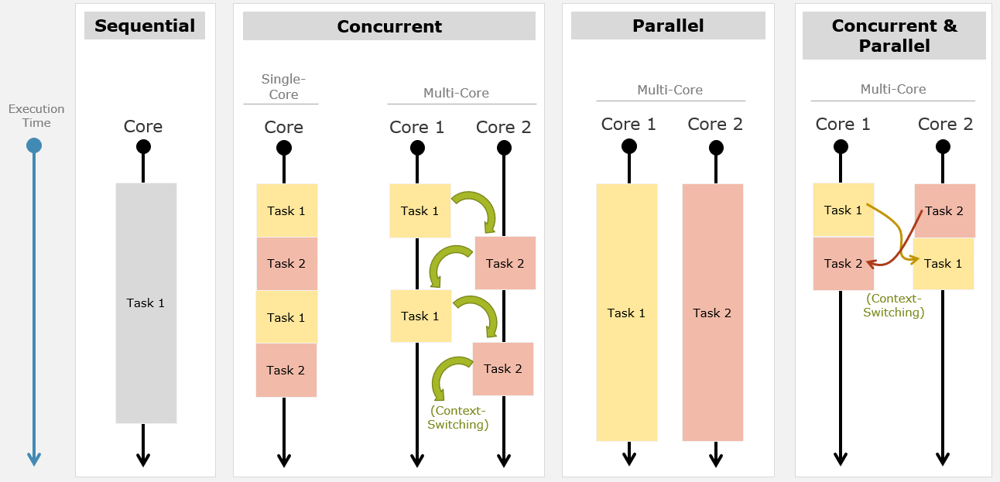

# 并发执行简介

## 为何需要并发？

在现代软件开发中，程序的执行模式直接决定了系统的性能表现和资源利用率。本章节的核心在于理解为何传统的顺序执行模式已无法满足现代硬件架构的需求，以及并发与并行执行如何解决这些问题。

### 传统顺序执行的局限性
假设我们有一个大型程序，例如银行应用程序。当客户想要关闭银行账户时，系统需要完成一系列复杂的操作。我们可以将这些操作抽象为三个主要任务：

1.  **检查账户状态**：确认账户是活跃还是非活跃状态。
2.  **计算最终余额**：核算所有银行账单以得出当前账户的最终余额。
3.  **处理卡片信息**：分别计算借记卡（Debit Card）和信用卡（Credit Card）的账单详情。

在**顺序执行** 模式下，处理器必须严格按照线性顺序完成任务。即：
*   先完成任务一（检查状态）。
*   完成后，才开始任务二（计算余额）。
*   最后，才进行处理任务三（卡片账单）。

**顺序执行带来的主要问题：**
*   **执行时间过长**：由于任务必须排队等待，整体耗时是各个任务耗时的总和。
*   **硬件资源浪费**：现代处理器通常具备多核架构（Multi-core），至少拥有双核，常见的是四核、六核或八核。在顺序执行模式下，当一个核心在处理任务时，其他核心可能处于空闲状态。这意味着我们没有充分利用硬件的全部潜力。
*   **用户体验下降**：对于大型程序，长时间的等待会导致界面卡顿或响应迟缓。

### 硬件架构的演变
理解执行模式的前提是理解硬件基础：
*   **单核处理器（Single Core）**：早期计算机常见，同一时间只能执行一条指令流。
*   **多核处理器（Multi-Core）**：现代标准配置。拥有多个独立的处理单元（Cores），理论上可以同时处理多个任务。

如果不采用并发或并行技术，即便拥有多核 CPU，程序也可能只是在单个核心上运行，导致其他核心闲置，这是一种严重的资源浪费。

---

## 执行模式深度解析

本部分将详细拆解三种主要的执行模式：并发执行、并行执行以及两者的结合模式。理解它们之间的细微差别是掌握多线程编程的关键。

### 并发执行

并发执行是一种让多个任务看似同时进行的执行模型，但其底层机制取决于硬件核心数。

#### 单核环境下的并发
在单核处理器上，并发是通过**时间片轮转** 实现的。
*   **机制**：处理器核心在任务之间快速切换。例如，核心先执行任务一的几条语句，然后暂停，切换到任务二执行几条语句，再切回任务一。
*   **切换频率**：这种切换发生在毫秒甚至微秒级别，取决于 CPU 时钟周期。
*   **用户感知**：由于切换速度极快，用户感觉任务是在同时进行的，但实际上它们是交替执行的。
*   **局限性**：虽然实现了多任务处理，但同一时刻物理上只有一个任务在运行。

#### 多核环境下的并发
在多核处理器上，并发执行的表现更为复杂。
*   **机制**：任务被分配给不同的核心，但核心并不一定固定负责某个任务。
*   **资源闲置问题**：有这样一种低效的并发场景。假设核心 1 正在执行任务 1，而核心 2 可能在某个时间点处于空闲（Idle）状态，或者核心之间的负载不均衡。
*   **不确定性**：并不保证某个核心专门负责某个任务。任务 1 可能在核心 1 上运行一段时间后，被调度到核心 2 上继续运行。

#### 上下文切换
并发执行的核心代价是上下文切换。
*   **定义**：当处理器从一个任务切换到另一个任务时，必须保存当前任务的状态（包括内存块、寄存器信息等），并加载下一个任务的状态。
*   **内存管理**：每个任务都有独立的内存块。执行任务 1 时访问内存块 A，切换到任务 2 时需访问内存块 B。这种内存上下文的切换需要消耗 CPU 周期。
*   **性能开销**：频繁的上下文切换会消耗系统资源，如果切换过于频繁，可能导致系统性能下降，这就是并发执行的一个潜在缺点。

### 并行执行

并行执行是并发执行的一种特殊且更高效的形式，但它对硬件有严格要求。
*   **硬件要求**：必须是在**多核环境** 下。单核处理器无法实现真正的并行。
*   **机制**：多个任务在**完全相同的时刻** 由不同的核心处理。
    *   核心 1 专门负责任务 1。
    *   核心 2 专门负责任务 2。
    *   两者在同一时钟周期内都在进行计算。
*   **优势**：
    *   没有任务间的上下文切换开销（针对这两个特定任务而言）。
    *   核心被完全 Dedicated（专用）于特定任务，直到任务完成。
    *   执行速度理论上最快。
*   **局限性**：
    *   **核心独占**：如果一个核心被某个任务完全占用，它可能无法及时响应操作系统上的其他程序。例如，核心 1 全力运行任务 1 时，操作系统可能需要该核心处理其他系统进程，此时核心不可用。
    *   **任务数量限制**：并行度受限于物理核心数量。如果有 2 个核心，最多只能真正并行 2 个任务。如果有 3 个任务，第 3 个任务必须等待或采用并发策略。

### 并发与并行的结合模型

现代高性能应用通常追求的是并发与并行的结合，以解决单一模式的缺陷。

*   **工作原理**：
    *   利用多核优势实现并行：核心 1 和核心 2 同时工作。
    *   利用并发机制实现灵活调度：在每个核心内部，或者当任务数多于核心数时，进行上下文切换。
*   **动态调度**：
    *   在第一个 CPU 周期，核心 1 可能执行任务 1，核心 2 执行任务 2。
    *   在下一个周期，核心 1 可能切换到任务 3，而核心 2 继续执行任务 2。
    *   再下一个周期，核心 1 可能回到任务 1。
*   **优势**：
    *   **资源利用率最大化**：确保所有核心都在忙碌，减少空闲时间。
    *   **响应性**：通过上下文切换，确保没有其他程序被完全阻塞。
    *   **性能最优**：结合了并行的速度和并发的灵活性。
*   **不确定性**：任务具体由哪个核心在何时执行，不由程序员硬编码控制，而是取决于操作系统的调度器、任务的权重、CPU 密集型程度以及逻辑操作的复杂性。

---

## C# 中的实现策略：多线程

在理论之上，如何在实际的编程语言中实现上述模型？在 C# 中，实现并发和并行执行的主要手段是**多线程**。

### 线程与任务的概念映射
在 C# 应用程序的上下文中，我们需要重新定义“任务”的概念：
*   **线程（Thread）**：代表一段待执行的代码路径。从 CPU 核心的角度来看，线程就是需要被处理的工作单元。
*   **多任务即多线程**：“多个任务”在 C# 代码层面等同于“创建多个线程”。
*   **默认行为**：默认情况下，C# 代码是顺序执行的（单线程）。要实现并发/并行，必须显式地创建和管理多个线程。

### 关键概念澄清：任务 vs 进程 vs 线程
这是初学者最容易混淆的部分，视频特别强调了应用程序视角与操作系统视角的区别。

| 概念                     | 操作系统视角 (OS Level)               | 应用程序视角 (Application Level)        |
| :--------------------- | :------------------------------ | :-------------------------------- |
| **任务 (Task)**          | 通常指**进程 (Process)**，即一个完整的程序实例。 | 指程序内部的一段逻辑工作单元，对应**线程 (Thread)**。 |
| **多任务 (Multitasking)** | 操作系统同时运行多个程序（如浏览器 +  Word）。     | 程序内部同时处理多个逻辑流（如 UI 响应 + 后台计算）。    |
| **执行单元**               | 进程是资源分配的基本单位。                   | 线程是 CPU 调度的基本单位。                  |

**重要提示**：
*   本课程内容聚焦于**应用程序内部**。我们讨论的是在一个 C# 进程（Process）内部，如何创建多个线程（Threads）来实现并发。
*   不要将此处讨论的“任务”与操作系统的“进程调度”混淆。操作系统负责管理整个 C# 程序作为一个进程，而我们在程序内部管理的是线程。
*   本课程不涉及操作系统底层的 CPU 调度算法，而是关注如何在代码层面利用多线程机制。

### 实现目标
通过多线程技术，我们的目标是：
1.  **打破顺序限制**：不再等待一个长时间运行的操作（如文件 IO、网络请求、复杂计算）完成后再执行下一步。
2.  **利用多核硬件**：让不同的线程在不同的 CPU 核心上真正并行运行。
3.  **保持响应性**：即使在处理繁重任务时，用户界面（UI）线程仍能响应用户操作。

---

## 核心定义与理论总结

为了巩固学习成果，以下是视频中给出的关于执行模式的正式定义。这些定义是后续学习多线程编程的理论基石。

### 并发执行
*   **定义**：任务以独立的顺序执行，且不影响最终结果。
*   **关键特征**：
    *   **顺序无关性**：任务执行的先后顺序不重要。任务 1 先于任务 2 执行，或者任务 2 先于任务 1 执行，最终的业务结果必须是一致的。
    *   **交错执行**：在单核上表现为时间片切换，在多核上表现为核心间的任务跳转。
    *   **结果一致性**：无论内部调度如何，对外呈现的结果应与顺序执行相同。

### 并行执行
*   **定义**：任务在同一时刻由多个核心同时执行。
*   **关键特征**：
    *   **同时性 (Simultaneity)**：这是与并发最大的区别。并行要求物理上的同一时间点有多个指令流在运行。
    *   **硬件依赖**：必须有多核 CPU 支持。单核无法实现并行。
    *   **专用性**：在并行期间，核心通常 dedicated 给特定任务，减少了上下文切换。

### 并发与并行结合
*   **定义**：结合了上述两者的优势。
*   **关键特征**：
    *   **独立且平行**：任务既以独立的方式执行（互不阻塞逻辑），又以平行的方式利用硬件资源。
    *   **最佳性能**：这是现代应用程序追求的目标。它保证了在不影响结果的前提下，通过多线程和多核协作实现最快的执行速度。
    *   **动态调度**：系统根据负载情况，动态决定哪些任务并行，哪些任务并发切换。

---

## 建议与复习重点

### 复习重点检查清单
在进入下一节（正式介绍 threading 代码）之前，请确保你能回答以下问题：
- [ ] 能否用银行关闭账户的例子，解释顺序执行为什么慢？
- [ ] 单核 CPU 是如何实现“看似同时”执行多个任务的？（关键词：上下文切换）
- [ ] 并行执行和并发执行在硬件要求上有什么本质区别？
- [ ] 为什么纯粹的并行执行可能会导致操作系统其他程序无法使用该核心？
- [ ] 在 C# 中，我们是通过什么机制来实现并发和并行的？（关键词：多线程）
- [ ] 如何区分操作系统层面的“进程/任务”和应用层面的“线程/任务”？

### 架构师视角的补充思考
虽然视频主要介绍了基础概念，但在实际架构设计中，还需注意以下几点：
1.  **线程安全（Thread Safety）**：视频提到并发执行不影响结果，但这有一个前提：共享资源的管理。如果多个线程同时修改同一个银行账户余额变量，而不加锁，结果就会出错。这是后续学习的重点。
2.  **上下文切换的代价**：虽然并发提高了资源利用率，但过度的上下文切换会导致“抖动（Thrashing）”，降低性能。架构师需要权衡线程数量与核心数量的关系。
3.  **异步与并发的区别**：本视频主要讲并发（Concurrency），后续学习中可能会接触到异步（Asynchrony）。异步侧重于非阻塞等待，而并发侧重于同时处理多个任务，两者常结合使用。
