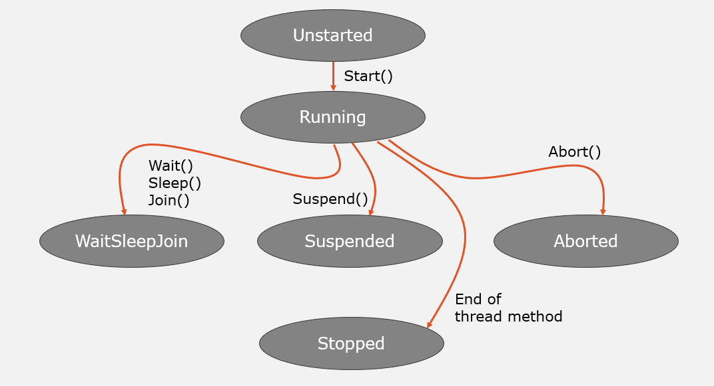
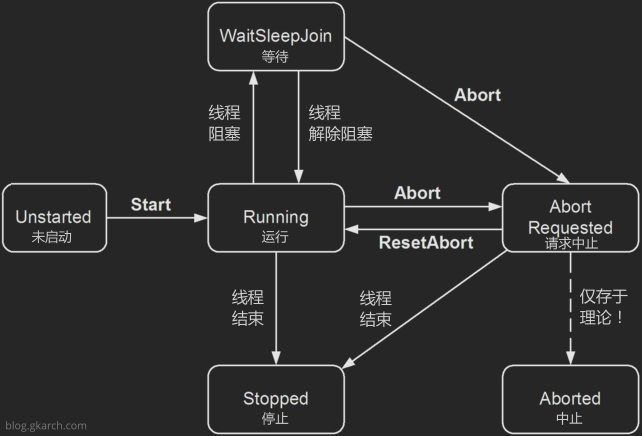

### 线程状态详解（含触发与恢复条件）

线程状态描述的是线程在生命周期中的**"当前处境"**，就像人的状态有"睡觉中"、"工作中"、"等待中"一样。理解状态转换是排查多线程问题的基础。

---

#### 一、线程状态总览（ThreadState 枚举）

C# 中线程的状态用 `ThreadState` 枚举表示，它是一个 **flags 特性** 的枚举，意味着一个线程可能同时处于多个状态：

```csharp
// 线程可能同时是：Running | AbortRequested
ThreadState state = Thread.CurrentThread.ThreadState;
Console.WriteLine(state); // 可能输出: Running, WaitSleepJoin, Stopped 等
```

**核心状态清单**：

| 名称               | 值   | 说明                                                                                                                                                                                                                                                                                                                                                                                                                                                                                                                                                                                                                                                                                                                                                                                                              |
| ---------------- | --- | --------------------------------------------------------------------------------------------------------------------------------------------------------------------------------------------------------------------------------------------------------------------------------------------------------------------------------------------------------------------------------------------------------------------------------------------------------------------------------------------------------------------------------------------------------------------------------------------------------------------------------------------------------------------------------------------------------------------------------------------------------------------------------------------------------------- |
| Running          | 0   | 线程已启动，但尚未停止。                                                                                                                                                                                                                                                                                                                                                                                                                                                                                                                                                                                                                                                                                                                                                                                                    |
| StopRequested    | 1   | 正在请求线程停止。 这是仅供内部使用。                                                                                                                                                                                                                                                                                                                                                                                                                                                                                                                                                                                                                                                                                                                                                                                             |
| SuspendRequested | 2   | 正在请求线程挂起。                                                                                                                                                                                                                                                                                                                                                                                                                                                                                                                                                                                                                                                                                                                                                                                                       |
| Background       | 4   | 该线程作为后台线程执行，而不是前台线程。 通过设置属性来控制此 [IsBackground](https://learn.microsoft.com/zh-cn/dotnet/api/system.threading.thread.isbackground?view=net-10.0#system-threading-thread-isbackground) 状态。                                                                                                                                                                                                                                                                                                                                                                                                                                                                                                                                                                                                                        |
| Unstarted        | 8   | 该方法 [Start()](https://learn.microsoft.com/zh-cn/dotnet/api/system.threading.thread.start?view=net-10.0#system-threading-thread-start) 尚未在线程上调用。                                                                                                                                                                                                                                                                                                                                                                                                                                                                                                                                                                                                                                                                 |
| Stopped          | 16  | 线程已停止。                                                                                                                                                                                                                                                                                                                                                                                                                                                                                                                                                                                                                                                                                                                                                                                                          |
| WaitSleepJoin    | 32  | 线程被阻止。 这可能是调用[Sleep(Int32)](https://learn.microsoft.com/zh-cn/dotnet/api/system.threading.thread.sleep?view=net-10.0#system-threading-thread-sleep\(system-int32\))[Join()](https://learn.microsoft.com/zh-cn/dotnet/api/system.threading.thread.join?view=net-10.0#system-threading-thread-join)或请求锁的结果，例如，通过调用[Enter(Object)](https://learn.microsoft.com/zh-cn/dotnet/api/system.threading.monitor.enter?view=net-10.0#system-threading-monitor-enter\(system-object\))或 [Wait(Object, Int32, Boolean)](https://learn.microsoft.com/zh-cn/dotnet/api/system.threading.monitor.wait?view=net-10.0#system-threading-monitor-wait\(system-object-system-int32-system-boolean\)) -或等待线程同步对象（例如[ManualResetEvent](https://learn.microsoft.com/zh-cn/dotnet/api/system.threading.manualresetevent?view=net-10.0)）。 |
| Suspended        | 64  | 线程已挂起。                                                                                                                                                                                                                                                                                                                                                                                                                                                                                                                                                                                                                                                                                                                                                                                                          |
| AbortRequested   | 128 | 该方法 [Abort(Object)](https://learn.microsoft.com/zh-cn/dotnet/api/system.threading.thread.abort?view=net-10.0#system-threading-thread-abort\(system-object\)) 已在线程上调用，但该线程尚未收到将尝试终止该方法的挂起 [ThreadAbortException](https://learn.microsoft.com/zh-cn/dotnet/api/system.threading.threadabortexception?view=net-10.0) 。                                                                                                                                                                                                                                                                                                                                                                                                                                                                                             |
| Aborted          | 256 | 线程状态包括 [AbortRequested](https://learn.microsoft.com/zh-cn/dotnet/api/system.threading.threadstate?view=net-10.0#system-threading-threadstate-abortrequested) 并且线程现在已死亡，但其状态尚未更改为 [Stopped](https://learn.microsoft.com/zh-cn/dotnet/api/system.threading.threadstate?view=net-10.0#system-threading-threadstate-stopped)。                                                                                                                                                                                                                                                                                                                                                                                                                                                                                       |


---

#### 二、各状态详解（触发条件 + 恢复条件）

#### **Unstarted（未启动状态）**

**大白话**：线程对象已经 `new` 出来了，但还没调用 `Start()` 方法，就像汽车打着火了但还没挂挡。

**代码示例**：
```csharp
Thread t = new Thread(() => Console.WriteLine("干活"));
// 此时 t.ThreadState == ThreadState.Unstarted

t.Start(); // 调用后状态变为 Running
```

**触发条件**：
- 唯一触发：创建 Thread 对象后，**未调用** `t.Start()`

**恢复条件**：
- 调用 `t.Start()` → 进入 Running 状态
- 注意：`Start()` 只能调用一次，重复调用会抛异常

---

#### **Running（运行状态）**

**大白话**：线程正在 CPU 上执行代码，或者在就绪队列里排队等着执行（操作系统随时可以调度它运行）。

**代码示例**：
```csharp
Thread t = new Thread(() => {
    // 这里的代码执行时，线程处于 Running 状态
    Console.WriteLine("我正在运行");
});
t.Start();

// 主线程检查子线程状态
while (t.ThreadState == ThreadState.Running)
{
    Console.WriteLine("子线程还在跑");
}
```

**触发条件**：
- 从 Unstarted 调用 `t.Start()` 后
- 从 WaitSleepJoin 状态被唤醒后

**恢复条件（如何离开 Running）**：
- 调用 `Thread.Sleep()` → 进入 **WaitSleepJoin**
- 调用 `t.Join()` 等待其他线程 → 进入 **WaitSleepJoin**
- 等待锁/信号量 → 进入 **WaitSleepJoin**
- 线程方法执行完毕 → 进入 **Stopped**
- 被其他线程调用 `t.Interrupt()` 或 `t.Abort()`（已废弃）

---

#### **WaitSleepJoin（等待状态）**

**大白话**：线程"卡住了"，暂时不干活。三种情况：
- **Wait**：等待锁、信号量等资源
- **Sleep**：调用 `Thread.Sleep()` 在睡觉
- **Join**：调用 `t.Join()` 在等别的线程结束

**代码示例（三种情况）**：
```csharp
// 情况1：Sleep
Thread t1 = new Thread(() => {
    Thread.Sleep(5000); // 5秒内处于 WaitSleepJoin
});

// 情况2：Join 等待
Thread t2 = new Thread(() => {
    Thread t = new Thread(() => Thread.Sleep(3000));
    t.Start();
    t.Join(); // 这里 t2 处于 WaitSleepJoin
});

// 情况3：等待锁（后面讲锁时会深入）
object lockObj = new object();
Thread t3 = new Thread(() => {
    lock (lockObj) // 如果锁被占用，t3 处于 WaitSleepJoin
    {
        Thread.Sleep(1000);
    }
});
```

**触发条件**：
- `Thread.Sleep(n)`
- `t.Join()`
- `Monitor.Wait()`
- 等待 `Mutex`、`Semaphore` 等同步对象

**恢复条件（如何唤醒）**：
- **Sleep 超时**：时间到了自动恢复 Running
- **Join 目标完成**：被等待的线程结束，立即恢复 Running
- **被 Interrupt()**：抛出 `ThreadInterruptedException`，进入 Running（在 catch 块中）
- **被 Abort()**（已废弃）：抛出 `ThreadAbortException`

---

#### **Stopped（停止状态）**

**大白话**：线程干完活（或者异常崩溃），寿终正寝了。这是**最终状态**，没法再复活。

**代码示例**：
```csharp
Thread t = new Thread(() => {
    Thread.Sleep(1000);
    // 方法结束 → 进入 Stopped
});

t.Start();
t.Join(); // 等线程自然结束

Console.WriteLine(t.ThreadState); // 输出 Stopped
Console.WriteLine(t.IsAlive);      // 输出 False
```

**触发条件**：
- 线程入口方法执行完毕（正常退出）
- 线程内抛出**未处理异常**（异常终止）
- 被其他线程调用 `t.Abort()`（已废弃）

**恢复条件**：
- **无恢复条件**！Stopped 是终点，线程对象不能再 Start
- 只能重新 new 一个新的 Thread 对象

---

#### **Background（后台状态，可叠加）**

**大白话**：这是一个**附加状态**，可以和上面任何状态组合。后台线程就像临时工，主线程一退，它们全部被强制终止。

**代码示例**：
```csharp
Thread t = new Thread(() => {
    Thread.Sleep(5000);
    Console.WriteLine("后台线程：我睡醒了"); // 可能永远执行不到
});

t.IsBackground = true; // 设为后台线程
t.Start();

Console.WriteLine("主线程：我马上就退出了");
// 主线程结束，进程退出，后台线程 t 直接被终止
```

**触发条件**：
- 设置 `t.IsBackground = true`（创建前或创建后都可以）

**恢复条件（变为前台线程）**：
- 设置 `t.IsBackground = false`

**关键区别**：
```csharp
// 前台线程（默认）：主线程必须等它结束
Thread t1 = new Thread(() => Thread.Sleep(5000));
t1.Start();
// 主线程会等 5 秒才退出

// 后台线程：主线程不等它
Thread t2 = new Thread(() => Thread.Sleep(5000));
t2.IsBackground = true;
t2.Start();
// 主线程立即退出，进程终止，t2 直接消失
```

---

#### **已废弃状态（了解即可）**

**AbortRequested**：调用 `t.Abort()` 后、线程真正终止前的中间状态。由于 `Abort()` 已废弃，这个状态也基本不用。

**Suspended**：调用 `t.Suspend()` 后的挂起状态。该方法已废弃，因为可能导致死锁（线程挂着的时候可能还握着锁）。

```csharp
// 千万别用这些废弃方法！
Thread t = new Thread(...);
t.Suspend(); // 已废弃！
t.Resume();  // 已废弃！
t.Abort();   // 已废弃！
```

---

#### 三、完整状态转换图（重点）







| **起始状态**           | **目标状态**           | **触发方法/事件**           | **类别**  | **说明**                                     |
| ------------------ | ------------------ | --------------------- | ------- | ------------------------------------------ |
| **None**           | **Unstarted**      | `new Thread()`        | 标准      | 线程对象已创建，但尚未在操作系统注册。                        |
| **Unstarted**      | **Running**        | `Thread.Start()`      | 标准      | 线程开始执行，进入就绪或运行状态。                          |
| **Running**        | **WaitSleepJoin**  | `Thread.Sleep()`      | 阻塞      | 线程主动放弃 CPU 时间片，等待指定时间。                     |
| **Running**        | **WaitSleepJoin**  | `Monitor.Wait()`      | 阻塞      | 线程释放锁并进入等待队列，直到被 `Pulse` 唤醒。               |
| **Running**        | **WaitSleepJoin**  | `Thread.Join()`       | 阻塞      | 当前线程停下，等待另一个线程执行完毕。                        |
| **WaitSleepJoin**  | **Running**        | 运行结束/被唤醒              | 恢复      | 睡眠到期、收到信号或目标线程结束。                          |
| **Running**        | **Suspended**      | `Thread.Suspend()`    | **已废弃** | 强行挂起线程。**极其危险**，容易导致死锁。                    |
| **Suspended**      | **Running**        | `Thread.Resume()`     | **已废弃** | 恢复被挂起的线程。                                  |
| **Running**        | **AbortRequested** | `Thread.Abort()`      | **已废弃** | 尝试引发 `ThreadAbortException`。在 .NET 5+ 中无效。 |
| **AbortRequested** | **Aborted**        | 系统处理完成                | **已废弃** | 线程成功捕获异常并终止。                               |
| **AbortRequested** | **Running**        | `Thread.ResetAbort()` | **已废弃** | 在 Catch 块中取消终止请求。                          |
| **Running**        | **Stopped**        | 方法执行完毕                | 标准      | 线程函数执行结束，资源准备回收。                           |
| **Running**        | **Background**     | 设置 `IsBackground`     | 属性      | 如果主线程退出，后台线程会自动关闭。                         |
**特殊路径**：
`Running` → `AbortRequested` → `Stopped`（Abort 路径，已废弃）
任何状态都可以叠加 `Background` 标志

废弃方法的“黑历史” (`Abort`, `Suspend`)
**为什么废弃？** `Abort` 会在代码执行的**任意位置**抛出异常。如果线程恰好在修改静态变量或持有文件句柄，资源将无法正确释放。
**现代替代方案：** 使用 `CancellationToken` 进行协作式取消。
使用 `Task` 和 `async/await` 处理异步逻辑，而不是手动管理 `Thread` 对象。


---

#### 四、ThreadState 的 Flags 特性（重要细节）

一个线程**可能同时处于多个状态**：

```csharp
Thread t = new Thread(() => {
    Thread.Sleep(1000);
});
t.IsBackground = true; // 设为后台线程
t.Start();

Thread.Sleep(100); // 让子线程开始 Sleep

Console.WriteLine(t.ThreadState); // 输出：WaitSleepJoin, Background
Console.WriteLine(t.IsAlive);     // 输出：True
```

**如何判断单个状态**：
```csharp
ThreadState state = t.ThreadState;

// 正确判断方法（按位与操作）
if ((state & ThreadState.WaitSleepJoin) != 0)
{
    Console.WriteLine("线程正在等待或睡眠");
}

if ((state & ThreadState.Background) != 0)
{
    Console.WriteLine("是后台线程");
}
```

**常见组合**：
- `Running`：正常执行
- `WaitSleepJoin`：等待中
- `WaitSleepJoin, Background`：后台线程在等待

---

#### 五、实际应用场景

**场景1：监控线程状态**
```csharp
Thread worker = new Thread(LongRunningTask);
worker.Start();

while (worker.IsAlive) // 等价于 state != Stopped
{
    Console.WriteLine($"线程状态: {worker.ThreadState}");
    
    if ((worker.ThreadState & ThreadState.WaitSleepJoin) != 0)
    {
        Console.WriteLine("线程卡住了，可能是死锁或等待资源");
    }
    
    Thread.Sleep(500);
}
```

**场景2：等待线程安全退出**
```csharp
Thread t = new Thread(() => {
    try
    {
        while (true)
        {
            DoWork();
            Thread.Sleep(1000); // 可中断的检查点
        }
    }
    catch (ThreadInterruptedException)
    {
        Console.WriteLine("收到中断，清理资源...");
    }
});

t.Start();

// 主线程想停止工作线程
Thread.Sleep(5000);
t.Interrupt(); // 请求中断
t.Join();      // 等待进入 Stopped 状态

Console.WriteLine($"最终状态: {t.ThreadState}"); // Stopped
```

**场景3：避免重复启动线程**
```csharp
Thread t = new Thread(...);
t.Start();

// 某处不小心又调用一次
if (t.ThreadState == ThreadState.Unstarted) // 检查状态
{
    t.Start(); // 安全调用
}
else
{
    Console.WriteLine("线程已启动，不能重复 Start");
}
```

---

#### 六、新手陷阱

**陷阱1：依赖 ThreadState 做精确同步**
```csharp
// 错误示范
while (t.ThreadState == ThreadState.Running)
{
    // 状态可能在判断后立即改变， race condition！
}
```
**正确做法**：用 `Join()` 或信号量等同步机制。

**陷阱2：误判 WaitSleepJoin**
```csharp
Thread t = new Thread(() => {
    // 只睡 1 毫秒
    Thread.Sleep(1);
});

t.Start();
Thread.Sleep(100); // 确保子线程 Sleep 完

// 此时状态可能是 Running，也可能是 Stopped！
Console.WriteLine(t.ThreadState);
```

**陷阱3：后台线程的数据丢失**
```csharp
Thread t = new Thread(() => {
    Thread.Sleep(2000);
    File.WriteAllText("result.txt", "重要数据"); // 可能永远不会执行
});
t.IsBackground = true;
t.Start();

// 主线程立即退出，后台线程被强制终止，数据没写入
```

---

#### 七、ThreadState 的完整判断示例

```csharp
static string GetThreadStateDescription(Thread t)
{
    var state = t.ThreadState;
    var desc = new System.Text.StringBuilder();
    
    if ((state & ThreadState.Unstarted) != 0)
        desc.Append("未启动 ");
    if ((state & ThreadState.Running) != 0)
        desc.Append("运行中 ");
    if ((state & ThreadState.WaitSleepJoin) != 0)
        desc.Append("等待中 ");
    if ((state & ThreadState.Stopped) != 0)
        desc.Append("已停止 ");
    if ((state & ThreadState.Background) != 0)
        desc.Append("(后台) ");
    
    return desc.ToString().Trim();
}

// 用法
Thread t = new Thread(() => Thread.Sleep(5000));
t.IsBackground = true;
t.Start();
Console.WriteLine(GetThreadStateDescription(t)); // 输出: 等待中 (后台)
```

---

**总结**：线程状态是动态变化的，理解各状态的触发和恢复条件，才能写出健壮的多线程代码。实际开发中，**少用 ThreadState 属性做逻辑判断**，多用 `Join()`、`IsAlive` 等更可靠的方法。记住：Unstarted→Running→(WaitSleepJoin)→Stopped 是主线，Background 是支线，废弃的方法别碰。