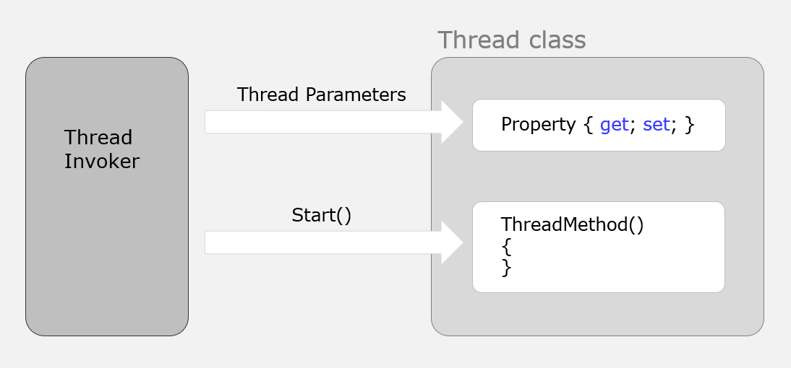

### 自定义线程对象详解

#### 一、为什么需要自定义线程类？

**大白话理解**：当你用 Lambda 创建线程时，所有逻辑都堆在一起。参数一多、逻辑一复杂，代码就像乱麻。自定义线程类就是**把线程相关的数据、逻辑、控制方法打包成一个"工具箱"**，要用的时候直接 `new` 一个对象，干净清爽。

**何时需要自定义线程类？**
- 参数超过3-4个，Lambda 捕获变量写起来很乱
- 相同的线程逻辑要在多处复用（不想复制粘贴 Lambda）
- 需要给线程添加状态管理（启动、停止、暂停）
- 需要封装复杂的线程控制逻辑（进度通知、异常处理）



---

#### 二、基础封装：把数据和逻辑打包

**需求**：创建一个"文件下载线程"，需要 url、保存路径、超时时间三个参数。

**Lambda 方式（混乱版）**：
```csharp
// 参数一多，Lambda 调用处完全看不懂
Thread t = new Thread(() => {
    Download(url, savePath, timeout, retryCount, proxy, headers, bufferSize);
});
```


**自定义类方式（清晰版）**：
```csharp
// 定义一个专门的下载线程类
public class DownloadThread
{
    // 1. 把参数变成类的字段
    private string _url;
    private string _savePath;
    private int _timeout;
    
    // 2. 构造函数接收参数
    public DownloadThread(string url, string savePath, int timeout)
    {
        _url = url;
        _savePath = savePath;
        _timeout = timeout;
    }
    
    // 3. 线程方法变成实例方法，直接使用字段
    public void Start()
    {
        Thread thread = new Thread(DoDownload);
        thread.Start();
    }
    
    private void DoDownload()
    {
        Console.WriteLine($"线程 {Thread.CurrentThread.ManagedThreadId} 开始下载");
        Console.WriteLine($"URL: {_url}");
        Console.WriteLine($"保存到: {_savePath}");
        Console.WriteLine($"超时: {_timeout}ms");
        
        Thread.Sleep(2000); // 模拟下载
        Console.WriteLine("下载完成");
    }
}

// 使用变得极其简单
class Program
{
    static void Main()
    {
        // 创建下载任务对象
        var downloader = new DownloadThread(
            url: "https://example.com/file.zip",
            savePath: "C:\\temp\\file.zip",
            timeout: 5000
        );
        
        // 启动线程，内部细节全隐藏
        downloader.Start();
        
        Thread.Sleep(3000);
        Console.WriteLine("主线程继续");
    }
}
```

**核心改进**：
- **数据封装**：参数变成 `private` 字段，外部无法乱改
- **接口简洁**：调用者只需要 `new` + `Start()`
- **逻辑内聚**：所有下载相关的代码都在类内部


---

#### 三、增强封装：加入线程控制

**需求**：让下载线程支持**随时停止**。

**问题**：外部如何通知子线程"别下了，停下"？用 `Interrupt()` 不够优雅，用共享变量更可控。

```csharp
public class StoppableDownloadThread
{
    private string _url;
    private string _savePath;
    private int _timeout;
    
    // 新增：停止标志
    private volatile bool _shouldStop = false; // volatile 保证可见性
    
    public StoppableDownloadThread(string url, string savePath, int timeout)
    {
        _url = url;
        _savePath = savePath;
        _timeout = timeout;
    }
    
    // 公开方法：请求停止
    public void Stop()
    {
        _shouldStop = true;
    }
    
    public void Start()
    {
        Thread thread = new Thread(DoDownload);
        thread.IsBackground = true; // 设为后台，主线程退出就自动结束
        thread.Start();
    }
    
    private void DoDownload()
    {
        Console.WriteLine($"开始下载: {_url}");
        
        // 模拟分段下载，每次循环检查停止标志
        for (int i = 0; i < 10; i++)
        {
            if (_shouldStop)
            {
                Console.WriteLine("收到停止信号，清理资源...");
                // 清理：删除不完整文件、关闭网络连接
                return; // 安全退出
            }
            
            Console.WriteLine($"下载进度: {(i + 1) * 10}%");
            Thread.Sleep(500); // 模拟下载耗时
        }
        
        Console.WriteLine("下载完成");
    }
}

// 使用示例
class Program
{
    static void Main()
    {
        var downloader = new StoppableDownloadThread(
            "https://example.com/bigfile.zip",
            "C:\\temp\\bigfile.zip",
            10000
        );
        
        downloader.Start();
        
        Thread.Sleep(2000);
        Console.WriteLine("2秒了，太慢了，停止下载！");
        downloader.Stop(); // 调用停止方法
        
        Thread.Sleep(1000);
        Console.WriteLine("主线程结束");
    }
}
```

**输出**：
```
开始下载: https://example.com/bigfile.zip
下载进度: 10%
下载进度: 20%
下载进度: 30%
下载进度: 40%
2秒了，太慢了，停止下载！
下载进度: 50%
收到停止信号，清理资源...
主线程结束
```

---

#### 四、高级封装：加入状态通知

**需求**：让外部知道下载进度，下载完主动通知。

**方案1：通过事件（Event）通知**：
```csharp
public class DownloadThreadWithEvents
{
    // 定义进度事件：每下载一块触发一次
    public event Action<int> OnProgress;
    
    // 定义完成事件：成功或失败都触发
    public event Action<bool, string> OnCompleted;
    
    private string _url;
    private string _savePath;
    private volatile bool _shouldStop;
    
    public DownloadThreadWithEvents(string url, string savePath)
    {
        _url = url;
        _savePath = savePath;
    }
    
    public void Stop() => _shouldStop = true;
    
    public void Start()
    {
        new Thread(DoDownload) { IsBackground = true }.Start();
    }
    
    private void DoDownload()
    {
        try
        {
            Console.WriteLine($"开始下载: {_url}");
            
            for (int i = 0; i < 10; i++)
            {
                if (_shouldStop)
                {
                    OnCompleted?.Invoke(false, "用户取消");
                    return;
                }
                
                Thread.Sleep(500);
                
                // 触发进度事件，通知外部
                int progress = (i + 1) * 10;
                OnProgress?.Invoke(progress);
            }
            
            // 触发完成事件
            OnCompleted?.Invoke(true, "下载成功");
        }
        catch (Exception ex)
        {
            OnCompleted?.Invoke(false, $"异常: {ex.Message}");
        }
    }
}

// 使用示例
class Program
{
    static void Main()
    {
        var downloader = new DownloadThreadWithEvents(
            "https://example.com/file.zip",
            "C:\\temp\\file.zip"
        );
        
        // 订阅事件
        downloader.OnProgress += (progress) => {
            Console.WriteLine($"进度更新: {progress}%");
        };
        
        downloader.OnCompleted += (success, message) => {
            Console.WriteLine($"下载结束: {(success ? "成功" : "失败")}, {message}");
        };
        
        downloader.Start();
        
        Console.ReadLine(); // 等待下载完成
    }
}
```

**方案2：通过回调函数通知**：
```csharp
public class DownloadThreadWithCallback
{
    private Action<int> _progressCallback;
    private Action<bool> _completionCallback;
    
    public DownloadThreadWithCallback(
        string url, 
        string savePath,
        Action<int> onProgress,    // 进度回调
        Action<bool> onComplete   // 完成回调
    )
    {
        _url = url;
        _savePath = savePath;
        _progressCallback = onProgress;
        _completionCallback = onComplete;
    }
    
    private void DoDownload()
    {
        // ... 下载逻辑 ...
        for (int i = 0; i < 10; i++)
        {
            _progressCallback?.Invoke((i + 1) * 10); // 调用回调
        }
        _completionCallback?.Invoke(true);
    }
}

// 使用
var downloader = new DownloadThreadWithCallback(
    url: "https://...",
    savePath: "C:\\...",
    onProgress: p => Console.WriteLine($"进度: {p}%"),
    onComplete: success => Console.WriteLine($"完成: {success}")
);
downloader.Start();
```

---

#### 五、完整实战：可复用的工作线程基类

**需求**：把线程控制的通用逻辑（启动、停止、状态通知）抽象成基类，具体业务（下载、计算）继承它。

```csharp
// 1. 定义抽象基类，封装通用逻辑
public abstract class WorkerThreadBase
{
    private Thread _thread;
    private volatile bool _shouldStop;
    
    // 对外暴露的属性
    public bool IsRunning => _thread?.IsAlive ?? false;
    public int ThreadId => _thread?.ManagedThreadId ?? -1;
    
    // 事件：状态变化通知
    public event Action<string> OnLog;
    public event Action<Exception> OnError;
    
    // 公共方法：启动
    public void Start()
    {
        if (IsRunning)
        {
            Log("线程已在运行");
            return;
        }
        
        _shouldStop = false;
        _thread = new Thread(RunWrapper);
        _thread.IsBackground = true;
        _thread.Start();
        
        Log($"线程 {ThreadId} 启动");
    }
    
    // 公共方法：停止
    public void Stop()
    {
        if (!IsRunning) return;
        
        Log("请求停止线程...");
        _shouldStop = true;
        _thread?.Interrupt(); // 如果线程在Sleep，强行唤醒
        _thread?.Join(5000);  // 最多等5秒
        
        if (_thread?.IsAlive == true)
        {
            Log("警告：线程停止超时");
        }
    }
    
    // 内部包装方法：统一异常处理
    private void RunWrapper()
    {
        try
        {
            Run(); // 调用子类实现的业务逻辑
            Log("线程正常结束");
        }
        catch (ThreadInterruptedException)
        {
            Log("线程被中断，安全退出");
        }
        catch (Exception ex)
        {
            OnError?.Invoke(ex);
        }
    }
    
    // 抽象方法：子类必须实现具体业务
    protected abstract void Run();
    
    // 辅助方法：检查是否需要停止
    protected bool ShouldStop() => _shouldStop;
    
    // 辅助方法：记录日志
    protected void Log(string message)
    {
        OnLog?.Invoke($"[线程{Thread.CurrentThread.ManagedThreadId}] {message}");
    }
}

// 2. 继承基类，实现具体业务
public class DownloadWorker : WorkerThreadBase
{
    private string _url;
    private string _savePath;
    
    public DownloadWorker(string url, string savePath)
    {
        _url = url;
        _savePath = savePath;
    }
    
    // 实现抽象方法
    protected override void Run()
    {
        Log($"开始下载: {_url}");
        
        for (int i = 0; i < 5; i++)
        {
            if (ShouldStop())
            {
                Log("检测到停止信号，退出");
                return;
            }
            
            Log($"下载进度: {(i + 1) * 20}%");
            Thread.Sleep(1000); // 模拟耗时
        }
        
        Log($"下载完成，保存到: {_savePath}");
    }
}

// 3. 使用超简单
class Program
{
    static void Main()
    {
        var downloader = new DownloadWorker(
            "https://example.com/file.zip",
            "C:\\temp\\file.zip"
        );
        
        // 订阅事件
        downloader.OnLog += msg => Console.WriteLine($"[日志] {msg}");
        downloader.OnError += ex => Console.WriteLine($"[错误] {ex.Message}");
        
        downloader.Start();
        
        Thread.Sleep(3500);
        Console.WriteLine("\n主线程：3.5秒了，停止下载！\n");
        downloader.Stop();
        
        Console.WriteLine("\n主线程：程序结束");
    }
}
```

**输出**：
```
[日志] [线程7] 线程 7 启动
[日志] [线程7] 开始下载: https://example.com/file.zip
[日志] [线程7] 下载进度: 20%
[日志] [线程7] 下载进度: 40%
[日志] [线程7] 下载进度: 60%

主线程：3.5秒了，停止下载！

[日志] [线程7] 请求停止线程...
[日志] [线程7] 检测到停止信号，退出
[日志] [线程7] 线程被中断，安全退出

主线程：程序结束
```

---

#### 六、自定义线程类 vs Lambda 对比

| 场景 | Lambda 方式 | 自定义线程类 |
|------|-------------|--------------|
| **简单任务（1-2个参数）** | ⭐⭐⭐⭐⭐ 简洁 | ⭐⭐⭐ 杀鸡用牛刀 |
| **复杂任务（多参数+控制）** | ⭐ 代码混乱 | ⭐⭐⭐⭐⭐ 结构清晰 |
| **逻辑复用（多处调用）** | ⭐ 只能复制粘贴 | ⭐⭐⭐⭐⭐ 类直接复用 |
| **状态管理（停止/暂停）** | ⭐ 需共享变量，易出错 | ⭐⭐⭐⭐⭐ 封装在类内 |
| **事件通知** | ⭐⭐ 需手动定义事件 | ⭐⭐⭐⭐ 可封装标准事件 |
| **调试维护** | ⭐⭐ 逻辑分散 | ⭐⭐⭐⭐⭐ 高内聚易调试 |
| **学习成本** | 低 | 中（需理解面向对象） |

**选择建议**：
```csharp
// 简单任务：用 Lambda
new Thread(() => Console.WriteLine("简单")).Start();

// 中等任务：参数多但无状态控制，用 Lambda + 参数类
var param = new WorkParams { ... };
new Thread(() => Process(param)).Start();

// 复杂任务：需要控制、状态、复用，用自定义类
var worker = new MyComplexWorker(param1, param2, ...);
worker.OnProgress += ...;
worker.Start();
```

---

#### 七、新手陷阱

**陷阱1：线程方法必须是实例方法**
```csharp
public class MyThread
{
    private static void Run() { } // 错误！static方法无法访问实例字段
    
    public void Start()
    {
        new Thread(Run).Start(); // 编译错误
    }
}
```

**陷阱2：忘记设置 IsBackground**
```csharp
public void Start()
{
    new Thread(Run).Start(); // 默认是前台线程
}
// 如果外部没调用 Stop()，主线程退出也会卡住
```

**陷阱3：事件线程安全问题**
```csharp
// 事件可能被多个线程同时调用
public event Action<int> OnProgress;

private void DoWork()
{
    OnProgress?.Invoke(100); // 如果外部订阅者没处理线程安全，会出问题
}

// 解决：事件内部用线程安全的方式调用
protected void RaiseProgress(int progress)
{
    OnProgress?.Invoke(progress); // 暂时够用，更复杂的用 lock 或 ConcurrentQueue
}
```

**陷阱4：Stop() 调用多次**
```csharp
var worker = new MyWorker();
worker.Stop(); // 第一次调用
worker.Stop(); // 第二次调用，线程已停，可能抛异常或死锁

// 解决：在 Stop() 内部检查状态
public void Stop()
{
    if (_thread?.IsAlive != true) return; // 已经停了，直接返回
    // ... 停止逻辑
}
```

---

#### 八、总结

自定义线程类本质上是**面向对象思想在线程编程中的应用**。它通过封装把混乱的线程逻辑变成清晰的"黑盒"对象，优势在于：

1. **高内聚**：数据、逻辑、控制在一起
2. **易复用**：一个类可在多处创建实例
3. **易测试**：可以单独测试类的功能
4. **易维护**：调试时知道所有逻辑都在类里

**最后建议**：
- 简单场景用 Lambda，复杂场景用类
- 参数超过3个就考虑封装
- 需要控制线程生命周期就封装
- 团队协作时，封装成类能降低沟通成本

理解了这个模式，后面学习 `Task` 和 `async/await` 会更轻松——因为它们本质上也是封装好的"高级线程对象"，只是更强大、更抽象。