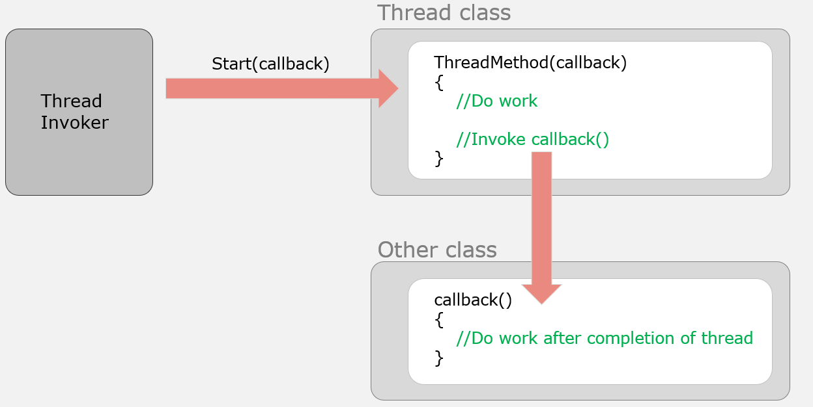

### 线程回调详解

#### 一、什么是回调？

**大白话理解**：回调就是 **"你干完活后，记得call我一下，告诉我结果"**。比如你去快递柜取包裹，输入取件码后系统说："正在开门，请稍等"，你不用在那儿干等，可以刷会手机。等门一开，系统"滴"一声提示你，这个"滴"就是回调通知。

**技术定义**：把一个方法（函数）作为参数传给另一个线程，等那个线程执行完任务后，反过来调用这个方法来返回结果或通知状态。

**核心作用**：解决**子线程如何向主线程返回结果**的问题。线程启动后各干各的，主线程不可能一直干等着（`Join`），回调就是让子线程主动"汇报工作"。

---

#### 二、为什么需要回调？线程返回结果的困境

**没有回调的困境：**
```csharp
static void Main()
{
    int result = 0;
    
    Thread t = new Thread(() => {
        Thread.Sleep(2000);
        result = 42; // 计算结果
    });
    t.Start();
    
    // 问题1：主线程怎么知道计算完成了？
    // 问题2：如何优雅地拿到 result？
    
    t.Join(); // 只能傻等，主线程啥也干不了
    Console.WriteLine($"结果: {result}"); // 2秒后才能拿到
}
```

**有回调的优雅方案：**
```csharp
static void Main()
{
    // 告诉子线程：你算完后，记得调用这个方法
    Thread t = new Thread(() => {
        Thread.Sleep(2000);
        int result = 42;
        OnCalculationComplete(result); // 回调通知
    });
    t.Start();
    
    Console.WriteLine("主线程：我不用等，继续干别的");
    Console.ReadLine();
}

// 回调方法：处理子线程返回的结果
static void OnCalculationComplete(int result)
{
    Console.WriteLine($"收到计算结果: {result}");
}
```




---

#### 三、回调的实现方式

#### **方式一：委托（Delegate）——最原始但最灵活**

委托可以理解为 **"方法类型的变量"**，它能存储一个方法的引用，并像调用方法一样调用它。

**完整示例：**
```csharp
using System;
using System.Threading;

// 步骤1：定义委托类型（签名必须和回调方法匹配）
// 这个委托表示"接受一个int参数，无返回值"的方法
public delegate void CalculationCallback(int result);

class Program
{
    static void Main()
    {
        // 步骤2：创建回调方法实例（把方法名传进去）
        CalculationCallback callback = new CalculationCallback(HandleResult);
        
        // 步骤3：启动线程并传入回调
        Calculator calc = new Calculator();
        calc.StartCalculation(100, callback);
        
        Console.WriteLine("主线程：计算已启动，我继续干别的");
        Thread.Sleep(3000); // 模拟主线程做其他事
    }
    
    // 回调方法：符合委托签名（void MethodName(int)）
    static void HandleResult(int result)
    {
        Console.WriteLine($"[回调] 计算结果: {result} (线程ID: {Thread.CurrentThread.ManagedThreadId})");
    }
}

// 计算器类：封装计算逻辑和线程
public class Calculator
{
    public void StartCalculation(int input, CalculationCallback callback)
    {
        Thread t = new Thread(() => {
            Console.WriteLine($"计算线程 {Thread.CurrentThread.ManagedThreadId} 开始计算...");
            Thread.Sleep(2000); // 模拟复杂计算
            
            int result = input * 2; // 假设的计算
            
            // 步骤4：任务完成后调用回调
            callback?.Invoke(result); // ?. 防止回调为空
        });
        
        t.IsBackground = true;
        t.Start();
    }
}
```

**输出结果：**
```
主线程：计算已启动，我继续干别的
计算线程 7 开始计算...
[回调] 计算结果: 200 (线程ID: 7)
```

**关键细节**：
- 回调方法在**子线程中执行**，不是在主线程！
- `?.Invoke()` 是安全调用，防止委托为 `null` 时抛异常

---

#### **方式二：Action/Func——现代简化版**

`Action` 和 `Func` 是 .NET 内置的泛型委托，不用自己定义。

- **Action**：无返回值委托（`Action` 无参，`Action<T>` 一个参数...）
- **Func**：有返回值委托（`Func<T>` 无参返回T，`Func<T1, T2>` 一个参数返回T2...）

**改写上面的例子：**
```csharp
public class CalculatorModern
{
    // 直接用 Action<int> 代替自定义委托
    public void StartCalculation(int input, Action<int> callback)
    {
        new Thread(() => {
            Thread.Sleep(2000);
            int result = input * 2;
            callback?.Invoke(result);
        }) { IsBackground = true }.Start();
    }
}

// 使用完全一样
static void Main()
{
    CalculatorModern calc = new CalculatorModern();
    calc.StartCalculation(100, HandleResult); // 方法名隐式转换为Action
    
    // 或者直接用 Lambda 作为回调（更常见）
    calc.StartCalculation(50, result => {
        Console.WriteLine($"Lambda回调结果: {result}");
    });
}

// 回调方法
static void HandleResult(int result)
{
    Console.WriteLine($"[回调] 计算结果: {result} (线程ID: {Thread.CurrentThread.ManagedThreadId})");
}
```

**Action 的多参数版本：**
```csharp
// 回调需要多个参数：Action<参数1, 参数2, ...>
public void DoWork(Action<int, string, bool> callback)
{
    new Thread(() => {
        // 干活...
        callback?.Invoke(42, "完成", true); // 传三个参数
    }).Start();
}

// 使用
DoWork((code, message, success) => {
    Console.WriteLine($"状态码: {code}, 消息: {message}, 成功: {success}");
});
```

---

#### **方式三：事件（Event）——标准组件模式**

事件是**封装好的委托**，更安全，适合需要多次回调的场景（比如进度通知）。

**完整示例：**
```csharp
using System;
using System.Threading;

public class FileDownloader
{
    // 定义事件：使用 EventHandler<T> 泛型
    public event EventHandler<int> OnProgressChanged; // 进度变化事件
    
    // 定义事件：使用自定义委托
    public event Action<bool, string> OnDownloadCompleted; // 完成事件
    
    private volatile bool _shouldStop;
    
    public void Stop() => _shouldStop = true;
    
    public void StartDownload(string url)
    {
        new Thread(() => {
            try
            {
                Console.WriteLine($"开始下载: {url}");
                
                for (int i = 0; i <= 100; i += 10)
                {
                    if (_shouldStop)
                    {
                        OnDownloadCompleted?.Invoke(false, "用户取消");
                        return;
                    }
                    
                    Thread.Sleep(200); // 模拟下载
                    
                    // 触发进度事件（多次回调）
                    OnProgressChanged?.Invoke(this, i); // EventHandler 固定签名
                }
                
                // 触发完成事件（单次回调）
                OnDownloadCompleted?.Invoke(true, "下载成功");
            }
            catch (Exception ex)
            {
                OnDownloadCompleted?.Invoke(false, $"异常: {ex.Message}");
            }
        }) { IsBackground = true }.Start();
    }
}

class Program
{
    static void Main()
    {
        var downloader = new FileDownloader();
        
        // 订阅事件（事件就是回调的集合）
        downloader.OnProgressChanged += (sender, progress) => {
            Console.WriteLine($"下载进度: {progress}%");
        };
        
        downloader.OnDownloadCompleted += (success, message) => {
            Console.WriteLine($"下载结果: {(success ? "成功" : "失败")}, {message}");
        };
        
        downloader.StartDownload("https://example.com/file.zip");
        
        Thread.Sleep(1000);
        Console.WriteLine("1秒后取消下载...");
        downloader.Stop();
        
        Console.ReadLine();
    }
}
```

**输出**：
```
开始下载: https://example.com/file.zip
下载进度: 10%
下载进度: 20%
下载进度: 30%
下载进度: 40%
下载进度: 50%
1秒后取消下载...
下载结果: 失败, 用户取消
```

**事件的优势**：
- **多播**：多个方法可同时订阅一个事件，都收到通知
- **封装**：外部只能订阅/取消，不能随意调用（更安全）
- **标准**：符合 .NET 组件编程规范

---

#### **方式四：回调 + 状态数据

有时回调需要知道**是哪个任务的结果**，特别是启动多个相同类型的线程时。

**问题场景：**
```csharp
for (int i = 0; i < 5; i++)
{
    int taskId = i;
    new Thread(() => {
        int result = taskId * 10;
        OnComplete(result); // 回调里不知道是哪个任务的结果
    }).Start();
}
```

**解决方案：回调时带上任务ID**
```csharp
public class TaskWithState
{
    public int TaskId { get; set; }
    public Action<int, int> Callback { get; set; } // result 和 taskId
    
    public void Start()
    {
        new Thread(() => {
            Thread.Sleep(1000);
            int result = TaskId * 10;
            Callback?.Invoke(TaskId, result); // 回调带上任务ID
        }).Start();
    }
}

// 使用
for (int i = 0; i < 5; i++)
{
    var task = new TaskWithState
    {
        TaskId = i,
        Callback = (id, result) => {
            Console.WriteLine($"任务 {id} 完成，结果: {result}");
        }
    };
    task.Start();
}
```

**输出（顺序不固定，但任务ID正确）：**
```
任务 0 完成，结果: 0
任务 1 完成，结果: 10
任务 2 完成，结果: 20
任务 4 完成，结果: 40
任务 3 完成，结果: 30
```

---

#### 四、回调的线程安全问题

**致命陷阱：回调在子线程执行，更新UI会崩溃！**

```csharp
// WinForms/WPF 错误示范
private void Button_Click(object sender, EventArgs e)
{
    new Thread(() => {
        Thread.Sleep(2000);
        int result = 42;
        
        // 在子线程直接更新UI控件
        labelResult.Text = $"结果: {result}"; // 抛出异常！
    }).Start();
}
```

**原因**：UI 控件只能在创建它的线程（UI线程）上访问。

**解决方案：回调里判断是否需要 Invoke**
```csharp
public class SafeCallbackCalculator
{
    private Control _uiControl; // 保存UI控件引用
    
    public SafeCallbackCalculator(Control control)
    {
        _uiControl = control;
    }
    
    public void StartCalculation(int input, Action<int> callback)
    {
        new Thread(() => {
            Thread.Sleep(2000);
            int result = input * 2;
            
            // 检查是否在UI线程上
            if (_uiControl.InvokeRequired)
            {
                // 在UI线程上执行回调
                _uiControl.Invoke(callback, result);
            }
            else
            {
                callback(result); // 已经在UI线程，直接执行
            }
        }).Start();
    }
}

// 使用
private void Button_Click(object sender, EventArgs e)
{
    var calc = new SafeCallbackCalculator(this); // this 是窗体
    calc.StartCalculation(100, result => {
        labelResult.Text = $"结果: {result}"; // 现在安全了
    });
}
```

---

#### 五、回调 vs 轮询（Polling）对比

**轮询方式（不推荐）**：
```csharp
// 主线程不断问：好了没？好了没？
bool isComplete = false;
int result = 0;

Thread t = new Thread(() => {
    Thread.Sleep(2000);
    result = 42;
    isComplete = true;
});
t.Start();

while (!isComplete) // 主线程空转，浪费CPU
{
    Thread.Sleep(100); // 必须Sleep，否则CPU飙满
}

Console.WriteLine(result);
```

**回调方式（推荐）**：
```csharp
new Thread(() => {
    Thread.Sleep(2000);
    OnComplete(42); // 好了叫你，不用反复问
}).Start();

// 主线程该干嘛干嘛，不用等
```

| 对比项   | 轮询        | 回调          |
| ----- | --------- | ----------- |
| CPU占用 | 高（需主动检查）  | 低（被动通知）     |
| 响应速度  | 有延迟（检查间隔） | 实时          |
| 代码复杂度 | 简单但啰嗦     | 初始设计复杂，使用简单 |
| 适用场景  | 简单状态检查    | 异步结果通知      |

---

#### 六、回调的实际应用场景

**场景1：异步文件处理**
```csharp
public void ProcessLargeFile(string path, Action<int, string> callback)
{
    new Thread(() => {
        try
        {
            var lines = File.ReadAllLines(path);
            for (int i = 0; i < lines.Length; i++)
            {
                ProcessLine(lines[i]);
                callback(i * 100 / lines.Length, "处理中"); // 进度回调
            }
            callback(100, "完成");
        }
        catch (Exception ex)
        {
            callback(-1, $"错误: {ex.Message}");
        }
    }).Start();
}

// 使用
ProcessLargeFile("data.txt", (progress, message) => {
    progressBar.Value = progress;
    statusLabel.Text = message;
});
```

**场景2：并发请求聚合**
```csharp
public void FetchAllData(Action<List<string>> onAllComplete)
{
    var results = new List<string>();
    int taskCount = 3;
    object lockObj = new object(); // 保护 results
    
    for (int i = 0; i < taskCount; i++)
    {
        int id = i;
        new Thread(() => {
            string data = $"数据-{id}";
            
            lock (lockObj)
            {
                results.Add(data);
                if (results.Count == taskCount)
                {
                    onAllComplete?.Invoke(results); // 全部完成后回调
                }
            }
        }).Start();
    }
}
```

**场景3：超时处理**
```csharp
public void ExecuteWithTimeout(Action work, Action onTimeout, int timeoutMs)
{
    Thread worker = new Thread(() => {
        work(); // 执行业务
    });
    
    Thread timer = new Thread(() => {
        Thread.Sleep(timeoutMs);
        if (worker.IsAlive)
        {
            worker.Interrupt(); // 中断工作线程
            onTimeout?.Invoke(); // 回调通知超时
        }
    });
    
    worker.Start();
    timer.Start();
}
```

---

#### 七、新手陷阱

**陷阱1：回调为 null 导致异常**
```csharp
public void DoWork(Action<int> callback)
{
    new Thread(() => {
        // 如果外部没传回调，callback 为 null，Invoke 抛 NullReferenceException
        callback.Invoke(42); // 崩溃！
    }).Start();
}

// 解决：用 ?. 安全调用
callback?.Invoke(42);
```

**陷阱2：回调耗时阻塞子线程**
```csharp
new Thread(() => {
    int result = 42;
    callback(result); // 如果回调里 Sleep 10秒，子线程也被卡住
}).Start();
```

**陷阱3：闭包变量生命周期**
```csharp
for (int i = 0; i < 5; i++)
{
    new Thread(() => {
        Thread.Sleep(100);
        callback(i); // i 已经变成 5 了
    }).Start();
}
// 解决：同 Lambda 参数传递，循环内创建临时变量
```


**陷阱4：忘记取消订阅事件**
```csharp
downloader.OnCompleted += MyCallback;
downloader.StartDownload();
// 如果 downloader 被复用，MyCallback 会多次触发
// 解决：完成时取消订阅，或用弱事件模式
```

---

#### 八、总结

回调是多线程间的 **"通信协议"**，核心要点：

1. **本质是委托**：方法当参数传递，`Action`/`Func` 是现代首选
2. **执行在子线程**：回调方法在子线程执行，更新UI需 Invoke
3. **带状态更灵活**：回调参数带上任务ID，避免分不清谁是谁
4. **事件更规范**：需要多次通知或多方订阅，用事件替代 Action


- 轮询是"你问我答"，回调是"好了我叫你"
- Lambda 捕获变量，循环内要建新变量
- 回调里更新UI，先判断 InvokeRequired

理解回调是理解现代异步编程（async/await）的基础，因为 async/await 本质上就是编译器帮你写的"回调"。