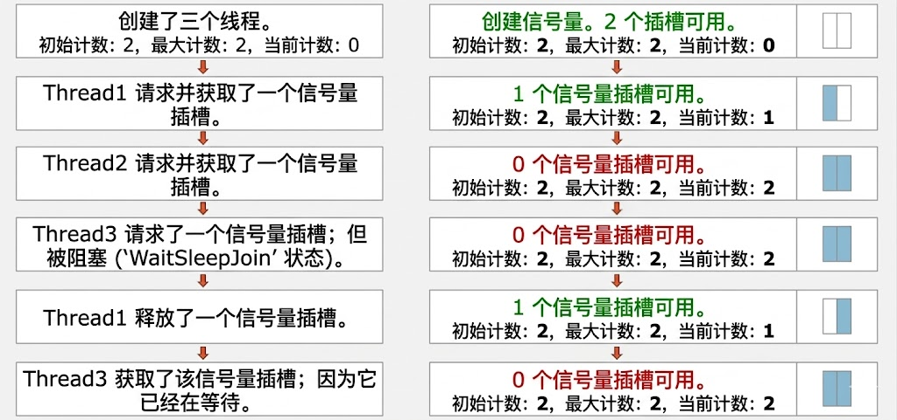

# 信号量（Semaphore）详解

## 一、为什么需要信号量？（从Mutex的局限性说起）

**Mutex 的痛点**：Mutex 就像**单人洗手间**，一次只能进一个线程。但现实中有需求是**允许N个线程同时访问**：
- **数据库连接池**：最多10个连接，10个线程可以同时取，第11个必须等
- **限流**：网站接口每秒最多处理100个请求，超出的排队
- **资源池**：5台打印机，5个任务可以同时打印，第6个等着

**信号量的解决**：信号量是一个**计数器**，初始值是N（如10），线程进来时-1，出去时+1。计数器为0时，新线程阻塞等待。

**类比**：停车场有10个车位（信号量计数=10），车辆（线程）进去就-1，出来就+1。满了就等，有车走就能进。

---

## 二、信号量是什么？（核心概念）

**官方定义**：`Semaphore` 是**内核模式**同步对象，维护一个**整型计数器**，控制**同时访问资源的线程数量**。

**两个核心操作**：
-  **`WaitOne()`**  ：请求一个许可，计数器-1。如果计数器=0，就阻塞
-  **`Release()`**  ：释放一个许可，计数器+1。如果有线程在等待，叫醒一个

**构造函数**：
```csharp
// 初始计数=3，最大计数=3（最常见的用法）
Semaphore semaphore = new Semaphore(initialCount: 3, maximumCount: 3);

// 初始计数=0，最大计数=10（开始时没资源，后续通过Release()动态添加）
Semaphore semaphore = new Semaphore(0, 10);
```



---

## 三、代码示例（从简单到复杂）

### 示例1：基础用法（公园门票）
```cs
using System;
using System.Threading;

// 场景：公园只有3个入园名额，但有10个人想同时进去
class SemaphoreBasicDemo
{
    static void Main()
    {
        // 创建信号量：初始3个名额，最多3个名额
        Semaphore parkGate = new Semaphore(3, 3, "公园大门");
        
        // 创建10个人（线程）
        for (int i = 1; i <= 10; i++)
        {
            int personId = i;  // 重要：避免闭包陷阱
            Thread person = new Thread(() =>
            {
                Console.WriteLine($"【人{personId}】到达公园门口...");
                
                // 等待入园许可（计数减1）
                parkGate.WaitOne();
                
                Console.WriteLine($"✅ 【人{personId}】入园成功！时间：{DateTime.Now:ss.fff}");
                
                // 模拟游玩5秒
                Thread.Sleep(5000);
                
                // 离开公园（计数加1）
                parkGate.Release();
                Console.WriteLine($"🚶 【人{personId}】离开公园，释放一个名额");
            });
            
            person.Start();
            Thread.Sleep(300); // 模拟人不是同时到达的
        }

        Console.ReadLine(); // 防止程序退出
    }
}

```

---

### 示例2：Release 多个许可

```csharp
// 构造函数：初始0个，最大10个
Semaphore _semaphore = new Semaphore(0, 10);

static void Producer()
{
    // 一次性释放3个许可
    _semaphore.Release(3); // 计数器+3
    Console.WriteLine("生产者：释放了3个资源");
}

static void Consumer()
{
    for (int i = 0; i < 3; i++)
    {
        _semaphore.WaitOne(); // 消耗1个许可
        Console.WriteLine("消费者：拿到资源");
    }
}
```


---

## 四、实际应用场景

### **场景1：数据库连接池（最经典）**

```csharp
public class ConnectionPool
{
    // 池子大小=10
    private static Semaphore _connectionSemaphore = new Semaphore(10, 10);
    private static ConcurrentBag<SqlConnection> _pool = new ConcurrentBag<SqlConnection>();

    // 初始化10个连接
    static ConnectionPool()
    {
        for (int i = 0; i < 10; i++)
        {
            _pool.Add(new SqlConnection($"Connection-{i}"));
        }
    }

    // 获取连接
    public static SqlConnection GetConnection()
    {
        Console.WriteLine("请求连接，等待获取许可...");
        _connectionSemaphore.WaitOne(); // 拿到一个许可
        
        if (_pool.TryTake(out var conn))
        {
            Console.WriteLine($"获取连接: {conn.ConnectionString}");
            return conn;
        }
        
        return null; // 理论上不会到这
    }

    // 归还连接
    public static void ReturnConnection(SqlConnection conn)
    {
        Console.WriteLine($"归还连接: {conn.ConnectionString}");
        _pool.Add(conn);
        _connectionSemaphore.Release(); // 释放许可
    }
}
```

---

### **场景2：限流器（API调用限制）**

```csharp
public class RateLimiter
{
    // 每秒最多处理100个请求
    private static Semaphore _limiter = new Semaphore(100, 100);
    private static Timer _resetTimer;

    static RateLimiter()
    {
        // 每秒重置一次计数
        _resetTimer = new Timer(_ => {
            int currentCount;
            // 释放所有等待，让计数回到100
            // 注意：这里要用 Interlocked 或 lock 保护
        }, null, 1000, 1000);
    }

    public static void ProcessRequest(int requestId)
    {
        Console.WriteLine($"请求{requestId}：等待处理许可...");
        _limiter.WaitOne(); // 拿到一个处理名额
        
        Console.WriteLine($"请求{requestId}：开始处理");
        Thread.Sleep(100); // 模拟处理
        
        // 注意：这里不应 Release，因为 Semaphore 计数代表"剩余名额"
        // 处理完名额空出来，应该用别的机制补充
    }
}
```

---

### **场景3：资源池（打印机池）**

```csharp
public class PrinterPool
{
    private static Semaphore _printerSemaphore;
    private static List<string> _printers = new List<string> { "Printer1", "Printer2", "Printer3" };

    static PrinterPool()
    {
        _printerSemaphore = new Semaphore(_printers.Count, _printers.Count);
    }

    public static void PrintDocument(string doc)
    {
        _printerSemaphore.WaitOne(); // 申请打印机
        
        string printer;
        lock (_printers) // 保护列表操作
        {
            printer = _printers[0];
            _printers.RemoveAt(0);
        }

        Console.WriteLine($"用 {printer} 打印 {doc}");
        Thread.Sleep(1000);

        lock (_printers)
        {
            _printers.Add(printer); // 归还
        }
        
        _printerSemaphore.Release(); // 释放许可
    }
}
```

---

## 五、Semaphore 与 Mutex/AutoResetEvent 的对比

| 对比项 | Mutex | AutoResetEvent | Semaphore |
|--------|-------|----------------|-----------|
| **核心作用** | 互斥（1人） | 事件（1人） | 限流（N人） |
| **计数器** | 只能1 | 只能1 | 任意 N |
| **是否排他** | ✅ 独占 | ✅ 一次一个 | ❌ N个同时 |
| **跨进程** | ✅ 支持 | ✅ 支持 | ✅ 支持 |
| **典型场景** | 单实例程序 | 轮流执行 | 连接池、限流 |
| **释放机制** | ReleaseMutex() | Set() | Release(N) |

**一句话记忆**：
- **Mutex**："一人独享"（洗手间）
- **AutoResetEvent**："一次一人"（单车道）
- **Semaphore**："一次N人"（停车场）

---

## 六、新手陷阱（必看）

### **陷阱1：信号量泄漏（最常见）**
```csharp
static void BadMethod()
{
    _semaphore.WaitOne(); // 拿到许可
    // 这里抛异常，下面的 Release 执行不到
    DoWork(); // 可能异常
    _semaphore.Release(); // 泄漏！许可没还回去
}
```

**后果**：许可越来越少，最终所有线程都阻塞，程序卡死。

**正确做法**：
```csharp
static void GoodMethod()
{
    _semaphore.WaitOne();
    try
    {
        DoWork();
    }
    finally
    {
        _semaphore.Release(); // finally 确保释放
    }
}
```

---

### **陷阱2：Release 次数超过 maximumCount**
```csharp
Semaphore sem = new Semaphore(3, 3);
sem.Release(); // 错误！当前计数已经是3，再Release会抛 SemaphoreFullException
```

**规则**：`Release()` 后计数器不能超过 `maximumCount`。

---

### **陷阱3：初始计数设置错误**
```csharp
// 错误：初始0，所有线程都进不来
Semaphore sem = new Semaphore(0, 10); 

// 正确：初始3，表示一开始就有3个许可
Semaphore sem = new Semaphore(3, 10);
```

**场景**：如果资源是动态创建的（如连接池懒加载），可以初始为0，创建好资源后 `Release()`。

---

### **陷阱4：WaitOne 超时后忘记处理**
```csharp
if (_semaphore.WaitOne(1000)) // 等1秒
{
    try { /* 干活 */ }
    finally { _semaphore.Release(); }
}
else
{
    // 超时了，不能进入临界区
    // 但也没拿到许可，不需要 Release
    Console.WriteLine("超时，放弃操作");
}
```

---

### **陷阱5：混淆初始计数和最大计数**
```csharp
// 错误：初始10，最大3（初始不能大于最大）
Semaphore sem = new Semaphore(10, 3); // ArgumentException

// 正确：初始 <= 最大
Semaphore sem = new Semaphore(3, 10); // OK
```

---

## 七、轻量级替代：SemaphoreSlim

`Semaphore` 是**内核模式**，每次 Wait/Release 都要经过操作系统，较慢。

`SemaphoreSlim` 是**混合模式**，先在用户态自旋，拿不到再进内核，更快。

```csharp
// 用法几乎一样
private static SemaphoreSlim _slim = new SemaphoreSlim(3, 3);

static async Task DoWorkAsync()
{
    await _slim.WaitAsync(); // 支持异步等待！
    try
    {
        // 干活
    }
    finally
    {
        _slim.Release();
    }
}
```

**对比**：

| 特性 | Semaphore | SemaphoreSlim |
|------|-----------|---------------|
| **模式** | 内核模式 | 混合模式（自旋+内核） |
| **性能** | 较慢 | 更快 |
| **跨进程** | ✅ 支持 | ❌ 不支持（仅进程内） |
| **异步等待** | ❌ 不支持 | ✅ `WaitAsync()` |
| **推荐场景** | 跨进程或长时间等待 | 进程内，高频操作 |

**选择建议**：
- **99%的情况用 `SemaphoreSlim`**（除非必须跨进程）
- .NET 6+ 项目中，`Semaphore` 基本只用于跨进程同步

---

## 八、总结

**信号量的核心**：
- **计数器**：初始 N，Wait 减1，Release 加1
- **限流神器**：控制并发数，保护资源池
- **记住释放**：必须在 `finally` 中 `Release()`

**使用口诀**：
```csharp
Semaphore sem = new Semaphore(3, 3); // 3个车位

sem.WaitOne(); // 开进去一个，剩2个
sem.WaitOne(); // 又进去一个，剩1个
sem.WaitOne(); // 再进去一个，剩0个
sem.WaitOne(); // 满了，等！

sem.Release(); // 开出来一个，剩1个（被等待的车进去）
```

**一句话**：信号量 = **可复用的 "N 把钥匙"**，拿到钥匙进门，出门还钥匙。