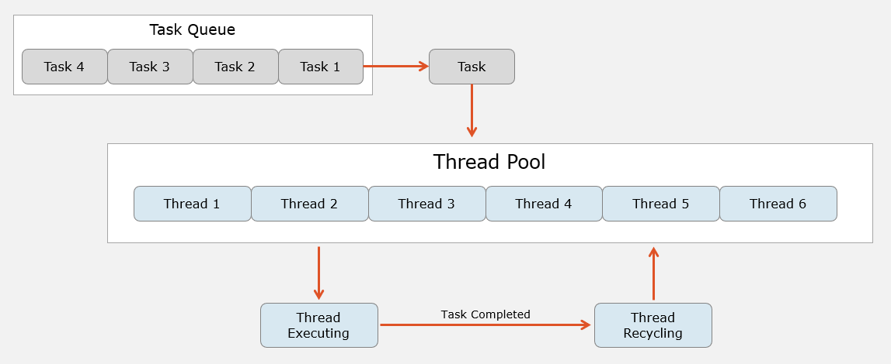

# 线程池详解

## 一、为什么需要线程池？（手工创建线程的痛苦）

**先回忆一下我们之前怎么创建线程**：
```csharp
// 每来一个任务，就 new 一个线程
for (int i = 0; i < 10; i++)
{
    new Thread(() => {
        DoWork();
    }).Start();
}
```

**这就像**：
- 每来一份外卖订单，就招一个外卖员，送完就开除
- 下个订单来了，再招一个，送完再开除
- 一天招100次，招人的成本比送外卖还高！

**手工创建线程的三大痛点**：
1. **创建销毁成本高**：线程是操作系统资源，`new Thread()` 和线程销毁都很慢（毫秒级）
2. **线程太多会卡死**：开1000个线程，CPU都花在切换线程上，程序卡成PPT
3. **无法控制**：线程开出去就像脱缰野马，无法统一管理、限流

**线程池就是解决这些问题的"线程管家"**。

---

## 二、线程池是什么？（线程的"人才市场"）

**大白话理解**：线程池是系统维护的**线程复用池**。它提前开好一批线程（默认几个到几十个），有任务就把任务塞给空闲线程，干完活的线程不会销毁，而是回到池子里等下一个任务。

**类比**：外卖公司的"骑手团队"。公司常年养着50个骑手，有订单就派给空闲骑手，送完外卖的骑手继续待命，而不是开除。

**核心概念**：
- **工作线程**：池子里的线程，一直在后台跑
- **任务队列**：用户提交的任务先排队，线程空闲了就去队列里取
- **自动管理**：线程不够用时会慢速创建新线程，空闲久了会销毁



---

## 三、如何使用线程池？（两个简单方法）

### 方法1：`ThreadPool.QueueUserWorkItem`（最原始）

```csharp
using System;
using System.Threading;

class Program
{
    static void Main()
    {
        Console.WriteLine($"主线程 {Thread.CurrentThread.ManagedThreadId} 提交任务...");
        
        // 把任务塞进线程池队列
        ThreadPool.QueueUserWorkItem(DoWork, "任务A");
        ThreadPool.QueueUserWorkItem(DoWork, "任务B");
        ThreadPool.QueueUserWorkItem(DoWork, "任务C");
        
        Console.WriteLine("主线程：任务已提交，我继续干别的");
        
        Thread.Sleep(3000); // 等线程池里的任务跑完
    }

    // 任务方法必须符合签名：void MethodName(object state)
    static void DoWork(object state)
    {
        string taskName = (string)state;
        Console.WriteLine($"任务 {taskName} 在线程 {Thread.CurrentThread.ManagedThreadId} 上开始");
        Thread.Sleep(1000); // 模拟工作
        Console.WriteLine($"任务 {taskName} 完成");
    }
}
```

**输出**：
```
主线程 1 提交任务...
主线程：任务已提交，我继续干别的
任务 任务A 在线程 5 上开始
任务 任务B 在线程 6 上开始
任务 任务C 在线程 7 上开始
任务 任务A 完成
任务 任务B 完成
任务 任务C 完成
```

**关键点**：
- `QueueUserWorkItem` 把任务塞进队列就返回，**不等待任务完成**
- 任务由线程池里的**后台线程**执行（`IsBackground = true`）
- 任务方法必须是 `void Method(object state)` 签名

---

### 方法2：Lambda 简写（推荐）

```csharp
static void Main()
{
    for (int i = 0; i < 5; i++)
    {
        int taskId = i; // 必须捕获循环变量
        ThreadPool.QueueUserWorkItem(_ => {
            Console.WriteLine($"任务 {taskId} 在线程 {Thread.CurrentThread.ManagedThreadId} 执行");
            Thread.Sleep(500);
        });
    }
    
    Thread.Sleep(3000);
}
```

---

## 四、线程池的优点（三大好处）

### **复用线程，省资源**
```csharp
// 手工创建：10个任务 = 10次 new Thread() = 10次销毁
for (int i = 0; i < 10; i++)
{
    new Thread(DoWork).Start(); // 每个任务都新建销毁
}

// 线程池：10个任务可能只用了2-3个线程
for (int i = 0; i < 10; i++)
{
    ThreadPool.QueueUserWorkItem(DoWork); // 线程1干完任务1，接着干任务4
}
```

**性能对比**：
- `new Thread()`：创建约 1-2ms，销毁约 0.5ms
- 线程池：复用已有线程，**开销接近 0**

### **自动管理，不操心**
```csharp
// 线程池会自动：
// - CPU忙时，慢速创建新线程（最多到几千个）
// - CPU闲时，销毁空闲线程（保留最小数量）
// - 防止线程爆炸式增长

// 你只管提交任务，不用管线程死活
ThreadPool.QueueUserWorkItem(DoWork);
```

### **系统级优化**
```csharp
// 线程池会：
// - 平衡负载：任务均匀分配给线程
// - 避免饥饿：不会某个线程忙死，其他闲死
// - 适合IO密集型：线程等待IO时会释放CPU
```

---

## 五、线程池的局限性（三大缺点）

### **无法精确控制**
```csharp
// 不能设置线程优先级
ThreadPool.QueueUserWorkItem(_ => {
    // 无法设置为 Highest
    Thread.CurrentThread.Priority = ThreadPriority.Highest; // 无效！
});

// 不能控制线程数量
// 线程池有自己的算法，你调不了
```

### **无法手动终止**
```csharp
ThreadPool.QueueUserWorkItem(_ => {
    // 这个任务一旦提交，无法取消或终止
    // 即使你想 Abort，也拿不到 Thread 对象
    while (true) { } // 死循环就永远占着线程
});
```

### **不适合长时间任务**
```csharp
// 线程池线程是短作业设计的
ThreadPool.QueueUserWorkItem(_ => {
    Thread.Sleep(300000); // 睡5分钟
    // 后果：线程池以为这个线程"忙"，会创建新线程补位
    // 最终线程池会被长任务占满，无法处理新任务
});
```

**原则**：线程池适合 **< 1秒** 的短任务，长任务请用 `new Thread()` 或 `Task`（后面会讲）。

---

## 六、线程池 vs 手动创建 Thread：怎么选？

| 场景 | 线程池 | new Thread() |
|------|--------|--------------|
| **短任务（<1秒）** | ✅ **完美**：复用，性能高 | ❌ 创建销毁开销大 |
| **长任务（>1秒）** | ❌ 会占满池子 | ✅ **适合**：独立线程，互不影响 |
| **需要控制优先级** | ❌ 无法控制 | ✅ 可以设置 Priority |
| **需要手动终止** | ❌ 拿不到 Thread 对象 | ✅ 有 Thread 对象，可 Abort/Join |
| **大量并发任务** | ✅ **完美**：自动限流 | ❌ 线程爆炸，系统卡死 |
| **需要后台线程** | ✅ 默认就是后台 | ✅ 可设置 IsBackground |
| **代码简洁度** | ✅ 一行提交 | ❌ 需要管理生命周期 |

**简单选择法则**：
- **CPU/IO 密集型短任务**：用线程池
- **长时间运行的后台任务**：用 `new Thread()`
- **不确定**：默认用线程池，除非遇到上述限制

---

## 七、线程池的默认配置（了解即可）

```csharp
// 获取/设置最小线程数（系统会保留这么多空闲线程）
ThreadPool.GetMinThreads(out int workerThreads, out int ioThreads);
ThreadPool.SetMinThreads(4, 4); // 建议别乱改

// 获取/设置最大线程数（上限）
ThreadPool.GetMaxThreads(out workerThreads, out ioThreads);
ThreadPool.SetMaxThreads(100, 100); // 默认是 CPU 核心数 * 1000

// 当前线程数
ThreadPool.GetAvailableThreads(out workerThreads, out ioThreads);
Console.WriteLine($"可用工作线程: {workerThreads}, IO线程: {ioThreads}");
```

**注意**：**99%的情况下不要修改这些值**，系统默认配置已经优化过了。乱改可能导致性能下降。

---

## 八、新手陷阱（必看）

### **陷阱1：主线程退出，线程池任务全被杀**
```csharp
static void Main()
{
    ThreadPool.QueueUserWorkItem(_ => {
        Thread.Sleep(5000);
        Console.WriteLine("任务完成"); // 可能看不到！
    });
    
    // 主线程1秒后就结束了
    Thread.Sleep(1000);
    // 后果：线程池是后台线程，主线程结束，程序退出，任务被强制终止
}
```

**解决**：主线程必须等待任务完成
```csharp
Thread.Sleep(6000); // 等久一点
// 或者用 CancellationToken 优雅退出（后面讲）
```

### **陷阱2：线程池线程里抛异常，程序崩溃**
```csharp
ThreadPool.QueueUserWorkItem(_ => {
    throw new Exception("boom"); // 没人 catch，程序直接崩
});
```

**解决**：任务内部必须 try-catch
```csharp
ThreadPool.QueueUserWorkItem(_ => {
    try
    {
        DoWork();
    }
    catch (Exception ex)
    {
        Console.WriteLine($"任务异常: {ex.Message}");
    }
});
```

### **陷阱3：以为任务按提交顺序执行**
```csharp
for (int i = 0; i < 5; i++)
{
    int id = i;
    ThreadPool.QueueUserWorkItem(_ => {
        Console.WriteLine($"任务{id}");
    });
}
// 输出可能是：3, 0, 4, 1, 2（顺序不保证）
```

**真相**：线程池有多个线程，任务**并行执行**，顺序随机。如需顺序，用**单线程线程池**（`TaskScheduler` 后面讲）。

---

## 九、总结

**线程池的核心**：
- **线程复用**：避免反复创建销毁
- **自动管理**：系统帮你调优
- **适合短任务**：< 1秒的最佳选择

**使用口诀**：
```csharp
// 短任务，扔池里
ThreadPool.QueueUserWorkItem(_ => QuickWork());

// 长任务，自己new
new Thread(() => LongWork()).Start();

// 不确定，先池子
// 出问题了再换
```

**记住**：线程池是**工具箱里的瑞士军刀**，小巧方便，但不是万能。遇到控制需求强的场景，老老实实 `new Thread()`。
