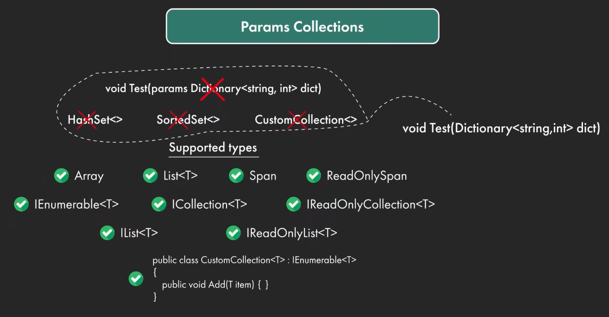

在 C# 13 之前，`params` 关键字是“残疾”的——它**只能修饰一维数组**（比如 `params int[]`）。这带来了一个巨大的痛点：每次调用含有 `params` 的方法时，如果传入的是离散的参数，**编译器都会在底层隐式地 `new` 一个数组，从而造成堆内存分配（Heap Allocation）**。在高性能、高频调用的场景（如日志记录、数据解析）下，这会导致 GC（垃圾回收）压力骤增。

C# 13 彻底打破了这一限制！正如图片所示，`params` 现在可以支持极其丰富的集合类型。



---

### 支持的类型

图片下方列出了大量带有绿色勾号的类型，这些是 C# 13 中 `params` 完美支持的目标类型。其背后的核心原理是：**C# 13 的 `params` 底层直接复用了 C# 12 引入的“集合表达式（Collection Expressions `[...]`）”的底层构建机制。**

#### 性能之王：`Span<T>` 和 `ReadOnlySpan<T>`
这是 C# 13 `params` 更新中**最重要、最具颠覆性**的特性。
当你使用 `params ReadOnlySpan<T>` 时，编译器不会在堆（Heap）上分配数组，而是直接在**栈（Stack）** 上分配一段连续的内存，或者在编译期将其内联！这意味着**零内存分配（Zero Allocation）**。

**例子 1：零分配的高性能计算**
```csharp
public class MathHelper
{
    // 以前必须写 params int[] numbers，每次调用都会 new int[]
    // 现在直接用 ReadOnlySpan，性能拉满
    public static int Sum(params ReadOnlySpan<int> numbers)
    {
        int total = 0;
        foreach (var num in numbers)
        {
            total += num;
        }
        return total;
    }
}

// 调用端写法没有任何变化，但底层彻底变了！
// 编译器会将其转化为类似：MathHelper.Sum((ReadOnlySpan<int>)[1, 2, 3, 4, 5]);
int result = MathHelper.Sum(1, 2, 3, 4, 5); 
Console.WriteLine(result); // 15
```

#### 接口类型：`IEnumerable<T>`, `IList<T>`, `IReadOnlyList<T>` 等
图片中列出了多达 6 种接口。这极大地提升了 API 设计的灵活性（依赖倒置原则）。你可以直接要求传入一个接口，编译器会自动在底层为你生成一个轻量级的实现类（通常是一个隐藏的数组或列表）来装载这些参数。

**例子 2：更优雅的 API 设计**
```csharp
public class Logger
{
    // 方法签名只需要一个只读列表接口
    public void LogMessages(params IReadOnlyList<string> messages)
    {
        for (int i = 0; i < messages.Count; i++)
        {
            Console.WriteLine($"[{i}]: {messages[i]}");
        }
    }
}

var logger = new Logger();
// 编译器会自动创建一个实现了 IReadOnlyList 的集合传进去
logger.LogMessages("系统启动", "加载配置", "连接数据库");
```

#### 具体泛型类：`List<T>`
如果你在方法内部不仅需要读取参数，还需要往里面添加新元素，你可以直接使用 `params List<T>`。编译器会自动帮你 `new List<T>()` 并调用 `Add` 方法。

**例子 3：需要修改参数集合的场景**
```csharp
public void ProcessAndAppend(params List<string> items)
{
    // 可以直接往 params 传进来的集合里加东西
    items.Add("EndOfData"); 
    
    foreach(var item in items)
    {
        Console.WriteLine(item);
    }
}

ProcessAndAppend("Apple", "Banana"); 
// 输出: Apple, Banana, EndOfData
```

#### 自定义集合：满足特定模式的 `CustomCollection<T>`
看图片最底部的那段代码，它说明了如何让你的自定义类支持 `params`：
**条件是**：你的类必须实现 `IEnumerable<T>`（或其派生接口），**并且**必须包含一个公开的 `Add(T item)` 方法（这其实就是 C# 经典的集合初始化器模式）。

**例子 4：让自定义容器支持 Params**
```csharp
// 满足条件的自定义集合
public class MyQueue<T> : IEnumerable<T>
{
    private Queue<T> _queue = new();

    // 必须有 Add 方法，编译器在组装 params 时会疯狂调用它
    public void Add(T item) => _queue.Enqueue(item);

    public IEnumerator<T> GetEnumerator() => _queue.GetEnumerator();
    IEnumerator IEnumerable.GetEnumerator() => GetEnumerator();
}

public class Demo
{
    // 直接用自定义类型作为 params
    public void PrintQueue(params MyQueue<string> queue)
    {
        foreach (var q in queue)
        {
            Console.WriteLine("排队中: " + q);
        }
    }
}

var demo = new Demo();
// 编译器会执行: var q = new MyQueue<string>(); q.Add("张三"); q.Add("李四");
demo.PrintQueue("张三", "李四"); 
```

---

### 不支持的类型

图片上半部分的虚线框里，明确给 `Dictionary<string, int>`、`HashSet<>`、`SortedSet<>` 和不符合规范的 `CustomCollection<>` 打了红叉。这是为什么呢？

#### 为什么不支持 `Dictionary`？
`params` 的本质是将**逗号分隔的单一值序列**（如 `1, 2, 3`）打包成一个集合。
而 `Dictionary` 是键值对（Key-Value Pair）。如果你写 `params Dictionary<string, int> dict`，调用时传什么呢？传 `"age", 18` 吗？编译器无法猜测哪些参数是 Key，哪些是 Value。由于这种**结构上的不匹配**，字典被明确排除在 `params` 之外。

*(注：如果你需要传字典，只能老老实实按照图片右侧箭头指示的那样，去掉 params 关键字，直接传字典对象本身。)*

#### 为什么不支持 `HashSet<T>` 和 `SortedSet<T>`？
这是一个**语义逻辑**上的考量。
`params` 传递的参数通常被视为一个**有序且允许重复**的序列（Sequence）。如果你调用 `Method(1, 2, 1)`，你期望方法接收到 3 个参数。
但 `HashSet`（哈希集合）和 `SortedSet`（有序集合）的特性是**去重**的。如果允许使用 `params HashSet<int>`，开发者传入 `1, 2, 1`，方法内部拿到的集合长度却变成了 2。这种隐式的数据丢失会引发极大的歧义和 Bug，因此 C# 设计团队认为它们不适合作为 `params` 的默认接收容器。

---

### 总结：为什么要关心这个特性？

如果你是在维护一个比较底层的库，或者对性能要求极高的系统（如游戏后端、高频交易、大型 Web 服务），**请立刻将你的 `params T[]` 替换为 `params ReadOnlySpan<T>`**！

**带来的改变是立竿见影的：**
1. **代码完全向下兼容**：方法的调用方一行代码都不用改。
2. **垃圾回收压力骤降**：以前调用一百万次这个方法，会产生一百万个小数组对象，触发无数次 GC0 回收；现在变成了 0 分配，系统会变得极其平滑。
3. **接口更纯粹**：不再被强制绑定到具体的 `Array` 类型上，代码解耦度更高。