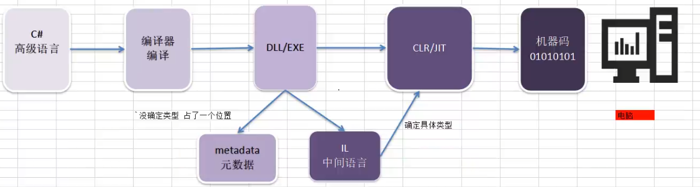
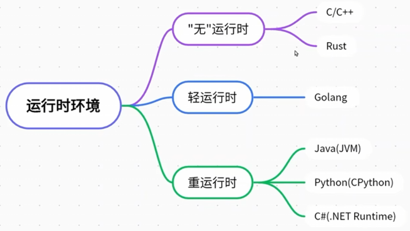

# Csharp源代码到运行时主要阶段

在 C# 中，从源代码到运行时的整个过程可以分为以下主要阶段：
```text
源代码(.cs) → 编译 → IL/程序集(.exe/.dll) → CLR加载 → JIT编译 → 本机代码 → 执行
```

## 源代码阶段：
1. **编写源代码：** 开发者编写 C# 源代码文件（`.cs`）。

## 编译阶段：
1. **编译：** 使用 C# 编译器（`csc.exe`）将源代码编译为中间语言（IL，Intermediate Language）代码。生成的文件通常是一个扩展名为 `.exe`（可执行文件）或 `.dll`（动态链接库）的程序集。
2. **生成[[元数据]]：** 编译过程中，生成包含程序集信息的[[元数据]]，包括类型、成员、版本等信息。

## JIT 编译阶段：
1. **JIT 编译：** 在运行时，Common Language Runtime（CLR）的 JIT 编译器负责将 IL 代码编译为本地机器代码。这一步是在程序加载到内存时进行的，即时（Just-In-Time）编译。

## 执行阶段：
1. **加载程序集：** CLR 加载编译好的程序集，包括 IL 代码和[[元数据]]。
2. **执行程序：** 程序在 CLR 中执行，JIT 编译器将 IL 代码转换为本地机器代码。执行过程中，CLR 负责内存管理、类型检查、垃圾回收等任务。

## 总结：
1. **开发者阶段：** 编写源代码。
2. **编译阶段：** 编译源代码生成 IL 代码和[[元数据]]。
3. **JIT 编译阶段：** 在运行时将 IL 代码编译为本地机器代码。
4. **执行阶段：** 加载程序集，执行程序，CLR 负责管理运行时环境。




## 编译 vs 运行

|             | 编译期                        | 运行时                     |
| ----------- | -------------------------- | ----------------------- |
| **发生时间**    | 发生在构建过程中，源代码被翻译为目标代码或中间代码。 | 发生在程序实际运行时，加载到内存并执行。    |
| **可能出现的错误** | 静态检查错误，如语法错误、类型错误等。        | 动态运行时错误，如空指针引用、除零错误等。   |
| **排查难度**    | 错误信息清晰，易于定位和修复。            | 错误可能更难以排查，需要使用调试工具进行追踪。 |
|             |                            |                         |

|          | 无运行时                | 有运行时                            |
| :------: | ------------------- | ------------------------------- |
| **内存管理** | 程序员需要手动管理内存分配和释放。   | 运行时环境负责内存管理，可能包括自动内存分配和垃圾回收。    |
| **线程模型** | 通常依赖操作系统提供的线程机制。    | 可能提供自己的线程管理机制，与操作系统的线程模型有一定差异。  |
| **系统调用** | 直接使用操作系统提供的系统调用接口。  | 通过运行时环境提供的接口进行系统调用，可能会屏蔽一些底层细节。 |
| **运行效率** | 对于底层硬件和操作系统有更直接的控制。 | 需要运行时环境的支持，可能引入一些开销。            |
## 动态库 vs. 静态库 - 编译和链接阶段：
| 阶段 | 静态库 | 动态库 |
| ---- | ---- | ---- |
| **定义** | 静态库是在编译时被链接到程序的库，代码在程序编译阶段就被静态地合并。 | 态库是在运行时加载到内存的库，它的代码在程序执行时被动态地链接。 |
| **文件格式** | `.lib`（Windows）或 `.a`（Unix/Linux） | `.dll`（Windows）或 `.so`（Unix/Linux） |
| **编译和链接阶段** | 静态库的代码在编译时被整合到程序中 | 编译时不包含库的代码，只在链接时引用库的符号 |
| **作用** | 提供独立的代码副本，每个程序有自己的库的实例，适用于没有外部库的环境 | 节省内存，允许在运行时替换库的版本，减小程序的可执行文件大小 |
## 动态库 vs. 静态库 - 区别和使用场景：
| 特点          | 静态库                         | 动态库                    |
| ----------- | --------------------------- | ---------------------- |
| **链接方式**    | 链接在编译时                      | 链接在运行时                 |
| **内存占用**    | 每个程序有自己的库的实例，可能占用更多内存       | 共享内存，多个程序可以共享同一个动态库的实例 |
| **更新和维护**   | 需要重新编译整个程序，更新较为繁琐           | 可在运行时替换库的版本，更容易更新      |
| **可执行文件大小** | 可执行文件较大，因为库的代码在编译时合并到可执行文件中 | 可执行文件较小，因为库的代码在运行时加载   |
|             |                             |                        |


# 反射
程序正在运行时，可以查看其它[[程序集]]或者自身的[[元数据]]。
一个**运行的程序查看本身或者其它程序的[[元数据]]的行为**就叫做反射

在程序运行时，通过反射可以得到其它[[程序集]]或者自己[[程序集]]代码的各种信息
类，函数，变量，对象等等，实例化它们，执行它们，操作它们


exe/dll(主要区别是exe有入口) 
**metadata**: 描述dll/exe文件的一个 **数据清单**
**反射**: 用来操作获取[[元数据]]         就是一个操作metadata的一个类库, 用来操作[[元数据]]中的**类, 方法, 属性, [[特性]], ** 

为什么通过反射去间接操作? 
1. **我们需要动态**  (这些 "动态" 操作都是在运行时期根据运行时的信息来进行的，而不是在编译时期就确定好的。这使得程序更加灵活，能够处理一些在编译时难以确定的情况。)
2. **读取私有的对象**


## Type（类的信息类）
它是反射功能的基础！
它是访问[[元数据]]的主要方式。 
使用 Type 的成员获取有关类型声明的信息
有关类型的成员（如构造函数、方法、字段、属性和类的[[事件]]）

```csharp
int a = 32;
Type t1 = a.GetType();
Type t2 = typeof(int);
// 必须要包含命名空间.类名
Type t3 = Type.GetType("System.Int32");

// 每一个类只有一份元数据, 所以上面的t1, t2, t3 指向的是同一个堆空间
```

## 获取所有公共成员 （GetMembers
成员包括：成员变量，成员函数等等
```csharp
class Test
{
    private int i = 0;
    public int j = 1;
    public string str = "hello world";
    public Test() { }
    public Test(int i)
    {
        this.i = i;
    }
    public Test(int i, string s) : this(i)
    {
        this.str = s;
    }
    public void Fun()
    {
        Console.WriteLine(str);
    }
}

Type t = typeof(Test);
MemberInfo[] memberInfos = t.GetMembers();
for (int i = 0; i < memberInfos.Length; i++) Console.WriteLine(memberInfos[i]);
```

## 获取类所有的公共构造函数并调用 （GetConstructors
```csharp
// 所有公共构造函数
ConstructorInfo[] ctors = t.GetConstructors();


// 得构造函数传入 Type数组 数组中内容按顺序是参数类型
// 执行构造函数传入  object数组 表示按顺序传入的参数

// 无参构造获取
Type t = typeof(Test);
ConstructorInfo constructorInfo = t.GetConstructor(new Type[0]);
Test test = constructorInfo.Invoke(null) as Test;

// 有参构造获取    获取一个参数为int的构造函数
Type t = typeof(Test);
ConstructorInfo constructorInfo = t.GetConstructor(new Type[1] { typeof(int) });
Test test = constructorInfo.Invoke(new object[1] { 666 }) as Test;

```

## 获取类所有公共成员变量 （GetFields
`FieldInfo` 类是 .NET 反射中的一个类，用于表示和操作类或结构体的字段信息。字段是类或结构体中的成员变量，通常用于存储对象的状态。`FieldInfo` 类提供了访问字段的[[元数据]]和运行时值的方法。

以下是一些 `FieldInfo` 类的常用属性和方法：

1. **属性：**
    - **Name:** 获取字段的名称。
    - **FieldType:** 获取字段的类型。
    - **IsPublic, IsPrivate, IsStatic, IsInitOnly:** 判断字段的访问修饰符和其他属性。
    - **DeclaringType:** 获取定义该字段的类的 `Type` 对象。
2. **方法：**
    - **GetValue(object obj):** 获取指定对象上的字段值。需要传递目标对象的实例作为参数。
    - **SetValue(object obj, object value):** 设置指定对象上的字段值。需要传递目标对象的实例和要设置的值作为参数。

以下是一个简单的示例，演示如何使用 `FieldInfo` 获取和操作字段：
```csharp
// 得到所有公共成员变量
Type t = typeof(Test);
FieldInfo[] fieldInfos = t.GetFields();


// 得到指定名称的公共成员
Type t = typeof(Test);
FieldInfo fieldInfo = t.GetField("str");
// 通过反射 获取其它程序集的对象的某个成员变量的值
// 假设下面的Test是其他程序集new出来的, Test.str = "wocao"
Test test = new Test(999, "wocao");
Console.WriteLine(fieldInfo.GetValue(test));    // 获取到test.str 

// 通过反射 设置其它程序集的对象的某个成员变量的值   第一个参数是想要通过反射操作的对象!
fieldInfo.SetValue(test, "hello world");
Console.WriteLine(fieldInfo.GetValue(test));


using System;
using System.Reflection;

public class MyClass
{
    public int PublicField;
    private string PrivateField;

    public MyClass(int value)
    {
        PublicField = value;
        PrivateField = "PrivateFieldValue";
    }
}

class Program
{
    static void Main()
    {
        Type myClassType = typeof(MyClass);

        // 获取字段信息
        FieldInfo publicFieldInfo = myClassType.GetField("PublicField");
        FieldInfo privateFieldInfo = myClassType.GetField("PrivateField", BindingFlags.NonPublic | BindingFlags.Instance);

        // 创建 MyClass 实例
        MyClass myObject = new MyClass(42);

        // 读取和修改字段的值
        int publicFieldValue = (int)publicFieldInfo.GetValue(myObject);
        Console.WriteLine($"PublicField value: {publicFieldValue}");

        privateFieldInfo.SetValue(myObject, "NewPrivateFieldValue");
        string privateFieldValue = (string)privateFieldInfo.GetValue(myObject);
        Console.WriteLine($"PrivateField value: {privateFieldValue}");
    }
}

```


## 获取了所有公共成员函数 （GetMethods
```csharp
// 获取所有公共成员函数并执行
Type t = typeof(string);
MethodInfo[] methodInfos = t.GetMethods();
for (int i = 0; i < methodInfos.Length; i++) Console.WriteLine(methodInfos[i]);

// 获取特定名称的公共成员函数
MethodInfo methodInfo = t.GetMethod("Substring", new Type[] { typeof(int), typeof(int) });

// 执行该方法
string str = "hello world";

// 第一个参数是想要通过反射操作的对象 相当于 对象.XX    如果是静态就传 null    
str = methodInfo.Invoke(str, new object[] { 0, 5 }) as string;
Console.WriteLine(str);


Type myClassType = typeof(MyClass);

// 获取所有公共方法
MethodInfo[] publicMethods = myClassType.GetMethods();

// 输出方法信息
foreach (MethodInfo methodInfo in publicMethods)
{
    Console.WriteLine($"Method Name: {methodInfo.Name}");
    Console.WriteLine($"Return Type: {methodInfo.ReturnType}");
    
    // 获取方法的参数信息
    ParameterInfo[] parameters = methodInfo.GetParameters();
    Console.Write("Parameters: ");
    foreach (ParameterInfo parameter in parameters)
    {
        Console.Write($"{parameter.ParameterType} {parameter.Name} ");
    }
    Console.WriteLine();

    Console.WriteLine();
}


```

## 其它    type.GetXXX
```csharp
//得枚举
GetEnumName
GetEnumNames

//得事件
GetEvent
GetEvents

//得接口
GetInterface
GetInterfaces

//得属性
GetProperty
GetPropertys
//等等

```

## 快速通过反射实例化对象 Activator
使用 `Activator` 类的主要优势在于在运行时创建对象，尤其是当不知道具体类型的情况下。然而，需要注意的是，使用 `Activator` 可能会导致性能损失，因为它依赖于反射机制。在已知类型的情况下，直接使用 `new` 操作符通常是更好的选择。
```csharp
// 快速将Type实例化为对象    无参构造
Type t = typeof(Test);
Test test = Activator.CreateInstance(t) as Test;
// 有参构造     后面参数如果不对会报错
test = Activator.CreateInstance(t, 666, "wocao") as Test;
```

## Assembly
[[程序集]]类Assembly: 主要用来加载其它[[程序集]]，加载后 才能用Type来使用其它[[程序集]]中的信息
如果想要使用不是自己[[程序集]]中的内容 需要先加载[[程序集]] 比如 dll文件(库文件)
简单的把库文件看成一种代码仓库，它提供给使用者一些可以直接拿来用的变量、函数或类
 

三种加载[[程序集]]的函数:
一般用来加载在同一文件下的其它[[程序集]]
Assembly asembly2 = Assembly.Load("[[程序集]]名称");

一般用来加载不在同一文件下的其它[[程序集]]
Assembly asembly = Assembly.LoadFrom("包含[[程序集]]清单的文件的名称或路径");
Assembly asembly3 = Assembly.LoadFile("要加载的文件的完全限定路径");

```csharp
Assembly assembly = Assembly.LoadFrom(@"D:\\Myproject VS\\静态\\bin\\Debug\\net8.0\\test.dll");
Type[] types = assembly.GetTypes();
Type t = assembly.GetType("test.Icon");

t.XXX
```


## 判断一个类型是否可以让其它类型给自己分配空间  (父类装子类) IsAssignableFrom
```csharp
class Father {}
class Son : Father {}

Type fatherType = typeof(Father);
Type sonType = typeof(Son);
if (fatherType.IsAssignableFrom(sonType))
{
	Console.WriteLine("可以用sonType来给fatherType分配内存");
	Father f = Activator.CreateInstance<Son>();
}
```

## 通过反射获取泛型类型的 泛型参数(<参数1, ...>) GetGenericArguments
```csharp
Dictionary<int, List<string>> dic = new Dictionary<int, List<string>>();
Type dicType = dic.GetType();
Type[] types = dicType.GetGenericArguments();
for (int i = 0; i < types.Length; i++)
	Console.WriteLine(types[i]);
```

