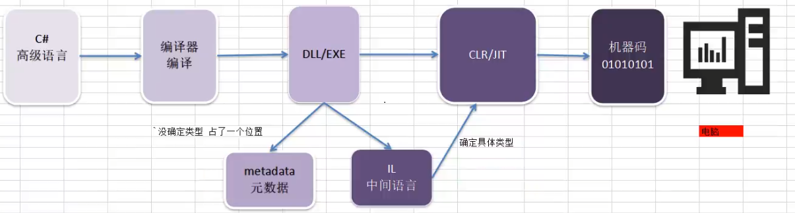

第一篇笔记作为整个系列的基石，最重要的是**建立直觉**和**理解底层运作机制**。不要一上来就开始写各种复杂的 API 调用，而是要搞清楚“反射到底是什么”、“它为什么能存在”以及“它的入口在哪里”。

# C# 反射系列笔记（一）：前置基础与核心概念

## 引言
在 C# 进阶的道路上，“反射（Reflection）”是一座绕不开的大山。无论是经常使用的 ORM 框架（如 Entity Framework、Dapper）、依赖注入容器（如 Autofac），还是各种序列化工具（如 JSON.NET），底层都重度依赖反射技术。

要掌握反射，我们不能只背 API，必须先理解它的底层逻辑。本篇笔记将从最基础的概念出发，为你揭开反射的神秘面纱。

---

## 什么是反射？（通俗理解）

在日常写代码时，我们通常是“静态”地使用类：
```csharp
Person p = new Person(); 
p.SayHello();
```
在这个过程中，编译器在**编译时**就已经知道 `Person` 是什么，它有哪些方法。

**而反射，赋予了程序在“运行时（Runtime）”审视自己、发现自己、甚至修改自己的能力。**
打个比方：
*   **普通编程**就像是你按照说明书（代码）组装一台机器。
*   **反射**就是程序在运行时，获取自身结构的“说明书”，并根据说明书来操作自己。

官方定义：**反射提供描述程序集、模块和类型的对象（Type 类型）。可以使用反射动态创建类型的实例，将类型绑定到现有对象，或从现有对象获取类型并调用其方法，或访问其字段和属性。**

---

## 前置基础：反射为什么能实现？

要理解反射，必须先了解 C# 程序的编译过程。反射并不是凭空产生的，它依赖于 .NET 强大的底层机制。

### C# 的编译过程
当你点击 Visual Studio 的“生成”按钮时，发生了什么？




1.  **源码 (.cs)** 经过 C# 编译器（Roslyn）。
2.  被编译成了 **中间语言（IL，Intermediate Language）** 和 **元数据（Metadata）**。
3.  这两者被打包在一起，生成了 **程序集（Assembly）**（也就是我们常见的 `.dll` 或 `.exe` 文件）。

### 核心灵魂：元数据（Metadata）
**元数据是反射能够存在的根本原因。**
什么是元数据？简单来说，就是“描述数据的数据”。

当你写下一个类：
```csharp
public class Person 
{
    public string Name { get; set; }
}
```
编译器不仅把逻辑变成了 IL 代码，还会生成一份详细的“清单”（元数据），这份清单里记录了：
*   这里有个类叫 `Person`。
*   它是 `public` 的。
*   它包含一个属性叫 `Name`，类型是 `string`。
*   它继承自 `System.Object`。

**一句话总结：反射，本质上就是 .NET 提供的、用于在运行时读取和操作“元数据”的一套 API。**

---

## 万物之源与反射入口：`System.Type`

在 C# 的反射世界里，`System.Type` 类是绝对的 C 位。它代表了 .NET 中的一种类型（比如类、接口、数组、枚举等）。

你要进行任何反射操作（获取属性、调用方法、动态实例化），**第一步永远是获取目标类型的 `Type` 对象。**

### 获取 `Type` 对象的绝招
获取 Type 对象通常有三种方式，对应不同的场景：

**方式一：`typeof` 运算符（编译时已知类型）**
这是最推荐、性能最好的方式，前提是你在写代码时就已经知道这个类叫什么。
```csharp
Type type1 = typeof(string);
Type type2 = typeof(Person);
```

**方式二：`Object.GetType()` 方法（运行时获取对象实例的类型）**
当你手上只有一个对象实例，但不知道它具体的运行时类型时使用。
```csharp
object obj = "Hello Reflection";
Type type = obj.GetType(); // 返回 System.String 的 Type
```

**方式三：`Type.GetType()` 方法（通过字符串名称获取）**
极致的动态化！只通过一个字符串就能找到类型，常用于读取配置文件来加载特定的类。
```csharp
// 注意：如果跨程序集，需要包含程序集的全名
Type type = Type.GetType("System.String"); 
Type myType = Type.GetType("MyProject.Models.Person, MyProject");
```

**方式四：`Assembly.GetType()`方法（从程序集获取）**
```cs
// 加载当前程序集
Assembly assembly = Assembly.GetExecutingAssembly();
Type type = assembly.GetType("MyNamespace.MyClass");

// 或加载指定程序集文件
Assembly loadedAssembly = Assembly.LoadFrom("MyLibrary.dll");
Type personType = loadedAssembly.GetType("MyLibrary.Models.Person");
```

### `Type` 能告诉我们什么？
拿到 `Type` 对象后，你就拿到了这个类的“户口本”。你可以探查它的一切：
```csharp
Type t = typeof(Person);

Console.WriteLine(t.Name);       // 类名：Person
Console.WriteLine(t.Namespace);  // 命名空间：MyProject.Models
Console.WriteLine(t.IsClass);    // 是否是类：True
Console.WriteLine(t.IsPublic);   // 是否公开：True
```

---

## 反射的底层机制：CLR 的元数据

### 编译后发生了什么

当你编译 C# 代码时：
```txt
源代码 (.cs)  →  编译器  →  程序集 (.exe / .dll)
                              ├── IL 代码（方法的逻辑）
                              └── 元数据（类型的描述信息）
```

**元数据就像程序集的“目录”或“说明书”**，里面记录了：
- 有哪些类、接口、结构体
- 每个类有哪些字段、属性、方法、事件
- 每个方法的参数类型、返回类型
- 每个成员是 public 还是 private
- 应用了哪些 Attribute（特性）


编译（C#编译器）后，代码被封装为**程序集**（.exe或.dll）。这个文件包含两部分：
1. **IL代码（中间语言）**：相当于“压缩后的逻辑指令”，例如 `ldstr "Hello"`、`call Console::WriteLine`。
2. **元数据（Metadata）**：这是反射的核心。它本质上是**嵌入在文件内的详细目录或数据库**。

**元数据详细记录了**：
- **类型定义**：类、结构体、接口、枚举的完整描述（名称、命名空间、可见性）。
- **成员定义**：字段（名称、类型、偏移量、私有/公有标记）、方法（名称、签名、IL代码指针、访问修饰符）、属性、事件。
- **引用信息**：本程序集引用了哪些外部类型和方法。

**关键点**：编译时，`private`关键字**并没有**导致元数据被删除，只是**在元数据中标记了 `Private` 标志位**。IL代码中通过 `call` 指令调用方法时，编译器会进行可见性检查，但这一检查在生成的IL层并不强制存在（它依赖于后续验证）。

###  运行时 CLR 如何使用元数据

```txt
程序启动
    ↓
CLR 加载程序集
    ↓
读取元数据，为每个类型创建 Type 对象
    ↓
程序可以通过 Type 对象查询元数据
    ↓
程序可以根据查询结果动态创建对象、调用方法
```
**关键点：元数据一直都在内存里！反射只是提供了一套 API 去读取和使用这些已有的信息。**


### 为什么能调用私有成员？
```cs
// 平时写代码，private 成员被编译器禁止访问：
class Secret 
{ 
    private int hidden = 42; 
}

Secret s = new Secret();
// s.hidden = 100;  ← 编译错误！

// 但反射可以：
FieldInfo field = typeof(Secret).GetField("hidden", 
    BindingFlags.NonPublic | BindingFlags.Instance);
field.SetValue(s, 100);  // 运行成功！
```
**底层原因：**
- 编译器的访问限制只是“编译时”的规则检查
- 元数据里记录了 `hidden` 是 private，但没有“禁止访问”的硬性机制
- CLR 本身在完全信任环境下**不会阻止**反射访问私有成员
- 这就像一个保险箱——平时需要钥匙，但反射是直接看设计图去操作
**注意：反射破坏封装性，框架更新时内部字段名可能变化，生产环境慎用。**


## 反射 vs 正常代码：对比理解

|维度|正常代码（静态）|反射代码（动态）|
|---|---|---|
|**类型检查**|编译时|运行时|
|**IDE 智能提示**|✅ 有|❌ 没有（用字符串写方法名）|
|**性能**|快|慢（5-100倍）|
|**可读性**|清晰|复杂、啰嗦|
|**适用场景**|大部分日常开发|框架、插件、ORM、序列化|
|**错误发现时机**|编译时就报错|运行到那行才报错|

**一个形象的比喻：**
- **正常代码**：你在自家厨房做饭——知道锅在哪，灶怎么开，闭着眼睛都能操作
- **反射代码**：你去一个陌生人的厨房做饭——需要先翻抽屉找锅，看说明书找开关在哪，每一步都要查

## 为什么要用反射？（优缺点分析）

凡事皆有代价，反射是一把锋利的双刃剑。

### 优点（应用场景）
1.  **极高的灵活性与解耦**：代码可以不依赖具体的类去编译。比如插件系统，主程序可以通过反射加载任何符合接口的第三方 `.dll`。
2.  **框架开发的基石**：如果没有反射，就写不出自动把数据库行映射到 C# 对象的 ORM，也写不出自动解析 JSON 的工具。
3.  **动态代理与 AOP**：在运行时动态生成代码或拦截方法调用。

### 缺点
1.  **性能损耗**：反射绕过了编译器的前期检查，在运行时需要大量的字符串匹配和元数据检索，比直接调用慢得多。（虽然后期可以通过 emit、表达式树或委托缓存来优化）。
2.  **类型安全问题**：编译器无法帮你检查反射代码中的错误。比如你用反射调用一个叫 `"SayHello"` 的方法，拼成了 `"SayHelo"`，编译会通过，但运行时直接抛出异常（崩溃）。
3.  **破坏封装性**：反射甚至可以强行读取和修改类的 `private` 私有字段！

**核心法则：能不用反射就不用反射；只有在需要编写高度通用、动态的框架代码时，才考虑使用反射。**


---

## 什么时候应该用反射？（不是炫技工具）
### 适合用反射的场景

1. **插件架构**：程序运行时加载未知的程序集
2. **ORM 框架**：将数据库记录映射到对象的属性（如 Entity Framework、Dapper）
3. **序列化/反序列化**：将对象的字段自动保存到 JSON/XML（如 Newtonsoft.Json）
4. **单元测试框架**：发现并运行标记了 `[Test]` 的方法
5. **依赖注入容器**：根据类型动态创建对象实例
6. **代码分析工具**：检查程序集里有哪些类型和方法

### 不应该用反射的场景

1. **已知类型的普通调用**：直接 `new` 和 `.` 操作符就行
2. **对性能敏感的代码**：比如每秒钟调用几万次的方法
3. **可以用接口/泛型替代的场景**：优先用编译时安全的方案

**经验法则：能不用反射就不用，实在没办法才用。**


---


## 一个完整的直觉小例子
```cs
using System.Reflection;

// 假设这个类在另一个 DLL 里，编译时完全不知道
public class MagicCalculator
{
    private int _secret = 42;
    
    public int Add(int a, int b) => a + b;
    
    private string GetSecretMessage() => $"The secret is {_secret}";
}

public class Program
{
    public static void Main()
    {
        // 模拟：运行时加载一个未知的类型
        Type calculatorType = typeof(MagicCalculator);  // 实际开发中可能是 Assembly.Load
        
        // 1. 查看这个类型的“说明书”
        Console.WriteLine($"类型名称: {calculatorType.Name}");
        Console.WriteLine($"是不是类: {calculatorType.IsClass}");
        
        // 2. 动态创建对象
        object calc = Activator.CreateInstance(calculatorType);
        
        // 3. 查看它有哪些公共方法
        MethodInfo[] methods = calculatorType.GetMethods();
        foreach (var m in methods)
        {
            Console.WriteLine($"公共方法: {m.Name}");
        }
        
        // 4. 动态调用 Add 方法
        MethodInfo addMethod = calculatorType.GetMethod("Add");
        int sum = (int)addMethod.Invoke(calc, new object[] { 3, 5 });
        Console.WriteLine($"3 + 5 = {sum}");  // 输出 8
        
        // 5. 访问私有字段（不推荐，但演示可行性）
        FieldInfo secretField = calculatorType.GetField("_secret", 
            BindingFlags.NonPublic | BindingFlags.Instance);
        Console.WriteLine($"秘密数字是: {secretField.GetValue(calc)}");  // 42
        
        // 6. 调用私有方法
        MethodInfo privateMethod = calculatorType.GetMethod("GetSecretMessage",
            BindingFlags.NonPublic | BindingFlags.Instance);
        string message = (string)privateMethod.Invoke(calc, null);
        Console.WriteLine(message);  // "The secret is 42"
    }
}
```

**运行结果：**
```txt
类型名称: MagicCalculator
是不是类: True
公共方法: Add
公共方法: GetType
公共方法: ToString
公共方法: Equals
公共方法: GetHashCode
3 + 5 = 8
秘密数字是: 42
The secret is 42
```

---

## 本篇总结
| 要点          | 一句话记住                                                      |
| ----------- | ---------------------------------------------------------- |
| 反射的定义       | 运行时获取类型信息并动态操作                                             |
| 为什么需要反射     | 处理编译时未知的类型（插件、动态加载）                                        |
| 反射的核心类      | `Type`——类型的“户口本”                                           |
| 获取 Type 的方式 | `typeof`、`GetType()`、`Type.GetType()`、`Assembly.GetType()` |
| 底层机制        | 元数据一直存在内存中，反射只是读取它                                         |
| 四大能力        | 查看信息、创建对象、调用方法、读写数据                                        |
| 主要缺点        | 性能差、代码啰嗦、编译时无检查                                            |
| 适用场景        | 框架、ORM、序列化、插件、IoC 容器                                       |
