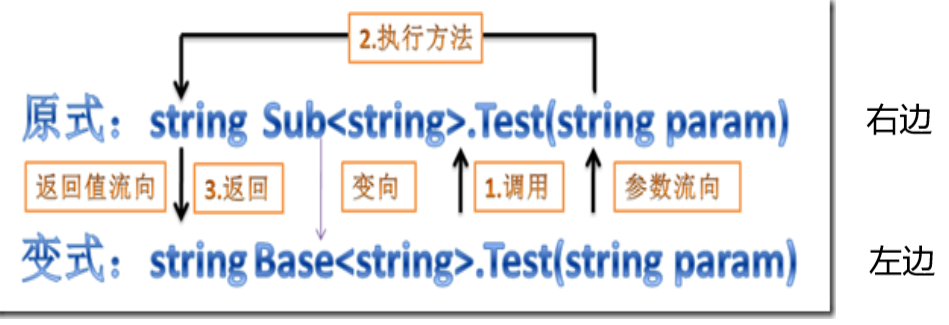
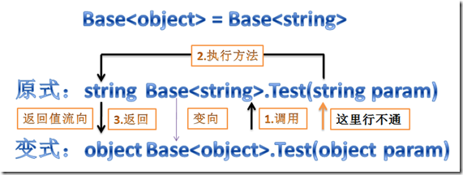
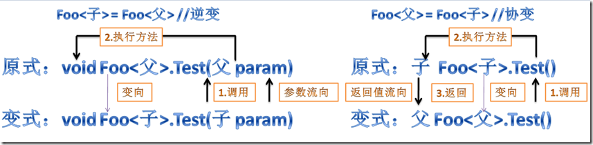
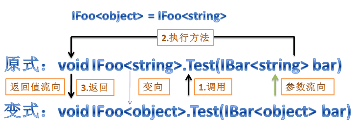

[逆变与协变详解 - zhangweiwen - 博客园 (cnblogs.com)](https://www.cnblogs.com/lemontea/archive/2013/02/17/2915065.html)

协变和逆变是用来修饰泛型类型参数T的
协变：out   表明修饰的T只能作为**返回值**来使用
逆变：in      表明修饰的T只能作为**参数**来使j用
只有**泛型接口**和**泛型委托**能使用

# 协变（Foo<父类> = Foo<子类> ）
典型场景：**生产者（输出数据），如返回值、只读集合。**

```cs
//泛型委托：
public delegate T MyFuncA<T>();//不支持逆变与协变
public delegate T MyFuncB<out T>();//支持协变
 
MyFuncA<object> funcAObject = null;
MyFuncA<string> funcAString = null;
MyFuncB<object> funcBObject = null;
MyFuncB<string> funcBString = null;
MyFuncB<int> funcBInt = null;
 
funcAObject = funcAString;//编译失败，MyFuncA不支持逆变与协变
funcBObject = funcBString;//变了，协变
funcBObject = funcBInt;//编译失败，值类型不参与协变或逆变
 
//泛型接口
public interface IFlyA<T> { }//不支持逆变与协变
public interface IFlyB<out T> { }//支持协变
 
IFlyA<object> flyAObject = null;
IFlyA<string> flyAString = null;
IFlyB<object> flyBObject = null;
IFlyB<string> flyBString = null;
IFlyB<int> flyBInt = null;
 
flyAObject = flyAString;//编译失败，IFlyA不支持逆变与协变
flyBObject = flyBString;//变了，协变
flyBObject = flyBInt;//编译失败，值类型不参与协变或逆变
 
//数组：
string[] strings = new string[] { "string" };
object[] objects = strings;
```

# 逆变（Foo<子类> = Foo<父类>）
典型场景：**消费者（输入数据），如函数参数、写入操作。**

```cs
public delegate void MyActionA<T>(T param);//不支持逆变与协变
public delegate void MyActionB<in T>(T param);//支持逆变
 
public interface IPlayA<T> { }//不支持逆变与协变
public interface IPlayB<in T> { }//支持逆变
 
MyActionA<object> actionAObject = null;
MyActionA<string> actionAString = null;
MyActionB<object> actionBObject = null;
MyActionB<string> actionBString = null;
actionAString = actionAObject;//MyActionA不支持逆变与协变,编译失败
actionBString = actionBObject;//变了，逆变
 
IPlayA<object> playAObject = null;
IPlayA<string> playAString = null;
IPlayB<object> playBObject = null;
IPlayB<string> playBString = null;
playAString = playAObject;//IPlayA不支持逆变与协变,编译失败
playBString = playBObject;//变了，逆变
```

# **注意:**
- 当前仅支持接口和委托的逆变与协变 ，不支持类和方法。但数组也有协变性。
- 值类型不参与逆变与协变。

```cs
public interface Base<T>
{
    T Test(T param);
}
public class Sub<T> : Base<T>
{
    public T Test(T param) { return default(T); }
}
Base<string> b = new Sub<string>();
b.Test("你好");
```

在上面的例子中，b里面的实例是`Sub<string>` `b.Test("你好")`会把参数 “你好” 传入到Sub里面执行方法



**即调用父类的方法，其实实际是调用子类的方法。**
可以看到，这个方法能够安全的调用，需要两个条件：
1. 变式（父）的方法参数能安全转为原式（子）的参数；
2. 原式（子）的返回值能安全的转为变式的返回值。


```cs
Base<object> BaseObject = null;
Base<string> BaseString = null;
BaseObject = BaseString;//编译失败
BaseObject.Test("");
```
这里的“实际流程”如下，可以看到，参数那里是object是不能安全转换为string，所以编译失败：



看到这里如果都明白的话，我们不难得到逆变与协变的”实际流程图”（记住，它们是有in/out限制的）:



# 稍微难一点的问题
下面哪个正确？
```cs
public interface IBar<in T> { }
//应该是in
public interface IFoo<in T>
{
    void Test(IBar<T> bar);
}


//还是out
public interface IFoo<out T>
{
    void Test(IBar<T> bar);
}
```

答案是，如果是in的话，会编译失败，out才正确（当然不要泛型修饰符也能通过编译，但IFoo就没有协变能力了）。
这里的意思就是说，一个有协变（逆变）能力的泛型（IBar），作为另一个泛型（IFoo）的参数时，影响到了它（IFoo）的泛型的定义。乍一看以为是in的其中一个陷阱是T是在Test方法的参数里的，所以以为是in。但**这里Test的参数根本不是T，而是`IBar<T>`**。





