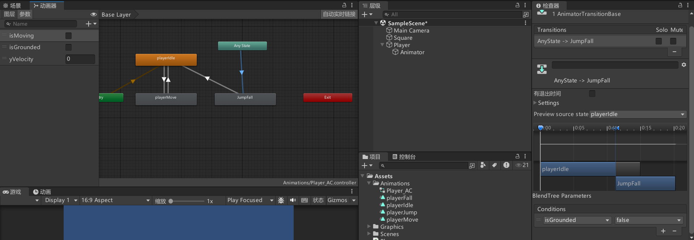

# 刚体相关


# 输入相关



# 序列化字段


# 精灵图集




导入图集，直接将png图片拖入到资源文件夹


并切割


让图中人物更加锐利


为Player创建一个子物体添加Sprite Renderer


更改中心点


# 动画控制器




为其添加动画


同理添加玩家移动动画


使用动画控制器来进行状态机切换




无痛动画切换


```cs
public class Player : MonoBehaviour
{
    private float xInput;

    [SerializeField]
    private float moveSpeed = 5f;

    private Rigidbody2D rb;

    [SerializeField]
    private float jumpForce;

    public Animator anim;

    public bool isMoving = false;

    void Start()
    {
        rb = GetComponent<Rigidbody2D>();
        // 获取子物体的Animator组件
        anim = GetComponentInChildren<Animator>();
    }

    void Update()
    {
        xInput = Input.GetAxisRaw("Horizontal");
        rb.velocity = new Vector2(xInput * moveSpeed, rb.velocity.y);

        if (Input.GetKeyDown(KeyCode.Space))
        {
            rb.velocity = new Vector2(rb.velocity.x, jumpForce);
        }


        isMoving = rb.velocity.x != 0;
        anim.SetBool("isMoving", isMoving);
    }
}

```


# 清理代码


```cs
using System.Collections;
using System.Collections.Generic;
using UnityEngine;

public class Player : MonoBehaviour
{
    private float xInput;

    [SerializeField]
    private float moveSpeed = 5f;

    private Rigidbody2D rb;

    [SerializeField]
    private float jumpForce;

    public Animator anim;


    void Start()
    {
        rb = GetComponent<Rigidbody2D>();
        // 获取子物体的Animator组件
        anim = GetComponentInChildren<Animator>();
    }

    void Update()
    {
        Movement();
        CheckInput();
        AnimatorController();
    }

    private void CheckInput()
    {
        xInput = Input.GetAxisRaw("Horizontal");

        if (Input.GetKeyDown(KeyCode.Space))
        {
            Jump();
        }
    }

    // 角色移动
    private void Movement()
    {
        rb.velocity = new Vector2(xInput * moveSpeed, rb.velocity.y);
    }


    // 跳跃操作
    private void Jump()
    {
        rb.velocity = new Vector2(rb.velocity.x, jumpForce);
    }


    // 动画控制器
    private void AnimatorController()
    {
        // 设置动画参数
        bool isMoving = rb.velocity.x != 0;
        anim.SetBool("isMoving", isMoving);
    }
}

```

整理项目结构


# 翻转角色
```cs
using System.Collections;
using System.Collections.Generic;
using UnityEngine;

public class Player : MonoBehaviour
{
    private float xInput;

    [SerializeField]
    private float moveSpeed = 5f;

    private Rigidbody2D rb;

    [SerializeField]
    private float jumpForce;

    public Animator anim;

    private int facingDir = 1; // 1表示面向右侧，-1表示面向左侧
    private bool facingRight = true; // 初始面向右侧

    void Start()
    {
        rb = GetComponent<Rigidbody2D>();
        // 获取子物体的Animator组件
        anim = GetComponentInChildren<Animator>();
    }

    void Update()
    {
        Movement();
        CheckInput();
        FlipController();
        AnimatorController();
    }

    private void CheckInput()
    {
        xInput = Input.GetAxisRaw("Horizontal");

        if (Input.GetKeyDown(KeyCode.Space))
        {
            Jump();
        }
    }

    // 角色移动
    private void Movement()
    {
        rb.velocity = new Vector2(xInput * moveSpeed, rb.velocity.y);
    }


    // 跳跃操作
    private void Jump()
    {
        rb.velocity = new Vector2(rb.velocity.x, jumpForce);
    }


    // 动画控制器
    private void AnimatorController()
    {
        // 设置动画参数
        bool isMoving = rb.velocity.x != 0;
        anim.SetBool("isMoving", isMoving);
    }


    // 角色翻转
    private void Flip()
    {
        facingDir = -1 * facingDir;
        facingRight = !facingRight;
        // 绕Y轴旋转180度
        transform.Rotate(0, 180, 0);
    }

    // 翻转控制器
    private void FlipController()
    {
        if (xInput > 0 && !facingRight)
        {
            Flip();
        }
        else if (xInput < 0 && facingRight)
        {
            Flip();
        }
    }
}

```
# 2d地面检测
通过这个红线来检测地面

设置地面层级

```cs

private bool isGrounded;

[SerializeField]
private float groundCheckDistance;

[SerializeField]
private LayerMask whatIsGround;


    void Update()
    { 
        // 是否检测到地面
        isGrounded = Physics2D.Raycast(transform.position, Vector2.down, groundCheckDistance, whatIsGround);
    }
    
    private void OnDrawGizmos()
    {
        Gizmos.color = Color.red;
        Gizmos.DrawLine(transform.position, new Vector3(transform.position.x, transform.position.y - groundCheckDistance));
    }
```


# 跳跃动画

先在Animator那添加跳跃和下落动画剪辑


创建跳跃和下落的混合树，并通过设置条件是否在地面上来进行状态切换



对混合树如下设置


代码设置
Player.cs
```cs
// 动画控制器
private void AnimatorController()
{
    // 设置动画参数
    bool isMoving = rb.velocity.x != 0;
    anim.SetFloat("yVelocity", rb.velocity.y);
    anim.SetBool("isMoving", isMoving);
    anim.SetBool("isGrounded", isGrounded);
}
```


# 粘墙问题

创建2d物理材质，将摩擦改为0


然后关联


# 冲刺与计时器

实现的框架 
```cs

[Header("冲刺信息")]
[SerializeField]
private float dashDuration;     // 冲刺持续时间

[SerializeField]
private float dashTime;         // 冲刺时间


void Update()
{

    dashTime -= Time.deltaTime;

    if (Input.GetKeyDown(KeyCode.LeftShift))
    {
        dashTime = dashDuration;
    }

    if (dashTime > 0)
    {
        Debug.Log("冲刺中...");
    }

}
```


实际实现
```cs

[Header("冲刺信息")]
[SerializeField]
private float dashDuration;     // 冲刺持续时间

[SerializeField]
private float dashTime;         // 冲刺时间

    private void Movement()
    {
        if (dashTime > 0)
        {
            rb.velocity = new Vector2(xInput * dashSpeed, rb.velocity.y);
        }
        else
        {
            rb.velocity = new Vector2(xInput * moveSpeed, rb.velocity.y);
        }
    }

```


创建冲刺动画，并进行相关状态机的设置


通过dashTime设置状态转换的参数
```cs
// 动画控制器
private void AnimatorController()
{
    // 设置动画参数
    bool isMoving = rb.velocity.x != 0;
    anim.SetFloat("yVelocity", rb.velocity.y);
    anim.SetBool("isMoving", isMoving);
    anim.SetBool("isGrounded", isGrounded);
    anim.SetBool("isDashing", dashTime > 0);
}
```


这里有个问题


可以下面设置就行


相关代码Player.cs
```cs
[Header~("冲刺信息")]
[SerializeField]
private float dashDuration;     // 冲刺持续时间

[SerializeField]
private float dashTime;         // 冲刺时间

[SerializeField]
private float dashSpeed;        // 冲刺速度~


// 角色移动
private void Movement()
{
    if (dashTime > 0)
    {
        rb.velocity = new Vector2(xInput * dashSpeed, 0);
    }
    else
    {
        rb.velocity = new Vector2(xInput * moveSpeed, rb.velocity.y);
    }
}


// 动画控制器
private void AnimatorController()
{
    // 设置动画参数
    bool isMoving = rb.velocity.x != 0;
    anim.SetFloat("yVelocity", rb.velocity.y);
    anim.SetBool("isMoving", isMoving);
    anim.SetBool("isGrounded", isGrounded);
    anim.SetBool("isDashing", dashTime > 0);
}

void Update()
{

    dashTime -= Time.deltaTime;

    if (Input.GetKeyDown(KeyCode.LeftShift))
    {
        dashTime = dashDuration;
    }
}

```


# 冲刺冷却

```cs
[SerializeField]
private float dashCooldown;      // 冲刺冷却时间
private float dashCooldownTimer;  // 冲刺冷却计时器 > 0 表示正在冷却


// 冲刺技能
private void DashAblity()
{
    // 如果冲刺计时器大于0，表示正在冲刺，不能再次冲刺
    if (dashCooldownTimer < 0)
    {
        dashCooldownTimer = dashCooldown;
        dashTime = dashDuration;
    }
}

private void CheckInput()
{
    xInput = Input.GetAxisRaw("Horizontal");

    if (Input.GetKeyDown(KeyCode.Space))
    {
        Jump();
    }
    if (Input.GetKeyDown(KeyCode.LeftShift))
    {
        DashAblity();
    }
}


void Update()
{
    Movement();
    CheckInput();
    CollisionChecks();

    dashTime -= Time.deltaTime;
    dashCooldownTimer -= Time.deltaTime;


    FlipController();
    AnimatorController();
}
```


# 攻击动画

添加各个新动画


动画过渡条件如下


动画退出条件


Player.cs
```cs
[Header("攻击信息")]
private bool isAttacking;
private int comboCounter;


public void AttackOver()
{
    isAttacking = false;
}
```

PlayerAnimEvents.cs
```cs
public class PlayerAnimEvents : MonoBehaviour
{
    private Player player;
    void Start()
    {
        player = GetComponentInParent<Player>();
    }

    private void AnimationTrigger()
    {
        // 结束攻击
        player.AttackOver();
    }
}
```

# 攻击连击

```cs
[SerializeField]
private float comboTime = 0.3f;
private float comboTimeWindow;     // 连击计时器

void Update()
{
    comboTimeWindow -= Time.deltaTime;
}

public void AttackOver()
{
    isAttacking = false;
    comboCounter = (comboCounter + 1) % 3;
}

// 检查输入
private void CheckInput()
{
    xInput = Input.GetAxisRaw("Horizontal");
    if (Input.GetKeyDown(KeyCode.Mouse0))
    {
        StartAttack();
    }
}

private void StartAttack()
{
    if (!isGrounded)
        return;

    // 如果连击计时器小于0，表示不在连击, 要写在前面
    if (comboTimeWindow < 0)
    {
        comboCounter = 0;
    }
    isAttacking = true;
    comboTimeWindow = comboTime;
}
```

# 通过继承制作敌人
分离Player中的通用内容，并新建一个类Entity以供怪物类继承
新增墙壁检测
```cs
public class Entity : MonoBehaviour
{
    protected Rigidbody2D rb;
    protected Animator anim;


    [Header("碰撞信息")]
    [SerializeField]
    protected float groundCheckDistance;


    [SerializeField]
    protected Transform groundCheck;

    [Space]

    [SerializeField]
    protected float wallCheckDistance;  // 墙壁检测距离
    [SerializeField]
    protected Transform wallCheck;
    [SerializeField]
    protected LayerMask whatIsGround;

    protected int facingDir = 1; // 1表示面向右侧，-1表示面向左侧
    protected bool facingRight = true; // 初始面向右侧

    protected bool isGrounded;
    protected bool isWallDetected;  // 是否检测到墙壁


    protected virtual void Start()
    {
        anim = GetComponentInChildren<Animator>();
        rb = GetComponent<Rigidbody2D>();

        if (wallCheck == null)
        {
            wallCheck = transform;
        }
    }

    protected virtual void Update()
    {
        CollisionChecks();
    }

    protected virtual void CollisionChecks()
    {
        // 是否检测到地面
        isGrounded = Physics2D.Raycast(groundCheck.position, Vector2.down, groundCheckDistance, whatIsGround);
        // 是否检测到墙壁
        isWallDetected = Physics2D.Raycast(wallCheck.position, facingDir * Vector2.right, wallCheckDistance, whatIsGround);
    }

    // 角色翻转
    protected virtual void Flip()
    {
        facingDir = -1 * facingDir;
        facingRight = !facingRight;
        // 绕Y轴旋转180度
        transform.Rotate(0, 180, 0);
    }
    protected virtual void OnDrawGizmos()
    {
        Gizmos.color = Color.red;
        Gizmos.DrawLine(groundCheck.position, new Vector3(groundCheck.position.x, groundCheck.position.y - groundCheckDistance));
        // 同理墙壁检测的一条线
        Gizmos.DrawLine(wallCheck.position, new Vector3(wallCheck.position.x + wallCheckDistance * facingDir, wallCheck.position.y));
    }
}

```
导入怪物资源，并进行如下设置


怪物类脚本Enemy_Skeleton.cs
```cs
public class Enemy_Skeleton : Entity
{
    bool isAttacking;

    [Header("移动信息")]
    [SerializeField]
    private float moveSpeed = 5f;

    [Header("玩家检测")]
    [SerializeField]
    private float playerCheckDistance; // 玩家检测距离
    [SerializeField]
    private LayerMask whatIsPlayer;

    private RaycastHit2D isPlayerDetected;

    protected override void Start()
    {
        base.Start();
    }

    protected override void Update()
    {
        base.Update();

        if (isPlayerDetected)
        {
            if (isPlayerDetected.distance > 1)
            {
                // 如果玩家在范围内，向玩家移动到1以内再攻击
                rb.velocity = new Vector2(moveSpeed * 1.5f * facingDir, rb.velocity.y);
                Debug.Log("我看到玩家了！我会追上去的！");
                isAttacking = false;    // 停止攻击
            }
            else
            {
                isAttacking = true;    // 开始攻击
            }
        }

        if (!isGrounded || isWallDetected)
            Flip();

        Movement();
    }

    private void Movement()
    {
        if (!isAttacking)
            rb.velocity = new Vector2(moveSpeed * facingDir, rb.velocity.y);
    }

    protected override void CollisionChecks()
    {
        base.CollisionChecks();

        isPlayerDetected = Physics2D.Raycast(transform.position, Vector2.right * facingDir, playerCheckDistance, whatIsPlayer);
    }

    protected override void OnDrawGizmos()
    {
        base.OnDrawGizmos();
        // 绘制玩家检测范围
        Gizmos.color = Color.blue;
        Gizmos.DrawLine(transform.position, new Vector3(transform.position.x + playerCheckDistance * facingDir, transform.position.y));
    }
}

```
```cs
public class Player : Entity
{
    private float xInput;

    [Header("移动信息")]
    [SerializeField]
    private float moveSpeed = 5f;

    [SerializeField]
    private float jumpForce;


    [Header("冲刺信息")]
    [SerializeField]
    private float dashDuration;     // 冲刺持续时间
    private float dashTime;         // 冲刺计时器 > 0 表示正在冲刺

    [SerializeField]
    private float dashSpeed;        // 冲刺速度

    [SerializeField]
    private float dashCooldown;      // 冲刺冷却时间
    private float dashCooldownTimer;  // 冲刺冷却计时器 > 0 表示正在冷却


    [Header("攻击信息")]
    [SerializeField]
    private float comboTime = 0.3f;
    private bool isAttacking;
    private int comboCounter;
    private float comboTimeWindow;     // 连击计时器

    protected override void Start()
    {
        base.Start();
    }

    protected virtual void Update()
    {
        base.Update();
        Movement();
        CheckInput();

        dashTime -= Time.deltaTime;
        dashCooldownTimer -= Time.deltaTime;
        comboTimeWindow -= Time.deltaTime;


        FlipController();
        AnimatorController();
    }

    public void AttackOver()
    {
        isAttacking = false;
        comboCounter = (comboCounter + 1) % 3;

    }


    // 检查输入
    private void CheckInput()
    {
        xInput = Input.GetAxisRaw("Horizontal");

        if (Input.GetKeyDown(KeyCode.Mouse0))
        {
            StartAttack();
        }
        if (Input.GetKeyDown(KeyCode.Space))
        {
            Jump();
        }
        if (Input.GetKeyDown(KeyCode.LeftShift))
        {
            DashAblity();
        }
    }

    private void StartAttack()
    {
        if (!isGrounded)
            return;

        // 如果连击计时器小于0，表示不在连击, 要写在前面
        if (comboTimeWindow < 0)
        {
            comboCounter = 0;
        }
        isAttacking = true;
        comboTimeWindow = comboTime;
    }

    // 冲刺技能
    private void DashAblity()
    {
        // 如果冲刺计时器大于0，表示正在冲刺，不能再次冲刺
        if (dashCooldownTimer < 0 && !isAttacking)
        {
            dashCooldownTimer = dashCooldown;
            dashTime = dashDuration;
        }
    }

    // 角色移动
    private void Movement()
    {
        if (isAttacking)
        {
            rb.velocity = new Vector2(0, 0);
        }
        else if (dashTime > 0)
        {
            rb.velocity = new Vector2(facingDir * dashSpeed, 0);
        }
        else
        {
            rb.velocity = new Vector2(xInput * moveSpeed, rb.velocity.y);
        }
    }


    // 跳跃操作
    private void Jump()
    {
        // 只有在地面的时候才能跳，只跳一次
        if (isGrounded)
            rb.velocity = new Vector2(rb.velocity.x, jumpForce);
    }


    // 动画控制器
    private void AnimatorController()
    {
        // 设置动画参数
        bool isMoving = rb.velocity.x != 0;
        anim.SetFloat("yVelocity", rb.velocity.y);
        anim.SetBool("isMoving", isMoving);
        anim.SetBool("isGrounded", isGrounded);
        anim.SetBool("isDashing", dashTime > 0);
        anim.SetBool("isAttacking", isAttacking);
        anim.SetInteger("comboCounter", comboCounter);
    }


    // 翻转控制器
    private void FlipController()
    {
        if (xInput > 0 && !facingRight)
            Flip();
        else if (xInput < 0 && facingRight)
            Flip();
    }

}

```

```cs
public class PlayerAnimEvents : MonoBehaviour
{
    private Player player;
    void Start()
    {
        player = GetComponentInParent<Player>();
    }

    private void AnimationTrigger()
    {
        // 结束攻击
        player.AttackOver();
    }
}

```