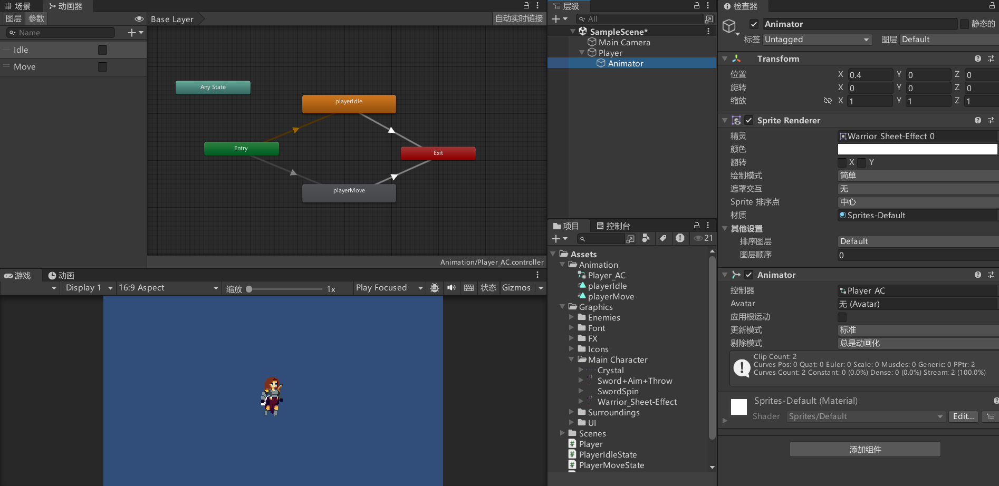
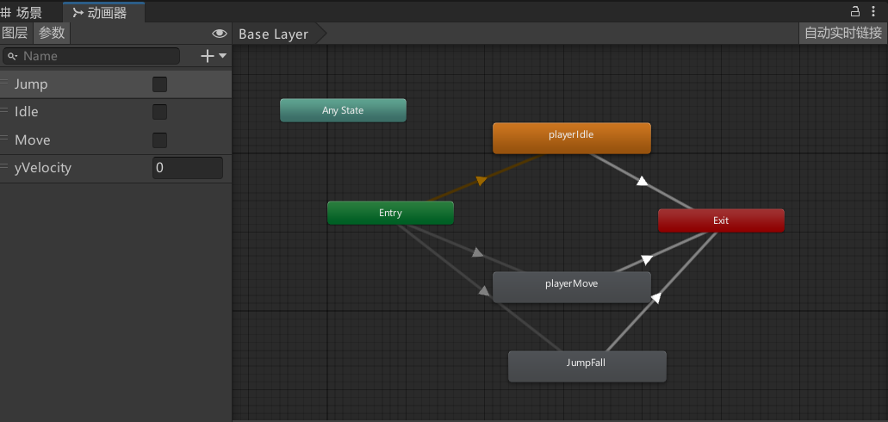
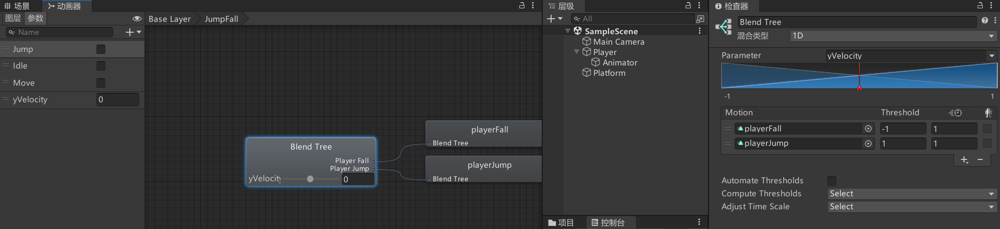
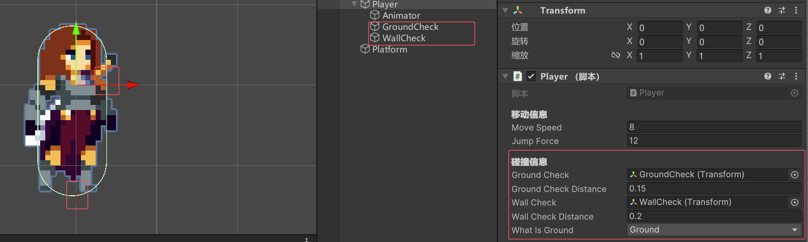
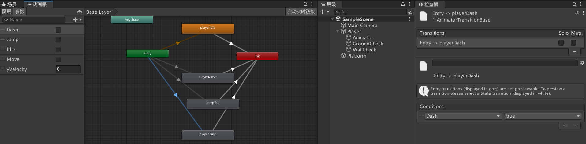
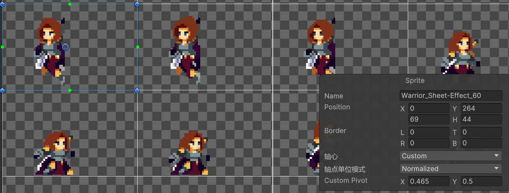
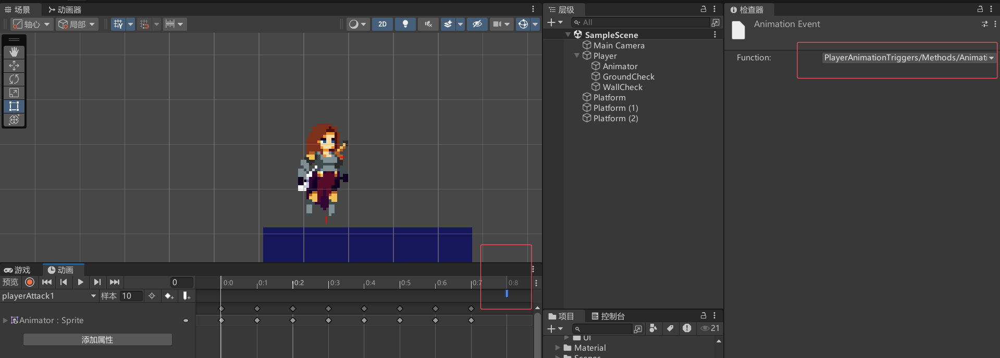
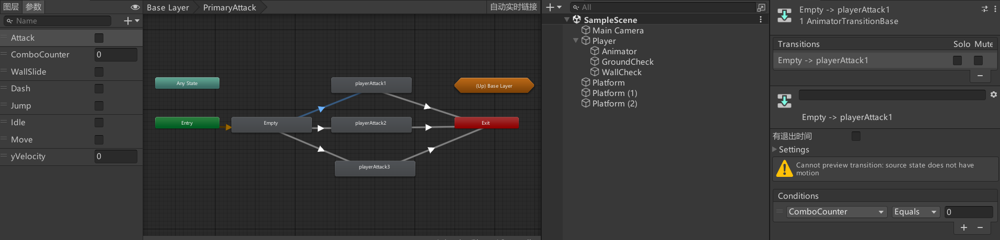
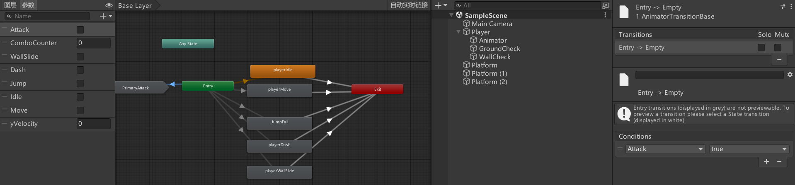

# 创建有限状态机

玩家状态
```cs
public class PlayerState 
{
    protected PlayerStateMachine stateMachine;
    protected Player player;
    private string animBoolName;

    public PlayerState(Player _player, PlayerStateMachine _stateMachine, string animBoolName)
    {
        player = _player;
        stateMachine = _stateMachine;
        this.animBoolName = animBoolName;
    }

    public virtual void Enter()
    {
        Debug.Log($"我正在进入 {animBoolName}状态");
    }

    public virtual void Update()
    {
        Debug.Log($"我正在更新 {animBoolName}状态");
    }

    public virtual void Exit()
    {
        Debug.Log($"我正在退出 {animBoolName}状态");
    }
}

```
玩家状态机脚本
```cs
public class PlayerStateMachine : MonoBehaviour
{
    public PlayerState currentState { get; private set; }
    public void Initialize(PlayerState _startState)
    {
        currentState = _startState;
        currentState.Enter();
    }

    public void ChangeState(PlayerState _newState)
    {
        currentState.Exit();
        currentState = _newState;
        currentState.Enter();
    } 
}

```
玩家脚本
```cs
public class Player : MonoBehaviour
{
    public PlayerStateMachine stateMachine { get; private set; }
    public PlayerIdleState idleState { get; private set; }
    public PlayerMoveState moveState { get; private set; }

    private void Awake()
    {
        stateMachine = new PlayerStateMachine();
        idleState = new PlayerIdleState(this, stateMachine, "Idle");
        moveState = new PlayerMoveState(this, stateMachine, "Move");
    }

    private void Start()
    {
        stateMachine.Initialize(idleState);
    }

    private void Update()
    {
        stateMachine.currentState.Update();
    }
}


```
玩家移动状态
```cs
public class PlayerMoveState : PlayerState
{
    public PlayerMoveState(Player _player, PlayerStateMachine _stateMachine, string animBoolName) : base(_player, _stateMachine, animBoolName)
    {
    }

    public override void Enter()
    {
        base.Enter();
    }

    public override void Exit()
    {
        base.Exit();
    }

    public override void Update()
    {
        base.Update();
        if (Input.GetKeyDown(KeyCode.N))
        {
            stateMachine.ChangeState(player.idleState);
        }
    }
}

```
玩家闲置状态
```cs
public class PlayerIdleState : PlayerState
{
    public PlayerIdleState(Player _player, PlayerStateMachine _stateMachine, string animBoolName) : base(_player, _stateMachine, animBoolName)
    {
    }

    public override void Enter()
    {
        base.Enter();
    }

    public override void Exit()
    {
        base.Exit();
    }

    public override void Update()
    {
        base.Update();
        if (Input.GetKeyDown(KeyCode.N))
        {
            stateMachine.ChangeState(player.moveState);
        }
    }
}

```

# 使用状态机设置动画控制器


```cs
public class Player : MonoBehaviour
{

    #region 组件
    public Animator anim { get; private set; }

    #endregion


    #region 状态
    public PlayerStateMachine stateMachine { get; private set; }
    public PlayerIdleState idleState { get; private set; }
    public PlayerMoveState moveState { get; private set; }

    #endregion

    private void Awake()
    {
        stateMachine = new PlayerStateMachine();
        idleState = new PlayerIdleState(this, stateMachine, "Idle");    // 这里的Idle是动画过渡条件
        moveState = new PlayerMoveState(this, stateMachine, "Move");
    }

    private void Start()
    {
        anim = GetComponentInChildren<Animator>();    
        stateMachine.Initialize(idleState);
    }

    private void Update()
    {

        stateMachine.currentState.Update();
    }
}

```
通过下面的函数来进行状态机的状态切换
```cs
/// <summary>
/// 玩家状态类基类
/// </summary>
public class PlayerState 
{
    protected PlayerStateMachine stateMachine;
    protected Player player;
    private string animBoolName;        // 动画过渡条件

    public PlayerState(Player _player, PlayerStateMachine _stateMachine, string animBoolName)
    {
        player = _player;
        stateMachine = _stateMachine;
        this.animBoolName = animBoolName;
    }

    // 状态机的状态切换相关函数
    public virtual void Enter()
    {
        Debug.Log($"我正在进入 {animBoolName}状态");
        player.anim.SetBool(animBoolName, true);
    }

    public virtual void Update()
    {
        Debug.Log($"我正在更新 {animBoolName}状态");
    }

    public virtual void Exit()
    {
        Debug.Log($"我正在退出 {animBoolName}状态");
        player.anim.SetBool(animBoolName, false);
    }
}

```

# 使用状态机实现移动
```cs
/// <summary>
/// 玩家移动状态类
/// </summary>
public class PlayerMoveState : PlayerState
{
    public PlayerMoveState(Player _player, PlayerStateMachine _stateMachine, string animBoolName) : base(_player, _stateMachine, animBoolName)
    {
    }

    public override void Enter()
    {
        base.Enter();
    }

    public override void Exit()
    {
        base.Exit();
    }

    public override void Update()
    {
        base.Update();

        player.SetVelocity(xInput * player.moveSpeed, rb.velocity.y);

        if (xInput == 0)
        {
            stateMachine.ChangeState(player.idleState);
        }
    }
}

```

```cs
public class Player : MonoBehaviour
{
    [Header("移动信息")]
    public float moveSpeed = 12f;    // 移动速度

    #region 组件
    public Animator anim { get; private set; }
    public Rigidbody2D rb { get; private set; }
    #endregion


    #region 状态
    public PlayerStateMachine stateMachine { get; private set; }
    public PlayerIdleState idleState { get; private set; }
    public PlayerMoveState moveState { get; private set; }

    #endregion

    private void Awake()
    {
        stateMachine = new PlayerStateMachine();
        idleState = new PlayerIdleState(this, stateMachine, "Idle");    // 这里的Idle是动画过渡条件
        moveState = new PlayerMoveState(this, stateMachine, "Move");
    }

    private void Start()
    {
        anim = GetComponentInChildren<Animator>();
        rb = GetComponent<Rigidbody2D>();
        stateMachine.Initialize(idleState);
    }

    private void Update()
    {
        stateMachine.currentState.Update();
    }

    public void SetVelocity(float _xVelocity, float _yVelocity)
    {
        rb.velocity = new Vector2(_xVelocity, _yVelocity);
    }
}

```


```cs
public class PlayerState 
{
    protected PlayerStateMachine stateMachine;
    protected Player player;
    protected Rigidbody2D rb;       // 玩家刚体
    private string animBoolName;        // 动画过渡条件

    protected float xInput;     // 水平输入


    public PlayerState(Player _player, PlayerStateMachine _stateMachine, string animBoolName)
    {
        player = _player;
        stateMachine = _stateMachine;
        this.animBoolName = animBoolName;
    }

    // 状态机的状态切换相关函数
    public virtual void Enter()
    {
        Debug.Log($"我正在进入 {animBoolName}状态");
        rb = player.rb;
        player.anim.SetBool(animBoolName, true);
    }

    public virtual void Update()
    {
        Debug.Log($"我正在更新 {animBoolName}状态");
        xInput = Input.GetAxis("Horizontal");
    }

    public virtual void Exit()
    {
        Debug.Log($"我正在退出 {animBoolName}状态");
        player.anim.SetBool(animBoolName, false);
    }
}

```

# 使用状态机实现跳跃
创建跳跃动画和下落动画，创建跳跃下落混合树





```cs
/// <summary>
/// 玩家状态类基类
/// </summary>
public class PlayerState 
{
    protected PlayerStateMachine stateMachine;
    protected Player player;
    protected Rigidbody2D rb;       // 玩家刚体
    private string animBoolName;        // 动画过渡条件

    protected float xInput;     // 水平输入


    public PlayerState(Player _player, PlayerStateMachine _stateMachine, string _animBoolName)
    {
        player = _player;
        stateMachine = _stateMachine;
        this.animBoolName = _animBoolName;
    }

    // 状态机的状态切换相关函数
    public virtual void Enter()
    {
        Debug.Log($"我正在进入 {animBoolName}状态");
        rb = player.rb;
        player.anim.SetBool(animBoolName, true);
    }

    public virtual void Update()
    {
        Debug.Log($"我正在更新 {animBoolName}状态");
        xInput = Input.GetAxis("Horizontal");
        player.anim.SetFloat("yVelocity", rb.velocity.y);
    }

    public virtual void Exit()
    {
        Debug.Log($"我正在退出 {animBoolName}状态");
        player.anim.SetBool(animBoolName, false);
    }
}

```

新建PlayerGroundedState，PlayerMoveState和PlayerIdleState继承PlayerGroundedState
```cs
public class PlayerGroundedState : PlayerState
{
    public PlayerGroundedState(Player _player, PlayerStateMachine _stateMachine, string _animBoolName) : base(_player, _stateMachine, _animBoolName)
    {
    }

    public override void Enter()
    {
        base.Enter();
    }

    public override void Exit()
    {
        base.Exit();
    }

    public override void Update()
    {
        base.Update();
        if (Input.GetKeyDown(KeyCode.Space))
        {
            stateMachine.ChangeState(player.jumpState);
        }
    }
}

```

```cs
public class Player : MonoBehaviour
{
    [Header("移动信息")]
    public float moveSpeed = 12f;    // 移动速度
    public float jumpForce;          // 跳跃力度

    #region 组件
    public Animator anim { get; private set; }
    public Rigidbody2D rb { get; private set; }
    #endregion


    #region 状态
    public PlayerStateMachine stateMachine { get; private set; }
    public PlayerIdleState idleState { get; private set; }
    public PlayerMoveState moveState { get; private set; }
    public PlayerJumpState jumpState { get; private set; }
    public PlayerAirState airState { get; private set; }

    #endregion

    private void Awake()
    {
        stateMachine = new PlayerStateMachine();
        idleState = new PlayerIdleState(this, stateMachine, "Idle");    // 这里的Idle是动画过渡条件
        moveState = new PlayerMoveState(this, stateMachine, "Move");
        jumpState = new PlayerJumpState(this, stateMachine, "Jump");
        airState  = new PlayerAirState(this, stateMachine, "Jump");
    }

    private void Start()
    {
        anim = GetComponentInChildren<Animator>();
        rb = GetComponent<Rigidbody2D>();
        stateMachine.Initialize(idleState);
    }

    private void Update()
    {
        stateMachine.currentState.Update();
    }

    public void SetVelocity(float _xVelocity, float _yVelocity)
    {
        rb.velocity = new Vector2(_xVelocity, _yVelocity);
    }
}

```


新建PlayerAirState
```cs
public class PlayerAirState : PlayerState
{
    public PlayerAirState(Player _player, PlayerStateMachine _stateMachine, string _animBoolName) : base(_player, _stateMachine, _animBoolName)
    {
    }

    public override void Enter()
    {
        base.Enter();
    }

    public override void Exit()
    {
        base.Exit();
    }

    public override void Update()
    {
        base.Update();
        if (rb.velocity.y == 0)
        {
            stateMachine.ChangeState(player.idleState);
        }
    }
}

```

新建PlayerJumpState
```cs
public class PlayerJumpState : PlayerState
{
    public PlayerJumpState(Player _player, PlayerStateMachine _stateMachine, string _animBoolName) : base(_player, _stateMachine, _animBoolName)
    {
    }

    public override void Enter()
    {
        base.Enter();
        rb.velocity = new Vector2(rb.velocity.x, player.jumpForce); // 重置y轴速度
    }

    public override void Exit()
    {
        base.Exit();
    }

    public override void Update()
    {
        base.Update();
        if (rb.velocity.y < 0)
        {
            stateMachine.ChangeState(player.airState);
        }
    }
}

```

# 碰撞检测



给玩家脚本添加相关的碰撞检测参数
```cs
public class Player : MonoBehaviour
{
    [Header("移动信息")]
    public float moveSpeed = 12f;    // 移动速度
    public float jumpForce;          // 跳跃力度

    [Header("碰撞信息")]
    [SerializeField] private Transform groundCheck;     // 地面检测点
    [SerializeField] private float groundCheckDistance; // 地面检测距离
    [SerializeField] private Transform wallCheck;       // 墙壁检测点
    [SerializeField] private float wallCheckDistance;   // 墙壁检测距离
    [SerializeField] private LayerMask whatIsGround;    // 地面层级

    #region 组件
    public Animator anim { get; private set; }
    public Rigidbody2D rb { get; private set; }
    #endregion


    #region 状态
    public PlayerStateMachine stateMachine { get; private set; }
    public PlayerIdleState idleState { get; private set; }
    public PlayerMoveState moveState { get; private set; }
    public PlayerJumpState jumpState { get; private set; }
    public PlayerAirState airState { get; private set; }

    #endregion

    private void Awake()
    {
        stateMachine = new PlayerStateMachine();
        idleState = new PlayerIdleState(this, stateMachine, "Idle");    // 这里的Idle是动画过渡条件
        moveState = new PlayerMoveState(this, stateMachine, "Move");
        jumpState = new PlayerJumpState(this, stateMachine, "Jump");
        airState  = new PlayerAirState(this, stateMachine, "Jump");
    }

    private void Start()
    {
        anim = GetComponentInChildren<Animator>();
        rb = GetComponent<Rigidbody2D>();
        stateMachine.Initialize(idleState);
    }

    private void Update()
    {
        stateMachine.currentState.Update();
    }

    public void SetVelocity(float _xVelocity, float _yVelocity)
    {
        rb.velocity = new Vector2(_xVelocity, _yVelocity);
    }


    // 地面检测
    public bool IsGroundDetected() => 
        Physics2D.Raycast(groundCheck.position, Vector2.down, groundCheckDistance, whatIsGround);

    // 画线辅助检测地面和墙面
    private void OnDrawGizmos()
    {
        Gizmos.color = Color.red;
        Gizmos.DrawLine(groundCheck.position, groundCheck.position + Vector3.down * groundCheckDistance);
        Gizmos.DrawLine(wallCheck.position, wallCheck.position + Vector3.right * wallCheckDistance);
    }
}

```

更改地面切换跳跃时的条件
```cs
public class PlayerGroundedState : PlayerState
{
    public PlayerGroundedState(Player _player, PlayerStateMachine _stateMachine, string _animBoolName) : base(_player, _stateMachine, _animBoolName)
    {
    }

    public override void Enter()
    {
        base.Enter();
    }

    public override void Exit()
    {
        base.Exit();
    }

    public override void Update()
    {
        base.Update();
        if (Input.GetKeyDown(KeyCode.Space) && player.IsGroundDetected())
        {
            stateMachine.ChangeState(player.jumpState);
        }
    }
}

```

同样更改空中条件
```cs
public class PlayerAirState : PlayerState
{
    public PlayerAirState(Player _player, PlayerStateMachine _stateMachine, string _animBoolName) : base(_player, _stateMachine, _animBoolName)
    {
    }

    public override void Enter()
    {
        base.Enter();
    }

    public override void Exit()
    {
        base.Exit();
    }

    public override void Update()
    {
        base.Update();
        if (player.IsGroundDetected())
        {
            stateMachine.ChangeState(player.idleState);
        }
    }
}

```


# 翻转Flip
```cs
public class Player : MonoBehaviour
{
    [Header("移动信息")]
    public float moveSpeed = 12f;    // 移动速度
    public float jumpForce;          // 跳跃力度

    public int facingDir { get; private set; } = 1;     // 1表示右，-1表示左
    public bool facingRight = true;

    [Header("碰撞信息")]
    [SerializeField] private Transform groundCheck;     // 地面检测点
    [SerializeField] private float groundCheckDistance; // 地面检测距离
    [SerializeField] private Transform wallCheck;       // 墙壁检测点
    [SerializeField] private float wallCheckDistance;   // 墙壁检测距离
    [SerializeField] private LayerMask whatIsGround;    // 地面层级

    #region 组件
    public Animator anim { get; private set; }
    public Rigidbody2D rb { get; private set; }
    #endregion


    #region 状态
    public PlayerStateMachine stateMachine { get; private set; }
    public PlayerIdleState idleState { get; private set; }
    public PlayerMoveState moveState { get; private set; }
    public PlayerJumpState jumpState { get; private set; }
    public PlayerAirState airState { get; private set; }

    #endregion

    private void Awake()
    {
        stateMachine = new PlayerStateMachine();
        idleState = new PlayerIdleState(this, stateMachine, "Idle");    // 这里的Idle是动画过渡条件
        moveState = new PlayerMoveState(this, stateMachine, "Move");
        jumpState = new PlayerJumpState(this, stateMachine, "Jump");
        airState  = new PlayerAirState(this, stateMachine, "Jump");
    }

    private void Start()
    {
        anim = GetComponentInChildren<Animator>();
        rb = GetComponent<Rigidbody2D>();
        stateMachine.Initialize(idleState);
    }

    private void Update()
    {
        stateMachine.currentState.Update();
    }

    public void SetVelocity(float _xVelocity, float _yVelocity)
    {
        rb.velocity = new Vector2(_xVelocity, _yVelocity);
        FlipController(_xVelocity);
    }


    // 地面检测
    public bool IsGroundDetected() => 
        Physics2D.Raycast(groundCheck.position, Vector2.down, groundCheckDistance, whatIsGround);

    // 画线辅助检测地面和墙面
    private void OnDrawGizmos()
    {
        Gizmos.color = Color.red;
        Gizmos.DrawLine(groundCheck.position, groundCheck.position + Vector3.down * groundCheckDistance);
        Gizmos.DrawLine(wallCheck.position, wallCheck.position + Vector3.right * wallCheckDistance);
    }


    // 翻转
    public void Flip()
    {
        facingDir *= -1;
        facingRight = !facingRight;
        transform.Rotate(0, 180, 0);
    }

    // 根据面朝向和传入的x来确认是否翻转
    public void FlipController(float _x)
    {
        if (_x > 0 && !facingRight)
            Flip();
        else if (_x < 0 && facingRight)
            Flip();
    }
}

```

# 创建冲刺状态

添加冲刺动画


新增PlayerDashState脚本
```cs
public class PlayerDashState : PlayerState
{
    public PlayerDashState(Player _player, PlayerStateMachine _stateMachine, string _animBoolName) : base(_player, _stateMachine, _animBoolName)
    {
    }

    public override void Enter()
    {
        base.Enter();
        stateTimer = player.dashDuration;
    }

    public override void Exit()
    {
        base.Exit();
        player.SetVelocity(0f, rb.velocity.y);
    }

    public override void Update()
    {
        base.Update();

        player.SetVelocity(player.dashSpeed * player.facingDir, rb.velocity.y);

        if (stateTimer < 0)
            stateMachine.ChangeState(player.idleState);
    }
}

```
Player里面新增dashState
```cs
public class Player : MonoBehaviour
{
    [Header("移动信息")]
    public float moveSpeed = 12f;    // 移动速度
    public float jumpForce;          // 跳跃力度
    public float dashSpeed;          // 冲刺速度    
    public float dashDuration;       // 冲刺持续时间

    public int facingDir { get; private set; } = 1;     // 1表示右，-1表示左
    public bool facingRight = true;

    [Header("碰撞信息")]
    [SerializeField] private Transform groundCheck;     // 地面检测点
    [SerializeField] private float groundCheckDistance; // 地面检测距离
    [SerializeField] private Transform wallCheck;       // 墙壁检测点
    [SerializeField] private float wallCheckDistance;   // 墙壁检测距离
    [SerializeField] private LayerMask whatIsGround;    // 地面层级

    #region 组件
    public Animator anim { get; private set; }
    public Rigidbody2D rb { get; private set; }
    #endregion


    #region 状态
    public PlayerStateMachine stateMachine { get; private set; }
    public PlayerIdleState idleState { get; private set; }
    public PlayerMoveState moveState { get; private set; }
    public PlayerJumpState jumpState { get; private set; }
    public PlayerAirState airState { get; private set; }
    public PlayerDashState dashState { get; private set; }

    #endregion

    private void Awake()
    {
        stateMachine = new PlayerStateMachine();
        idleState = new PlayerIdleState(this, stateMachine, "Idle");    // 这里的Idle是动画过渡条件
        moveState = new PlayerMoveState(this, stateMachine, "Move");
        jumpState = new PlayerJumpState(this, stateMachine, "Jump");
        airState = new PlayerAirState(this, stateMachine, "Jump");
        dashState = new PlayerDashState(this, stateMachine, "Dash");
    }

    private void Start()
    {
        anim = GetComponentInChildren<Animator>();
        rb = GetComponent<Rigidbody2D>();
        stateMachine.Initialize(idleState);
    }

    private void Update()
    {
        stateMachine.currentState.Update();
    }

    public void SetVelocity(float _xVelocity, float _yVelocity)
    {
        rb.velocity = new Vector2(_xVelocity, _yVelocity);
        FlipController(_xVelocity);
    }


    // 地面检测
    public bool IsGroundDetected() =>
        Physics2D.Raycast(groundCheck.position, Vector2.down, groundCheckDistance, whatIsGround);

    // 画线辅助检测地面和墙面
    private void OnDrawGizmos()
    {
        Gizmos.color = Color.red;
        Gizmos.DrawLine(groundCheck.position, groundCheck.position + Vector3.down * groundCheckDistance);
        Gizmos.DrawLine(wallCheck.position, wallCheck.position + Vector3.right * wallCheckDistance);
    }


    // 翻转
    public void Flip()
    {
        facingDir *= -1;
        facingRight = !facingRight;
        transform.Rotate(0, 180, 0);
    }

    // 根据面朝向和传入的x来确认是否翻转
    public void FlipController(float _x)
    {
        if (_x > 0 && !facingRight)
            Flip();
        else if (_x < 0 && facingRight)
            Flip();
    }
}

```
PlayerState里面添加状态计时器
```cs
/// <summary>
/// 玩家状态类基类
/// </summary>
public class PlayerState 
{
    protected PlayerStateMachine stateMachine;
    protected Player player;
    protected Rigidbody2D rb;       // 玩家刚体
    private string animBoolName;        // 动画过渡条件

    protected float xInput;     // 水平输入

    protected float stateTimer;     // 状态计时器


    public PlayerState(Player _player, PlayerStateMachine _stateMachine, string _animBoolName)
    {
        player = _player;
        stateMachine = _stateMachine;
        this.animBoolName = _animBoolName;
    }

    // 状态机的状态切换相关函数
    public virtual void Enter()
    {
        Debug.Log($"我正在进入 {animBoolName}状态");
        rb = player.rb;
        player.anim.SetBool(animBoolName, true);
    }

    public virtual void Update()
    {
        Debug.Log($"我正在更新 {animBoolName}状态");
        xInput = Input.GetAxis("Horizontal");
        player.anim.SetFloat("yVelocity", rb.velocity.y);
        stateTimer -= Time.deltaTime;   
    }

    public virtual void Exit()
    {
        Debug.Log($"我正在退出 {animBoolName}状态");
        player.anim.SetBool(animBoolName, false);
    }
}

```
地面状态添加切换冲刺状态
```cs
public class PlayerGroundedState : PlayerState
{
    public PlayerGroundedState(Player _player, PlayerStateMachine _stateMachine, string _animBoolName) : base(_player, _stateMachine, _animBoolName)
    {
    }

    public override void Enter()
    {
        base.Enter();
    }

    public override void Exit()
    {
        base.Exit();
    }

    public override void Update()
    {
        base.Update();
        if (Input.GetKeyDown(KeyCode.LeftShift))
        {
            stateMachine.ChangeState(player.dashState);
        }

        if (Input.GetKeyDown(KeyCode.Space) && player.IsGroundDetected())
        {
            stateMachine.ChangeState(player.jumpState);
        }
    }
}

```

# 改进冲刺状态
让冲刺能在空中时候用，添加冲刺冷却


Player添加冲刺方向和冲刺计时器等相关字段，并更新
```cs
public class Player : MonoBehaviour
{
    [Header("移动信息")]
    public float moveSpeed = 12f;    // 移动速度
    public float jumpForce;          // 跳跃力度

    [Header("冲刺信息")]
    [SerializeField] private float dashCooldown;     // 冲刺冷却时间
    private float dashUsageTimer;       // 冲刺使用计时器
    public float dashSpeed;          // 冲刺速度    
    public float dashDuration;       // 冲刺持续时间
    public float dashDir { get; private set; }

    public int facingDir { get; private set; } = 1;     // 1表示右，-1表示左
    public bool facingRight = true;

    [Header("碰撞信息")]
    [SerializeField] private Transform groundCheck;     // 地面检测点
    [SerializeField] private float groundCheckDistance; // 地面检测距离
    [SerializeField] private Transform wallCheck;       // 墙壁检测点
    [SerializeField] private float wallCheckDistance;   // 墙壁检测距离
    [SerializeField] private LayerMask whatIsGround;    // 地面层级

    #region 组件
    public Animator anim { get; private set; }
    public Rigidbody2D rb { get; private set; }
    #endregion


    #region 状态
    public PlayerStateMachine stateMachine { get; private set; }
    public PlayerIdleState idleState { get; private set; }
    public PlayerMoveState moveState { get; private set; }
    public PlayerJumpState jumpState { get; private set; }
    public PlayerAirState airState { get; private set; }
    public PlayerDashState dashState { get; private set; }

    #endregion

    private void Awake()
    {
        stateMachine = new PlayerStateMachine();
        idleState = new PlayerIdleState(this, stateMachine, "Idle");    // 这里的Idle是动画过渡条件
        moveState = new PlayerMoveState(this, stateMachine, "Move");
        jumpState = new PlayerJumpState(this, stateMachine, "Jump");
        airState = new PlayerAirState(this, stateMachine, "Jump");
        dashState = new PlayerDashState(this, stateMachine, "Dash");
    }

    private void Start()
    {
        anim = GetComponentInChildren<Animator>();
        rb = GetComponent<Rigidbody2D>();
        stateMachine.Initialize(idleState);
    }

    private void Update()
    {
        stateMachine.currentState.Update();
        CheckForDashInput();
    }

    public void SetVelocity(float _xVelocity, float _yVelocity)
    {
        rb.velocity = new Vector2(_xVelocity, _yVelocity);
        FlipController(_xVelocity);
    }


    // 地面检测
    public bool IsGroundDetected() =>
        Physics2D.Raycast(groundCheck.position, Vector2.down, groundCheckDistance, whatIsGround);

    // 画线辅助检测地面和墙面
    private void OnDrawGizmos()
    {
        Gizmos.color = Color.red;
        Gizmos.DrawLine(groundCheck.position, groundCheck.position + Vector3.down * groundCheckDistance);
        Gizmos.DrawLine(wallCheck.position, wallCheck.position + Vector3.right * wallCheckDistance);
    }


    // 翻转
    public void Flip()
    {
        facingDir *= -1;
        facingRight = !facingRight;
        transform.Rotate(0, 180, 0);
    }

    // 根据面朝向和传入的x来确认是否翻转
    public void FlipController(float _x)
    {
        if (_x > 0 && !facingRight)
            Flip();
        else if (_x < 0 && facingRight)
            Flip();
    }

    private void CheckForDashInput()
    {
        dashUsageTimer -= Time.deltaTime; // 更新冲刺计时器


        if (Input.GetKeyDown(KeyCode.LeftShift) && dashUsageTimer < 0)
        {
            dashUsageTimer = dashCooldown; // 重置冲刺计时器
            dashDir = Input.GetAxisRaw("Horizontal");   // 将冲刺方向设置为水平输入
            if (dashDir == 0) dashDir = facingDir; // 如果没有水平输入，则使用当前面朝方向
            stateMachine.ChangeState(dashState);
        }
    }
}

```

冲刺方向
```cs
public class PlayerDashState : PlayerState
{
    public PlayerDashState(Player _player, PlayerStateMachine _stateMachine, string _animBoolName) : base(_player, _stateMachine, _animBoolName)
    {
    }

    public override void Enter()
    {
        base.Enter();
        stateTimer = player.dashDuration;
    }

    public override void Exit()
    {
        base.Exit();
        player.SetVelocity(0f, rb.velocity.y);
    }

    public override void Update()
    {
        base.Update();

        player.SetVelocity(player.dashSpeed * player.dashDir, 0);

        if (stateTimer < 0)
            stateMachine.ChangeState(player.idleState);
    }
}

```
不在地面状态时要切换为空中状态
```cs
public class PlayerGroundedState : PlayerState
{
    public PlayerGroundedState(Player _player, PlayerStateMachine _stateMachine, string _animBoolName) : base(_player, _stateMachine, _animBoolName)
    {
    }

    public override void Enter()
    {
        base.Enter();
    }

    public override void Exit()
    {
        base.Exit();
    }

    public override void Update()
    {
        base.Update(); 

        if (!player.IsGroundDetected())
        {
            stateMachine.ChangeState(player.airState);
        }

        if (Input.GetKeyDown(KeyCode.Space) && player.IsGroundDetected())
        {
            stateMachine.ChangeState(player.jumpState);
        }
    }
}

```
# 墙面滑动状态
更改角色轴心点击，不让其在空气墙滑动



PlayerState添加y轴的输入
```cs
/// <summary>
/// 玩家状态类基类
/// </summary>
public class PlayerState 
{
    protected PlayerStateMachine stateMachine;
    protected Player player;
    protected Rigidbody2D rb;       // 玩家刚体
    private string animBoolName;        // 动画过渡条件

    protected float xInput;     // 水平输入
    protected float yInput;

    protected float stateTimer;     // 状态计时器


    public PlayerState(Player _player, PlayerStateMachine _stateMachine, string _animBoolName)
    {
        player = _player;
        stateMachine = _stateMachine;
        this.animBoolName = _animBoolName;
    }

    // 状态机的状态切换相关函数
    // 进入通过设置Bool值来切换动画
    public virtual void Enter()
    {
        Debug.Log($"我正在进入 {animBoolName}状态");
        rb = player.rb;
        player.anim.SetBool(animBoolName, true);
    }

    public virtual void Update()
    {
        Debug.Log($"我正在更新 {animBoolName}状态");
        xInput = Input.GetAxisRaw("Horizontal");        // 注意这里不能用GetAxis，因为GetAxis会平滑处理输入
        yInput = Input.GetAxisRaw("Vertical");
        player.anim.SetFloat("yVelocity", rb.velocity.y);
        stateTimer -= Time.deltaTime;   
    }

    // 退出也是通过设置Bool来切换动画
    public virtual void Exit()
    {
        Debug.Log($"我正在退出 {animBoolName}状态");
        player.anim.SetBool(animBoolName, false);
    }
}

```

```cs
public class PlayerAirState : PlayerState
{
    public PlayerAirState(Player _player, PlayerStateMachine _stateMachine, string _animBoolName) : base(_player, _stateMachine, _animBoolName)
    {
    }

    public override void Enter()
    {
        base.Enter();
    }

    public override void Exit()
    {
        base.Exit();
    }

    public override void Update()
    {
        base.Update();
        if (player.IsWallDetected())
        {
            stateMachine.ChangeState(player.wallSlide);
        }

        if (player.IsGroundDetected())
        {
            stateMachine.ChangeState(player.idleState);
        }

        if (xInput != 0)
        {
            player.SetVelocity(player.moveSpeed * 0.8f * xInput, rb.velocity.y);
        }
    }
}

```


新增墙面滑动状态
```cs
public class PlayerWallSlideState : PlayerState
{
    public PlayerWallSlideState(Player _player, PlayerStateMachine _stateMachine, string _animBoolName) : base(_player, _stateMachine, _animBoolName)
    {
    }

    public override void Enter()
    {
        base.Enter();
    }

    public override void Exit()
    {
        base.Exit();
    }

    public override void Update()
    {
        base.Update();
        // 如果在墙面滑动状态时，面朝向和输入方向不一致
        if (xInput != 0 && player.facingDir != xInput)
        {
            stateMachine.ChangeState(player.idleState);
        }

        // 如果在墙面滑动状态时，向下按键调整下滑速度
        if (yInput < 0)
            rb.velocity = new Vector2(0, rb.velocity.y);
        else
            rb.velocity = new Vector2(0, rb.velocity.y * 0.7f);

        if (player.IsGroundDetected())
        {
            stateMachine.ChangeState(player.idleState);
        }
    }
}

```


添加墙面滑动状态
```cs
public class Player : MonoBehaviour
{
    [Header("移动信息")]
    public float moveSpeed = 12f;    // 移动速度
    public float jumpForce;          // 跳跃力度

    [Header("冲刺信息")]
    [SerializeField] private float dashCooldown;     // 冲刺冷却时间
    private float dashUsageTimer;       // 冲刺使用计时器
    public float dashSpeed;          // 冲刺速度    
    public float dashDuration;       // 冲刺持续时间
    public float dashDir { get; private set; }

    public int facingDir { get; private set; } = 1;     // 1表示右，-1表示左
    public bool facingRight = true;

    [Header("碰撞信息")]
    [SerializeField] private Transform groundCheck;     // 地面检测点
    [SerializeField] private float groundCheckDistance; // 地面检测距离
    [SerializeField] private Transform wallCheck;       // 墙壁检测点
    [SerializeField] private float wallCheckDistance;   // 墙壁检测距离
    [SerializeField] private LayerMask whatIsGround;    // 地面层级

    #region 组件
    public Animator anim { get; private set; }
    public Rigidbody2D rb { get; private set; }
    #endregion


    #region 状态
    public PlayerStateMachine stateMachine { get; private set; }
    public PlayerIdleState idleState { get; private set; }
    public PlayerMoveState moveState { get; private set; }
    public PlayerJumpState jumpState { get; private set; }
    public PlayerAirState airState { get; private set; }
    public PlayerWallSlideState wallSlide { get; private set; }
    public PlayerDashState dashState { get; private set; }

    #endregion

    private void Awake()
    {
        stateMachine = new PlayerStateMachine();
        idleState = new PlayerIdleState(this, stateMachine, "Idle");    // 这里的Idle是动画过渡条件
        moveState = new PlayerMoveState(this, stateMachine, "Move");
        jumpState = new PlayerJumpState(this, stateMachine, "Jump");
        airState = new PlayerAirState(this, stateMachine, "Jump");
        dashState = new PlayerDashState(this, stateMachine, "Dash");
        wallSlide = new PlayerWallSlideState(this, stateMachine, "WallSlide"); 
    }

    private void Start()
    {
        anim = GetComponentInChildren<Animator>();
        rb = GetComponent<Rigidbody2D>();
        stateMachine.Initialize(idleState);
    }

    private void Update()
    {
        stateMachine.currentState.Update();
        CheckForDashInput();
        Debug.Log(IsWallDetected());
    }

    public void SetVelocity(float _xVelocity, float _yVelocity)
    {
        rb.velocity = new Vector2(_xVelocity, _yVelocity);
        FlipController(_xVelocity);
    }


    // 地面检测
    public bool IsGroundDetected() =>
        Physics2D.Raycast(groundCheck.position, Vector2.down, groundCheckDistance, whatIsGround);

    // 墙壁检测
    public bool IsWallDetected() =>
        Physics2D.Raycast(wallCheck.position, Vector2.right * facingDir, wallCheckDistance, whatIsGround);

    // 画线辅助检测地面和墙面
    private void OnDrawGizmos()
    {
        Gizmos.color = Color.red;
        Gizmos.DrawLine(groundCheck.position, groundCheck.position + Vector3.down * groundCheckDistance);
        Gizmos.DrawLine(wallCheck.position, wallCheck.position + Vector3.right * wallCheckDistance);
    }


    // 翻转
    public void Flip()
    {
        facingDir *= -1;
        facingRight = !facingRight;
        transform.Rotate(0, 180, 0);
    }

    // 根据面朝向和传入的x来确认是否翻转
    public void FlipController(float _x)
    {
        if (_x > 0 && !facingRight)
            Flip();
        else if (_x < 0 && facingRight)
            Flip();
    }

    private void CheckForDashInput()
    {
        dashUsageTimer -= Time.deltaTime; // 更新冲刺计时器


        if (Input.GetKeyDown(KeyCode.LeftShift) && dashUsageTimer < 0)
        {
            dashUsageTimer = dashCooldown; // 重置冲刺计时器
            dashDir = Input.GetAxisRaw("Horizontal");   // 将冲刺方向设置为水平输入
            if (dashDir == 0) dashDir = facingDir; // 如果没有水平输入，则使用当前面朝方向
            stateMachine.ChangeState(dashState);
        }
    }


}

```

# 墙面跳跃状态
新建墙面跳跃状态
```cs
public class PlayerWallJumpState : PlayerState
{
    public PlayerWallJumpState(Player _player, PlayerStateMachine _stateMachine, string _animBoolName) : base(_player, _stateMachine, _animBoolName)
    {
    }

    public override void Enter()
    {
        base.Enter();
        stateTimer = 0.4f;
        // 进入墙壁跳跃状态时设置玩家速度，使其超反方向跳
        player.SetVelocity(5 * -player.facingDir, player.jumpForce); 
    }

    public override void Exit()
    {
        base.Exit();
    }

    public override void Update()
    {
        base.Update();

        // 跳跃时间到达后，切换到空中状态
        if (stateTimer < 0)
        {
            stateMachine.ChangeState(player.airState);
        }
        // 如果时间没到，并且玩家落到地面照样切状态
        if (player.IsGroundDetected())
        {
            stateMachine.ChangeState(player.idleState);
        }
    }
}

```

Player添加状态
```cs
public class Player : MonoBehaviour
{
    [Header("移动信息")]
    public float moveSpeed = 12f;    // 移动速度
    public float jumpForce;          // 跳跃力度

    [Header("冲刺信息")]
    [SerializeField] private float dashCooldown;     // 冲刺冷却时间
    private float dashUsageTimer;       // 冲刺使用计时器
    public float dashSpeed;          // 冲刺速度    
    public float dashDuration;       // 冲刺持续时间
    public float dashDir { get; private set; }

    public int facingDir { get; private set; } = 1;     // 1表示右，-1表示左
    public bool facingRight = true;

    [Header("碰撞信息")]
    [SerializeField] private Transform groundCheck;     // 地面检测点
    [SerializeField] private float groundCheckDistance; // 地面检测距离
    [SerializeField] private Transform wallCheck;       // 墙壁检测点
    [SerializeField] private float wallCheckDistance;   // 墙壁检测距离
    [SerializeField] private LayerMask whatIsGround;    // 地面层级

    #region 组件
    public Animator anim { get; private set; }
    public Rigidbody2D rb { get; private set; }
    #endregion


    #region 状态
    public PlayerStateMachine stateMachine { get; private set; }
    public PlayerIdleState idleState { get; private set; }
    public PlayerMoveState moveState { get; private set; }
    public PlayerJumpState jumpState { get; private set; }
    public PlayerAirState airState { get; private set; }
    public PlayerWallSlideState wallSlide { get; private set; }
    public PlayerWallJumpState wallJump { get; private set; }
    public PlayerDashState dashState { get; private set; }

    #endregion

    private void Awake()
    {
        stateMachine = new PlayerStateMachine();
        idleState = new PlayerIdleState(this, stateMachine, "Idle");    // 这里的Idle是动画过渡条件
        moveState = new PlayerMoveState(this, stateMachine, "Move");
        jumpState = new PlayerJumpState(this, stateMachine, "Jump");
        airState = new PlayerAirState(this, stateMachine, "Jump");
        dashState = new PlayerDashState(this, stateMachine, "Dash");
        wallSlide = new PlayerWallSlideState(this, stateMachine, "WallSlide");
        wallJump = new PlayerWallJumpState(this, stateMachine, "Jump");
    }

    private void Start()
    {
        anim = GetComponentInChildren<Animator>();
        rb = GetComponent<Rigidbody2D>();
        stateMachine.Initialize(idleState);
    }

    private void Update()
    {
        stateMachine.currentState.Update();
        CheckForDashInput();
    }

    public void SetVelocity(float _xVelocity, float _yVelocity)
    {
        rb.velocity = new Vector2(_xVelocity, _yVelocity);
        FlipController(_xVelocity);
    }


    // 地面检测
    public bool IsGroundDetected() =>
        Physics2D.Raycast(groundCheck.position, Vector2.down, groundCheckDistance, whatIsGround);

    // 墙壁检测
    public bool IsWallDetected() =>
        Physics2D.Raycast(wallCheck.position, Vector2.right * facingDir, wallCheckDistance, whatIsGround);

    // 画线辅助检测地面和墙面
    private void OnDrawGizmos()
    {
        Gizmos.color = Color.red;
        Gizmos.DrawLine(groundCheck.position, groundCheck.position + Vector3.down * groundCheckDistance);
        Gizmos.DrawLine(wallCheck.position, wallCheck.position + Vector3.right * wallCheckDistance);
    }


    // 翻转
    public void Flip()
    {
        facingDir *= -1;
        facingRight = !facingRight;
        transform.Rotate(0, 180, 0);
    }

    // 根据面朝向和传入的x来确认是否翻转
    public void FlipController(float _x)
    {
        if (_x > 0 && !facingRight)
            Flip();
        else if (_x < 0 && facingRight)
            Flip();
    }

    // 检查冲刺输入
    private void CheckForDashInput()
    {
        //if (IsWallDetected()) return;     // 碰到墙壁时不允许冲刺

        dashUsageTimer -= Time.deltaTime; // 更新冲刺计时器

        if (Input.GetKeyDown(KeyCode.LeftShift) && dashUsageTimer < 0)
        {
            dashUsageTimer = dashCooldown; // 重置冲刺计时器
            dashDir = Input.GetAxisRaw("Horizontal");   // 将冲刺方向设置为水平输入
            if (dashDir == 0) dashDir = facingDir; // 如果没有水平输入，则使用当前面朝方向
            stateMachine.ChangeState(dashState);
        }
    }


}

```

墙面滑行状态切换到墙面跳跃状态，注意return；
```cs
public class PlayerWallSlideState : PlayerState
{
    public PlayerWallSlideState(Player _player, PlayerStateMachine _stateMachine, string _animBoolName) : base(_player, _stateMachine, _animBoolName)
    {
    }

    public override void Enter()
    {
        base.Enter();
    }

    public override void Exit()
    {
        base.Exit();
    }

    public override void Update()
    {
        base.Update();

        // 墙面滑动状态下跳跃
        if (Input.GetKeyDown(KeyCode.Space))
        {
            stateMachine.ChangeState(player.wallJump);
            return;     // 跳跃状态下不需要执行下面的代码
        }

        // 如果在墙面滑动状态时，面朝向和输入方向不一致
        if (xInput != 0 && player.facingDir != xInput)
        {
            stateMachine.ChangeState(player.idleState);
        }

        // 如果在墙面滑动状态时，向下按键调整下滑速度
        if (yInput < 0)
            rb.velocity = new Vector2(0, rb.velocity.y);
        else
            rb.velocity = new Vector2(0, rb.velocity.y * 0.7f);

        if (player.IsGroundDetected())
        {
            stateMachine.ChangeState(player.idleState);
        }
    }
}

```
如果冲刺到墙上
```cs
public class PlayerDashState : PlayerState
{
    public PlayerDashState(Player _player, PlayerStateMachine _stateMachine, string _animBoolName) : base(_player, _stateMachine, _animBoolName)
    {
    }

    public override void Enter()
    {
        base.Enter();
        stateTimer = player.dashDuration;
    }

    public override void Exit()
    {
        base.Exit();
        player.SetVelocity(0f, rb.velocity.y);
    }

    public override void Update()
    {
        base.Update();

        // 如果冲刺到墙上
        if (!player.IsGroundDetected() && player.IsWallDetected())
        {
            stateMachine.ChangeState(player.wallSlide);
        }

        player.SetVelocity(player.dashSpeed * player.dashDir, 0);

        if (stateTimer < 0)
            stateMachine.ChangeState(player.idleState);
    }
}

```

# 主要攻击状态

新增动画触发器字段triggerCalled和AnimationFinishTrigger函数
```cs
/// <summary>
/// 玩家状态类基类
/// </summary>
public class PlayerState 
{
    protected PlayerStateMachine stateMachine;
    protected Player player;
    protected Rigidbody2D rb;       // 玩家刚体
    private string animBoolName;        // 动画过渡条件

    protected float xInput;     // 水平输入
    protected float yInput;

    protected float stateTimer;     // 状态计时器

    protected bool triggerCalled;     // 动画触发器


    public PlayerState(Player _player, PlayerStateMachine _stateMachine, string _animBoolName)
    {
        player = _player;
        stateMachine = _stateMachine;
        this.animBoolName = _animBoolName;
    }

    // 状态机的状态切换相关函数
    // 进入通过设置Bool值来切换动画
    public virtual void Enter()
    {
        rb = player.rb;
        player.anim.SetBool(animBoolName, true);
        triggerCalled = false;      // 总为假，除非动画被调用
    }

    public virtual void Update()
    {
        xInput = Input.GetAxisRaw("Horizontal");        // 注意这里不能用GetAxis，因为GetAxis会平滑处理输入
        yInput = Input.GetAxisRaw("Vertical");
        player.anim.SetFloat("yVelocity", rb.velocity.y);
        stateTimer -= Time.deltaTime;   
    }

    // 退出也是通过设置Bool来切换动画
    public virtual void Exit()
    {
        player.anim.SetBool(animBoolName, false);
    }

    // 动画结束触发器
    public virtual void AnimationFinishTrigger()
    {
        triggerCalled = true;
    }
}

```

新增攻击状态
```cs
public class PlayerPrimaryAttackState : PlayerState
{
    public PlayerPrimaryAttackState(Player _player, PlayerStateMachine _stateMachine, string _animBoolName) : base(_player, _stateMachine, _animBoolName)
    {
    }

    public override void Enter()
    {
        base.Enter();
    }

    public override void Exit()
    {
        base.Exit();
    }

    public override void Update()
    {
        base.Update();
        
        // 如果结束触发器被调用，切换到空闲状态
        if (triggerCalled)
        {
            stateMachine.ChangeState(player.idleState);
        }
    }
}

```

Player新增状态和动画结束触发器

```cs
public class Player : MonoBehaviour
{
    [Header("移动信息")]
    public float moveSpeed = 12f;    // 移动速度
    public float jumpForce;          // 跳跃力度

    [Header("冲刺信息")]
    [SerializeField] private float dashCooldown;     // 冲刺冷却时间
    private float dashUsageTimer;       // 冲刺使用计时器
    public float dashSpeed;          // 冲刺速度    
    public float dashDuration;       // 冲刺持续时间
    public float dashDir { get; private set; }

    public int facingDir { get; private set; } = 1;     // 1表示右，-1表示左
    public bool facingRight = true;

    [Header("碰撞信息")]
    [SerializeField] private Transform groundCheck;     // 地面检测点
    [SerializeField] private float groundCheckDistance; // 地面检测距离
    [SerializeField] private Transform wallCheck;       // 墙壁检测点
    [SerializeField] private float wallCheckDistance;   // 墙壁检测距离
    [SerializeField] private LayerMask whatIsGround;    // 地面层级

    #region 组件
    public Animator anim { get; private set; }
    public Rigidbody2D rb { get; private set; }
    #endregion


    #region 状态
    public PlayerStateMachine stateMachine { get; private set; }
    public PlayerIdleState idleState { get; private set; }
    public PlayerMoveState moveState { get; private set; }
    public PlayerJumpState jumpState { get; private set; }
    public PlayerAirState airState { get; private set; }
    public PlayerWallSlideState wallSlide { get; private set; }
    public PlayerWallJumpState wallJump { get; private set; }
    public PlayerDashState dashState { get; private set; }
    public PlayerPrimaryAttackState primaryAttack { get; private set; }

    #endregion

    private void Awake()
    {
        stateMachine = new PlayerStateMachine();
        idleState = new PlayerIdleState(this, stateMachine, "Idle");    // 这里的Idle是动画过渡条件
        moveState = new PlayerMoveState(this, stateMachine, "Move");
        jumpState = new PlayerJumpState(this, stateMachine, "Jump");
        airState = new PlayerAirState(this, stateMachine, "Jump");
        dashState = new PlayerDashState(this, stateMachine, "Dash");
        wallSlide = new PlayerWallSlideState(this, stateMachine, "WallSlide");
        wallJump = new PlayerWallJumpState(this, stateMachine, "Jump");
        primaryAttack = new PlayerPrimaryAttackState(this, stateMachine, "Attack");
    }

    private void Start()
    {
        anim = GetComponentInChildren<Animator>();
        rb = GetComponent<Rigidbody2D>();
        stateMachine.Initialize(idleState);
    }

    private void Update()
    {
        stateMachine.currentState.Update();
        CheckForDashInput();
    }


    public void AnimationTrigger() => stateMachine.currentState.AnimationFinishTrigger(); // 动画结束触发器
    public void SetVelocity(float _xVelocity, float _yVelocity)
    {
        rb.velocity = new Vector2(_xVelocity, _yVelocity);
        FlipController(_xVelocity);
    }


    // 地面检测
    public bool IsGroundDetected() =>
        Physics2D.Raycast(groundCheck.position, Vector2.down, groundCheckDistance, whatIsGround);

    // 墙壁检测
    public bool IsWallDetected() =>
        Physics2D.Raycast(wallCheck.position, Vector2.right * facingDir, wallCheckDistance, whatIsGround);

    // 画线辅助检测地面和墙面
    private void OnDrawGizmos()
    {
        Gizmos.color = Color.red;
        Gizmos.DrawLine(groundCheck.position, groundCheck.position + Vector3.down * groundCheckDistance);
        Gizmos.DrawLine(wallCheck.position, wallCheck.position + Vector3.right * wallCheckDistance);
    }


    // 翻转
    public void Flip()
    {
        facingDir *= -1;
        facingRight = !facingRight;
        transform.Rotate(0, 180, 0);
    }

    // 根据面朝向和传入的x来确认是否翻转
    public void FlipController(float _x)
    {
        if (_x > 0 && !facingRight)
            Flip();
        else if (_x < 0 && facingRight)
            Flip();
    }

    // 检查冲刺输入
    private void CheckForDashInput()
    {
        //if (IsWallDetected()) return;     // 碰到墙壁时不允许冲刺

        dashUsageTimer -= Time.deltaTime; // 更新冲刺计时器

        if (Input.GetKeyDown(KeyCode.LeftShift) && dashUsageTimer < 0)
        {
            dashUsageTimer = dashCooldown; // 重置冲刺计时器
            dashDir = Input.GetAxisRaw("Horizontal");   // 将冲刺方向设置为水平输入
            if (dashDir == 0) dashDir = facingDir; // 如果没有水平输入，则使用当前面朝方向
            stateMachine.ChangeState(dashState);
        }
    }


}

```
地面状态切换攻击状态
```cs
public class PlayerGroundedState : PlayerState
{
    public PlayerGroundedState(Player _player, PlayerStateMachine _stateMachine, string _animBoolName) : base(_player, _stateMachine, _animBoolName)
    {
    }

    public override void Enter()
    {
        base.Enter();
    }

    public override void Exit()
    {
        base.Exit();
    }

    public override void Update()
    {
        base.Update();

        if (Input.GetKeyDown(KeyCode.Mouse0))
        {
            stateMachine.ChangeState(player.primaryAttack);
        }

        if (!player.IsGroundDetected())
        {
            stateMachine.ChangeState(player.airState);
        }

        if (Input.GetKeyDown(KeyCode.Space) && player.IsGroundDetected())
        {
            stateMachine.ChangeState(player.jumpState);
        }
    }
}

```
新增动画触发器类，主要用于外面动画调用

```cs
/// <summary>
/// 玩家动画触发器，给外部动画调用
/// </summary>
public class PlayerAnimationTriggers : MonoBehaviour
{
    private Player player => GetComponentInParent<Player>();
    private void AnimationTrigger()
    {
        player.AnimationTrigger();
    }
}

```

# 连击攻击




```cs
public class PlayerPrimaryAttackState : PlayerState
{
    private int comboCounter;   // 连击数
    private float lastTimeAttacked;     // 上一次攻击的时间
    private float comboWindow = 2;     // 连击窗口（连击重置前的时间）
    public PlayerPrimaryAttackState(Player _player, PlayerStateMachine _stateMachine, string _animBoolName) : base(_player, _stateMachine, _animBoolName)
    {
    }

    public override void Enter()
    {
        base.Enter();
        if (comboCounter > 2 || Time.time >= lastTimeAttacked + comboWindow)
            comboCounter = 0;
        player.anim.SetInteger("ComboCounter", comboCounter); // 设置连击数
    }

    public override void Exit()
    {
        base.Exit();
        comboCounter++;
        lastTimeAttacked = Time.time;
    }

    public override void Update()
    {
        base.Update();

        // 如果结束触发器被调用，切换到空闲状态
        if (triggerCalled)
        {
            stateMachine.ChangeState(player.idleState);
        }
    }
}

```

# 最终确定的攻击状态

走路惯性攻击，连击攻击时的移动
```cs
public class PlayerPrimaryAttackState : PlayerState
{
    private int comboCounter;   // 连击数
    private float lastTimeAttacked;     // 上一次攻击的时间
    private float comboWindow = 2;     // 连击窗口（连击重置前的时间）
    public PlayerPrimaryAttackState(Player _player, PlayerStateMachine _stateMachine, string _animBoolName) : base(_player, _stateMachine, _animBoolName)
    {
    }

    public override void Enter()
    {
        base.Enter();
        if (comboCounter > 2 || Time.time >= lastTimeAttacked + comboWindow)
            comboCounter = 0;
        player.anim.SetInteger("ComboCounter", comboCounter); // 设置连击数

        float attackDir = player.facingDir;     // 使用新的现成的输入来做攻击方向
        if (xInput != 0)
            attackDir = xInput;

        player.SetVelocity(player.attackMovement[comboCounter].x * attackDir, player.attackMovement[comboCounter].y);

        stateTimer = 0.1f;      // 下面攻击停止留一点时间，作为走路惯性
    }

    public override void Exit()
    {
        base.Exit();
        // 攻击结束后，设置5秒的忙碌状态
        player.StartCoroutine("BusyFor", 0.15f);
        comboCounter++;
        lastTimeAttacked = Time.time;
    }

    public override void Update()
    {
        base.Update();

        if (stateTimer < 0)
        {
            player.ZeroVelocity();
        }

        // 如果结束触发器被调用，切换到空闲状态
        if (triggerCalled)
        {
            stateMachine.ChangeState(player.idleState);
        }
    }
}

```

新增协程函数BusyFor，增加控制攻击细节的连击移动值，是否忙碌
```cs
public class Player : MonoBehaviour
{
    [Header("攻击细节")]
    public Vector2[] attackMovement;      // 连击攻击的移动值


    // 是否忙碌（攻击连击会有一瞬间切换到移动状态，这里的变量就是解决这问题）
    public bool isBusy { get; private set; } = false; 
    [Header("移动信息")]
    public float moveSpeed = 12f;    // 移动速度
    public float jumpForce;          // 跳跃力度

    [Header("冲刺信息")]
    [SerializeField] private float dashCooldown;     // 冲刺冷却时间
    private float dashUsageTimer;       // 冲刺使用计时器
    public float dashSpeed;          // 冲刺速度    
    public float dashDuration;       // 冲刺持续时间
    public float dashDir { get; private set; }

    public int facingDir { get; private set; } = 1;     // 1表示右，-1表示左
    public bool facingRight = true;

    [Header("碰撞信息")]
    [SerializeField] private Transform groundCheck;     // 地面检测点
    [SerializeField] private float groundCheckDistance; // 地面检测距离
    [SerializeField] private Transform wallCheck;       // 墙壁检测点
    [SerializeField] private float wallCheckDistance;   // 墙壁检测距离
    [SerializeField] private LayerMask whatIsGround;    // 地面层级

    #region 组件
    public Animator anim { get; private set; }
    public Rigidbody2D rb { get; private set; }
    #endregion


    #region 状态
    public PlayerStateMachine stateMachine { get; private set; }
    public PlayerIdleState idleState { get; private set; }
    public PlayerMoveState moveState { get; private set; }
    public PlayerJumpState jumpState { get; private set; }
    public PlayerAirState airState { get; private set; }
    public PlayerWallSlideState wallSlide { get; private set; }
    public PlayerWallJumpState wallJump { get; private set; }
    public PlayerDashState dashState { get; private set; }
    public PlayerPrimaryAttackState primaryAttack { get; private set; }

    #endregion

    private void Awake()
    {
        stateMachine = new PlayerStateMachine();
        idleState = new PlayerIdleState(this, stateMachine, "Idle");    // 这里的Idle是动画过渡条件
        moveState = new PlayerMoveState(this, stateMachine, "Move");
        jumpState = new PlayerJumpState(this, stateMachine, "Jump");
        airState = new PlayerAirState(this, stateMachine, "Jump");
        dashState = new PlayerDashState(this, stateMachine, "Dash");
        wallSlide = new PlayerWallSlideState(this, stateMachine, "WallSlide");
        wallJump = new PlayerWallJumpState(this, stateMachine, "Jump");
        primaryAttack = new PlayerPrimaryAttackState(this, stateMachine, "Attack");
    }

    private void Start()
    {
        anim = GetComponentInChildren<Animator>();
        rb = GetComponent<Rigidbody2D>();
        stateMachine.Initialize(idleState);
    }

    private void Update()
    {
        stateMachine.currentState.Update();
        CheckForDashInput();
    }

    public IEnumerator BusyFor(float _seconds)
    {
        isBusy = true;
        yield return new WaitForSeconds(_seconds);
        isBusy = false;
    }

    public void AnimationTrigger() => stateMachine.currentState.AnimationFinishTrigger(); // 动画结束触发器

    #region 速度
    public void ZeroVelocity() => rb.velocity = Vector2.zero; // 设置速度为0
    public void SetVelocity(float _xVelocity, float _yVelocity)
    {
        rb.velocity = new Vector2(_xVelocity, _yVelocity);
        FlipController(_xVelocity);
    }
    #endregion

    #region 碰撞
    // 地面检测
    public bool IsGroundDetected() =>
        Physics2D.Raycast(groundCheck.position, Vector2.down, groundCheckDistance, whatIsGround);

    // 墙壁检测
    public bool IsWallDetected() =>
        Physics2D.Raycast(wallCheck.position, Vector2.right * facingDir, wallCheckDistance, whatIsGround);

    // 画线辅助检测地面和墙面
    private void OnDrawGizmos()
    {
        Gizmos.color = Color.red;
        Gizmos.DrawLine(groundCheck.position, groundCheck.position + Vector3.down * groundCheckDistance);
        Gizmos.DrawLine(wallCheck.position, wallCheck.position + Vector3.right * wallCheckDistance);
    }
    #endregion

    #region 翻转
    // 翻转
    public void Flip()
    {
        facingDir *= -1;
        facingRight = !facingRight;
        transform.Rotate(0, 180, 0);
    }

    // 根据面朝向和传入的x来确认是否翻转
    public void FlipController(float _x)
    {
        if (_x > 0 && !facingRight)
            Flip();
        else if (_x < 0 && facingRight)
            Flip();
    }
    #endregion
    // 检查冲刺输入
    private void CheckForDashInput()
    {
        //if (IsWallDetected()) return;     // 碰到墙壁时不允许冲刺

        dashUsageTimer -= Time.deltaTime; // 更新冲刺计时器

        if (Input.GetKeyDown(KeyCode.LeftShift) && dashUsageTimer < 0)
        {
            dashUsageTimer = dashCooldown; // 重置冲刺计时器
            dashDir = Input.GetAxisRaw("Horizontal");   // 将冲刺方向设置为水平输入
            if (dashDir == 0) dashDir = facingDir; // 如果没有水平输入，则使用当前面朝方向
            stateMachine.ChangeState(dashState);
        }
    }


}

```
Player忙碌时不移动，具体点就是连击的时候用协程控制忙碌，从而不让其切换到移动状态
```cs
/// <summary>
/// 玩家Idle状态类
/// </summary>
public class PlayerIdleState : PlayerGroundedState
{
    public PlayerIdleState(Player _player, PlayerStateMachine _stateMachine, string _animBoolName) : base(_player, _stateMachine, _animBoolName)
    {
    }

    public override void Enter()
    {
        base.Enter();
        player.ZeroVelocity(); // 可以解决从空中掉落到地面时，速度不为0的问题
    }

    public override void Exit()
    {
        base.Exit();
    }

    public override void Update()
    {
        base.Update();

        
        //if (xInput == player.facingDir && player.IsWallDetected())
        //    return;

        // 只有在玩家无输入，并且不忙的时候
        if (xInput != 0 && !player.isBusy)
        {
            stateMachine.ChangeState(player.moveState);
        }
    }
}

```

# 阶段性代码总结

## Player
```cs
public class Player : MonoBehaviour
{
    [Header("攻击细节")]
    public Vector2[] attackMovement;      // 连击攻击的移动值


    // 是否忙碌（攻击连击会有一瞬间切换到移动状态，这里的变量就是解决这问题）
    public bool isBusy { get; private set; } = false; 
    [Header("移动信息")]
    public float moveSpeed = 12f;    // 移动速度
    public float jumpForce;          // 跳跃力度

    [Header("冲刺信息")]
    [SerializeField] private float dashCooldown;     // 冲刺冷却时间
    private float dashUsageTimer;       // 冲刺使用计时器
    public float dashSpeed;          // 冲刺速度    
    public float dashDuration;       // 冲刺持续时间
    public float dashDir { get; private set; }

    public int facingDir { get; private set; } = 1;     // 1表示右，-1表示左
    public bool facingRight = true;

    [Header("碰撞信息")]
    [SerializeField] private Transform groundCheck;     // 地面检测点
    [SerializeField] private float groundCheckDistance; // 地面检测距离
    [SerializeField] private Transform wallCheck;       // 墙壁检测点
    [SerializeField] private float wallCheckDistance;   // 墙壁检测距离
    [SerializeField] private LayerMask whatIsGround;    // 地面层级

    #region 组件
    public Animator anim { get; private set; }
    public Rigidbody2D rb { get; private set; }
    #endregion


    #region 状态
    public PlayerStateMachine stateMachine { get; private set; }
    public PlayerIdleState idleState { get; private set; }
    public PlayerMoveState moveState { get; private set; }
    public PlayerJumpState jumpState { get; private set; }
    public PlayerAirState airState { get; private set; }
    public PlayerWallSlideState wallSlide { get; private set; }
    public PlayerWallJumpState wallJump { get; private set; }
    public PlayerDashState dashState { get; private set; }
    public PlayerPrimaryAttackState primaryAttack { get; private set; }

    #endregion

    private void Awake()
    {
        stateMachine = new PlayerStateMachine();
        idleState = new PlayerIdleState(this, stateMachine, "Idle");    // 这里的Idle是动画过渡条件
        moveState = new PlayerMoveState(this, stateMachine, "Move");
        jumpState = new PlayerJumpState(this, stateMachine, "Jump");
        airState = new PlayerAirState(this, stateMachine, "Jump");
        dashState = new PlayerDashState(this, stateMachine, "Dash");
        wallSlide = new PlayerWallSlideState(this, stateMachine, "WallSlide");
        wallJump = new PlayerWallJumpState(this, stateMachine, "Jump");
        primaryAttack = new PlayerPrimaryAttackState(this, stateMachine, "Attack");
    }

    private void Start()
    {
        anim = GetComponentInChildren<Animator>();
        rb = GetComponent<Rigidbody2D>();
        stateMachine.Initialize(idleState);
    }

    private void Update()
    {
        stateMachine.currentState.Update();
        CheckForDashInput();
    }

    public IEnumerator BusyFor(float _seconds)
    {
        isBusy = true;
        yield return new WaitForSeconds(_seconds);
        isBusy = false;
    }

    public void AnimationTrigger() => stateMachine.currentState.AnimationFinishTrigger(); // 动画结束触发器

    #region 速度
    public void ZeroVelocity() => rb.velocity = Vector2.zero; // 设置速度为0
    public void SetVelocity(float _xVelocity, float _yVelocity)
    {
        rb.velocity = new Vector2(_xVelocity, _yVelocity);
        FlipController(_xVelocity);
    }
    #endregion

    #region 碰撞
    // 地面检测
    public bool IsGroundDetected() =>
        Physics2D.Raycast(groundCheck.position, Vector2.down, groundCheckDistance, whatIsGround);

    // 墙壁检测
    public bool IsWallDetected() =>
        Physics2D.Raycast(wallCheck.position, Vector2.right * facingDir, wallCheckDistance, whatIsGround);

    // 画线辅助检测地面和墙面
    private void OnDrawGizmos()
    {
        Gizmos.color = Color.red;
        Gizmos.DrawLine(groundCheck.position, groundCheck.position + Vector3.down * groundCheckDistance);
        Gizmos.DrawLine(wallCheck.position, wallCheck.position + Vector3.right * wallCheckDistance);
    }
    #endregion

    #region 翻转
    // 翻转
    public void Flip()
    {
        facingDir *= -1;
        facingRight = !facingRight;
        transform.Rotate(0, 180, 0);
    }

    // 根据面朝向和传入的x来确认是否翻转
    public void FlipController(float _x)
    {
        if (_x > 0 && !facingRight)
            Flip();
        else if (_x < 0 && facingRight)
            Flip();
    }
    #endregion
    // 检查冲刺输入
    private void CheckForDashInput()
    {
        //if (IsWallDetected()) return;     // 碰到墙壁时不允许冲刺

        dashUsageTimer -= Time.deltaTime; // 更新冲刺计时器

        if (Input.GetKeyDown(KeyCode.LeftShift) && dashUsageTimer < 0)
        {
            dashUsageTimer = dashCooldown; // 重置冲刺计时器
            dashDir = Input.GetAxisRaw("Horizontal");   // 将冲刺方向设置为水平输入
            if (dashDir == 0) dashDir = facingDir; // 如果没有水平输入，则使用当前面朝方向
            stateMachine.ChangeState(dashState);
        }
    }


}

```
## PlayerState
```cs
/// <summary>
/// 玩家状态类基类
/// </summary>
public class PlayerState 
{
    protected PlayerStateMachine stateMachine;
    protected Player player;
    protected Rigidbody2D rb;       // 玩家刚体
    private string animBoolName;        // 动画过渡条件

    protected float xInput;     // 水平输入
    protected float yInput;

    protected float stateTimer;     // 状态计时器

    protected bool triggerCalled;     // 动画触发器


    public PlayerState(Player _player, PlayerStateMachine _stateMachine, string _animBoolName)
    {
        player = _player;
        stateMachine = _stateMachine;
        this.animBoolName = _animBoolName;
    }

    // 状态机的状态切换相关函数
    // 进入通过设置Bool值来切换动画
    public virtual void Enter()
    {
        rb = player.rb;
        player.anim.SetBool(animBoolName, true);
        triggerCalled = false;      // 总为假，除非动画被调用
    }

    public virtual void Update()
    {
        xInput = Input.GetAxisRaw("Horizontal");        // 注意这里不能用GetAxis，因为GetAxis会平滑处理输入
        yInput = Input.GetAxisRaw("Vertical");
        player.anim.SetFloat("yVelocity", rb.velocity.y);
        stateTimer -= Time.deltaTime;   
    }

    // 退出也是通过设置Bool来切换动画
    public virtual void Exit()
    {
        player.anim.SetBool(animBoolName, false);
    }

    // 动画结束触发器
    public virtual void AnimationFinishTrigger()
    {
        triggerCalled = true;
    }
}

```
## PlayerStateMachine
```cs
/// <summary>
/// 状态机类
/// </summary>
public class PlayerStateMachine : MonoBehaviour
{
    public PlayerState currentState { get; private set; }
    public void Initialize(PlayerState _startState)
    {
        currentState = _startState;
        currentState.Enter();
    }

    public void ChangeState(PlayerState _newState)
    {
        currentState.Exit();
        currentState = _newState;
        currentState.Enter();
    } 
}

```
## PlayerIdleState
```cs
/// <summary>
/// 玩家Idle状态类
/// </summary>
public class PlayerIdleState : PlayerGroundedState
{
    public PlayerIdleState(Player _player, PlayerStateMachine _stateMachine, string _animBoolName) : base(_player, _stateMachine, _animBoolName)
    {
    }

    public override void Enter()
    {
        base.Enter();
        player.ZeroVelocity(); // 可以解决从空中掉落到地面时，速度不为0的问题
    }

    public override void Exit()
    {
        base.Exit();
    }

    public override void Update()
    {
        base.Update();

        
        //if (xInput == player.facingDir && player.IsWallDetected())
        //    return;

        // 只有在玩家无输入，并且不忙的时候
        if (xInput != 0 && !player.isBusy)
        {
            stateMachine.ChangeState(player.moveState);
        }
    }
}

```
## PlayerMoveState
```cs
/// <summary>
/// 玩家移动状态类
/// </summary>
public class PlayerMoveState : PlayerGroundedState
{
    public PlayerMoveState(Player _player, PlayerStateMachine _stateMachine, string _animBoolName) : base(_player, _stateMachine, _animBoolName)
    {
    }

    public override void Enter()
    {
        base.Enter();
    }

    public override void Exit()
    {
        base.Exit();
    }

    public override void Update()
    {
        base.Update();

        player.SetVelocity(xInput * player.moveSpeed, rb.velocity.y);

        if (xInput == 0)
        {
            stateMachine.ChangeState(player.idleState);
        }
    }
}

```
## PlayerJumpState
```cs
public class PlayerJumpState : PlayerState
{
    public PlayerJumpState(Player _player, PlayerStateMachine _stateMachine, string _animBoolName) : base(_player, _stateMachine, _animBoolName)
    {
    }

    public override void Enter()
    {
        base.Enter();
        rb.velocity = new Vector2(rb.velocity.x, player.jumpForce); // 重置y轴速度
    }

    public override void Exit()
    {
        base.Exit();
    }

    public override void Update()
    {
        base.Update();
        if (rb.velocity.y < 0)
        {
            stateMachine.ChangeState(player.airState);
        }
    }
}

```
## PlayerGroundedState
```cs
public class PlayerGroundedState : PlayerState
{
    public PlayerGroundedState(Player _player, PlayerStateMachine _stateMachine, string _animBoolName) : base(_player, _stateMachine, _animBoolName)
    {
    }

    public override void Enter()
    {
        base.Enter();
    }

    public override void Exit()
    {
        base.Exit();
    }

    public override void Update()
    {
        base.Update();

        if (Input.GetKey(KeyCode.Mouse0))
        {
            stateMachine.ChangeState(player.primaryAttack);
        }

        if (!player.IsGroundDetected())
        {
            stateMachine.ChangeState(player.airState);
        }

        if (Input.GetKeyDown(KeyCode.Space) && player.IsGroundDetected())
        {
            stateMachine.ChangeState(player.jumpState);
        }
    }
}

```
## PlayerAirState
```cs
public class PlayerAirState : PlayerState
{
    public PlayerAirState(Player _player, PlayerStateMachine _stateMachine, string _animBoolName) : base(_player, _stateMachine, _animBoolName)
    {
    }

    public override void Enter()
    {
        base.Enter();
    }

    public override void Exit()
    {
        base.Exit();
    }

    public override void Update()
    {
        base.Update();
        if (player.IsWallDetected())
        {
            stateMachine.ChangeState(player.wallSlide);
        }

        if (player.IsGroundDetected())
        {
            stateMachine.ChangeState(player.idleState);
        }

        if (xInput != 0)
        {
            player.SetVelocity(player.moveSpeed * 0.8f * xInput, rb.velocity.y);
        }
    }
}

```
## PlayerDashState
```cs
public class PlayerDashState : PlayerState
{
    public PlayerDashState(Player _player, PlayerStateMachine _stateMachine, string _animBoolName) : base(_player, _stateMachine, _animBoolName)
    {
    }

    public override void Enter()
    {
        base.Enter();
        stateTimer = player.dashDuration;
    }

    public override void Exit()
    {
        base.Exit();
        player.SetVelocity(0f, rb.velocity.y);
    }

    public override void Update()
    {
        base.Update();

        // 如果冲刺到墙上
        if (!player.IsGroundDetected() && player.IsWallDetected())
        {
            stateMachine.ChangeState(player.wallSlide);
        }

        player.SetVelocity(player.dashSpeed * player.dashDir, 0);

        if (stateTimer < 0)
            stateMachine.ChangeState(player.idleState);
    }
}

```
## PlayerPrimaryAttackState
```cs
public class PlayerPrimaryAttackState : PlayerState
{
    private int comboCounter;   // 连击数
    private float lastTimeAttacked;     // 上一次攻击的时间
    private float comboWindow = 2;     // 连击窗口（连击重置前的时间）
    public PlayerPrimaryAttackState(Player _player, PlayerStateMachine _stateMachine, string _animBoolName) : base(_player, _stateMachine, _animBoolName)
    {
    }

    public override void Enter()
    {
        base.Enter();
        if (comboCounter > 2 || Time.time >= lastTimeAttacked + comboWindow)
            comboCounter = 0;
        player.anim.SetInteger("ComboCounter", comboCounter); // 设置连击数

        float attackDir = player.facingDir;     // 使用新的现成的输入来做攻击方向
        if (xInput != 0)
            attackDir = xInput;

        player.SetVelocity(player.attackMovement[comboCounter].x * attackDir, player.attackMovement[comboCounter].y);

        stateTimer = 0.1f;      // 下面攻击停止留一点时间，作为走路惯性
    }

    public override void Exit()
    {
        base.Exit();
        // 攻击结束后，设置5秒的忙碌状态
        player.StartCoroutine("BusyFor", 0.15f);
        comboCounter++;
        lastTimeAttacked = Time.time;
    }

    public override void Update()
    {
        base.Update();

        if (stateTimer < 0)
        {
            player.ZeroVelocity();
        }

        // 如果结束触发器被调用，切换到空闲状态
        if (triggerCalled)
        {
            stateMachine.ChangeState(player.idleState);
        }
    }
}

```
## PlayerWallJumpState
```cs
public class PlayerWallJumpState : PlayerState
{
    public PlayerWallJumpState(Player _player, PlayerStateMachine _stateMachine, string _animBoolName) : base(_player, _stateMachine, _animBoolName)
    {
    }

    public override void Enter()
    {
        base.Enter();
        stateTimer = 0.4f;
        // 进入墙壁跳跃状态时设置玩家速度，使其超反方向跳
        player.SetVelocity(5 * -player.facingDir, player.jumpForce); 
    }

    public override void Exit()
    {
        base.Exit();
    }

    public override void Update()
    {
        base.Update();

        // 跳跃时间到达后，切换到空中状态
        if (stateTimer < 0)
        {
            stateMachine.ChangeState(player.airState);
        }
        // 如果时间没到，并且玩家落到地面照样切状态
        if (player.IsGroundDetected())
        {
            stateMachine.ChangeState(player.idleState);
        }
    }
}

```

## PlayerWallSlideState
```cs
public class PlayerWallSlideState : PlayerState
{
    public PlayerWallSlideState(Player _player, PlayerStateMachine _stateMachine, string _animBoolName) : base(_player, _stateMachine, _animBoolName)
    {
    }

    public override void Enter()
    {
        base.Enter();
    }

    public override void Exit()
    {
        base.Exit();
    }

    public override void Update()
    {
        base.Update();

        // 墙面滑动状态下跳跃
        if (Input.GetKeyDown(KeyCode.Space))
        {
            stateMachine.ChangeState(player.wallJump);
            return;     // 跳跃状态下不需要执行下面的代码
        }

        // 如果在墙面滑动状态时，面朝向和输入方向不一致
        if (xInput != 0 && player.facingDir != xInput)
        {
            stateMachine.ChangeState(player.idleState);
        }

        // 如果在墙面滑动状态时，向下按键调整下滑速度
        if (yInput < 0)
            rb.velocity = new Vector2(0, rb.velocity.y);
        else
            rb.velocity = new Vector2(0, rb.velocity.y * 0.7f);

        if (player.IsGroundDetected())
        {
            stateMachine.ChangeState(player.idleState);
        }
    }
}

```
## PlayerAnimationTriggers
```cs
/// <summary>
/// 玩家动画触发器，给外部动画调用
/// </summary>
public class PlayerAnimationTriggers : MonoBehaviour
{
    private Player player => GetComponentInParent<Player>();
    private void AnimationTrigger()
    {
        player.AnimationTrigger();
    }
}

```