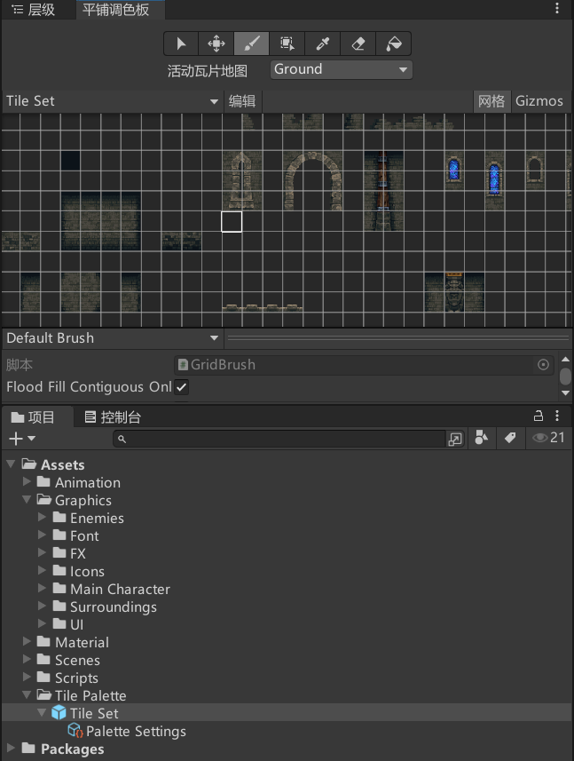
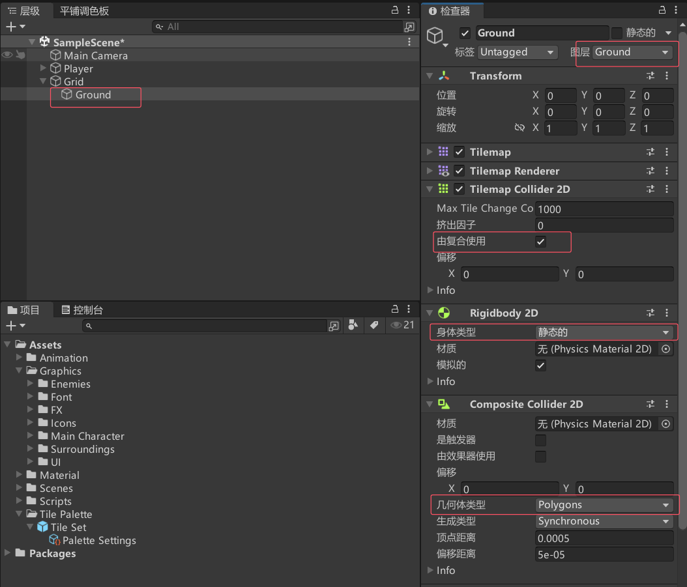
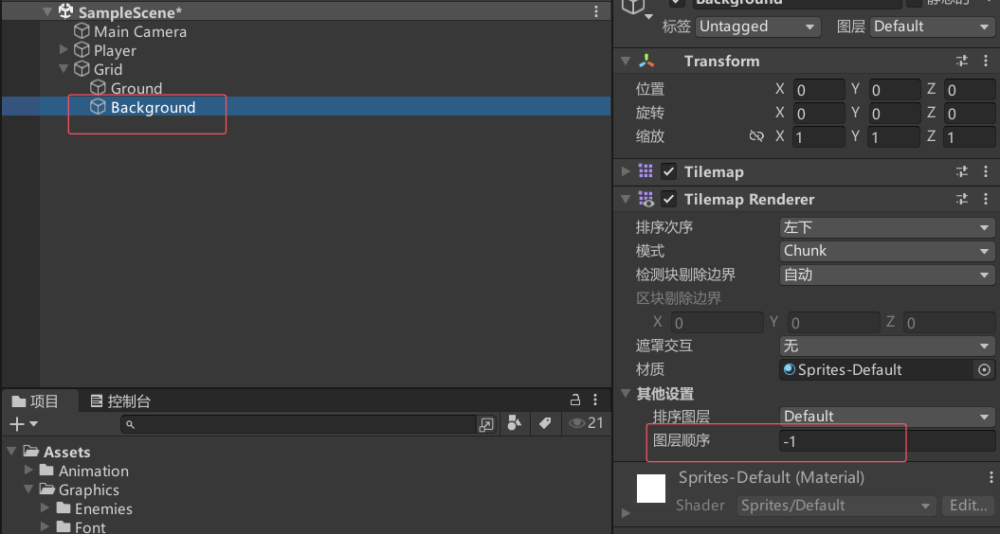
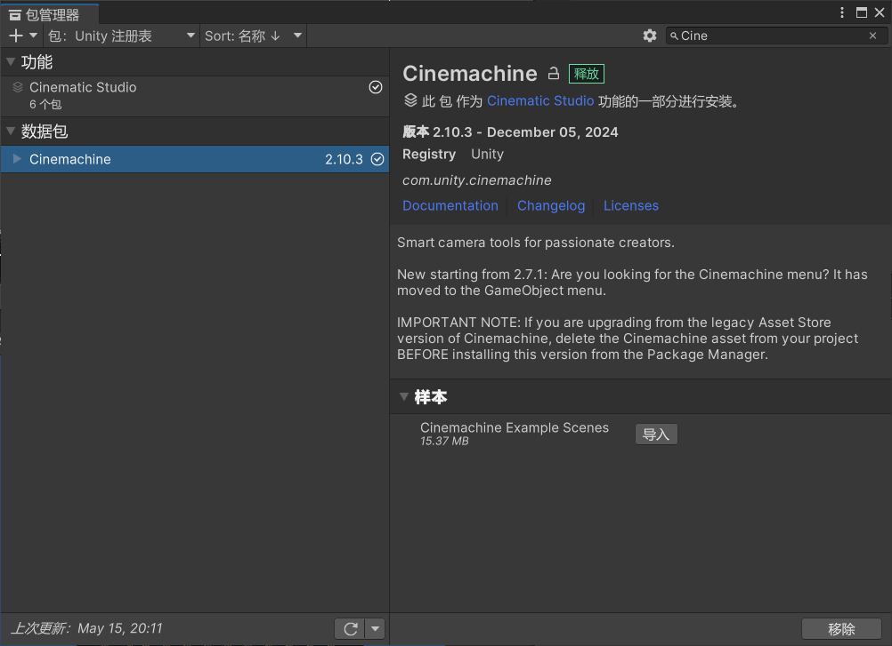
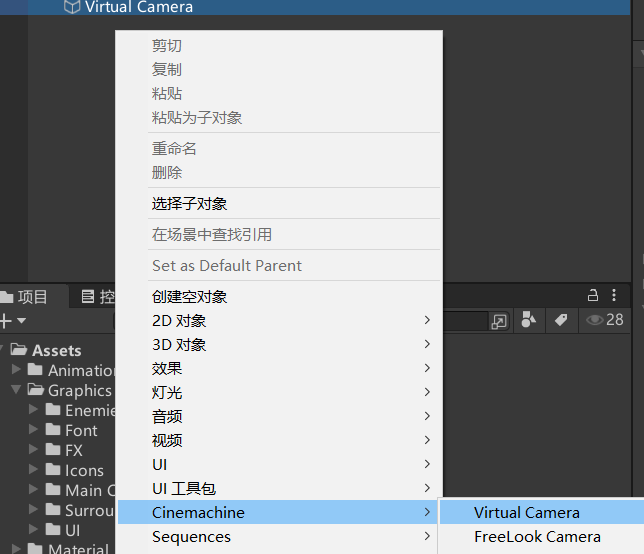
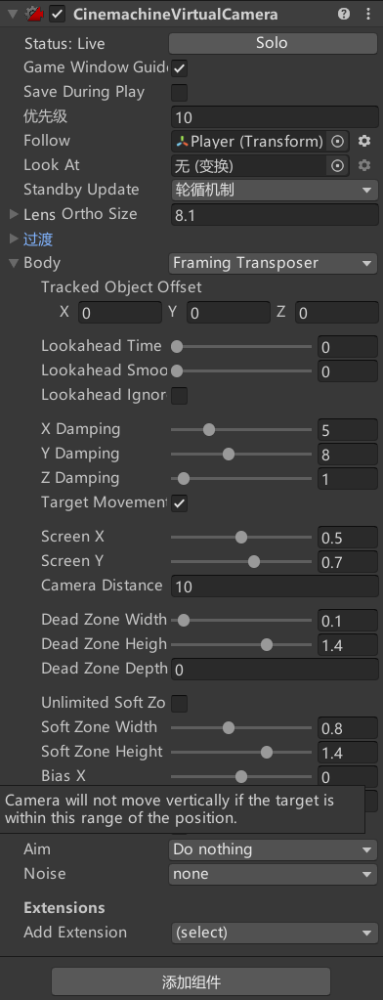
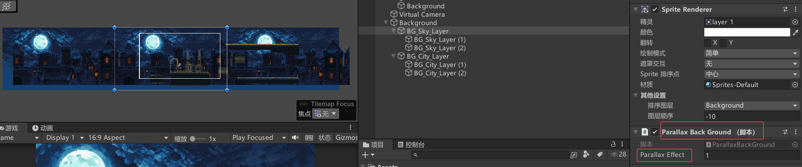

# 瓦片调色板




# 瓦片地图碰撞器


新增瓦片地图背景



 # 摄像机
 





制作多个背景作为子对象
并添加视差脚本


```cs
public class ParallaxBackGround : MonoBehaviour
{
    private GameObject cam;

    [SerializeField] private float parallaxEffect;

    private float xPostion;

    void Start()
    {
        cam = GameObject.Find("Main Camera");
        xPostion = transform.position.x;
    }

    void Update()
    {
        float distanceToMove = cam.transform.position.x * parallaxEffect;
        transform.position = new Vector3(xPostion + distanceToMove, transform.position.y);
    }
}

```


# 无尽背景
**1. 什么是“视差背景”？（Parallax Background）**
想象一下你坐在一辆行驶的火车上，看向窗外的风景：
- **远处的山（背景）**：移动得很慢。
- **近处的树（前景）**：移动得很快。

这种效果就是“视差效果”。在游戏中，我们可以用不同的移动速度来模拟景深，让背景看起来更真实。

这段代码的作用是：**让背景以不同于相机的速度移动**，从而产生视差效果。
`parallaxEffect`（视差系数）：
- 如果 `parallaxEffect = 1`，背景和相机完全同步（没有视差效果）。
- 如果 `parallaxEffect = 0.5`，背景移动速度是相机的一半（远处的山）。
- 如果 `parallaxEffect = 0`，背景完全不移动（比如最远处的星空）。

假设：

- 背景是一张 **重复的山脉图片**，宽度 `length = 10`。
- `parallaxEffect = 0.5`（山脉移动速度是相机的一半）。
- **相机向右移动**：
    - 相机移动 `10` 单位 → 山脉只移动 `10 * 0.5 = 5` 单位。
    - 当相机移动 `20` 单位时，山脉移动 `10` 单位，这时会触发边界检查，让背景“循环”一次（避免出现空白）。
其实就是当角色相机快走了两个相机宽，而远处背景只走了一个相机宽，就触发移动背景
```cs
public class ParallaxBackGround : MonoBehaviour
{
    private GameObject cam;

    [SerializeField] private float parallaxEffect;  // 视差系数

    private float xPostion;     // 背景的初始X位置。
    private float length;       // 背景的宽度
    void Start()
    {
        cam = GameObject.Find("Main Camera");
        length = GetComponent<SpriteRenderer>().bounds.size.x; 
        xPostion = transform.position.x;
    }

    void Update()
    {
        float distanceToMove = cam.transform.position.x * parallaxEffect;       // 计算相机移动的距离
        float distanceMoved = cam.transform.position.x * (1 - parallaxEffect);  // 计算背景移动的距离
        // 更新背景的位置，使其跟随相机移动
        transform.position = new Vector3(xPostion + distanceToMove, transform.position.y);

        // 边界检查（防止背景跑出屏幕）
        if (distanceMoved > xPostion + length)  // 向右循环
            xPostion = xPostion + length;    
        else if (distanceMoved < xPostion - length) // 向左循环
            xPostion = xPostion - length;
    }
}

```